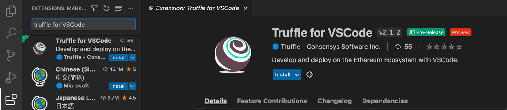
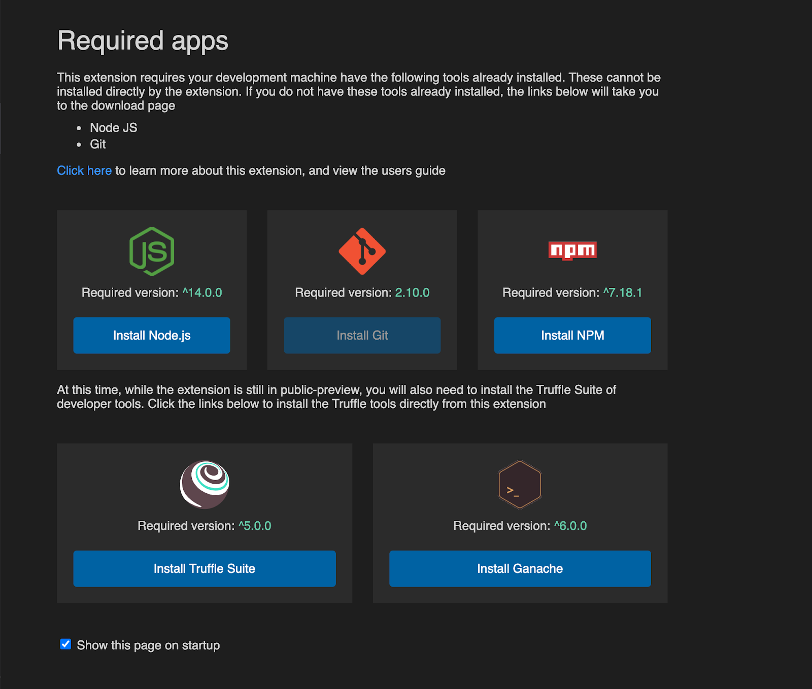
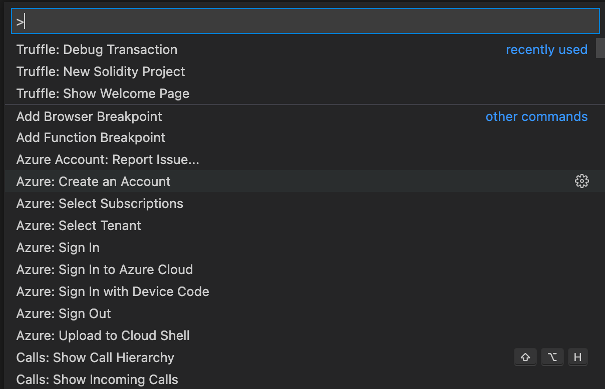
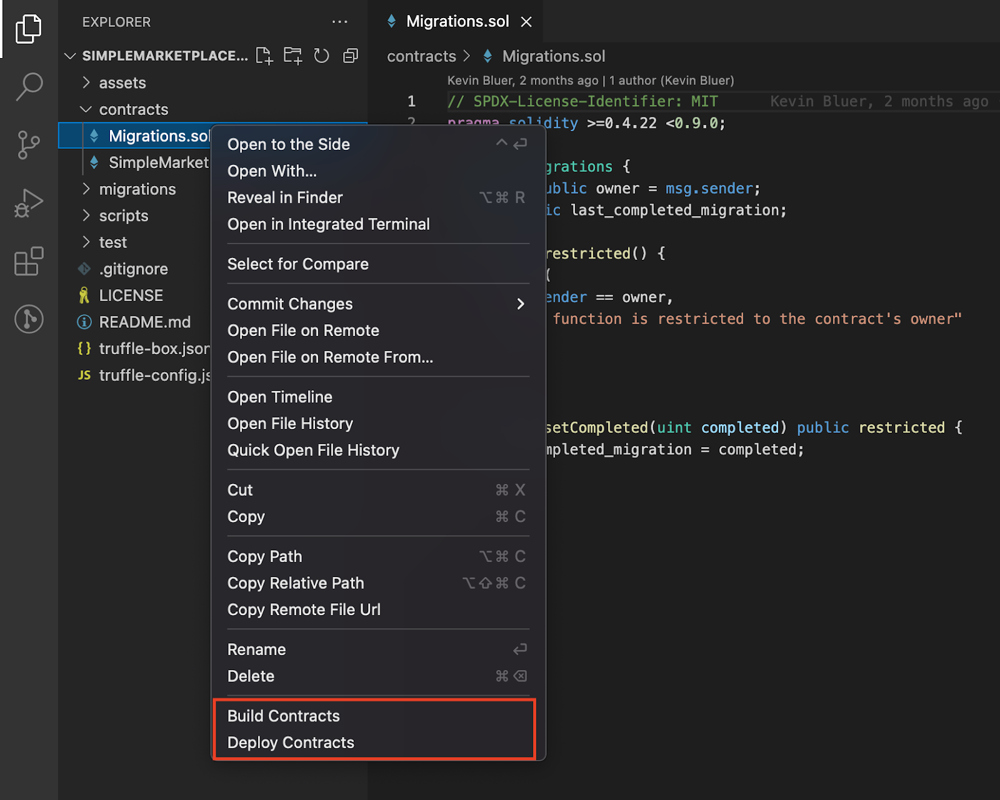
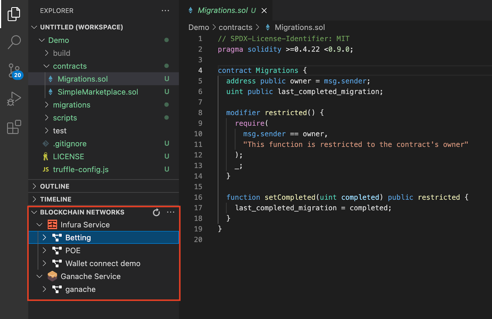
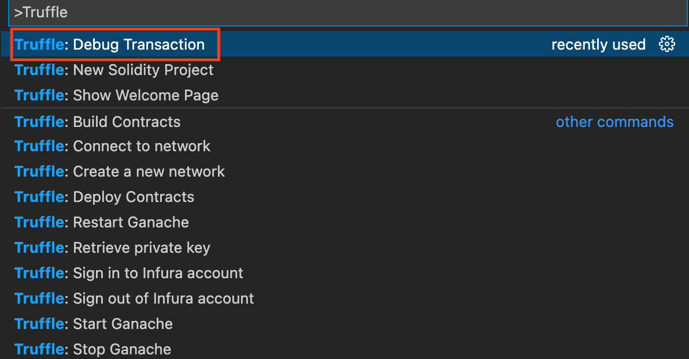
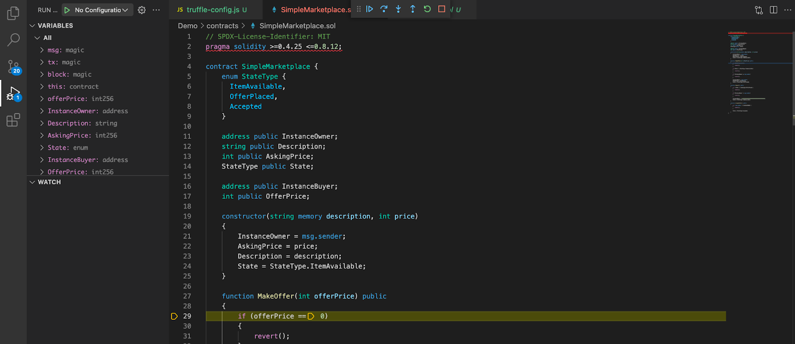
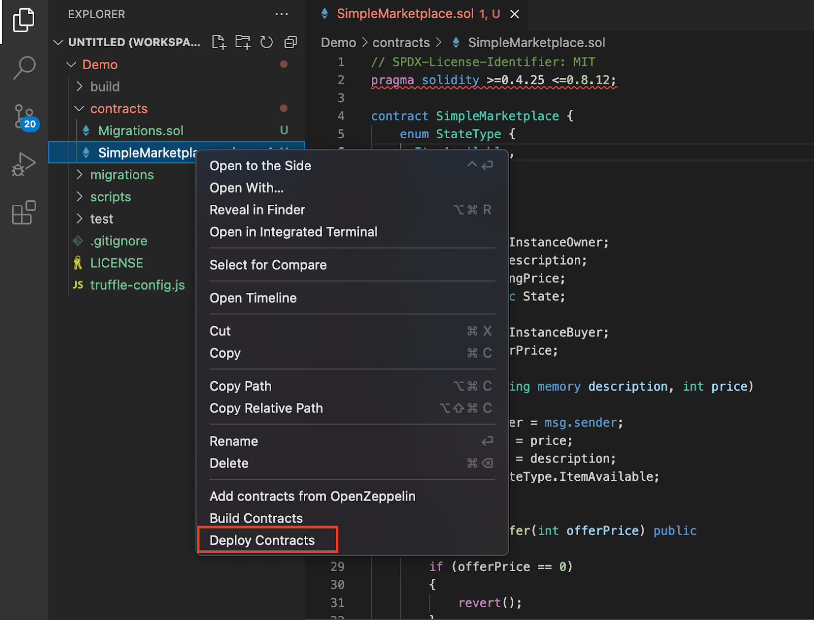
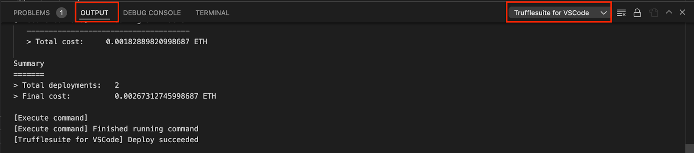

**By Kingsley Arinze**

We're excited to announce the release of Truffle for VS Code, an extension that allows newbies and experienced web3 developers to code, debug, and deploy their smart contracts without needing to leave VS Code.

Some of its key features include:

* You can start a new Truffle project from scratch or from a [Truffle Box](https://trufflesuite.com/boxes/)
* You can deploy your smart contract easily by connecting to your Infura account and fetching all your existing projects with their corresponding networks' RPC endpoints. You can also create new Infura projects from VS Code
* You can debug a transaction using the native VS Code debugger instead of the command line
* You can connect to Ganache local blockchain and deploy smart contracts from a user interface without leaving VS Code

Instead of performing these tasks via the command line, VS Code users can seamlessly use a single interface, improving the user experience and speeding up the development process.

VS Code remains one of the most popular code editors available today. Created by Microsoft, this code editor is available for free on all major Operating Systems and houses a lot of extensions that help simplify workflows.

Extensions on VS Code are created by Microsoft or independent teams/developers. The Truffle for VS Code extension was originally started by Microsoft as the *Blockchain Development Kit for Ethereum* and through the [partnership](https://consensys.net/blog/press-release/consensys-expands-blockchain-service-capabilities-on-microsoft-azure/){target=_blank}, with Truffle, Microsoft transitioned the management of the extension to the Truffle team.

In summary, this extension is designed to help VS Code users build, debug, and deploy smart contracts on the Ethereum blockchain using the Truffle suite of tools.

## Installing the VS Code Extension for Truffle

The easiest way to get started is by browsing the VS Code built-in marketplace tab. Search for **Truffle for VS Code**, and click the install button. 

An alternative way is to visit the [VS Code marketplace](https://marketplace.visualstudio.com/items?itemName=trufflesuite-csi.truffle-vscode){target=_blank} and install directly from the website.

Upon installation, you will get a prompt to download some dependencies or upgrade the versions you already have to newer versions.

The Truffle for VS Code extension surfaces in the following areas in VS Code, each with different sets of commands:

The VS Code command palette (SHIFT + CMD + P): here, you can perform tasks such as:

* Creating a new Solidity project
* Creating and connecting to a new network
* Starting and stopping Ganache local blockchain
* Debugging transactions using VS Code native debugger

The VS Code context menu (Right-click on a .sol file): here, you can perform tasks such as:

* Adding a new contract from OpenZeppelin
* Building your contracts
* Deploying your contracts to your network of choice

* The VS Code Tree view (Under the Explorer tab): here, you can create and connect to an Infura or Ganache network without leaving the VS Code application

## Try these features!

### 1. Preview version of the Truffle Debugger with native VS Code support

The Truffle Debugger uses the native VS Code debugging feature, allowing VS Code users to debug their transactions in the ways they are familiar with: visually stepping through the code to understand how it behaves.

To start debugging a transaction using the extension, open the command palette with **SHIFT + CMD + P** and select "**Truffle: Debug Transaction**". The extension would list all the previously run transactions in chronological order. Clicking on any transaction starts the debugging process, and you can step through to gain more insight into that transaction.

### 2. Sign in to your Infura account and deploy contracts without setting up a new network in your Truffle config file

With this extension, you no longer need to leave the VS Code application to create a new Infura project or deploy to an existing Infura project. Instead, you can sign in to your Infura account from VS Code by simply clicking a button. This would list all your Infura projects and their corresponding network RPC endpoints.

With Infura set up, you can right-click on a contract, select the "Deploy contracts" option, and pick a Project/Network combination to deploy your contract to.

The extension outputs information about your contract deployments to the Output tab on the VS Code command line. You also need to ensure that its reading outputs from "**Truffle for VS Code**".

### 3. Connect to Ganache local blockchain and deploy contracts from a user interface without leaving VS Code

The VS Code extension allows you to start, stop, and deploy smart contracts to the Ganache local blockchain without leaving the VS Code application. Simply create a new Ganache network under the "Truffle Networks" tab, and right-click to see the start/stop menu.

With Ganache running, you can right-click on your smart contract file and select the "**Deploy Contracts**" option. This would list all the available networks, including those from your truffle-config file and networks you created using the extension (Infura and Ganache). Next, select the Ganache network and watch the extension deploy your contract to Ganache.

That’s it, now you have all you need to start building the right way!

This extension provides a uniform interface for all things smart contracts which we believe can be helpful in onboarding newbies into web3 and improving the workflow for more experienced developers.

Get started with the extension today by visiting the VS Code built-in marketplace and searching for [Truffle for VS Code](https://marketplace.visualstudio.com/items?itemName=trufflesuite-csi.truffle-vscode){target=_blank}.

We plan to have a dedicated VS Code tab for the extension in the future to improve the discoverability of libraries and security tools.

We appreciate any feedback you might have concerning the extension. Feel free to shoot us a tweet/dm at [@trufflesuite](https://twitter.com/trufflesuite){target=_blank}.
