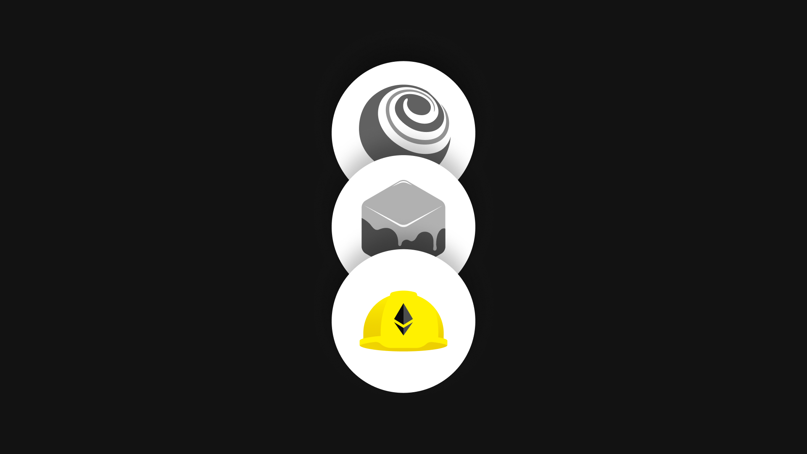

**By Kingsley Arinze**

_Today, Consensys announces the sunsetting of web3 pioneering dev tools, Truffle and Ganache, and welcomes new support for developers with a HardHat partnership._

Empowering developers to build on Ethereum has always been at the core of the Consensys mission and supporting web3 builders is our top priority. To focus our energy on partners in the Ethereum ecosystem, we have decided to sunset Truffle and Ganache and to empower developers to build dapps using MetaMask tooling like Snaps and the SDK.

We recognize the integral role Truffle and Ganache have played in many Ethereum projects and will be partnering with HardHat to provide a smooth transition process for all developers currently using them. We are committed to supporting Truffle and Ganache users as they transition to HardHat, Foundry, and other ecosystem tools like Remix, Thirdweb, and OpenZeppelin.

## Next steps for developers using Truffle and Ganache

At Consensys, our vision for web3 is expansive and ambitious. We are investing in new tools and APIs to empower developers to build powerful dapps with [MetaMask](https://metamask.io/), [Infura](https://www.infura.io/), and [Linea](https://linea.build/), which is why the Truffle engineering team will join these teams to accelerate the build out of their developer offerings.

For developers currently using Truffle and Ganache, we’re proud to be partnering with HardHat to offer migration and ongoing support in the following ways:

1. **Migration Path**: In collaboration with HardHat, we'll provide documentation outlining the migration process from Truffle to HardHat. We will also provide guidance and support to devs interested in using other popular ecosystem tools, like Foundry.
2. **Product Support**: Truffle and Ganache support will be available for the next 90 days through [Zendesk](https://trufflesuite.zendesk.com/hc/en-us/requests/new), Truffle G[itHub discussions](https://github.com/orgs/trufflesuite/discussions), [Ganache GitHub discussions](https://github.com/trufflesuite/ganache/discussions), and [Consensys Discord](https://discord.com/channels/697535391594446898/799049410738520105).
3. **Codebase's Future**: Starting on December 20, 2023, Truffle and Ganache codebases will remain available as public archives. This gives developers around 90 days to migrate to HardHat and other solutions.
4. **Community Q+A**: Join us on September 27th for an open community Q&A session. Submit your questions [here](https://github.com/orgs/trufflesuite/discussions) in advance.

## Forever grateful to Truffle and Ganache

Since their inception, Truffle and Ganache have been more than just tools. They were beacons in the Ethereum ecosystem that have enabled developers to create, test, and deploy Solidity smart contracts with ease. Their functionality democratized Ethereum's potential, making dapp development simple and accessible.

Truffle and Ganache fueled a wave of web3 advancements, enabling teams across the ecosystem to build some of the most innovative projects on Ethereum. And for this, we will be forever grateful and look forward to supporting builders who are bringing the promise of web3 to life now and always.

## FAQ

**Why sunset Truffle and Ganache?**\
Consensys is constantly evaluating how it can best support web3 builders and has seen incredible growth in demand and potential for our Infura, MetaMask Snaps, and SDK offerings. Consensys is shifting the Truffle team to focus on scaling those offerings and helping developers build with and for MetaMask. To support projects currently using Truffle and Ganache, Consensys is collaborating with Hardhat to migrate Truffle and Ganache users and move the codebases to a public archive.

**What migration support is available?**\
Consensys recommends migrating from using Truffle and Ganache within the 3-month deprecation period to ensure the tooling being used is actively maintained and dependencies being updated. A full migration guide has been published [here](https://trufflesuite.com/docs/truffle/how-to/migrate-to-hardhat/) with step-by-step instructions on how to migrate your project to Hardhat. Consensys will maintain the Truffle documentation pages, archiving them along with the codebase for future reference and will be available in support channels ([Zendesk](https://trufflesuite.zendesk.com/hc/en-us/requests/new), GitHub[ discussions](https://github.com/orgs/trufflesuite/discussions), and [Consensys Discord](https://discord.com/channels/697535391594446898/799049410738520105)). to answer questions related to migrating. HardHat's support will also be ready to assist on their [#migrating-to-hardhat](https://discord.com/channels/750408878008827925/768892114087444491) Discord channel.

**How long will current Truffle users receive support?**\
Nothing will change for the next 90 days and we are committed to working with our partners at Hardhat to support users as they migrate. For users who do not plan to migrate, the current codebases and documentation will remain available as public archives indefinitely. Ganache will not be upgraded to support the next hard fork that is currently planned for November.

**How will Consensys continue to support developers?**\
Consensys is constantly evaluating how we can uniquely serve and empower developers. With a constellation of developer tools emerging in our ecosystem, including leaders like Hardhat, builders have never had more options for writing, testing and deploying smart contracts. Sunsetting Truffle and Ganache allow us to focus our teams on building out MetaMask as a platform and empowering developers around the world to build impactful dapps using the MetaMask SDK, Snaps, and our library of APIs and Infura endpoints.

**What will happen to the Truffle team?**\
The engineering and product teams have moved internally to developer-focused offerings within MetaMask and Infura, where they will continue their work enabling web3 builders.

**Where can I learn more?** \
We are hosting a community AMA on September 27, and you can submit your questions [here](https://truffle.deform.cc/community-ama/). You can also ask questions in the interim on [GitHub discussions](https://github.com/orgs/trufflesuite/discussions).
