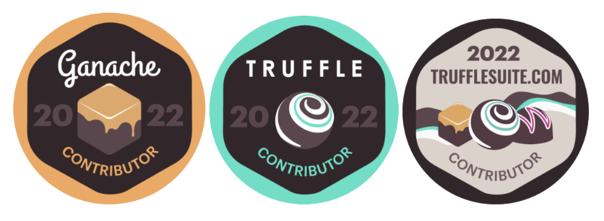

**By Kingsley Arinze**

Hey Trufflesuite contributors, we’re excited to share that in collaboration with the [GitPOAP](https://gitpoap.io/) team, we will be issuing POAPs in appreciation of your awesome contributions over the years. 

## What are POAPs?

POAPs (Proof Of Attendance Protocol) are badges issued as NFTs (non-fungible token) to prove that the recipient/owner has carried out an action or has attended an event. They are like gold medals from the Olympics, except these exist as digital collectibles. 

## Who's eligible to claim a GitPOAP?

Great question. Annual contributor POAPs will be issued to those who have contributed one or more times since since the start of the following projects:

- [Ganache](https://github.com/trufflesuite/ganache)
- [Truffle](https://github.com/trufflesuite/truffle)
- [trufflesuite.com website](https://github.com/trufflesuite/trufflesuite.com)

Those of you who have contributed to all three projects can claim all three POAPs! 

Here are some POAPs you should expect to receive as a Trufflesuite contributor:

## How and when can I claim my POAP?

POAPs will be issued as NFTs, so contributors must authenticate with their GitHub accounts on the [GitPOAP website](https://gitpoap.io/) to claim their POAP.

All POAPs are minted on Gnosis Chain (formerly xDai). There is no cost to claim a POAP and it can be migrated to Ethereum Mainnet by sending a transaction. Visit [how do I migrate my POAP to Mainnet](https://intercom.help/poap/en/articles/5790336-how-do-i-migrate-my-poap-to-mainnet) for instructions.

The official start date for claiming is April 7, 2022, so mark your calendars and claim your GitPOAP as soon as possible.

Thanks to the [GitPOAP](https://twitter.com/gitpoap) team for selecting Truffle as one of the lucky few projects in their launch cohort.
