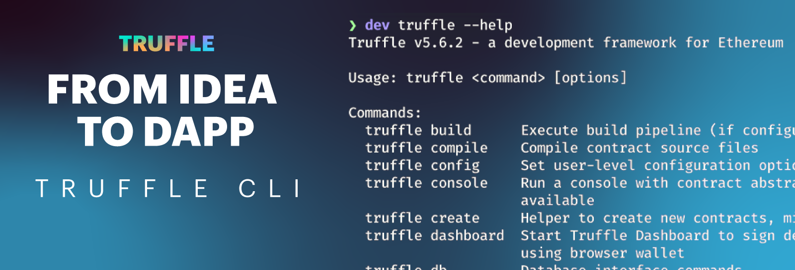
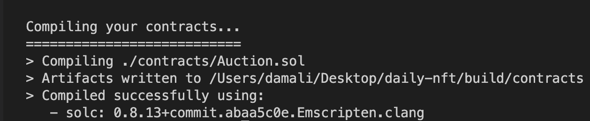

**By [Kingsley Arinze](https://www.linkedin.com/in/bruzzy)**

Every software engineer has a series of tools they default to when building applications from the ground up. In the traditional software industry, there are a lot of options for tooling to choose from that interoperate for end-to-end development. In Web3, an emergent industry, not as many tools are built with interoperability in mind.  

This is the problem Truffle solves for developers. By creating as many tools that are compatible with each other and work together to simplify the dapp creation process for developers.

This is the first part of a new Truffle content series, where we outline the steps to go from  an idea to a minimum-viable-dapp, showcasing the cool features and tools available within Truffle suite for smart contract developers across different experience levels.

In part one we’ll be focusing on [Truffle CLI](https://trufflesuite.com/docs/truffle) and showcase all that is possible with the Truffle CLI by creating a smart contract project, writing smart contract code, compiling, migrating and interacting with this smart contract all within the Truffle CLI.

In subsequent posts, we’ll build on this project by adding automated testing, showcasing how easy it is to add smart contract testing in JavaScript/TypeScript and Solidity with Truffle. And later on, we’ll also explore debugging options that are available to us via the [Truffle debugger](https://trufflesuite.com/docs/truffle/how-to/debug-test/use-the-truffle-debugger) and console.log.

By the end of this series, you will be able to build a dapp from the ground up, leveraging the various tools that are available in the Truffle suite of tools, including [Ganache](https://trufflesuite.com/ganache), [Truffle for VS Code extension](https://trufflesuite.com/blog/build-on-web3-with-truffle-vs-code-extension), [Truffle dashboard](https://trufflesuite.com/blog/introducing-truffle-dashboard), [Truffle boxes](https://trufflesuite.com/boxes) and much more.

## Requirements
To be able to follow through with the content of this post, you will need to have the following requirements met:

- Node.js v14 - v18
- Windows, Linux, or macOS

It is recommended that you download Node.js using a Node version manager to avoid permission errors caused by using sudo to download Truffle. Follow the instructions [here](https://docs.npmjs.com/downloading-and-installing-node-js-and-npm#using-a-node-version-manager-to-install-nodejs-and-npm) to download a Node version manager for your operating system.

With Node.js installed, you can install Truffle globally with the command `npm install -g truffle`. See the [Truffle installation guide](https://trufflesuite.com/docs/truffle/how-to/install) for more information.

## Create a Truffle project with Truffle Init

To create a smart contract project with Truffle, there are two options to choose from, one is the [Truffle box](https://trufflesuite.com/boxes) option, which we will touch on in more detail later in the series. The second option is the Truffle CLI option. For this post, we’ll use the Truffle CLI option.

By downloading Truffle globally, you have the Truffle CLI available to you. Create an empty folder for your project and call it **daily-nft**, then run `truffle init` in the root of this new folder. This should create a bare-bone Truffle project with no smart contract included.

If you examine the newly created project structure, you’ll find the following items:

`contracts/`: Directory for Solidity contracts

`migrations/`: Directory for scriptable deployment files

`test/`: Directory for test files for testing your application and contracts

`truffle-config.js`: Truffle configuration file

## The Smart contract
For the smart contract, we’ll be using [this project](https://github.com/OnlyOneJMJQ/the-daily-nft-contracts) built by my awesome colleague [Josh](https://twitter.com/onlyonejmjq). It’s called the Daily NFT. The idea behind the project is that one NFT gets displayed every day, based on the winner of an auction. Users can continue bidding for the next day’s NFT while the day’s NFT is displayed.

As you’ll see, It’s a simple project that is easy to understand, yet complex enough not to be a hello world or timer project.

In the `contracts/` directory, create a new Solidity file and call it ` Auction.sol`, then add the following content to it:

```solidity
// SPDX-License-Identifier: UNLICENSED
pragma solidity ^0.8.13;

contract Auction {
    event Start();
    event Bid(address indexed sender, uint amount);
    event Withdraw(address indexed bidder, uint amount);
    event End(address winner, uint amount);

    address payable public seller;
    uint public endAt;
    bool public started;
    bool public ended;

    address public highestBidder;
    uint public highestBid; // Wei
    mapping(address => uint) public bids;
    mapping(address => address) public nfts;
    mapping(address => uint256) public nftIds;
}
```
A brief description of what happening in the code. We’ve defined four events that would be triggered at four important stages of the contract; when we `Start` the auction - manually, when a `Bid` is made, when a `Withdraw` is triggered and, when the auction `End`s in 24 hours.

We’ve also defined a number of public variables as described below:

`seller`: Payable address of the auction owner - the deploying address.

`endAt:` Number of hours after which the auction ends - 24 hours.

`started:` True or false value that signifies that the auction has start or not.

`ended:` True or false value that signifies that the auction has ended or not.

`highestBidder:` Address of the current highest bidder.

`highestBid:` Highest bid amount expressed in Wei.

`bids:` a mapping between addresses and their respective bid amounts

`nfts:` a mapping between addresses and their respective bid nft address

`nftIds:` a mapping between nft addresses and their respective Ids.

```solidity
...

    constructor(
        uint _startingBid
    ) {
        seller = payable(msg.sender);
        highestBid = _startingBid;
    }

    function start() external {
        require(!started, "started");
        require(msg.sender == seller, "not seller");

        started = true;
        endAt = block.timestamp + 1 days;

        emit Start();
    }

    function bid() external payable {
        require(started, "not started");
        require(block.timestamp < endAt, "ended");
        require(msg.value > highestBid, "value < highest");
        require(nfts[msg.sender] != address(0), "include nft to display");

        if (highestBidder != address(0)) {
            bids[highestBidder] += highestBid;
        }

        highestBidder = msg.sender;
        highestBid = msg.value;

        emit Bid(msg.sender, msg.value);
    }

    // Overload if the user submits an NFT
    function bid(address nft, uint256 nftId) external payable {
        require(started, "not started");
        require(block.timestamp < endAt, "ended");
        require(msg.value > highestBid, "value < highest");

        if (highestBidder != address(0)) {
            bids[highestBidder] += highestBid;
        }

        if (nfts[msg.sender] == address(0)) {
            require(nft != address(0), "invalid nft address");
            nfts[msg.sender] = nft;
            nftIds[msg.sender] = nftId;
        }

        highestBidder = msg.sender;
        highestBid = msg.value;

        emit Bid(msg.sender, msg.value);
    }

    function withdraw() external {
        uint bal = bids[msg.sender];
        bids[msg.sender] = 0;
        payable(msg.sender).transfer(bal);

        emit Withdraw(msg.sender, bal);
    }

    function end() external {
        require(started, "not started");
        require(block.timestamp >= endAt, "end time in future");
        require(!ended, "ended");

        ended = true;

        emit End(highestBidder, highestBid);
    }
```

Here’s a summary of the second part of the contract code:

- `constructor()` function is called during deployment, setting the seller and highestBid to the deployer’s address and the provided _startingBid respectively.

- `start()` function is manually called to start the auction. It sets the auction end time to 24 hours from start time.

- There are two bid() functions, one accepts an nft address and Id while the other does not accept any argument. They ensure that new bids are higher in value than the current highestBid for them to be accepted.

- `withdraw()` function allows users to claim back their bid amount.

- `end()` function checks that the auction end time has been reached before stopping the auction.

## Compile contracts with Truffle CLI

To compile the newly created contract, navigate to the project root directory and run the `truffle compile` command. Truffle will go through the `/contracts` directory, compiling every file and library that ends with .sol. In our case, we only have one contract file to compile.



Also note that upon first run, all contracts will be compiled but on subsequent runs, Truffle will compile only the contracts that have been changed since the last compile. You can override this behavior by running the above command with the `--all` option.

Upon successful compilation, notice that a new `build` directory has been created. This directory contains the artifacts of your compilation, specifically inside the `build/contracts/` directory, relative to your project root. Go ahead and inspect the content of this directory.

## Deploy contracts locally with Truffle CLI

Truffle ships with a built-in personal blockchain that can be used for interacting with, and testing smart contracts locally. This blockchain is local to your system and does not interact with the Ethereum main or test networks. To access it, simply run the command `truffle develop`.

To be able to deploy contracts to any Ethereum network with Truffle, you must create a migration file for that contract. Migrations are JavaScript files, written with the assumption that your deployment needs will change with time, that help you deploy contracts to any Ethereum network, including locally running nodes like the one Truffle ships with.

Now in the `migrations/` folder, create a new file and call it `1_migration.js`. The number “1” that precedes “_migration” is very important as it signifies order i.e It tells Truffle which migration file to run before the other. This number will be incremented with each new file that is added to the migration folder.

Copy over the following content to the newly created migration file:

```javascript

const Auction = artifacts.require("Auction");

module.exports = function (deployer) {
  deployer.deploy(Auction, 100);
};
```
Here, we’re using the `artifacts.require()` function to tell Truffle which contract file we want to interact with. It returns a contract abstraction that we can use within the rest of our deployment script.

On the second line, we now export a function that when called, takes a `deployer` object and calls on the `deployer.deploy()` function to deploy the contract, while passing in the required arguments specified in the Auction contract constructor. For a more detailed breakdown of how migrations work in Truffle, visit the [Truffle migration documentation](https://trufflesuite.com/docs/truffle/how-to/contracts/run-migrations).

With the migration file out of the way, we’re ready to deploy the smart contract to the Truffle built-in local blockchain. Start by running the command `truffle develop` to expose the Truffle developer console - if you don't have it running already. 


Notice that it spins up a local blockchain on port 9545. This command also exposes 10 Ethereum accounts with there associated private keys and mnemonic seed phrase. Be sure not to send real Eth tokens to these addresses as they are not safe and are only meant for interacting with your smart contract.

Within this console, run the command `migrate` to deploy your contract to the local blockchain node. This should return the transaction ID and address of your deployed contract, including a cost summary.


## Interact with locally deployed contracts using Truffle CLI

With the contract deployed to Truffle’s local blockchain and since we don’t have a frontend for our dapp yet, we can manually interact with the deployed smart contract directly from the developer console exposed by the `truffle develop` command. Let's get to it!

### Fetch deployed contract:

```console
truffle(develop)> let auction = await Auction.deployed()
```

### Get the currently set seller and highestBid values
	
```console
truffle(develop)> let seller = await auction.seller()
truffle(develop)> let highestBid = await auction.highestBid()
```

### Display seller and highestBid values, in my case:

```console
truffle(develop)> seller
'0x1a33B6853b36F4c2E3872E229F3a77Bf75943F9d'
truffle(develop)> highestBid.toNumber()
100
```
### Check if the auction has started:

```console
truffle(develop)> let started = await auction.stared()
truffle(develop)> started
false
```
### Start the auction:

```console
truffle(develop)> await auction.start()
truffle(develop)> started = await auction.started()
true
```
    
## Whats next?
You’ve just successfully created a new Truffle project, written the smart contract, compiled and deployed the smart contract! We’ve even gone ahead to interact with the deployed contract locally using the Truffle developer console. Congrats!

In the next post, we’ll explore writing and running automated tests for our smart contracts using the Truffle CLI.

At Truffle, we remain committed to improving and simplifying the user experience for dapp developers in the Web3 ecosystem by creating developer tools, resources, and educational materials.

To find out more about our suite of developer tools, visit the official [Truffle website](https://trufflesuite.com). If you have questions, feel free to start a discussion on our [Github Discussions page](https://github.com/orgs/trufflesuite/discussions).

We also hold weekly live-streamed sessions called [Web Unleashed](https://trufflesuite.com/unleashed), where we build, interview folks, and discuss important developments around the ecosystem. Keep an eye on our [Twitter](https://twitter.com/trufflesuite) for updates on the next session. You can also find past episodes on the [Truffle Youtube channel](https://www.youtube.com/c/TruffleSuite) and the [unleashed section](https://trufflesuite.com/unleashed) of our website if you prefer written materials.