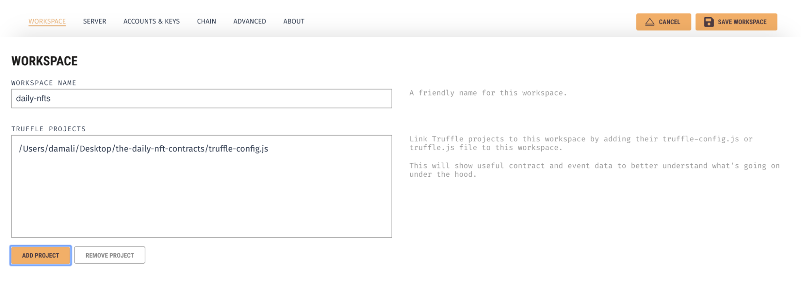
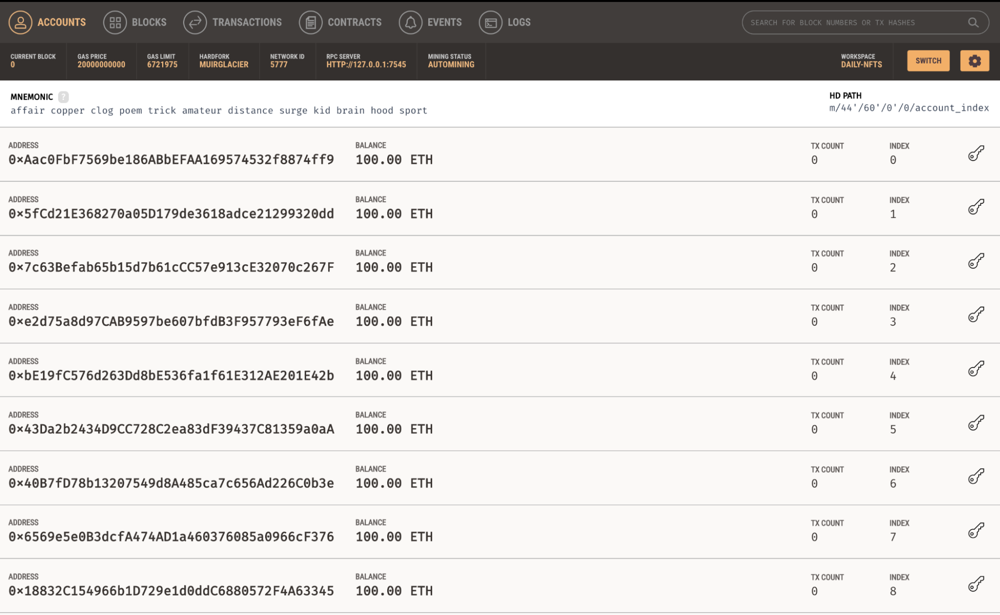
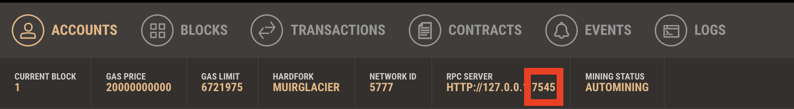
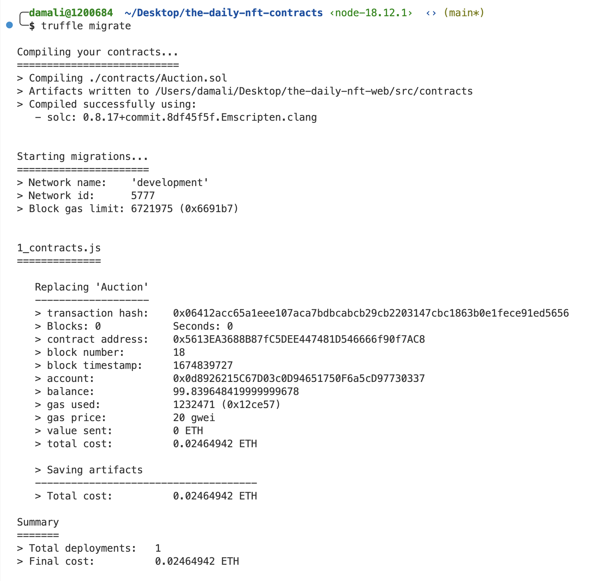
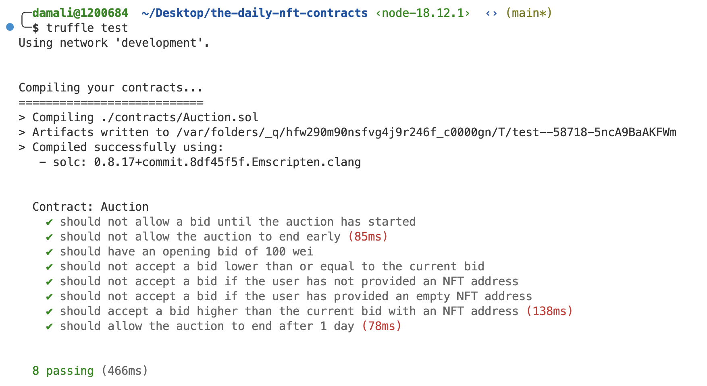

**By [Kingsley Arinze](https://www.linkedin.com/in/bruzzy)**

Welcome to the third post of the Truffle series: From idea to minimum viable dapp, where we showcase how to build a dapp from scratch with the Truffle suite. In this post, we’re going to cover how to enhance your auction dapp using Ganache.

In part [one](https://trufflesuite.com/blog/from-idea-to-minimum-viable-dapp-truffle-command-line-interface-part-1), we created a new smart contract project in Solidity, compiled and deployed the smart contract, and interacted with it in a development environment using the Truffle CLI.

In part [two](https://trufflesuite.com/blog/from-idea-to-minimum-viable-dapp-truffle-command-line-interface-part-2), we built on part one by adding automated unit tests, leveraging the automated test runner and libraries that Truffle CLI makes available.

In this post, we’re going to build further on parts one and two by exploring the benefits of using Ganache as our blockchain simulator instead of the built-in blockchain simulator that comes bundled with Truffle CLI.

## What is Ganache?

Ganache is a local blockchain simulator that enables fast and easy dapp development, testing, and deployment on the Ethereum network. It enables developers to simulate the Ethereum virtual machine, allowing smart contracts to interact with it the same way they’d interact with the Ethereum blockchain when deployed.

This means that you can expect your smart contract to work on Ganache, the exact same way it would on the Ethereum testnets and mainnet.

There are two flavors of Ganache, [Ganache Command Line Interface (CLI)](https://github.com/trufflesuite/ganache#readme) and [Ganache Graphical User Interface (GUI)](https://trufflesuite.com/ganache). Both flavors have a richer feature set than the built-in Ganache that comes with Truffle CLI, but for this post, we’ll be focusing on Ganache GUI, exploring ways in which adding it to our mix of tools can greatly improve productivity.

Suppose you’re interested in using the Ganache CLI interface instead. In that case, you should check out this blog on [Ganache 7](https://trufflesuite.com/blog/introducing-ganache-7) and this blog on [three new features of Ganache CLI that will improve your development experience](https://trufflesuite.com/blog/three-new-ganache-features-to-improve-your-developer-experience).

## Ganache GUI

Ganache GUI is a graphical version of the Ganache CLI, although not as feature-rich as Ganache CLI, it has some cool features that can help improve productivity, such as the ability to create and switch between multiple workspaces, link and unlink Truffle projects, examine blocks and transactions through the built-in block explorer and lots more.

You can download a version of the Ganache GUI for your operating system by visiting the [Ganache download page](https://trufflesuite.com/ganache). Once you have that downloaded, go ahead and install it as you would any other application.


## Using Ganache GUI instead of the Truffle CLI built-in blockchain

In episode one, under the [Deploy contracts locally with Truffle CLI](https://trufflesuite.com/blog/from-idea-to-minimum-viable-dapp-truffle-command-line-interface-part-1/#deploy-contracts-locally-with-truffle-cli) section, we deployed contracts to Truffle’s built-in blockchain simulator and interacted with the deployed contract through the truffle developer console we exposed with the command “truffle develop”.

In episode two, after adding some automated unit tests, we ran our tests against the built-in blockchain that comes with Truffle CLI by first running “truffle develop” followed by the “test” command.

Recall that running “truffle develop” exposes an interface for accessing Truffle’s built-in blockchain.

In this post, we’re going to be replacing Truffle’s built-in blockchain with the Ganache GUI, since it provides more visibility and features compared to Truffle CLI’s built-in blockchain. To do this successfully, we will need to set up a workspace for our project.

## Setting up a workspace

On the Ganache GUI home screen, there are two options for creating a workspace, the QUICKSTART option, and the NEW WORKSPACE option. The QUICKSTART option helps spin up a blockchain with the [default workspace configuration options](https://trufflesuite.com/docs/ganache/reference/workspace-default-configuration) in a single click, while the NEW WORKSPACE option allows for more flexibility in terms of configuration.

Since we already have a working project with a _truffle-config.js_ file, we’ll be using the NEW WORKSPACE option. Click the NEW WORKSPACE button and enter a workspace name for your project, then go ahead and select your project’s _truffle-config.js_ file under the TRUFFLE PROJECTS input field and click SAVE WORKSPACE to continue.



If you did that correctly, you should see an ACCOUNTS page. This page is similar to the response from running the “truffle develop” command in episode one.

It creates 10 free Ethereum accounts, each loaded with 100 fake ETH tokens for testing. This page also displays the Mnemonic seed phrase used for generating these accounts, as well as each account's private keys.



## Replacing Truffle CLI’s built-in blockchain with Ganache GUI

We will delve deeper into the other pages and what they do but in the meantime, let’s go ahead and replace Truffle CLI’s built-in blockchain with Ganache GUI in our dapp development workflow.

Replacing Truffle CLI’s built-in blockchain with Ganache GUI in our workflow means that contract deployments, interactions, and tests would run against this new blockchain simulator; Ganache GUI, and since it has a user interface, we will have more insight into what happens under the hood.

To do this, all we need to do is to update the “development.port” value inside the _truffle-config.js_ file to point to the port that our Ganache GUI instance exposes, which is usually port 7547.

Notice that we currently have that value set to 8545, which is the port on which truffle CLI’s internal blockchain runs - you can see this by running the “truffle develop” command.



Your _truffle-config.js_ file should now look like this:

```javascript
...
development: {
      host: "127.0.0.1",
      port: 7545,
      network_id: "*", // Any network (default: none)
    },
...
```

With the port value updated, we can now deploy our contract to Ganache GUI. To do that, navigate to the project root and run the command “truffle migrate”.

Recall that in previous episodes, to access a blockchain node, we had to first run the “truffle develop” command to spin up Truffle’s internal blockchain before running the actual commands like “migrate” and “test”.

Now since we run a standalone Ganache GUI, we can skip the first command - “truffle develop” entirely and run the actual commands directly. The only requirement is that we prefix all commands with the “truffle” keyword e.g “truffle migrate” and “truffle test” instead of just "migrate" and "test".



## Interacting with the smart contract deployed on Ganache GUI

You can still interact with your deployed contract the same way we did in episode one, see the [Interact with locally deployed contracts using Truffle CLI](https://trufflesuite.com/blog/from-idea-to-minimum-viable-dapp-truffle-command-line-interface-part-1/#interact-with-locally-deployed-contracts-using-truffle-cli) section for more information.

The only difference would be the command we use in accessing the Truffle CLI’s console. In episode one, we accessed the Truffle CLI’s blockchain with the “truffle develop” command and then retrieved our deployed contract.

In this episode, since we no longer rely on the built-in Truffle CLI blockchain, we will use the command “truffle console” to open up a console for fetching and interacting with the deployed contract instead.

Note that the console exposed by the command “truffle console” does not start any blockchain instance like “truffle develop” does. Instead, it spins up an environment for running and interacting with the default blockchain you’ve set in your _truffle-config.js_ file.

Feel free to try out all the code samples in the [Interact with locally deployed contracts using Truffle CLI](https://trufflesuite.com/blog/from-idea-to-minimum-viable-dapp-truffle-command-line-interface-part-1/#interact-with-locally-deployed-contracts-using-truffle-cli) section of episode one in this new console. They should still work fine.

## Running automated tests against Ganache GUI

In episode two, we wrote some unit tests which we ran against the built-in blockchain that comes with Truffle CLI, now since we’re replacing that with the Ganache GUI, let's see how we can run our automated tests against Ganache GUI.

Running our tests against Ganache GUI is as straightforward as running “truffle test” on the root of our Truffle project. Since we have already updated the _truffle-config.js_ file to point to the port on which Ganache GUI runs, every command that is prefixed with “truffle” will automatically connect to and run on Ganache GUI.



## Benefits of using Ganache GUI over Truffle CLI’s built-in blockchain

One handy feature of Ganache GUI is the ability to create and maintain multiple workspaces, including the ability to link and unlink Truffle projects from these workspaces. Workspaces are particularly useful because they allow you to persist smart contract interaction history over time, including logs, events, transactions e.t.c

Another useful feature of Ganache GUI is the number of available pages and views it has, each displaying a different type of information to help dapp developers gain more insight into their smart contracts. Some of these pages include:

**An accounts page** that shows the accounts generated, their balances, the number of transactions that’s been performed with said accounts, the account index, and the account’s private key - if you click on the key icon on the right-hand side of each account, it will expose their private keys.

This page is the default page and comes in handy when you need to double-check which account did what and how much ETH balance and transactions a particular account has performed.

**A blocks page** that shows each block as mined on the blockchain, along with gas used and transactions. This is similar to what you’d find on etherscan.io although with far fewer features. It is useful as it allows you to simulate a blockchain explorer.

**A transactions page** that lists all transactions run against the blockchain. The transactions page together with the blocks page provides a lot of insight into your smart contract the same way a block explorer would.

It also serves as a good resource in case you want to go back to previous transactions and learn more about them especially during debugging. The workspace feature makes it possible so that this information is persisted over time, something you can not get in the Truffle CLI’s built-in blockchain.

**A contracts page** that lists the contracts contained in your workspace's Truffle projects. Clicking on any of the listed contracts would open up a view that shows you all the values contained in your contract's storage including variables, their corresponding values, and the contract’s available functions, address, and deployment transaction.

**An events page** that lists all events that have been triggered since a workspace's creation. Ganache will attempt to decode events triggered by contracts in your Truffle project.

**A logs page** that shows the logs for the server, which is useful for debugging.

## What’s coming next?

So far, we’ve seen some ways in which adding Ganache GUI into our workflow makes building easier and provides more options for debugging and visibility.

Up next, we’ll explore ways you can debug your smart contract code, using the Truffle debugger and console.log feature. Until then, keep an eye on [Truffle's Twitter](https://twitter.com/trufflesuite) and our [GitHub Discussions page](https://github.com/orgs/trufflesuite/discussions) for more updates.

We also hold weekly live-streamed sessions called Web3 Unleashed, where we build, interview developers in the web3 community, and discuss important developments across the ecosystem. You can find past episodes on the [Truffle Youtube channel](https://www.youtube.com/c/TruffleSuite) and the [unleashed section](https://trufflesuite.com/unleashed) of our website if you prefer written materials.
