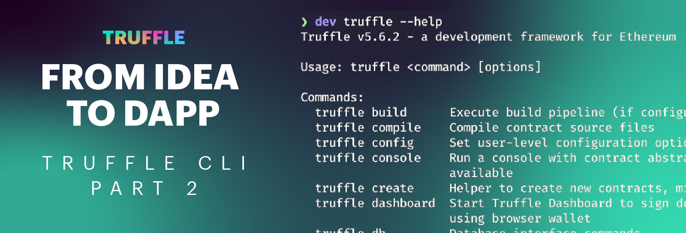
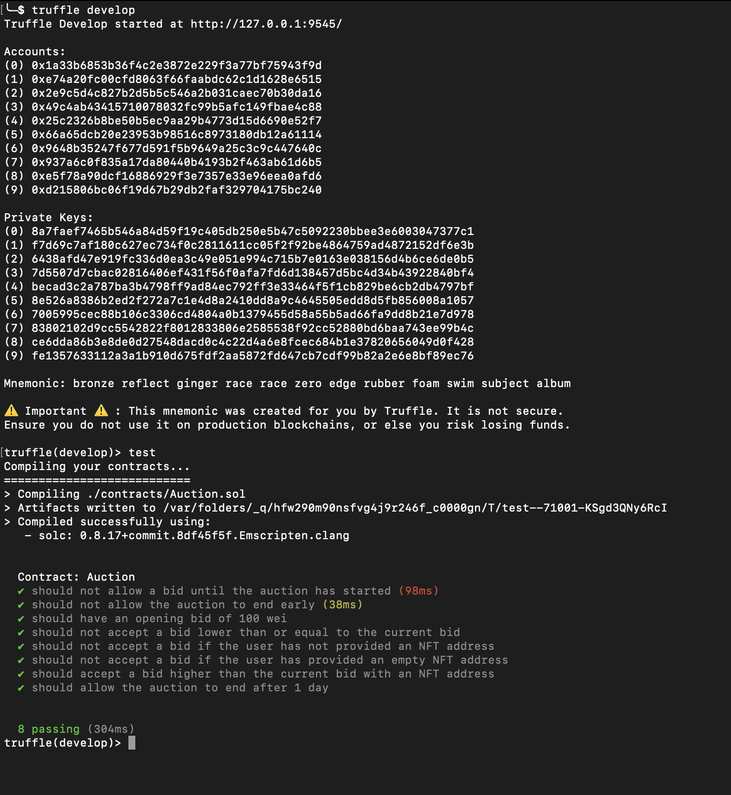

**By [Kingsley Arinze](https://www.linkedin.com/in/bruzzy)**

In the first part of [From Idea to Minimum Viable Dapp](https://trufflesuite.com/blog/from-idea-to-minimum-viable-dapp-truffle-command-line-interface-part-1) series, we created a new smart contract project, wrote some smart contract code, compiled and deployed the smart contract, and interacted with the deployed contract, all while using the Truffle CLI.

In this episode, we’ll explore writing and running automated unit tests for smart contracts, leveraging the cool features that Truffle CLI provides developers. To be able to follow through with this guide, you should start by checking out [part one](https://trufflesuite.com/blog/from-idea-to-minimum-viable-dapp-truffle-command-line-interface-part-1) as it is a prerequisite for this post. 

Truffle comes bundled with an automated testing framework to make testing your contracts easy. Automated tests can be written in both JavaScript/TypeScript and Solidity, with both having their respective advantages and disadvantages.

## Writing unit tests for your smart contract

All test files will be located in the `./test` directory. Truffle will only run test files with the following file extensions: .js, .ts, .es, .es6, and .jsx, and .sol. All other files are ignored.

Now go ahead and create a test file inside the `./test` directory and call it `auction.js`.

To help us with asserting reverts and checking if certain events were emitted during our test, we’ll need to install the `truffle-assertions` library from NPM by running the command `npm install -d truffle-assertions`. 

We’ll also need some helper functions to help with things like getting the latest block timestamp and advancing the current time forward. To do that, let us create a file on the root of our project (outside the ./test directory) and call it `helpers.js`.

Now copy over the following content into the helper file:

```javascript
const rpcPromise = (rpcData) => {
  return new Promise((resolve, reject) => {
    const data = { id: new Date().getTime(), jsonrpc: "2.0" };
    web3.currentProvider.send({ ...data, ...rpcData }, (err, result) => {
      if (err) return reject(err);
      return resolve(result.result);
    });
  });
};

const mineBlock = () => rpcPromise({ method: "evm_mine" });

const advanceTimeTo = async (timestampInSecs) => {
  if (!timestampInSecs) return;
  const msg = `Jump to future request: ${timestampInSecs}\n\t${new Date(
    timestampInSecs * 1000
  )}`;

  const setTimeResult = await rpcPromise({
    method: "evm_setTime",
    params: [timestampInSecs * 1000], // yea milliseconds
  });

  return mineBlock();
};


const getLatestBlockTimestamp = async () => {
  const block = await rpcPromise({
    method: "eth_getBlockByNumber",
    params: ["latest", false],
  });
  const ts = block.timestamp;
  const timestamp = parseInt(ts, 16);
  return timestamp;
};

module.exports = {
  advanceTimeTo,
  getLatestBlockTimestamp
};
```

With the helper functions out of the way, let's delve into the actual test cases. We’ll start by importing the Auction contract artifact, the assertion library and our helper functions. For more information on how the `artifacts.require` command works, check out [this documentation](https://trufflesuite.com/docs/truffle/how-to/contracts/run-migrations/#artifactsrequire).

```javascript
const Auction = artifacts.require("Auction");
const truffleAssert = require("truffle-assertions");
const {
  getLatestBlockTimestamp,
  advanceTimeTo,
} = require("../ganache-helpers.js");

...
```

Now some actual test cases

```javascript
... 

contract("Auction", (accounts) => {
  // Before auction start

  it("should not allow a bid until the auction has started", async () => {
    const auctionInstance = await Auction.deployed();

    await truffleAssert.reverts(
      auctionInstance.bid({ value: 100 }),
      "not started"
    );
  });

  // After auction start

  it("should not allow the auction to end early", async () => {
    const auctionInstance = await Auction.deployed();

    // Start an auction
    await auctionInstance.start();

    await truffleAssert.reverts(auctionInstance.end(), "end time in future");
  });

  it("should have an opening bid of 100 wei", async () => {
    const auctionInstance = await Auction.deployed();

    const highestBid = (await auctionInstance.highestBid.call()).toNumber();

    assert.equal(highestBid, 100, "opening bid is not equal to 100 wei");
  });

  it("should not accept a bid lower than or equal to the current bid", async () => {
    const auctionInstance = await Auction.deployed();

    await truffleAssert.reverts(
      // Using accounts[9] as a stand-in for an NFT address
      auctionInstance.methods["bid(address,uint256)"](accounts[9], 1, {
        value: 100,
      }),
      "value < highest"
    );
  });

  it("should not accept a bid if the user has not provided an NFT address", async () => {
    const auctionInstance = await Auction.deployed();

    await truffleAssert.reverts(
      auctionInstance.bid({ value: 100 }),
      "include nft to display"
    );
  });

  it("should not accept a bid if the user has provided an empty NFT address", async () => {
    const auctionInstance = await Auction.deployed();

    await truffleAssert.reverts(
      auctionInstance.methods["bid(address,uint256)"](
        "0x0000000000000000000000000000000000000000",
        1,
        { value: 100 }
      ),
      "invalid nft address"
    );
  });

  it("should accept a bid higher than the current bid with an NFT address", async () => {
    const auctionInstance = await Auction.deployed();

    // Using accounts[9] as a stand-in for an NFT address
    await auctionInstance.methods["bid(address,uint256)"](accounts[9], 1, {
      value: 101,
    });
    const highestBId = (await auctionInstance.highestBid.call()).toNumber();

    assert.equal(highestBId, 101, "opening bid is not equal to 100 wei");
  });

  it("should allow the auction to end after 1 day", async () => {
    const auctionInstance = await Auction.deployed();

    // Gets the timestamp for 1 day from the current block in seconds
    const timestamp = await getLatestBlockTimestamp();
    const nextDay = timestamp + 86400;

    await advanceTimeTo(nextDay);

    const tx = await auctionInstance.end();

    truffleAssert.eventEmitted(tx, "End");
  });
});
```
The test case descriptions are self-explanatory so it’s clear what we’re doing in each. 

If you’ve ever written unit tests for a JavaScript project with Mocha, you will notice how similar the structure of our test cases are to a Mocha test, and this is because Truffle uses Mocha under the hood with a few tweaks like using `contract()` instead of the `describe()` keyword.

Besides the difference in choice of keywords, both `contract()` and `describe()` do the exact same thing, which is to group test cases logically, and in the case of Truffle, by contracts. This means if you have more than one contract to test, you can technically have all the test cases in one file, separating them with the `contract()` method.

## Running your tests

Since we’re not using the standalone Ganache yet (will be covered in a later post ), we’ll have to rely on the internal, somewhat basic Ganache that comes bundled with the Truffle CLI. To spin it up, simply run the `truffle develop` command. 

There are a number of ways to run your tests in Truffle, one way is to run all tests together with the command `test`, and another way is to specify the test file to run like so `test ./test/<FILENAME>`, e.g `test ./test/auction.js`. For more information on additional options you can pass in while running the test, see the [command reference documentation](https://trufflesuite.com/docs/truffle/reference/command-line-options/#test).

Whichever way you choose to use, if you’ve done everything correctly, you should see some nice green check marks, signifying that your test cases are all passing. Congrats!



## What’s next?

That’s it for writing and running automated unit tests for your smart contract. In this case we’ve used JavaScript, but the same rules apply if you want to use TypeScript, the only difference is that you’ll need to set up your Truffle project to use TypeScript.

If you’re curious enough and willing to dig deeper into testing with Truffle, try out creating some more test cases for your smart contract but this time in Solidity. It’s mostly the same concepts, check out the [Truffle documentation of writing tests in Solidity](https://trufflesuite.com/docs/truffle/how-to/debug-test/write-tests-in-solidity) to get started.

In part three,  we’ll explore ways in which you can debug your smart contract code, using the Truffle debugger and console.log feature. Until then, keep an eye on [Truffle's Twitter](https://twitter.com/trufflesuite) and our [GitHub Discussions page](https://github.com/orgs/trufflesuite/discussions) for more updates.

We also hold weekly live-streamed sessions called Web3 Unleashed, where we build, interview developers in the web3 community, and discuss important developments across the ecosystem. You can find past episodes on the [Truffle Youtube channel](https://www.youtube.com/c/TruffleSuite) and the [unleashed section](https://trufflesuite.com/unleashed) of our website if you prefer written materials.