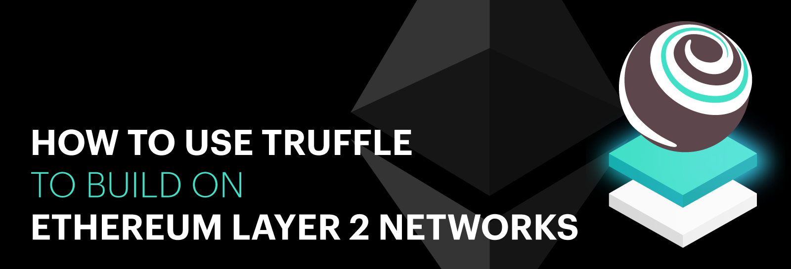

**By [Kingsley Arinze](https://twitter.com/heydamali)**

Layer 2 networks, also commonly referred to as “L2s”, are scaling solutions in the blockchain ecosystem. The Ethereum blockchain, due to its design and transaction demand, has become slow and expensive for everyday users transacting on the blockchain. To ensure Ethereum can scale, many core developers have been working rigourly on the (fast-approaching) Merge to Proof of Stake and several L2 solutions have emerged for faster and cheaper transactions.

An L2 can simply be described as a server or a cluster of servers run by businesses, third-party operators, or even a group of individuals, that accepts and processes transactions off-chain by rolling up these transactions into batches before sending them back to a layer 1 chain like Ethereum.

In decentralized networks, the “Scalability Trilemma'' refers to the idea that a network cannot be **decentralized**, **secure**, and **scalable** at the same time. The Trilemma states that for a blockchain network to exist, it would have to make a tradeoff, leaving out one of these three aspects. This is why today, there are a myriad of blockchain layer 1 like Solana and NEAR and layer 2 chains like Arbitrum, Polygon, and Optimism  to choose from. Each promises its own set of advantages and disadvantages, depending on which aspects of the Scalability Trilemma it chooses to solve.

### Layer 2s and the Ethereum ecosystem

The Ethereum ecosystem has a number of layer 2 solutions available today which can be broadly classified as either “use-case specific” or “generalized” layer 2. These scaling solutions use a different underlying technology to offer scalability for the Ethereum blockchain:

1. [State Channels](https://ethereum.org/en/developers/docs/scaling/state-channels/) allow users to transact an arbitrary number of times off-chain, while only sending two transactions to the Ethereum mainnet.

2. [Rollups](https://ethereum.org/en/developers/docs/scaling/#rollups) perform transactions outside layer 1, before posting a compressed version of these transactions to the layer 1 blockchain, thereby relying on its native security. 
There are two classes of rollups: 

    - [Optimistic rollups](https://ethereum.org/en/developers/docs/scaling/optimistic-rollups/)
    
    - [Zero Knowledge rollups](https://ethereum.org/en/developers/docs/scaling/zk-rollups/)

3. [Sidechains](https://ethereum.org/en/developers/docs/scaling/#sidechains) are parallel running, EVM-compatible blockchains that run based on their own consensus mechanism and  use a two-way bridge to communicate with the Ethereum mainnet.

You can learn more about Ethereum layer 2 solutions in these [ConsenSys blogs](https://consensys.net/search/?q=l222).

### Benefits of Layer 2 solutions

As stated earlier, the Ethereum blockchain suffers from slow transaction speed and high gas costs, especially during network spikes, mostly due to its initial design that favors decentralization and security over scalability. 

Some of the ways in which layer 2s are improving the Ethereum user experience are:

1. Greater transaction throughput because L2s perform computations outside Ethereum (off-chain) and only have to post compressed transaction data to the mainnet, thus transaction speed is significantly improved.

2. Reduced transaction fees  by bundling a handful of transactions into a single transaction before sending them to the mainnet means way less transaction fees.

3. Increased security due to trustless proving mechanisms such as zero knowledge cryptography. Some use game theory and staked value for fraud proofs.

4. Expanded use cases like gaming and NFTs are not effective with the current transaction speed and cost, Layer 2s help tackle these problems.

### How is Truffle making building on Layer 2 easy?

At Truffle, our goal is to make building on Ethereum and other EVM-compatible blockchains and L2 networks as seamless as possible by providing the necessary tools developers need to build dapps. 

We’ve created simple Truffle Boxes that enable developers to learn quickly, by providing all the necessary boilerplate code and structure required to compile, migrate, test, and deploy smart contracts on  layer 2 networks. At the moment, we currently support 3 Truffle Boxes that focus on rollups and side chains and are working on adding to this collection. 

The 3 layer 2 Truffle Boxes we currently have are:

1. [The Optimism Truffle box](https://trufflesuite.com/boxes/optimism/)

2. [The Arbitrum Truffle box](https://trufflesuite.com/boxes/arbitrum/)

3. [The Polygon Truffle box](https://trufflesuite.com/boxes/polygon/)

To use these boxes, you must have the following softwares installed on your local machine:

[Node.js](https://nodejs.org/) 10.x or later

[NPM](https://docs.npmjs.com/cli/) version 5.2 or later

[Docker](https://docs.docker.com/get-docker/) version 19.03.12 or later

[Docker-compose](https://docs.docker.com/compose/install/) version 1.27.3 or later

With these requirements sorted out, you can install a new box with the command: `$ truffle unbox <BOX NAME>` for example `$ truffle unbox optimism`. This should create a new optimism project with the necessary files and folder structure.

If you’re curious to learn how you can build a dapp using our Optimism box, we’ve created an easy to follow [tutorial](https://trufflesuite.com/guides/nft-marketplace/) which you can use.

For more information about our exciting boxes and the upcoming ones, visit the official [Truffle boxes documentation](https://trufflesuite.com/boxes/).