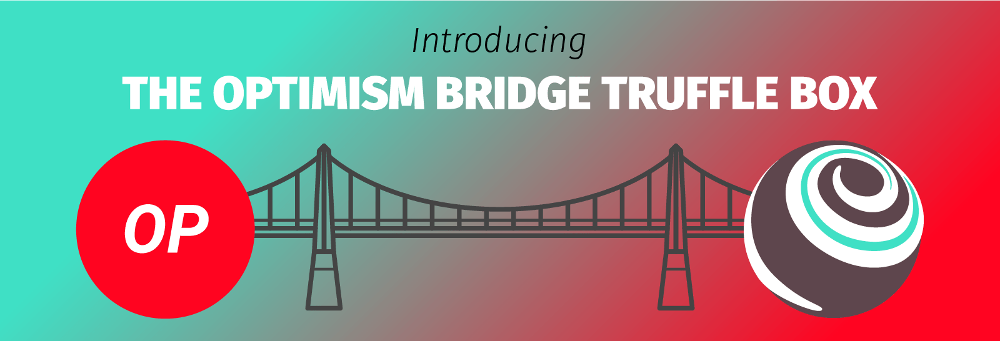

**By [Kingsley Arinze](https://twitter.com/heydamali)**

The growth of the crypto ecosystem has led to the introduction of multiple Layer 1 (L1) blockchains and Layer 2 (L2) scaling solutions, leading blockchain enthusiasts to believe that the future is multi-chain. However, the full potential of a multi-chain future can only be realized when there is a means of data exchange between the various L1s and L2s.

## What are bridges 
Imagine a scenario where all of a user's assets live on the Ethereum Mainnet. This user stumbles upon a new dapp that offers new exciting features, but only exists on a L2 such as Optimism. For this user to be able to transfer their existing assets from Mainnet to Optimism, there needs to be a solution that connects the two networks. Bridges are that solution. 

Blockchain bridges are solutions that allow for the easy transfer of assets and information between various L1s and L2s. With all the different blockchains that exist today, each with different underlying technologies and consensus mechanisms, the need for blockchain bridges can not be overstated.

The benefits of blockchain bridges include: 

- Easy exchange of data between two blockchain networks
- More options for users as they explore dapps on other networks
- Collaboration between developers across ecosystems

## What are Truffle boxes
[Truffle Boxes](https://trufflesuite.com/boxes) are the easiest way to get started building dapps on Ethereum or other L1s and L2s. They are helpful boilerplate code that provides the necessary configuration needed to build, deploy, and test a dapp, allowing developers to focus on the most important part of their dapp: the application logic.

Truffle boxes come bundled with useful libraries, solidity contracts, and frontend code out of the box. They are built in a non-opinionated way so that developers are not locked into building a certain type of dapp. Truffle currently has 50+ boxes ready for use, and you can find out more about them [here](https://trufflesuite.com/boxes).

## The Optimism Bridge Box
The Truffle Optimism Bridge Box provides you with the setup necessary to start building applications between multiple Ethereum network layers. It contains contracts that interact with the Optimism bridge on L1 and L2, along with a set of migrations for deploying contracts, calling functions, and passing messages and values.

Past L2 Truffle Boxes for [Optimism](https://trufflesuite.com/boxes/optimism) and  [Arbitrium](https://trufflesuite.com/boxes/arbitrum) were built without support for bridging in mind. In this new iteration of Truffle Boxes, we’re focusing on demonstrating bridging support for popular L2 networks.

### Requirements and Installation
As with every Truffle Box, you need to fulfill the following requirements before you can use them:

- [Node.js](https://nodejs.org/) 10.x or later
- [NPM](https://docs.npmjs.com/cli/) 5.2 or later
- [Docker](https://docs.docker.com/get-docker/) 19.03.12 or later
- [Docker-compose](https://docs.docker.com/compose/install) version 1.27.3 or later
- Recommended Docker memory allocation of >= 8 GB
- Windows, Linux, or macOS

Other important, but optional requirements are:
- An [Infura](https://blog.infura.io/?utm_source=blog&utm_medium=pressrelease&utm_campaign=2022_Jun_introducing-the-optimism-bridge-truffle-box_acquisition_content) account and a Project ID
- A [MetaMask](https://metamask.io/) account

Then, you can install this box by simply running the command:

```
truffle unbox optimism-bridge
```

It is important to note that this command will only work after the box has been published and gone live. You can use the following command to access it in the interim. 

```
truffle unbox https://github.com/truffle-box/optimism-box
```
### Setting up the Optimism Bridge Box
With the Optimism Bridge Box installed, the next step is to install all the dependencies bundled with the box. To do that, navigate to the root directory of the box and run the command `yarn install`.

Next, you will need to set up some environment variables. The Optimism Bridge Box comes with a .env.example file which can be found in the root directory and contains all the required environment variables that need to be set. Copy those over into a new .env file you will create and provide the necessary values. You will need to provide at least one mnemonic to use with the network.

For more information about setting up and the required environment variables, please refer to the documentation [here](https://github.com/truffle-box/optimism-bridge-box/blob/232a6db7784ed9131d5584f0fc16abec92b21a51/README.md#setup).

### Start bridging!
Now that you have installed and configured the Optimism Bridge Box, it’s time to start bridging! To help get started, we’ve included the following contracts and scripts as examples:

1. An [L1 contract](https://github.com/truffle-box/optimism-bridge-box/blob/232a6db7784ed9131d5584f0fc16abec92b21a51/contracts/ethereum/GreeterL1.sol) that sends a message over the Optimism bridge.
2. A [Migration](https://github.com/truffle-box/optimism-bridge-box/blob/232a6db7784ed9131d5584f0fc16abec92b21a51/migrations/3_set_L2_greeting.js) that sends a message from Ethereum to Optimism.
3. An [L2 contract](https://github.com/truffle-box/optimism-bridge-box/blob/232a6db7784ed9131d5584f0fc16abec92b21a51/contracts/optimism/GreeterL2.sol) that sends a message over the Optism bridge.
4. A [Migration](https://github.com/truffle-box/optimism-bridge-box/blob/232a6db7784ed9131d5584f0fc16abec92b21a51/migrations/4_set_L1_greeting.js) that sends a message from Optimism to Ethereum.
5. A [script](https://github.com/truffle-box/optimism-bridge-box/blob/232a6db7784ed9131d5584f0fc16abec92b21a51/scripts/deploy.mjs) to automate the process of compiling contracts and running migrations across each network.

## Conclusion
That’s all you need to get started building dapps that bridge between Optimism and Ethereum. We’ve put together a short [demo](https://github.com/truffle-box/optimism-bridge-box/blob/232a6db7784ed9131d5584f0fc16abec92b21a51/README.md#demo) that further expands on how the Optimism Bridge Box can be used to bridge networks. We’re so excited to see what our developer community builds with this these tools!

To find out more about our suite of developer tools, visit the official [Truffle website](https://trufflesuite.com). If you have questions that you'd like for our team members to answer, feel free to start a discussion on [Github Discussions](https://github.com/orgs/trufflesuite/discussions). Finally, don't forget to follow us on [Twitter](https://twitter.com/trufflesuite) for live announcements and updates.