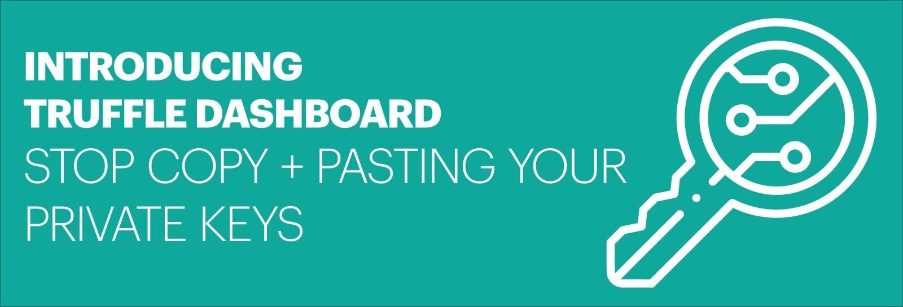
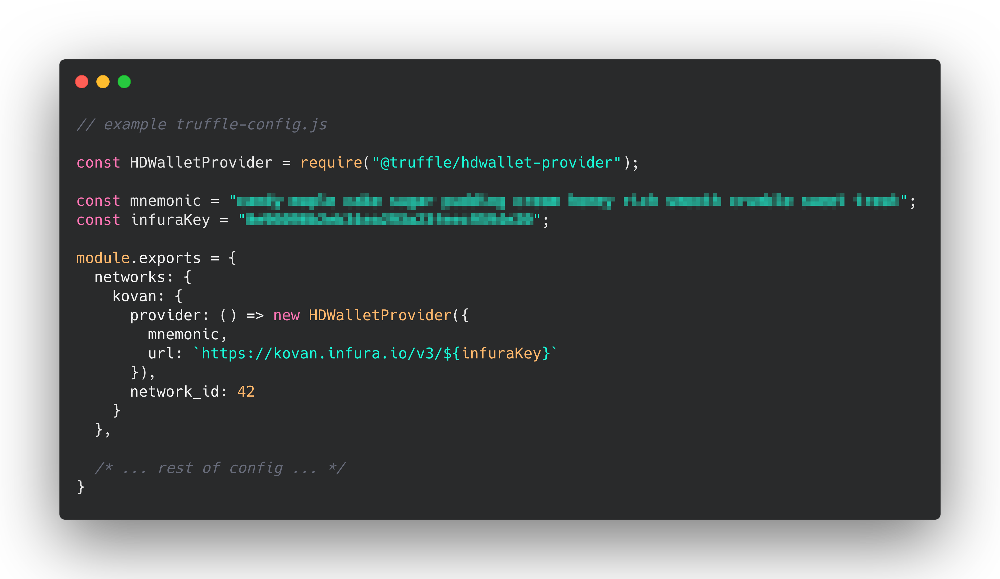
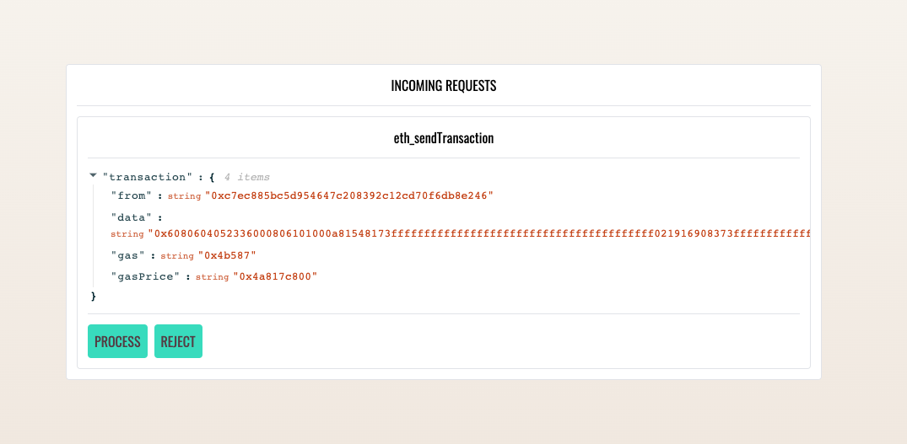

**By [Kingsley Arinze](https://twitter.com/heydamali)**

## Don't get rekt 🙀

One of our core missions at Truffle is to provide tooling that aids in the complete Web3 dapp development lifecycle, while maintaining rigorous security practices throughout. **As a smart contract developer, you require your development tools to keep your sensitive information secret and safe.** At Truffle, we're always looking for ways to make your experience more secure.

If you’ve ever deployed a smart contract, chances are you’ve had to think twice about sharing your private keys with Truffle or other development tools. Maybe you've had to be vigilant not to accidentally share those keys on GitHub. To deploy to an Ethereum network, you've needed to copy your wallet credentials and store them in an insecure location to share with a tool like HDWalletProvider. **This has been necessary because your mnemonic or private key gives Truffle the permissions it needs to sign transactions on your behalf.**

<figure markdown>
  
  <figcaption>Have you ever had to do something like this?</figcaption>
</figure>


**Storing your mnemonic seed phrase or private keys in regular files poses a considerable security concern.** Your seed phrase can easily be hijacked by JavaScript code, accidentally committed to Git, or targeted by bad actors.

## Enter Truffle Dashboard 🔥 🚀

Truffle Dashboard completely removes the need to manually interact with your wallet's mnemonic phrase or private keys throughout the development lifecycle.  **You can now safely deploy your smart contracts to your network of choice without Truffle ever needing to know what your keys look like.** Truffle seamlessly connects to your MetaMask wallet without any configuration, using the currently selected account and network for Truffle's deployment configuration.

_But that's not all!_ To make things more convenient, **you can use Truffle Dashboard with any development tool.** For example, if you use Hardhat or Foundry to develop your smart contracts, you can also integrate with Truffle Dashboard for this improved security workflow. See the [Using Truffle Dashboard with other development tools](/docs/truffle/getting-started/using-the-truffle-dashboard) section of our docs to learn how.

## How does Truffle Dashboard Work? ⚙️🔧

If you're new to Truffle, ensure you have Node.js then install the latest version of Truffle with the following command:

```console
npm install -g truffle
```

If you already have Truffle installed, you want to first uninstall your existing instance of Truffle globally:

```console
npm uninstall -g truffle
npm install -g truffle
```


### Running Truffle Dashboard 🚀

With the latest version of Truffle, in addition to all previously existing `truffle <...>` commands, you will see a new `truffle dashboard` command.

Running `truffle init` walks you through the process of setting up a new truffle project.

Running `truffle dashboard` in a separate terminal window starts Truffle Dashboard at `http://localhost:24012` and automatically opens a new tab in your existing browser session.


You can also configure the port and host to run Truffle Dashboard in one of two ways:

  - On the command line:

    ```console
    truffle dashboard --port <Port of choice> --host <Host of choice>`
    ```

  - In your Truffle configuration (truffle-config.js) file:

    ```javascript
    module.exports = {
      /* ... rest of truffle-config.js ... */

      dashboard: {
        port: 25012,
        host: "localhost"
      }
    }
    ```

See the [Truffle Commands](/docs/truffle/reference/truffle-commands.html) and/or the [Configuration](/docs/truffle/reference/configuration.html) reference documentation to learn more.

### Connecting your wallet 🤝

Truffle Dashboard requires you to connect your wallet to get started. Click the "Connect Wallet" button and connect Truffle Dashboard to your wallet the same way you would for any other dapp.


Next, Truffle Dashboard prompts you to confirm that you are connected to the correct network, since it uses the wallet's default active network. Make sure you switch to the desired network before confirming. Every transaction you process will be sent to the confirmed network.


During development, a typical workflow is first to deploy and test out your smart contract code on a development blockchain like [Ganache](https://trufflesuite.com/ganache) before deploying to your favorite test network.

You can still maintain this workflow with Truffle Dashboard by simply importing Ganache’s local blockchain network into your MetaMask wallet as usual and pointing Truffle Dashboard to use it as your confirmed network.


### Using Truffle Dashboard in your Truffle project 🎉

Before Truffle Dashboard was available, if you wanted to connect to a network like Rinkeby or Mainnet from your Truffle project, you had to specify some configuration variables in the network section of the truffle-config.js file.

```javascript
module.exports = {
  /* ... rest of truffle-config.js ... */

  networks: {
    development: {
      host: "localhost",
      port: 8545,
      network_id: "*"
    },

    ropsten: {
      // ...
    },

    mainnet: {
      // ...
    }
  }
};
```

With Truffle Dashboard, you do not need any of that, as Truffle now exposes a built-in network named `"dashboard"` which runs on whatever port and host your Truffle Dashboard is running on (`http://localhost:24012` by default). With Truffle Dashboard running and connected to MetaMask, you can simply supply the `dashboard` keyword to any Truffle command that requires you to specify a network. For example:

```console
truffle migrate --network dashboard
truffle console --network dashboard
```

When you run the above commands (or any RPC request), Truffle forwards your request from the command-line to the browser, where you can inspect it and choose to process or reject with MetaMask.



As with every zero-configuration feature, you are allowed to override the default configuration by adding a network called `dashboard` to your Truffle configuration file and specifying its options as you would for other networks. See the [`networks` configuration](/docs/truffle/reference/configuration.html#networks) reference documentation for more information.

### Using Truffle Dashboard with other development tools 👪

Although we developed Truffle Dashboard intending to improve the development experience for those who choose to build with Truffle, we made sure to make it tool-agnostic. So if Truffle isn't your development tool of choice for developing smart contracts (why on earth should it not be? C'mon, now let's talk!), but you'd like to integrate the Dashboard into your workflow, we've got you covered.

You can use Truffle Dashboard with other development tools. For example, use it with Hardhat by simply starting Truffle Dashboard in a separate terminal window and add a network configuration option that points to Truffle Dashboard's RPC URL in your Hardhat config file:

```js
module.exports = {
  // ...

  networks: {
    // ...

    "truffle-dashboard": {
      url: "http://localhost:24012/rpc"
    }
  },
};
```

With this setup, when you run the command `hardhat deploy --network truffle-dashboard`, the request is forwarded to Truffle Dashboard, where you can inspect and process them.

## Conclusion ❤️️

**With Truffle Dashboard, you no longer have to worry about giving your private keys to someone else's JavaScript code.** You can now relax and leave it up to MetaMask to keep your private keys safe and sign transactions on your behalf.


To get started, download the latest version of Truffle and start using Truffle Dashboard today by running the command `npm uninstall -g truffle && npm install -g truffle`.  Please refer to the [Truffle Dashboard](/docs/truffle/getting-started/using-the-truffle-dashboard.html) feature documentation for more.

Truffle Dashboard was borne out of our years of experience working on developer tools for the Ethereum ecosystem and receiving valuable feedback from our users. We are extremely excited to release this feature. We hope you're excited to try it out.

With ❤️️ from the Truffle team. Questions/comments/concerns? Please shoot us a tweet [@trufflesuite](https://twitter.com/trufflesuite)!
