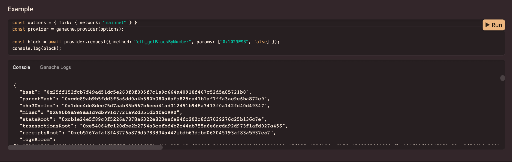
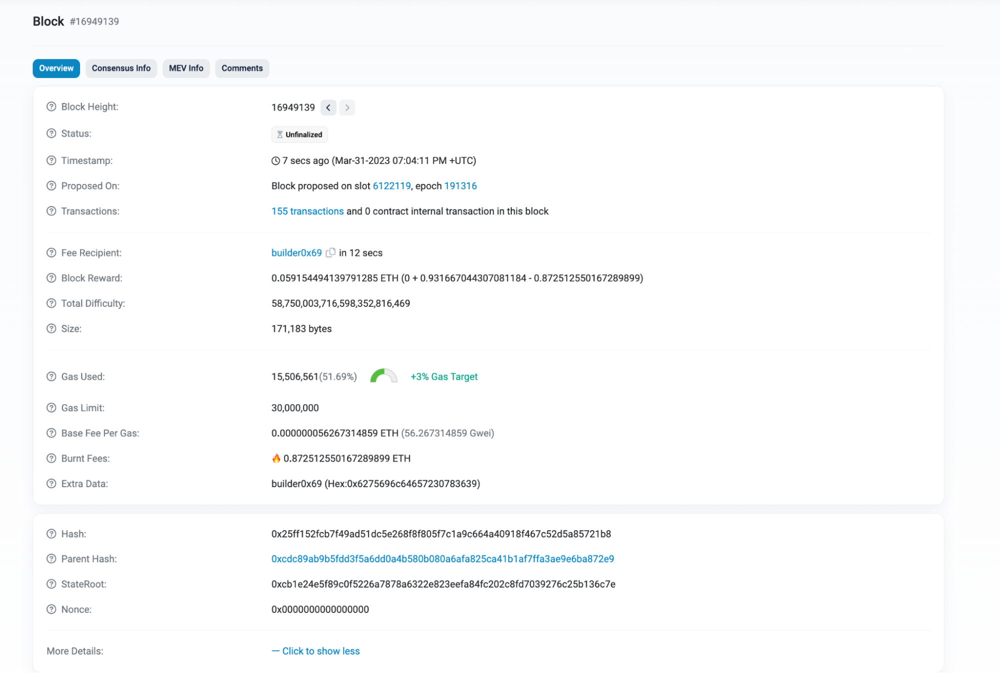

**By [Kingsley Arinze](https://www.linkedin.com/in/bruzzy)**

If you’ve ever wondered what RPC methods [Ganache](https://trufflesuite.com/ganache/) support or what arguments to pass in when calling these RPC methods, including the type of response to expect, then we’re happy to introduce you to [ganache.dev](http://ganache.dev), an interactive JSON-RPC documentation for Ganache.

Or if you’re a Hardhat user but can not stop thinking of what could be if you had a tool like [Truffle Dashboard](https://trufflesuite.com/blog/introducing-truffle-dashboard/), that plugs in seamlessly to your existing workflow, allowing you to interact with the blockchain and deploy contracts without exposing your secret keys, then look no further as we’ve created a plugin that extends Truffle Dashboard to do just that.

In this product release update, we'll delve into [ganache.dev](http://ganache.dev) and [Truffle Dashboard Hardhat Plugin](https://www.npmjs.com/package/@truffle/dashboard-hardhat-plugin), what they are, and how to use them to improve your development experience.

## ganache.dev, An interactive JSON-RPC documentation for Ganache

We’re happy to share with the world this project we’ve been hard at work on recently, [ganache.dev](http://ganache.dev). [ganache.dev](http://ganache.dev) is interactive JSON-RPC documentation for Ganache that allows you to quickly try out various RPC methods on the browser, without having to run a Ganache instance.

It contains code samples for each RPC method and is powered by [Ganache in the Browser](https://github.com/trufflesuite/ganache/#browser-use), demonstrating using Ganache programmatically as an [EIP-1193 provider](https://github.com/trufflesuite/ganache/#as-an-eip-1193-provider-only).

With each example on this interactive documentation, the editor can be changed to further test other Ganache features or combine a couple of features together as you would in a code editor. For example in this blog, we will be editing an example to include and test out the [zero-config mainnet forking](https://trufflesuite.com/blog/three-new-ganache-features-to-improve-your-developer-experience/#zero-config-mainnet-forking-now-available-in-the-browser) feature.

This is possible because [ganache.dev](http://Ganache.dev) uses the latest version of Ganache which supports mainnet forking in the browser without any configuration - [more on that here](https://trufflesuite.com/blog/three-new-ganache-features-to-improve-your-developer-experience/#zero-config-mainnet-forking-now-available-in-the-browser).

### Try out the zero-config mainnet forking feature on ganache.dev

Head to Etherscan and grab the latest block number on mainnet, at the time of this writing, it was 16949139 in decimal, which translates to 0x1029F93 in hex.

On ganache.dev, head to the eth_getBlockByNumber RPC method documentation and update the code sample to look like this:

```javascript
const options = { fork: { network: "mainnet" } };
const provider = ganache.provider(options);

const block = await provider.request({
  method: "eth_getBlockByNumber",
  params: ["0x1029F93", false],
});

console.log(block);
```

As you can see, we’re defining a new provider, and passing in the option that enables mainnet forking and since ganache.dev runs on the latest version of Ganache, we get to have this feature on our browser.

Next, we pass the latest mainnet block number as a parameter to the eth_getBlockByNumber RPC method and finally, we log the output to the console.

Once you run this code, you should get a response that looks like this:



If you study the output, you should be able to see that it matches exactly with what we have on Etherscan, so cool!



Feel free to play around with this interactive documentation and if you find any bugs, do not hesitate to [open an issue](https://github.com/trufflesuite/ganache/issues/new).

## What is Truffle Dashboard Hardhat Plugin

Our focus for Truffle going forward is to improve its interoperability with other development frameworks that are available in the ecosystem. This means that we want you to be able to plug any tool from the [Truffle suite](https://trufflesuite.com/blog/) into your existing workflow - irrespective of what development framework you’re using - and still be able to achieve the optimal result.

This is why we’re excited to introduce the [Truffle Dashboard Hardhat Plugin](https://www.npmjs.com/package/@truffle/dashboard-hardhat-plugin), a plugin that extends the Truffle Dashboard’s functionality to allow HardHat users to decode transaction information including the function signature and the values of any arguments passed.

With this plugin, whenever you run `npx hardhat compile`, the compiled artifacts from your Hardhat project are sent to the Truffle Dashboard, which in turn uses [@truffle/decoder](https://trufflesuite.com/docs/truffle/codec/modules/_truffle_decoder.html) to decode, providing more context before you go on to sign a transaction.

### How to get started with Truffle Dashboard Hardhat Plugin

The first step is to make sure you have access to [Truffle](https://trufflesuite.com/truffle/) either by downloading it to your local machine using `npm install -g truffle` or by fetching and running the Truffle dashboard remotely using `npx truffle dashboard`.

The next step is to install this plugin in your local Hardhat project with the command `npm install @truffle/dashboard-hardhat-plugin -D` and import it into your hardhat.config.js file like so:

```javascript
import "@truffle/dashboard-hardhat-plugin";
```

With both [Truffle](https://trufflesuite.com/truffle/) and [truffle-dashboard-hardhat-plugin](https://www.npmjs.com/package/@truffle/dashboard-hardhat-plugin) installed properly, you will need to tell the plugin where to send the compiled artifacts including subsequent transactions and to do that, you’ll need to update the configuration file - hardhat.config.js.

```javascript
const config: HardhatUserConfig = {
  networks: {
    dashboard: {
      url: "http://localhost:24012/rpc"
    }
  },
  ...
}
```

### How to use Truffle Dashboard Hardhat Plugin

Usage is very simple, all calls to `npx hardhat compile` will send the compiled artifacts to Truffle Dashboard.

Also, any deployments or transactions via scripts that target the dashboard network will be sent to Truffle Dashboard for signing via your browser-based wallet.

```javascript
	npx hardhat run scripts/deploy.ts --network dashboard
```


Please ensure that your browser-based wallet is unlocked for transactions to be received, otherwise, you might see a “Cannot read properties of null (reading 'sendTransaction')”.

### Get started using Truffle, Ganache, and Hardhat

At Truffle, we remain committed to improving and simplifying the user experience for dapp developers in the web3 ecosystem, by creating developer tools, resources, and educational materials.

To find out more about our suite of developer tools, visit the [official Truffle website](https://trufflesuite.com/) or follow us on Twitter. If you have questions, feel free to start a discussion on [Truffle Github Discussions](https://github.com/orgs/trufflesuite/discussions).
