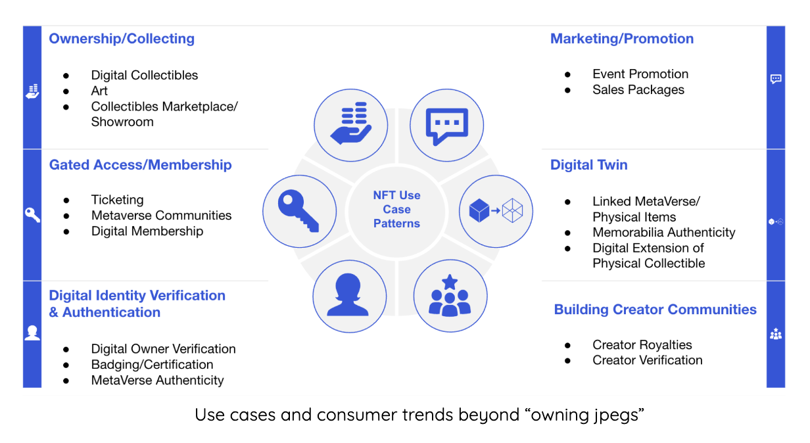
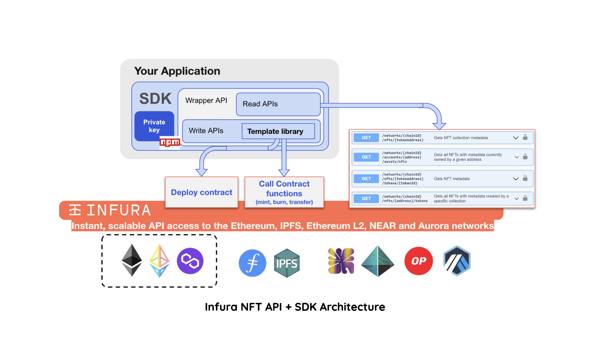

**By [Kingsley Arinze](https://www.linkedin.com/in/bruzzy)**

Infura [announced](https://blog.infura.io/post/introducing-the-infura-nft-api-beta-release) the private beta release of their NFT API a few months ago. Since then, there has been an ecosystem of tools developing around it, making it easier to build with [Infura’s NFT API](https://infura.io/resources/apis/nft-api-beta-signup). 

One such tool is the [The Infura NFT SDK Truffle Box](https://github.com/truffle-box/infura-nft-sdk-box), which as you’ll see later in this post, utilizes another tool built on top of the Infura NFT API, the [Infura NFT SDK](https://github.com/consensys/infura-sdk), to make NFT development as stress-free as possible.

In this post, we will discuss the Infura NFT API, as well as the Infura NFT SDK which is available for download as an [NPM package](https://www.npmjs.com/package/@infura/sdk). We’ll then explore the Infura NFT SDK Truffle Box and how it makes NFT development a lot easier by providing the necessary configuration and boilerplate code needed to build a complete NFT project.

## Infura NFT API, what is it?

In the past year, we’ve seen a significant increase in cryptocurrency adoption across the world, which is in part, a result of the NFT boom of the past year. 

As a matter of fact, there is an estimated 880% increase in global crypto adoption in 2021, a $180 billion market capitalization for stablecoins as of March 2022 as well as a $70 billion market capitalization for NFTs as of September 2022.

We’ve also seen a number of popular brands like Coca-Cola, Adidas, Nike, and Formula 1 to name a few, launch NFTs and invest in the Metaverse. 

All this points to the fact that NFTs are an important part of our ecosystem and their use cases aren’t just limited to PFPs or artwork, but extend to include digital identity verification, membership/access to gated digital and physical communities, and much more.



Infura and Truffle understand the importance of NFTs and where it is headed, which is why we've expanded our product offering to include the [NFT API](https://docs.api.infura.io/nft), a set of RESTful APIs that enable developers to: 

- Fetch all or specific NFTs for an account 
- Verify ownership of an NFT or a collection
- Get the creator and transfer history of NFT or a collection
- And other important metadata

## Infura NFT SDK, what is it?

The Infura NFT SDK is basically a wrapper around the Infura NFT API, exposed as a JavaScript library and available for download on [NPM](https://www.npmjs.com/package/@infura/sdk). This library, in addition to being able to make RESTful calls to all of Infura’s NFT API endpoints, allows you to deploy and call methods on common Ethereum smart-contract definitions through Infura, without the developer overhead of learning Solidity, compiling code, and importing ABI’s.



For a detailed description of how to use the SDK for deploying an NFT, minting and transferring an NFT, and fetching NFT metadata, please refer to the [how-to section](https://docs.infura.io/infura/infura-custom-apis/nft-sdk/how-to) of the Infura NFT API documentation.

## The Infura NFT SDK Truffle Box

To further simplify the developer experience for NFT developers and creators using the Infura NFT API and the SDK, Truffle is happy to announce the release of the [Infura NFT SDK Truffle Box](https://github.com/truffle-box/infura-nft-sdk-box), a set of boilerplate code that enables NFT developers, using Truffle, to take their ideas from concept to reality, as quickly as possible, by allowing them to focus on the most important and unique parts of their projects, while taking care of all other aspects such as project configuration and deployment.

### Installation and setup

To use the Infura NFT SDK Truffle Box, you have to meet the following requirements: 

- Access to the Infura NFT API as it is still in private beta. Join the waitlist [here](https://infura.io/resources/apis/nft-api-beta-signup)
- Node.js 10.x or later
- NPM version 5.2 or later 
- Windows, Linux, or macOS 
- An [Infura](https://infura.io) account and Project ID, together with the Project Secret Key
- A [MetaMask](https://metamask.io) account

Once these requirements are met, in an empty folder, run the unbox command as shown below: 

```bash
npx truffle unbox infura-nft-sdk
```

This should download and unbox the Infura NFT SDK Box. Next download all project dependencies by running `npm install`.

With all dependencies successfully installed, proceed to creating a `.env` file in the root of your project, followed by adding values for the following environment variables:

```bash
REACT_APP_INFURA_PROJECT_ID=your-project-id
REACT_APP_INFURA_PROJECT_SECRET=your-project-secret
REACT_APP_IPFS_GATEWAY=your-ipfs-gateway
```

### Start the project

We’ve included a basic user interface that enable you to perform some actions as you will see shortly. Switch to the client directory of the box and run `npm start` to start the project. On your browser, navigate to `http://localhost:3000` to view your application and connect your wallet.

### How it works

Once you've started the application, notice that on the left hand side, there are links to perform actions like deploying an NFT contract, Loading a deployed NFT contract, Minting and setting royalty for an NFT, and viewing your minted NFT collection. Let's delve deeper into these actions:

1. Deploy a new NFT contract: using the **Add New Contract** link, you can deploy a new NFT contract by first choosing a template, which is a way of telling Infura what underlying smart contract to use. At the moment, there is only one option which is an ERC721 contract but as time goes on, more options will be added. 

    Once you've selected a template, you'll be prompted to provide the contract name, symbol and URI - link to your NFT metadata hosted on IPFS. With those set, click the deploy button and proceed to approving the transaction on your connected MetaMask wallet. That's it, you've successfully deployed a new NFT contract.

2. Load contract: there's also an option to load a different contract to the UI incase you have multiple contracts deployed. Click the **Load contract** link, This will prompt you to select a template to use. Once selected, input the contract address you want to load before clicking the load button.

3. Interact with you NFT contract: once you've deployed or loaded your NFT contract, you can navigate to the **Contract** link and interact with your deployed contract by minting an NFT. You will need to provide the metadata URI for the NFT you want to mint. You can also set royalty by populating the royalty input field and clicking the **Set Royalties** button.

4. View your NFTs: by clicking the **Album** link, you should be able to see all your minted NFTs on display on the UI.

## Conclusion

At Truffle, we remain committed to improving and simplifying the user experience for dapp developers in the Web3 ecosystem by creating developer tools, resources, and educational materials. 

To find out more about our suite of developer tools, visit the official [Truffle website](https://trufflesuite.com). If you have questions, feel free to start a discussion on our https://github.com/orgs/trufflesuite/discussions. 

We also hold weekly live-streamed sessions called **Web Unleashed**, where we build, interview folks, and discuss important developments around the ecosystem. Keep an eye on our Twitter for updates on the next session. 

You can also find past episodes on the [Truffle Youtube channel](https://www.youtube.com/c/TruffleSuite) and the [unleashed section](https://trufflesuite.com/unleashed) of our website if you prefer written materials.