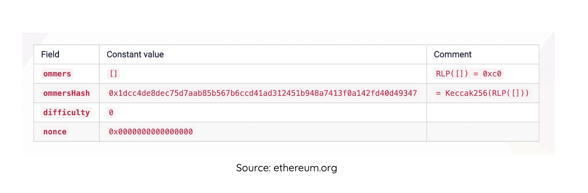

**By [Kingsley Arinze](https://twitter.com/heydamali)**

*As the Merge draws closer and closer, teams building for the Web3 ecosystem are reflecting on ways to prepare for this significant milestone in Ethereum’s history. In this blog, we’ll understand the migration to Proof of Stake on a deeper level by exploring the ways in which it will upgrade the Ethereum network, how Truffle is preparing for it, and finally what it means for the future of our service.*

One of the most talked-about events in crypto in 2022 is the Merge. While many Web3 enthusiasts see it as an opportunity to invest and get a quick return due to  ETH price speculation, many people don’t understand how the migration to Proof of Stake (PoS) will evolve Ethereum.

## What is the Merge?

The Ethereum blockchain, by initial design, uses a ProofofWork (PoW) consensus mechanism, a system whereby validators also known as miners are required to complete a complex cryptographic puzzle in order to validate transactions and create new blocks. This process requires a lot of computing power and has been criticized by many due to its environmental impact. 

The ProofofStake (PoS) consensus mechanism on the other hand is a system where validators are required to stake their digital coins for the right to validate transactions and create new blocks. This mechanism promises to reduce Ethereum’s carbon footprint by about 99.95%.

The Merge in simple terms refers to the transition of Ethereum from a PoW consensus blockchain into a PoS consensus blockchain. Currently, Ethereum has both a PoW and PoS chain running in parallel and while both chains have validators, only the PoW chain currently processes users’ transactions. Once the Merge is complete, Ethereum will shift to the PoS chain, called the Beacon Chain, making mining on PoW obsolete.

While there’s been some misinformation about the Merge and how it would lower gas fees, it is important to clarify that that isn’t the case as [highlighted by Tim Beiko](https://www.youtube.com/watch?v=lhtDKfuEeGo), a Researcher at the Ethereum Foundation. Instead, the Merge aims to solve the following challenges which are considered to be barriers to the mainstream adoption of crypto: 

- Slow transaction speed
- High energy usage leading to increased carbon emissions
- Higher barrier to participation due to the resources required to be a miner or validator 

## How does the Merge change Ethereum as we know it today?

The Merge, although designed to only have minimal impact on how Ethereum is operated from the end-user, smart contract, and dapp perspective, there are some minor changes worth noting. 

### 1. Block structure

Post Merge, we will see the introduction of new blocks that would include the current PoW blocks’ content as one of its components in a field called `ExecutionPayloads`. We’ll also see the retirement of some PoW block headers that would no longer be relevant to the new PoS chain. The values of these headers would be set to the zero equivalent of their data structures going forward, as opposed to their complete removal so as to minimize disruption to tooling and existing infrastructures. These changes are captured in the table below:

### 2. Stabilized and reduced block time
The merge is expected to reduce and stabilize the average time it takes to create a new block in Ethereum to exactly 12 seconds. Currently, under PoW, it takes approximately 13 seconds to create a new block, which means that sometimes it could take longer and sometimes shorter than 13 seconds. Although this only implies a ~1 second change, smart contracts can now have a better sense of the expected block times to use in their calculations.

### 3. *Finalized* and *Safe head* blocks

Currently, for a block to be considered “confirmed” in Ethereum, several other blocks must have been mined on top of it. This is expected to change post-merge with the introduction of the concept of a ***Finalized* block** which is simply a block that has been accepted by more than ⅔ of the total validators. This means that for an attacker to create a conflicting block, they must burn a minimum of ⅓ of the total stake. The Merge would also introduce a ***safe head* block** which under normal network conditions and assuming a network delay of fewer than 4 seconds, is expected to be included in the chain.

It is expected that JSON RPC APIs would be updated to expose the safe head block in a new `safe` tag and the finalized block in a `finalized` tag. These changes are summarized in the table below:

## How Truffle is preparing for the Merge

At Truffle, we are very excited about the Merge!   Here are some ways in which we’re preparing for it.

We’re updating our Truffle boxes that utilize deprecated testnets and adding support for new testnets. [Truffle boxes](https://trufflesuite.com/boxes) are helpful boilerplate code that allows dapp developers to focus on their application’s unique logic. Some of these boxes currently include configuration options for some testnets that will be deprecated post-merge, such as the Rinkeby and Ropsten testnet. We’re updating these boxes to exclude deprecated testnets as well as adding support for new testnets like the [Kiln testnet](https://kiln.themerge.dev).

The [Truffle documentation](https://trufflesuite.com/docs) is also being updated to better capture the essence of Ethereum, post-merge. After the merge, Ethereum is expected to consist of two main layers: **the Consensus layer** where the blockchain consensus happens, and the **Execution layer** where transactions are processed and bundled. These layers would be handled by the Beacon chain consensus client and modified pre-merge PoW clients (including Geth, Parity e.t.c) respectively. We’re also updating some of our blogs, tutorials, and educational contents to better reflect these changes.

Finally, we're also updating our developer tools mainly [Ganache](https://trufflesuite.com/docs/ganache/) and the [Truffle Debugger](https://trufflesuite.com/docs/truffle/getting-started/using-the-truffle-debugger/) to match new specifications so be on the lookout for when we announce these upgrades.

## Conclusion

At Truffle, we remain committed to improving and simplifying the user experience for dapp developers in the Web3 ecosystem by creating developer tools, resources, and educational materials that will help onboard new dapp developers. With this upgrade coming to Ethereum, we're even more excited and committed to this course.

To find out more about our suite of developer tools, visit the official [Truffle website](https://trufflesuite.com). If you have questions that you'd like for our team members to answer concerning the merge and how it impacts our products, feel free to start a discussion on our [Github Discussions channel](https://github.com/orgs/trufflesuite/discussions). Finally, don't forget to follow us on [Twitter](https://twitter.com/trufflesuite) for live announcements and updates.

