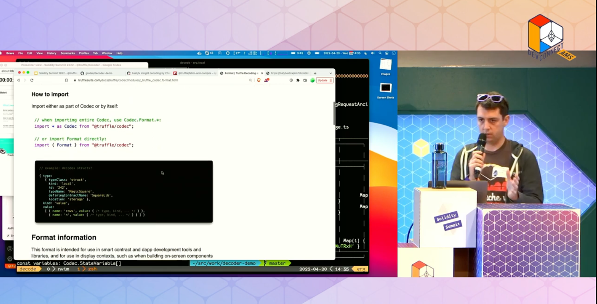
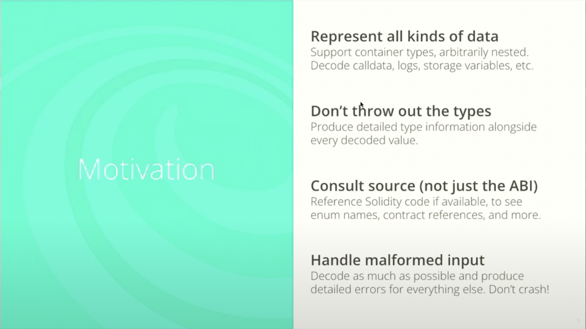
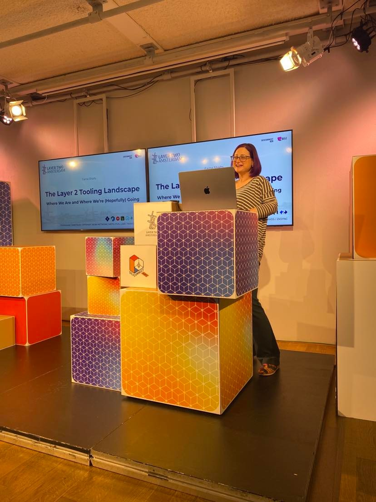
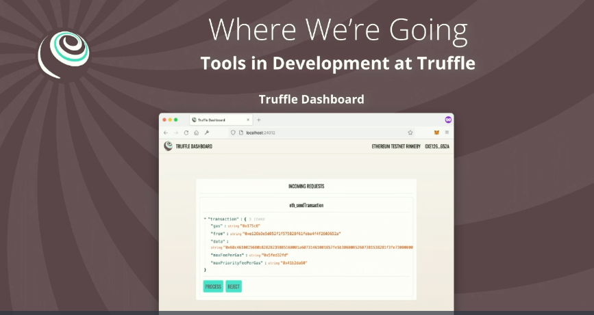

**By Ray Allums, & Kingsley Arinze**

### Introduction

The Truffle team took part in DevConnect week in Amsterdam, and it was easily the highlight of our year….so far! DevConnect, organized by the Ethereum Foundation, brought the Ethereum community together in Amsterdam to share new updates, extensive roadmaps, and an exciting outlook on what the future holds.

DevConnect week in Amsterdam hosted 100+ events ranging from meetups, DAO gatherings, Layer 2 development discussions, all the way to dancing the night away at rAave!

This week made one thing clear - the Ethereum ecosystem has an incredibly vibrant and passionate community! 

### IRL VS URL

The long plane ride was well worth it, because we finally got to meet our awesome coworkers in person, as well as network with world class devs! In Amsterdam, our team bonded over delicious dinners, succulent wine, board games, and a canal boat tour. We also were able to connect with other devs from Web3 companies like DeveloperDAO, Starkware, Nethermind, ZKX Protocol, Gitcoin, and other major Layer 2 protocols. Getting to connect in person was invaluable to facilitating conversations on improving the developer tooling ecosystem. We were able to quickly bounce ideas off one other to strategize how Truffle can continue to improve.

In the spirit of decentralization, each talk, hackathon, and event featured at DevConnect was hosted and ran independently. Across Amsterdam, we heard from industry leaders and learned about new and upcoming projects. There was a large focus on modularity and Layer 2s, and at Truffle, we’re proud to say we’re aligned on that focus. 

At DevConnect, G Nicholas D'Andreaa, Truffle Suite Lead, and Faina Shalts, Lead Blockchain Engineer, had the opportunity to showcase various offerings in our Truffle suite of tools. 

TL’DR: We’re really excited about what our team is building! 

### Solidity summit 2022: Truffle decoder demo

G Nicholas D'Andrea was featured in a one-day forum for the Solidity ecosystem to demo Truffle decoder. Truffle decoder is a high-level interface for decoding transactions, events, and state variables for Ethereum smart contracts. G Nicholas demonstrated how to initialize the [Truffle Decoder library](https://www.npmjs.com/package/@truffle/decoder) as well as some of the supported functions.

During the discussion, G Nicholas touched upon the motivation behind the Truffle decoder which is the need for a library that:

- Is able to decode and represent all kinds of data, including call data, revert messages, custom errors, logs, and storage variables.

- Is able to retain type information after decoding. For example, say you have an integer, how do you know if it is a uint128 or a uint64? You need this type of information to be able to display decoded values in the right format.

- Provides more detailed decoding, relying not only on contract ABIs but also uses the contract source code for reference if available.

- Properly handles errors during decoding especially with malformed data because in blockchain, sometimes data is malformed. 

G Nicholas illustrated the two major tools that use Truffle decode:

- MetaMask, more specifically, the MetaMask transaction decoder, allows users to see additional information in a “data'' tab about the transaction they want to confirm/sign.

- [VS Code extension](https://marketplace.visualstudio.com/items?itemName=trufflesuite-csi.truffle-vscode) with the Truffle debugger, enables VS Code users to debug and replay transactions made against their contract.

You can dive deeper into these core functions by reading the [official documentation](https://trufflesuite.com/docs/truffle/codec/modules/_truffle_decoder.html).

### L2Beat Layer 2 Conference: The Layer 2 Tooling Landscape

Faina Shalts, the Lead Blockchain Engineer at Truffle, gave a talk at the two-day L2Beat conference about the future of the Layer 2 Tool Landscape. 

By evaluating the current Layer 2 Tooling offerings, Faina identified several unmet needs that are starting to emerge:

- **UI/UX tooling**: There is the need to standardize the user experience for actions like switching networks and this can be achieved via tooling, offering a more streamlined experience for dapp developers.

- **Layer abstraction**: Faina identified the need to abstract away all the technicalities associated with layer 2 and bridging. Users should not be bothered about what layer they are on, only that they are able to carry out the desired operation successfully.

- **Sequencer and validator monitoring**: Users and developers need to be aware of the level of security on any given chain. Information like the sequencer availability should be transparent and open to all. 

- **Bridge interfaces**: Due to a plethora of bridge interfaces and many security trade offs, there is a need to standardize this process by providing tools that dapp developers can use to build bridges efficiently.

- **Multichain deployment management**: Deploying contracts to both layer 1 and layer 2 as a single operation can be very complex. Right now, the newer dev tools that currently exist look at deployments as a single chain process, but they do not take into consideration when a contract on one chain may depend on deploying another contract to a different chain first.

Luckily, Truffle is already one step ahead!  Our team has released various layer 2 tools to improve and standardize the user experience.

Some of the tools that we’re excited about are:

1. [Truffle boxes](https://trufflesuite.com/boxes/): These are boilerplate code, similar to the Ruby on Rails scaffold, where running a simple command on your CLI would scaffold a new project, including all the directories you need as well as a detailed README with deployment instructions and things to be mindful of. As of now, Truffle has the [Arbitrium box](https://trufflesuite.com/boxes/arbitrum/), the [Optimism box](https://trufflesuite.com/boxes/optimism/) and the [Polygon box](https://trufflesuite.com/boxes/polygon/) all live and available for dapp developers to use. We’re currently working on more advanced use cases for our boxes like the bridge box and starknet box.

2. Protocol flavored Ganache: We’re in the final stages of launching the infrastructure for what we call the Ganache Plugins. These are plugins that would enable dapp developers to run Ganache with the rules of layer 2 protocols baked in, allowing them to do what they’re already comfortable with: debugging and testing via Ganache. Once this is live, developers would be able to have an Optimism Ganache, Arbitrum Ganache, and a Starknet Ganache.

3. Declarative deployments: This would be the solution for the multi chain deployment problem. The goal is to tell Truffle what your completed project should look like using a YAML or JSON file and then Truffle would take it up from there, deploying your contracts in the order you’ve describe and to the chains or layers you’ve specified, all while maintaining state, handling contract dependencies as well as deploying to multiple RPC endpoints.

4. [Truffle VS Code extension](https://marketplace.visualstudio.com/items?itemName=trufflesuite-csi.truffle-vscode): Which is a tool that allows you to perform all the actions you would perform with Truffle, but all within VS Code. It allows you to compile, debug, deploy your contracts. This was released a few weeks ago and we’re working on making this extension incorporate all these new layer 2 support tools.

5. [Truffle dashboard](https://trufflesuite.com/docs/truffle/getting-started/using-the-truffle-dashboard/): A tool that removes the need to copy/paste your private keys into regular files during contract deployment. With Truffle dashboard running, you can connect through the UI and deploy contracts via [MetaMask](https://metamask.io/) or Wallet connect. This was released sometime in January and we’re working on implementing our multi-network approach to the Truffle Dashboard as well.

### Conclusion 

In conclusion, Amsterdam was filled with tons of key learnings, stronger team connections and potential collaboration, that the Truffle team is excited to build upon. Gaining an in depth look at the state of the Ethereum ecosystem makes us thrilled for what is yet to come!

