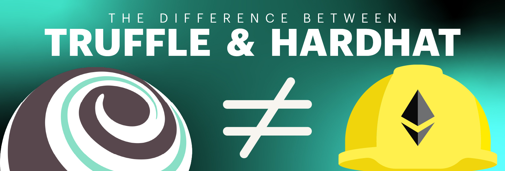

**By [Kingsley Arinze](https://www.linkedin.com/in/bruzzy)**

Every field in software development relies on the availability of the right tools to get the job done effectively. This is especially true for dapp development in Web3, as we’re still in the early stages. 

Today, there are two dominant development environments for dapp development: Truffle and Hardhat. And while these two are the most prevalent, we’re seeing newer players such as Foundry and Tenderly gain traction in the ecosystem.

In most cases, when new developers are on-boarded into Web3, they tend to stick to the development environment they started with, primarily because of a lack of understanding of what other tools offer. And although this isn’t a bad thing, it can limit developers’ understanding of tools and the different features of each, in order to provide the most value.

In this blog, our goal is to outline the differences between Hardhat and Truffle, while reviewing some of the services they offer in hopes that the next time you’re choosing a development environment for your next dapp, you’re able to make an informed decision.

## A bit of history

Truffle was the first of the two to be released, and it was initially written in CoffeeScript. It was later rewritten to ES6 JavaScript in 2015. Truffle quickly gained attention as developers could now write and test their smart contracts using ES6 JavaScript without needing to add any custom processors. 

Truffle also introduced the first-ever **integrated Solidity debugger** and was the first to allow mainnet forking using **Ganache**. As part of its offering were also tools that enable developers to compile and deploy contracts, perform automated testing, and configure their frontend architecture.

Hardhat on the other hand was initially launched in 2019 as [Buidler](https://github.com/NomicFoundation/hardhat/releases/tag/hardhat-v2.0.0). Hardhat went on to learn from the early days of Truffle and quickly became the top provider. They offered three main components for dapp development: **Hardhat**, the development environment, **Hardhat Runner**, the task runner, and **Hardhat Network**, the EVM development network.

The key value proposition of Hardhat was that it was less opinionated than Truffle, although in recent times, we’re beginning to see Hardhat become more opinionated, which makes sense considering the exponential growth of the Ethereum ecosystem in recent years.

## Truffle vs. Hardhat - An overview of each tool

### Hardhat and Truffle’s built-in Ethers.js support

It is recognized in the ecosystem that Ethers.js has been gaining significant traction in the last few years. This is in big part due to its active maintenance and feature release cadence. That said, Web3.js 4.x recently hit alpha so the library wars are far from over.

Hardhat works well with Ethers.js, as an entire plugin and documentation section is dedicated to it. On the other hand, Truffle has built-in contract abstractions that make web3.js easier to use, and has Ethers.js support improvements in the works.  

It is important to note that despite Truffle and Hardhat having better support for web3.js and Ethers.js respectively, you can still use any of the two, depending on what you’re more comfortable with.

### Hardhat and Truffle’s built-in TypeScript support

Hardhat has built-in support for TypeScript and this is important for teams that rely heavily on this programming language as Hardhat requires minimal configuration to get started using TypeScript. 

You won't need to download any other dependencies if you download the hardhat-toolbox package using NPM 7 or greater. You can simply configure your project using `hardhat.config.ts` and a `tsconfig.json` file, and you’re ready to start building!

Hardhat also supports writing scripts and smart contract tests in TypeScript. It requires no additional dependencies to get this done. You also won’t need to manually run `tsc` before running your tests. Additionally, It features type-checking using an optional `-- typecheck` flag. 

Truffle, on the other hand, also supports writing tests in TypeScript. However, you’ll need to manually install all the necessary dependencies, and manually run the `tsc` command to compile TypeScript files. 

### Truffle for VS Code Extension vs. Hardhat for VS Code Extension

These two extensions vary significantly in what they accomplish. [The Truffle for VS Code Extension](https://marketplace.visualstudio.com/items?itemName=trufflesuite-csi.truffle-vscode), which Microsoft originally started, is more catered toward developer user experience. It has an interface for managing your development workflows and representing important information visually. 

The Truffle for VS code extension also has built-in support for a growing number of Web3 tools and services, including [Infura](https://infura.io/), [Truffle debugger](https://trufflesuite.com/docs/truffle/getting-started/using-the-truffle-debugger/), and [Ganache](https://trufflesuite.com/ganache/). This means that with a few clicks,  you can test, debug, and deploy your contracts directly to the Ethereum mainnet and testnets. You can also deploy directly to Ganache and Hyperledger Besu using this extension.

The [Hardhat for VS code Extension](https://marketplace.visualstudio.com/items?itemName=NomicFoundation.hardhat-solidity) caters more towards providing language support for Solidity. It offers code completion, Solidity code error detection, code formatting, and code actions. It is similar to the [Solidity extension](https://marketplace.visualstudio.com/items?itemName=JuanBlanco.solidity) by Juan Blanco, although the latter has been around since 2015 and offers additional features such as code snippets and Nethereum code generation for integration with .NET projects.

### Ganache vs. Hardhat Network

Both [Ganache](https://trufflesuite.com/ganache/) and [Hardhat Network](https://hardhat.org/hardhat-network/docs/overview) have rich lists of features. They are both local Ethereum network nodes capable of instantly mining new blocks. This makes them very fast and useful for testing smart contracts. They can also be configured to mine blocks at intervals. 

They are both capable of running as an in-process or standalone daemon. But Ganache takes it a step further by having a standalone graphical user interface called the [Ganache GUI](https://trufflesuite.com/ganache/) that can be used together with other development environments for a more visual experience.

Both local networks are capable of forking the Ethereum mainnet and testnets, allowing users to replay real-life transactions locally. This is particularly useful when used together with the Truffle debugger. For example, here is a [demo](https://www.reddit.com/r/ethereum/comments/4yd1o4/testrpc_teaser_instantaneous_forking_coming_soon/) of using the Ganache mainnet forking feature and the Truffle debugger to exploit the DAO hack of 2016.

Both have native support for logging items to the console using the console.log statement. Hardhat has had this feature for a while, but Truffle recently incorporated it into Ganache. It is [available for use](https://trufflesuite.com/blog/three-new-ganache-features-to-improve-your-developer-experience/#ability-to-use-consolelog-from-solidity) today. Truffle also understands and supports Hardhat’s console.log library contract and Vyper’s print statement, more on that [here](https://trufflesuite.com/blog/three-new-ganache-features-to-improve-your-developer-experience/#ability-to-use-consolelog-from-solidity).

### Truffle’s built-in debugging support

This is one area that Truffle differs from Hardhat: Truffle not only supports console logging, which many developers use for debugging, but it also features a fully-fledged, integrated [debugger](https://trufflesuite.com/docs/truffle/getting-started/using-the-truffle-debugger/) with step-in/out, breakpoints e.t.c that is compatible with VS Code.

You can also use the Truffle debugger inside test files to debug specific operations. The debugger allows this by exposing the `truffle test -- debug` command, alongside a `debug()` function that can be used to wrap contract operations for debugging purposes. More on that [here](https://trufflesuite.com/docs/truffle/getting-started/using-the-truffle-debugger/#in-test-debugging).

Truffle debugger exposes another command, `truffle debug --fetch-external`, that allows developers to debug third-party contracts that are verified on [Etherscan](https://etherscan.io/) and [Sourcify](https://sourcify.dev/). Furthermore, you can debug transactions without creating a Truffle project, using the `truffle debug --URL <provider_url>` command.

You can learn more about the Truffle debugger and how to take advantage of its rich features by checking out its [documentation](https://trufflesuite.com/docs/truffle/getting-started/using-the-truffle-debugger/#in-test-debugging).

### Truffle Dashboard

Another area that Truffle differs from Hardhat is in contract deployment security. Usually, smart contract developers will have to copy out their wallet’s private keys or mnemonic and hand them over to JavaScript files or store them in environment config files like `.env` to be able to deploy their smart contracts. 

With [Truffle Dashboard](https://trufflesuite.com/blog/introducing-truffle-dashboard/), you won’t ever expose your private keys or even know what they look like. You can securely deploy contracts to any network of your choice by starting a dashboard instance, which can seamlessly connect to your MetaMask wallet without any configuration, allowing you to use the currently selected account on MetaMask as your Truffle deployment configuration.

This isn’t only limited to Truffle users, as the Truffle dashboard also integrates nicely with other developer tools like Hardhat, Foundry, and Tenderly. All you need to do is to download Truffle and follow the instructions on the [documentation](https://trufflesuite.com/docs/truffle/getting-started/using-the-truffle-dashboard/). 

### Integration with Infura

The next step after creating and testing smart contracts using either of these tools is to deploy your contracts to either the Mainnet or a testnet so that they can be publicly available. 

There are several options, but Infura stands out as the most reliable. Also, [Infura recently announced](https://consensys.net/blog/press-release/infura-announces-plan-to-foster-a-decentralized-infrastructure-ecosystem/) its plan to launch a new decentralized infrastructure ecosystem to provide builders with even more options for node service providers.

Although Infura is being used today by developers irrespective of what development environment they use, the Truffle for VS Code extension enhances the user experience for Truffle users by only requiring them to link their Infura account one time and subsequently perform all operations without ever needing to leave the VS Code application. More on that in this [explainer blog](https://trufflesuite.com/blog/build-on-web3-with-truffle-vs-code-extension/).

### Multiple supported testing languages/techniques

In Hardhat, automated tests are primarily written in JavaScript and TypeScript, mainly using Ethers.js and Mocha. Hardhat also exposes custom [Chai Matchers](https://hardhat.org/hardhat-chai-matchers/docs/overview) and [Hardhat Network Helpers](https://hardhat.org/hardhat-network-helpers/docs/overview) libraries through the Hardhat/toolbox plugins to help simplify test code.

Truffle, in addition to supporting both JavaScript and TypeScript for writing automated tests that interact with your contract from the outside, more like how a frontend application would, also offers an entirely different method of writing test code, using the Solidity programming language. 

This technique is used to interact with contracts in advanced, bare-to-the-metal scenarios. You can learn more about testing with Solidity in Truffle in this [documentation](https://trufflesuite.com/docs/truffle/testing/writing-tests-in-solidity/).

### Plugin support

[Hardhat plugins](https://hardhat.org/hardhat-runner/plugins) are bits of reusable configuration code written and exported for wider use. Their primary function is to extend the Hardhat Runtime environment by defining tasks and overriding existing ones.

Some examples of things you can achieve with a plugin include: running a linter, using different compiler versions for different files, or generating a UML diagram for your contracts.

There is a rich ecosystem of Hardhat plugins that caters to various needs. You can learn more about them on their [website](https://hardhat.org/hardhat-runner/plugins).

Truffle also offers [plugin support](https://github.com/rkalis/truffle-plugin-verify) although this is still in its early stages. [Truffle boxes](https://trufflesuite.com/boxes/) on the other hand are a bit different in the sense that they do not only provide reusable configuration files for quickly starting a new dapp project, but they also provide all the necessary boilerplate code needed to code, compile and deploy contracts, all while being as less opinionated as possible.

The Truffle website has several boxes you can use depending on the type of dapp project you intend to build. There are boxes tailored for developers looking to build on layer 2 networks such as [Optimism](https://trufflesuite.com/boxes/optimism/) and [Arbitrum](https://trufflesuite.com/boxes/arbitrum/). 

There are boxes to help you start an [Optimism bridge](https://trufflesuite.com/boxes/optimism-bridge/) project, as well as a [React box](https://trufflesuite.com/boxes/react/) with all the necessary components for building a functional dapp frontend using modern React and JavaScript code.

The most recent addition to the list of available Truffle boxes is the [Infura NFT SDK Truffle box](https://github.com/truffle-box/infura-nft-sdk-box) that leverages the recently [announced Infura NFT API/SDK](https://consensys.net/blog/press-release/infura-announces-plan-to-foster-a-decentralized-infrastructure-ecosystem/) to make NFT creation a breeze. You can learn more about this box on this [explainer blog](https://trufflesuite.com/blog/the-infura-sdk-nft-truffle-box-all-you-need-to-know/).

## Choosing the right dapp development environment

At the end of the day, choosing the right development environment largely depends on your unique needs and those of the dapps you’re looking to create. At Truffle, our mantra is about collaboration and improving interoperability, so if you choose to use Hardhat, plus Truffle’s debugger, dashboard, and Ganache they work well together.  We're also building compatibility for Foundry, although you'll get the latest Truffle features and a more integrated experience if you decide to use Truffle from the ground up.

At Truffle, we remain committed to improving and simplifying the user experience for dapp developers in the Web3 ecosystem by creating developer tools, resources, and educational materials. 

To find out more about our suite of developer tools, visit the official [Truffle website](https://trufflesuite.com/). If you have questions, feel free to start a discussion on our [Github Discussions page](https://github.com/orgs/trufflesuite/discussions). 

We also hold weekly live-streamed sessions called [Web Unleashed](https://trufflesuite.com/unleashed/), where we build, interview folks, and discuss important developments around the ecosystem. Keep an eye on our [Twitter](https://twitter.com/trufflesuite) for updates on the next session. You can also find past episodes on the [Truffle Youtube channel](https://www.youtube.com/c/TruffleSuite) and the [unleashed section](https://trufflesuite.com/unleashed) of our website if you prefer written materials.