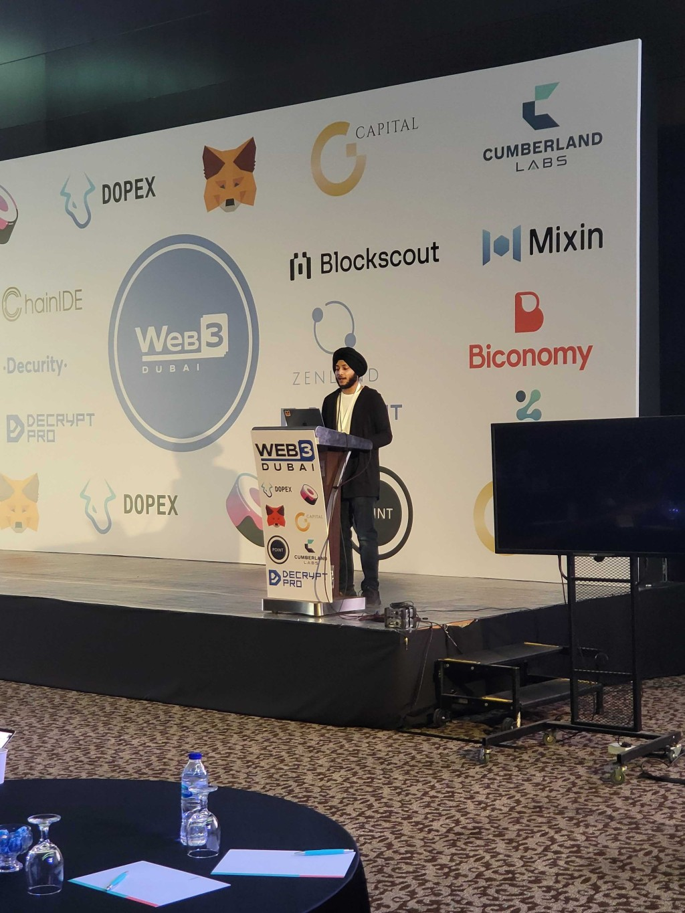
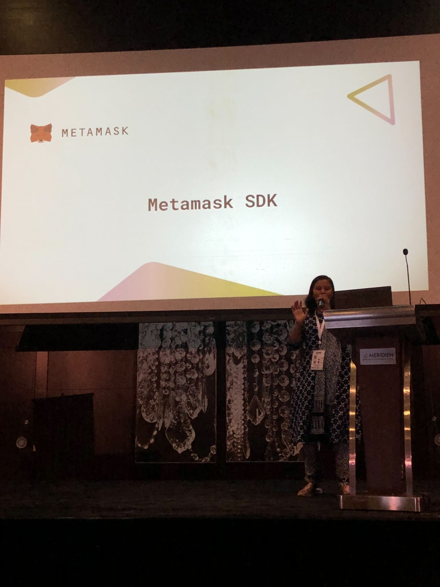
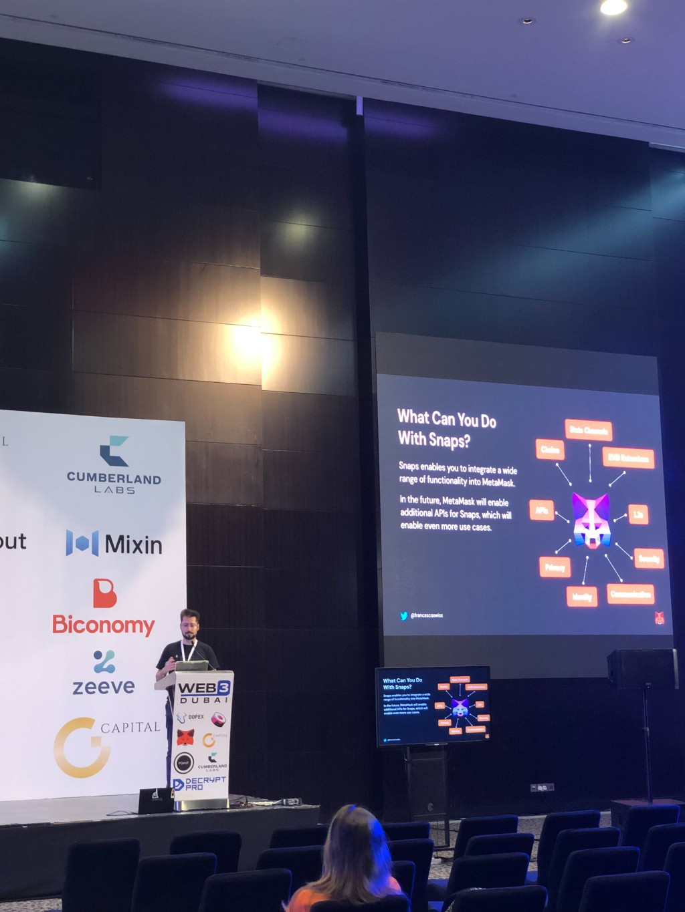

**By Kingsley Arinze**

I’ve been active in the web3 space for a little over a year now, with about 11  months of professional experience as a technical content writer and blockchain engineer. Despite that, I had never attended any web3 conference before Web3 Dubai. 

During one of my one-on-ones with my manager [Clarissa Watson](https://twitter.com/bluestwind) a couple of months ago, she found this surprising and made it one of my OKRs for the year to attend a web3 conference IRL. 

I was excited and happy, but honestly, I didn’t know if I’d be able to make it seeing that I recently moved to Dubai and getting an EU or US visa - as most web3 conferences happen in these regions -  can be challenging, and 2022  is winding down fast.

You can imagine my excitement when my teammate [Megan Dias](https://twitter.com/mycomeg) reached out to me about a web3 conference in Dubai. Megan had been helpful with tips about settling in Dubai since she’d spent some time there visiting family. 

She was attending the conference so it would be a good opportunity to meet for the first time. It was a no-brainer! I reached out to [Eric Bishard](https://twitter.com/httpJunkie) one of the organizers, who offered me one of the remaining team tickets.

## Preaching the gospel of MetaMask Snaps, aka booth duty

I spent some time at the booth, where I got to speak to people about MetaMask Snaps and all the opportunities it opens up for developers. If you're unfamiliar with MetaMask Snaps, it is the first of many features to be released by [MetaMask Flask](https://metamask.io/flask). 

Snaps allow users to safely expand the capabilities of MetaMask by adding new APIs to MetaMask, adding support for different blockchain protocols, including layer 2s, or modifying existing functionality using internal APIs.

If you’re interested in building with MetaMask Snaps when it goes public, you can check out this cool new [MetaMask Snap Truffle box](https://trufflesuite.com/boxes/metamask-snap-box) we’ve built to help you get started quickly. You can learn more about MetaMask snaps and how to get started by checking out the [Snaps documentation](https://docs.metamask.io/guide/snaps.html#what-is-snaps).

## Sharing updates on Truffle Suite

I also seized the opportunity to talk to folks about Truffle and the work we’re doing to help simplify the web3 development experience and onboard new developers to the web3 ecosystem.

I introduced developers to one of my favorite Truffle features - a new way of deploying smart contracts without exposing their private keys using the [Truffle Dashboard](https://trufflesuite.com/blog/introducing-truffle-dashboard). I also showed them how this feature could be used in collaboration with other development environments like Hardhat.

The developers I spoke to were excited to get back to using Truffle after I told them about Truffle’s improved Typescript and Ethers.js support rolling out in the coming weeks.
[Truffle for VS Code extension](https://marketplace.visualstudio.com/items?itemName=trufflesuite-csi.truffle-vscode) and Programmatic Ganache were some other Truffle suite product offerings that were exciting to learn about. 

If you’re curious how Truffle now measures up to Hardhat, you should check out this cool [Truffle vs. Hardhat blog](https://trufflesuite.com/blog/truffle-vs-hardhat-breaking-down-the-difference-between-ethereums-top-development-environments) I wrote some weeks ago.

## Inspiring workshops, presentations, and talks

I started off by attending [Nader Dabit’s](https://twitter.com/dabit3) workshop on LensProtocol and how to build on it and be a part of the Lens ecosystem. After that, I attended [Mirko Garozzo’s](https://twitter.com/mirkogarozzo)  lightning talk on MetaMask Snaps that use non-EVM chains like Bitcoin, Solana, e.t.c.

[Manbir Singh](https://twitter.com/manbirmarwah) also gave a lightning talk on the newly announced MetaMask grant DAO and how excited we at Consensys are about its possible outcome.

Web3 Dubai was filled with so many great talks, and workshops that I couldn’t attend all of them however, some interesting ones I either attended in person or watched a recap of on were by my awesome colleagues, and they include

- [Jyoti Puri’s](https://twitter.com/jyopur?lang=en) technical talks on how MetaMask SDK works and how developers can leverage it, as well as all the platforms MetaMask SDK currently supports.
- [Eric Bishard’s](https://twitter.com/httpJunkie) workshop on building a dynamic NFT project using React and MetaMask SDK. He also did an introduction to Snaps talk as a bonus.
- [Guillaume Bibeau-Laviolette’s](https://twitter.com/GuiBibeau) amazing talk on Web3 UX, including common mistakes developers make and how to fix them.
- Finally, [Francesco Andreoli’s](https://twitter.com/francescoswiss) talk on democratizing access to the decentralized web with MetaMask.

There were a lot of other interesting talks I wasn’t opportune to experience in person at the conference. However, I plan to watch a recap once they are available on Youtube in a digestible format.

## Dinner and networking

Did I mention that the night before the conference, I attended the opening event for web3Dubai? It was held at Bla Bla Dubai, a cocktail bar by Jumeirah beach. The rest of the attendees and I had a lot to drink and eat.

The first day of the conference was also Francesco Andreoli’s birthday, so the team spent some time celebrating with him, although I couldn’t join as I was a bit under the weather.

Finally, the day after the conference Eric Bishard hit me up and made a reservation for me to meet with and network with some of the conference organizers and speakers later that evening. At ZouZou, JBR Jumeriah beach, I had some great conversations about web3 over good food and drinks. It was a great experience, I must say.

## Takeaways

Since this was my first time attending a Web3 conference, I don’t have any experience to measure this up to, so I genuinely think it was a great conference.

I had great conversations and met with people I’d never met in person for the first time, and I loved it. I also got to learn from all the sessions I attended. 

Having that many people gather under one roof, sharing knowledge, and learning about web3 together is an experience I want to have again. Maybe next year, Maybe next month, I guess we’ll see! Either way, I’m grateful to be part of this team and ecosystem.
