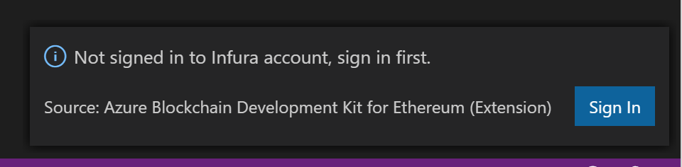
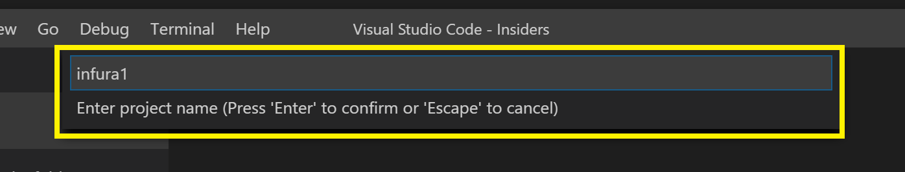
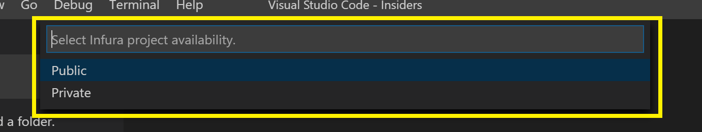
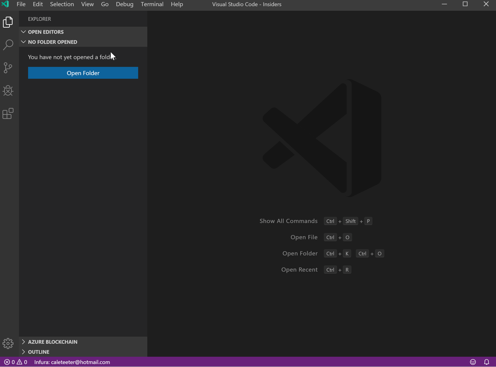
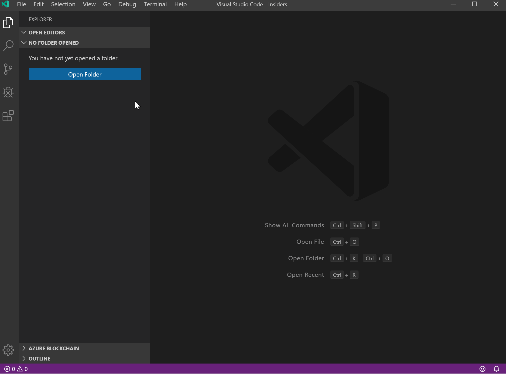
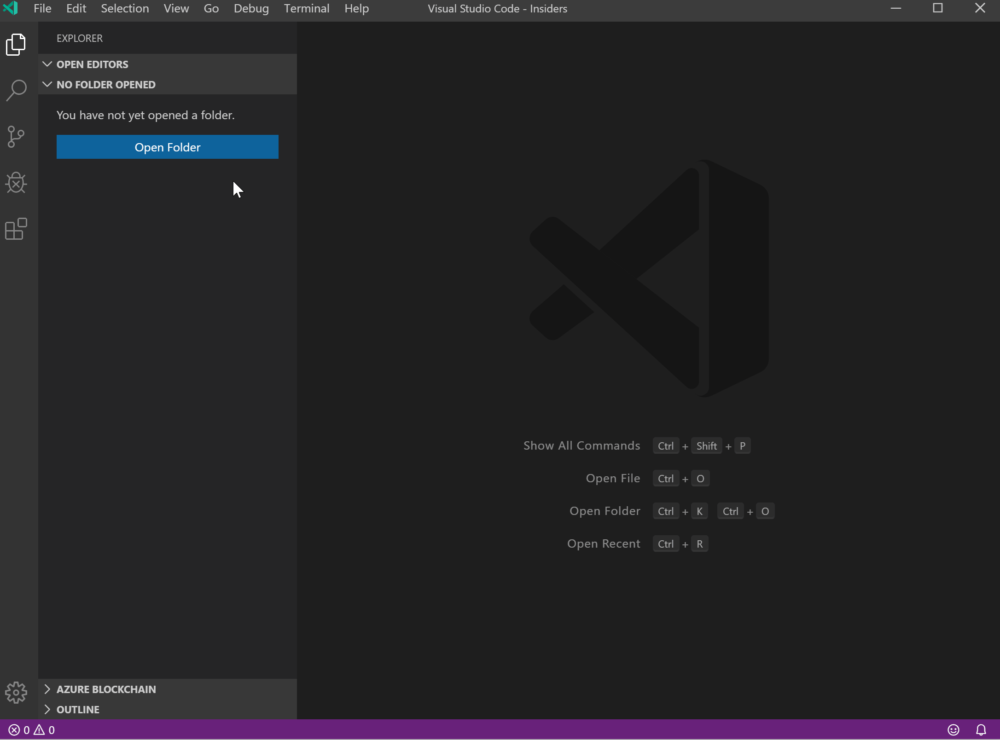

The Trufflesuite for VSCode Extension, allows users to create a new instance, or connect to an existing instance, of the Infura Service directly from VS Code. This enables developers to remain productive in their IDE, reducing time moving from portal to IDE etc.

## Creating a New Infura Service

If you do not have an existing Infura Service deployed, you may create one in any account you have access to. To create a new Infura Service, follow the steps below.

1. There are a few ways to create a new Infura Service.

   1. One way is to use the Command Palette and select either `Truffle: Create a new network`.

      

   2. Additionally, the ellipsis menu on the `Blockchain Networks view` can be used.

      

   3. Finally, if no other networks have been created, shortcuts are provided in the `Blockchain Networks view`
      

2. If a previous login was not done to Infura, a prompt will be shown to allow login to the Infura service.

   

3. After successful login, enter the project name.

   

4. Enter the project visibility. Default is public.

   

## Connecting to existing projects in Infura Service

1. There exists the same ways to connect to an existing Infura account/projects.

   1. One way is to use the Command Palette and select `Truffle: Connect to network`.

      

   2. Additionally, the ellipsis menu on the `Blockchain Networks view` can be used.

      

   3. Finally, if no other networks have been created, shortcuts are provided in the `Blockchain Networks view`

      

2. If a previous login was not done to Infura, a prompt will be shown to allow login to the Infura service.

   

3. After successful login, select the project name.

   

4. The nodes available from Infura are then show in the view.

   
