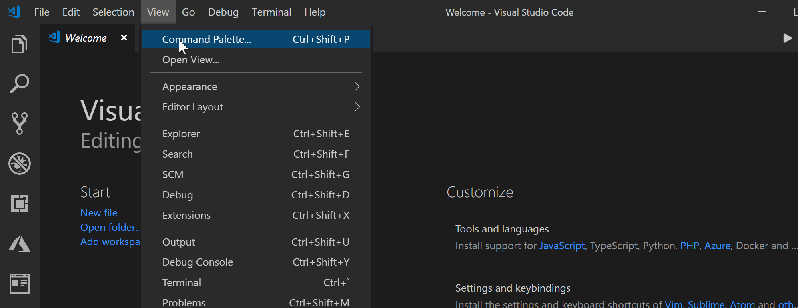

This extension provides several commands for interacting with ledgers, building, compiling and testing your smart contract as well as several features designed to help you integrate ledgers with other systems such as SQL Server, IoT Hub etc. These features are enabled through the Command Palette and/or through several "right click" short cut menus.

To access the Command Palette, you may choose _View, Command Palette_ from the VS Code menu, or `ctrl+shift+p`

## Commands

| Command Name                          | Description                                                                                                                                                                                                                                                                                            |
| ------------------------------------- | ------------------------------------------------------------------------------------------------------------------------------------------------------------------------------------------------------------------------------------------------------------------------------------------------------ |
| `Truffle: Build Contracts`            | Build/compile all contracts in the `contracts` directory                                                                                                                                                                                                                                               |
| `Truffle: Deploy Contracts`           | Allows a developer to deploy a smart contract to local (Ganache), or a public Ethereum network                                                                                                                                                                                                         |
| `Truffle: Generate Smart Contract UI` | For a compiled contract, this command will autogenerate basic UI to interact with the contract using Truffle Suites - Drizzle component                                                                                                                                                                |
| `Truffle: New Solidity Project`       | This command will scaffold out a basic (default) Smart Contract folder structure. Includes simple contract (.sol), Truffle Migrate/config files and GitHub readiness (e.g., README etc). Optionally a developer can choose to unbox a Truffle box to get access to specific examples hosted by Truffle |
| `Truffle: Start Ganache Server`       | This command will start a local Ethereum emulator - Truffle's Ganache command line server ([Ganache-cli](https://github.com/trufflesuite/ganache-cli/blob/master/README.md)). This server allows developers to deploy contracts to a local network which emulates a public blockchain node             |
| `Truffle: Stop Ganache Server`        | This command will stop the local Ganache, Ethereum, emulator                                                                                                                                                                                                                                           |
| `Truffle: Show Welcome Page`          | Will open the projects default Welcome Page which has simple examples and links to online-resources specific to this plugin.                                                                                                                                                                           |

## Right Click Shortcuts

| Command Name                | Context                                                              | Description                                                                                                                             |
| --------------------------- | -------------------------------------------------------------------- | --------------------------------------------------------------------------------------------------------------------------------------- |
| `Copy Access Key`           | right click on your Blockchain Service Node                          | Inserts the access key for your node into the copy/paste buffer                                                                         |
| `Copy Contract ABI`         | right click on contract .json                                        | After compiling, right clicking on the contract, or the contract .json file will copy the contract ABI into your copy/paste buffer      |
| `Copy Contract Bytecode`    | right click on contract .json                                        | After compiling, right clicking on the contract, or the contract .json file will copy the contract Bytecode into your copy/paste buffer |
| `Copy RPC Endpoint Address` | right click on your Node                                             | Inserts the RPC endpoint address for your node into the copy/paste buffer                                                               |
| `Deploy Contracts`          | right click on your contract .sol or contract .json (after building) | Deploys your contract to the selected destination (local, test/main-net)                                                                |
