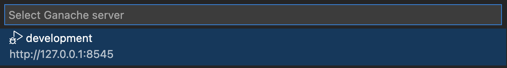
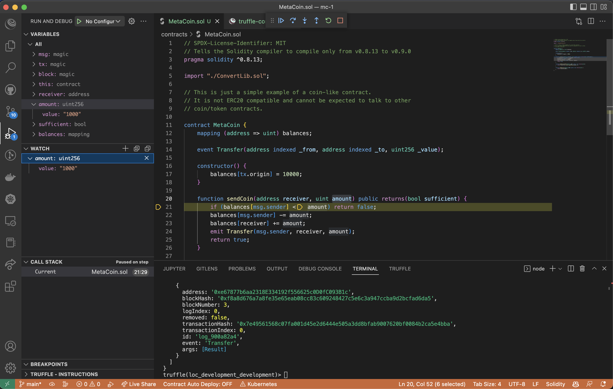
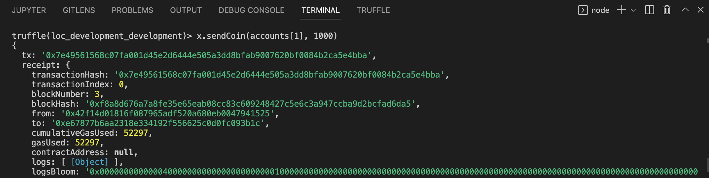

# Debug smart contracts

Truffle for VSCode allows you to debug smart contracts using the VSCode debugger.

## Use the debugger

Start the debugger by selecting **Truffle: Debug Transaction** in the
[command palette](../reference/command-palette.md).
Select the network to debug against.

Then, select the hash of the transaction to debug.

The VSCode debugger launches, and you can use typical debugger functions such as watch windows, view
the call stack, and step in/out/over.

When you initially deploy a contract, only the constructor function is called, so only the
constructor function is available in the list of transaction hashes to debug.
To debug other functions (for example, the `sendCoin` function in the `MetaCoin.sol` contract
included in the [Metacoin box](/boxes/metacoin)), you must invoke them first
(generating resulting transaction hashes).

You can execute a function
[using the Truffle console in a terminal window](/docs/truffle/getting-started/interacting-with-your-contracts).

