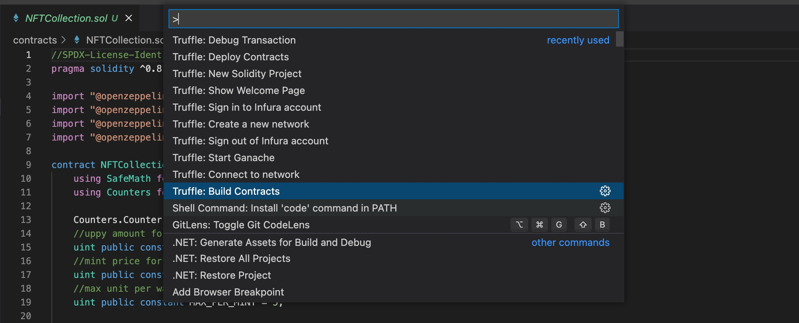
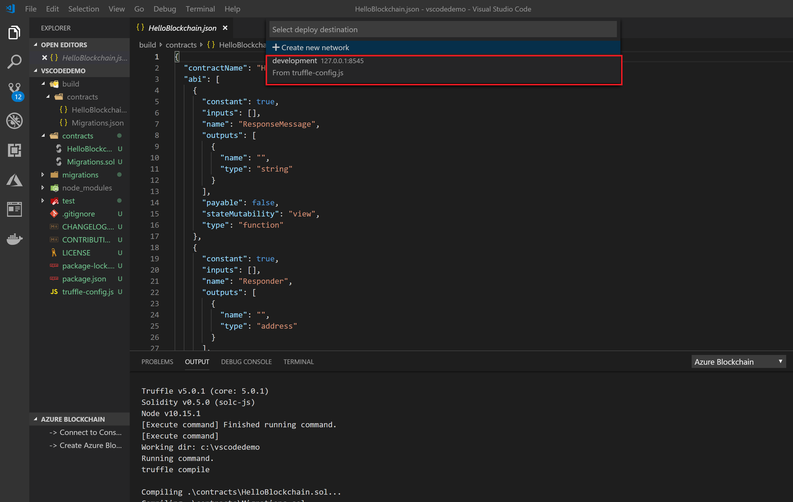

# Manage smart contracts

Truffle for VSCode allows developers to quickly scaffold out a directory with a basic smart contract
and key files needed to deploy contracts locally or to public Ethereum networks.

This page provides instructions on creating, building, and deploying smart contracts.

## Create a new Solidity project

In the [command palette](../reference/command-palette.md), select **Truffle: New Solidity Project**.
The extension asks the developer to **Create Basic Project** or **Create Project from Truffle box**.

**Create Basic Project** scaffolds out a simple Truffle-compatible directory structure including
a sample `HelloBlockchain.sol` contract, deployment (migration) files, a basic contract test
framework, and basic files for GitHub integration.
This smart contract directory is ready to build and deploy to a network.

## Import smart contract libraries

We recommend using the npm or Yarn package manager to handle contract dependencies allowing you to
have version control across your dependent contracts.

The OpenZeppelin smart contracts library includes secure implementations of standards such as ERC-20
and useful functions such as safe-math and Gas Station Network (GSN).

To use the OpenZeppelin library in your project,
[install OpenZeppelin](https://docs.openzeppelin.com/contracts/4.x/#install) on the command line in
the root of the project:

```shell
npm install @openzeppelin/contracts
```

Or:

```shell
yarn add @openzeppelin/contracts
```

## Build a smart contract

The basic contract included in the [basic project](#create-a-new-solidity-project) is ready to be
built and deployed as is.
You can edit this contract to fit your needs.

Build your smart contract by doing one of the following:

- In the [command palette](../reference/command-palette.md), select **Truffle: Build Contracts**.
  
- Select your contract Solidity (`.sol`) file, right-click and select **Build Contracts**.
  

Once compiled, you have your contract, contract metadata (contract ABI, bytecode, etc.) available in
the `build` directory.

The build artifacts and directory structure use [Truffle Suite](https://trufflesuite.com/) and are
compatible with any Truffle automation or scripts that depend on that framework.

## Deploy a smart contract

Once you've built your contract, you can activate the deployment process manually by doing one of
the following:

- In the [command palette](../reference/command-palette.md), select **Truffle: Deploy Contracts**.
- Select your contract Solidity (`.sol`) file, right-click and select **Deploy Contracts**.

Alternatively, you can automatically activate the deployment process upon saving your contract by
turning on **Contract Auto Deploy** on the blue status bar at the bottom of the screen.


Once activated, the deployment process gives users the option to deploy a contract
[locally](#local-deployment) or [to an Ethereum network](#deploy-to-an-ethereum-network).

Deployment parameters are based on the Truffle
[migrations](/docs/truffle/how-to/contracts/run-migrations) process, and are defined and
managed in the `truffle-config.js` file.

### Local deployment

If you haven't already connected to any other network, the default option allows you to deploy your
contract to an emulated Ethereum network powered by [Ganache](/ganache).



Select the `development` network to deploy your contract to a local network.
Deployment information, such as contract address, transaction hash, and other metadata are
published in the Truffle for VSCode output channel.

Important output parameters include:

- Contract address - The address of the deployed contract on the ledger.
  You may use this contract address to interact with your contract functions.
- Account - The account used to sign/send the contract.
  This account is autogenerated.
- Balance, gas, value, and cost - Ganache is an Ethereum emulator, so it emulates the
  functions/parameters needed to send contracts to the public network.
  These functions/parameters include ETH and other parameters that apply to public networks.
- Total deployments - Number of deployments.

#### Generate a new key

You can generate a new key automatically.
The extension asks you to save the key in a file with a `.env` extension.

#### Paste an existing mnemonic

If you have previous keys generated in a tool such as [MetaMask](https://metamask.io/), you can
reuse the keys by pasting the 12-word phrase.
The extension asks developers who have pasted their mnemonic where they want to store the
file (as a `.env` file).

If you're testing with several existing keys stored in files on the development machine, the
extension shows the first/last three characters of the 12-word phrase, and the location of the
`.env` file on disk.

### Deploy to an Ethereum network

Truffle for VSCode supports connecting to public Ethereum networks using [Infura](https://infura.io/).

To connect to a public network and deploy a contract:

1. In the [command palette](../reference/command-palette.md), select **Truffle: Sign into Infura account**.
1. Sign into or create your Infura account.
1. In the **Blockchain Networks** tab, select the ellipsis in the top right corner and connect to or
   create an Infura project.

The extension updates your `truffle-config.js` to include the connection strings for each destination.
Deployment of a contract to Ethereum follows the same steps as a [local deployment](#local-deployment).

> **Important**: The mnemonic used in this step must be the same one associated with your Ethereum
user account.
Replace the 12-word mnemonic with a valid one and use caution when sharing this project with others
to avoid exposing the mnemonic/account information.

After setting up your `truffle-config.js` with the proper account information and deploying to a
network, you can see the results of your transaction in the Truffle for VSCode output channel.
