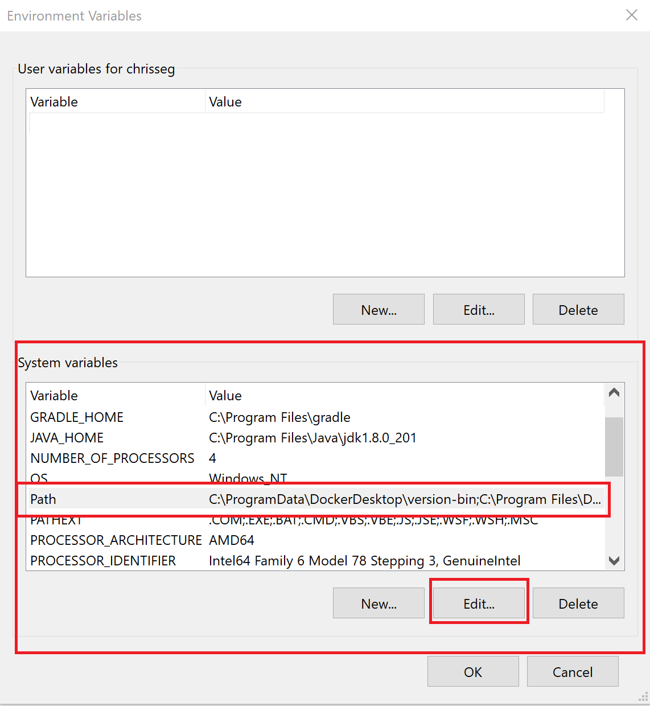
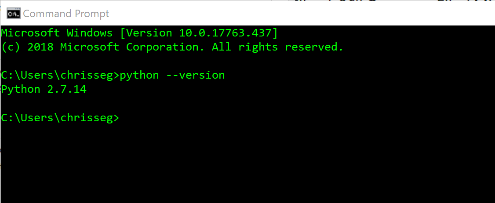
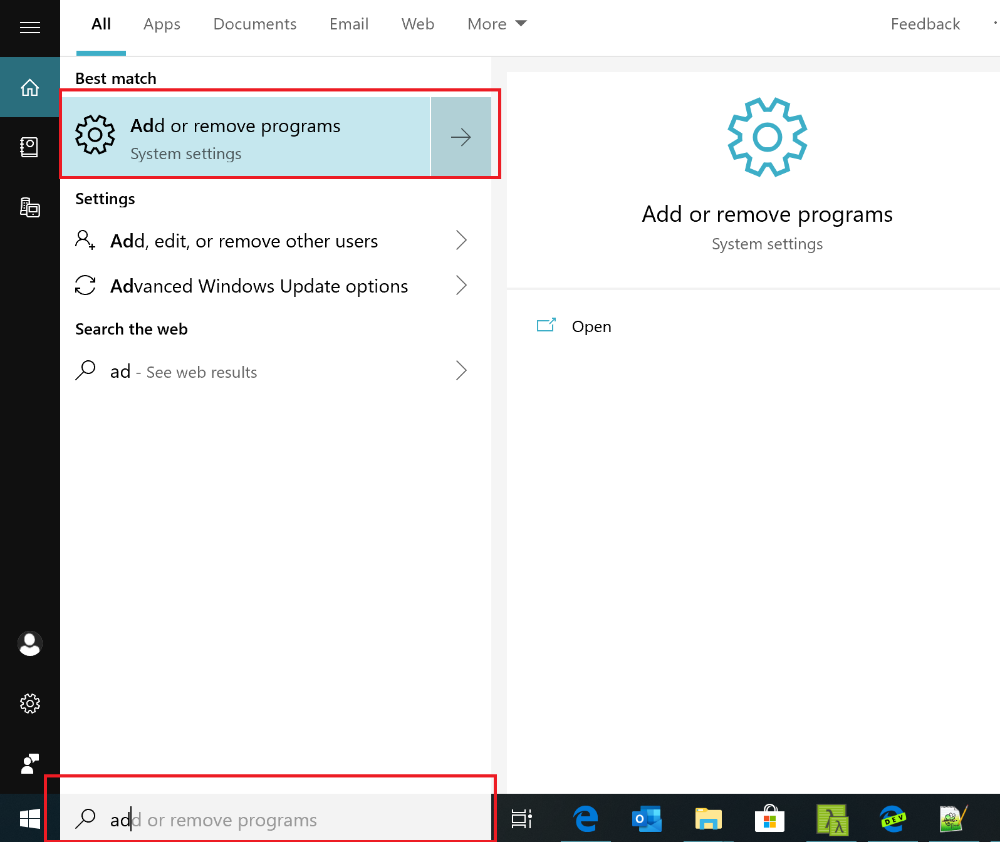
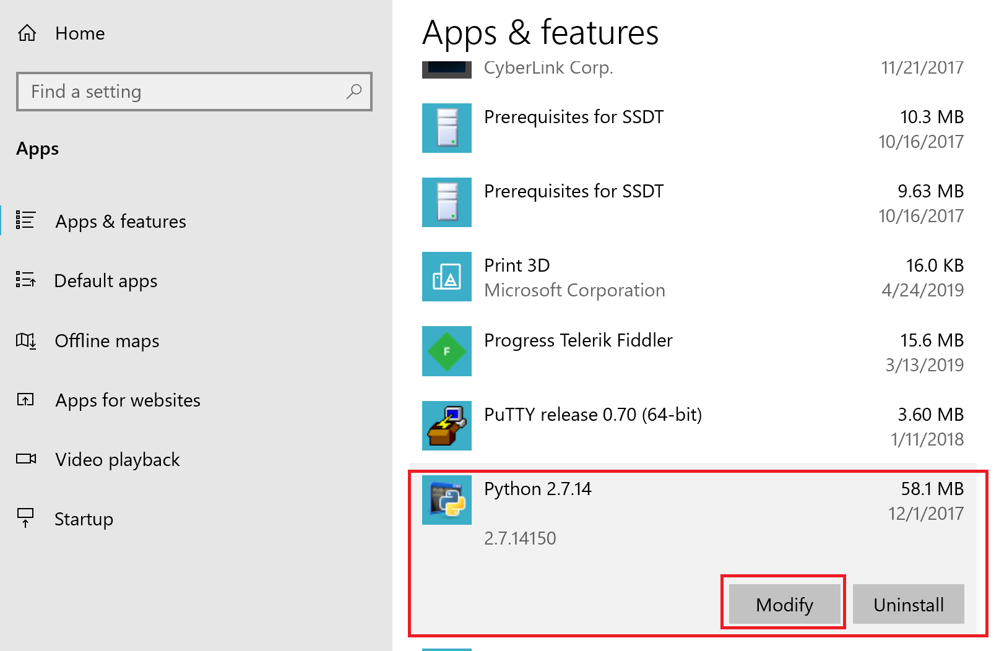
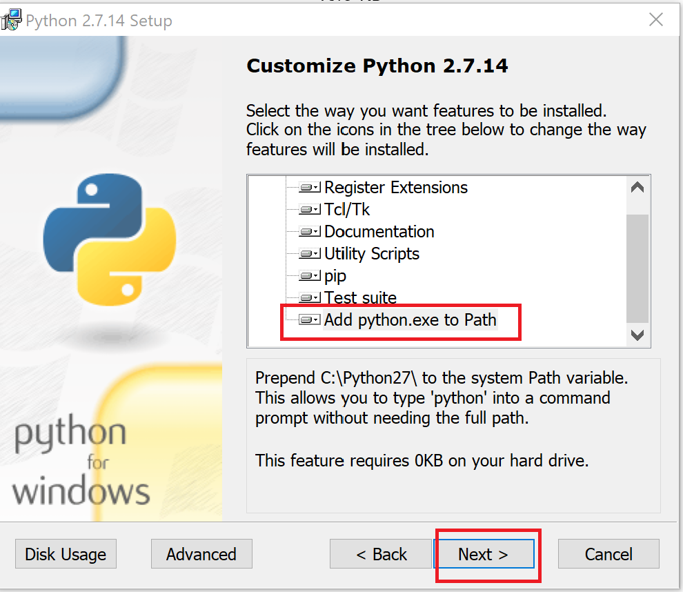

# Troubleshoot

This page provides troubleshooting information for some frequent issues.

## Missing or old version of Python

If you've installed all dependencies, but still get the "missing" or "old version" notification for
Python, you likely have installed Python without adding it to your system PATH variable (the default
installation mode of Python).

To resolve this problem, you must add your Python directory to the system path.
You can do this by editing your PATH variable directly, or by fixing your Python installation.

### Add your Python directory to your PATH variable directly

1. On Windows, edit your PATH variable by going to the Windows search bar and typing `env`.
   
1. Once the System Properties panel launches, select **Environment Variables**.
   
1. In the Environment Variables editor, select the **Path** and **Edit**.
   
1. Select **New** to add a new entry to your PATH, then type `C:\Python27\` (or whichever
   directory you installed Python to), and select **OK** to save.
   
1. To verify your changes, open a new command prompt and enter `python --version`.
   

### Fix your Python installation

1. On Windows, edit your PATH variable by going to the Windows search bar and typing `add`.
   
1. Scroll down to your Python installation and select **modify**.
   
1. In the Python dialog box, select **Change Python**.
   
1. Scroll down and select the red X next to **Add python.exe to Path**, then select **Will be
   installed on local hard drive**.
   
1. Select **Next**.
   
1. To verify your changes, open up a command prompt and enter `python --version`.
   

## Git client not installed

If you've installed Git but get prompted that the Git client isn't installed, you likely need to add
it to your system PATH variable.

You must update the path manually:

1. On Windows, edit your PATH variable by going to the Windows search bar and typing `env`.
   
1. Once the System Properties panel launches, select **Environment Variables**.
   
1. In the Environment Variables editor, select **Path** and **Edit**.
   
1. Select **New** to add a new entry to your PATH, then type `C:\Program Files\Git\bin\` (or
   whichever directory you installed Git to), and select **OK** to save.

## Errors upon creating a project

If you're getting errors when creating a new project, this might be caused by a dependency that
requires a C++ compiler to be installed.

On Windows, you can resolve this with a build tools installation.
Open a Powershell shell under administrator rights, and run the following command:

```shell
npm install --global windows-build-tools
```

!!! note

   This installation takes a few minutes to install.`
