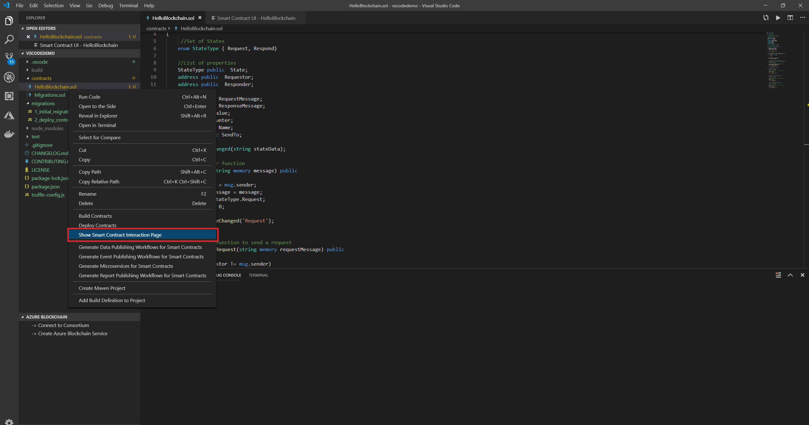
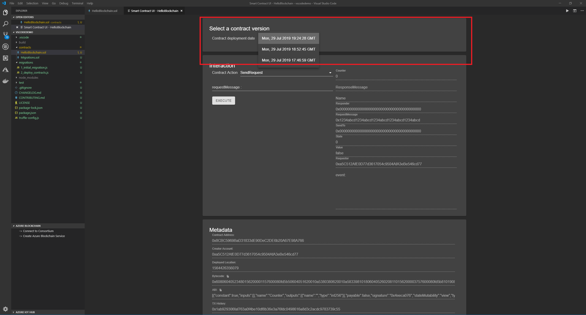
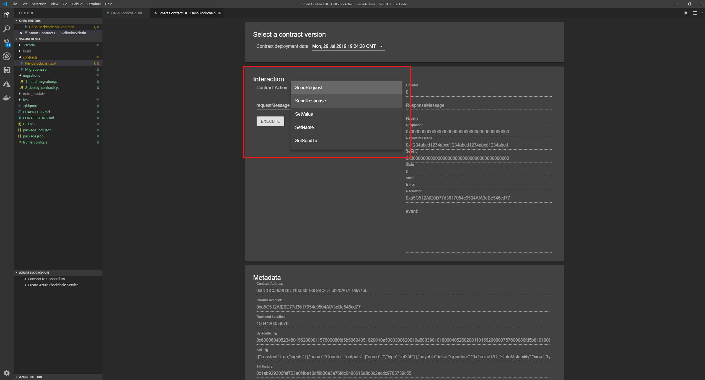
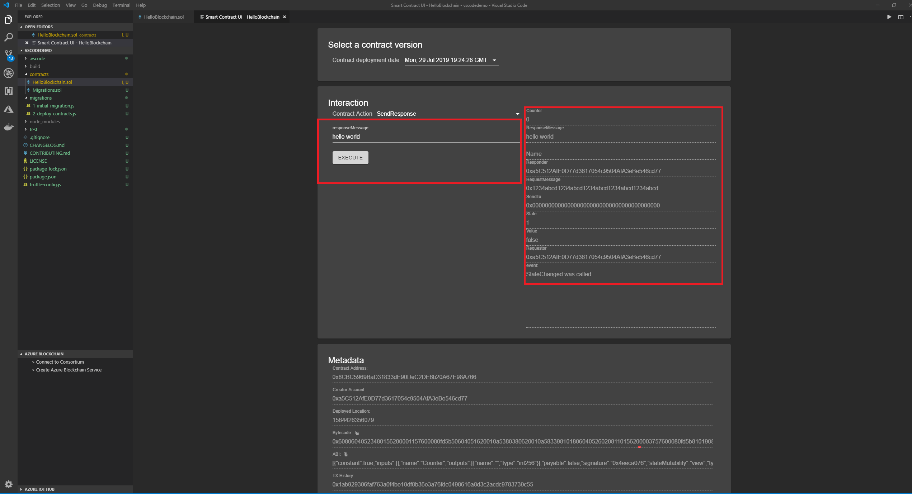
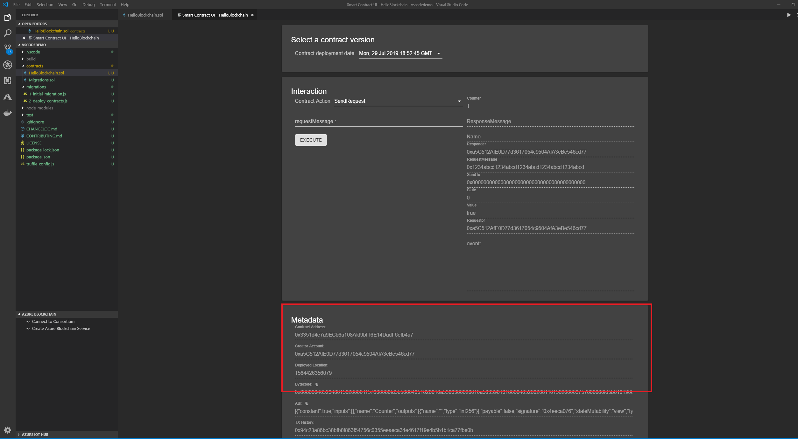

_Interact with your Smart Contract_

The Truffle for VSCode extension gives developers the ability to generate a simple user interface (UI) to interact with their contract directly from the IDE. This UI can be used for simple testing, debugging or even as the basis for a full UI.

`Note: Currently the UI components will only work with contracts deployed locally (to a Truffle Ganache instance) and supports only the following data types (address, bool, int and string)`

| Content                                                     |
| ----------------------------------------------------------- |
| [Deploy your contract locally](#deploy-your-contract)       |
| [Interact with your contract](#interact-with-your-contract) |

## Deploy your contract

### Local deployment

If a developer has not already connected to an Infura Account or any other type of network, the default option will allow a developer to deploy their contract to an emulated Ethereum network. This local network is powered by [Truffle Ganache](https://trufflesuite.com/docs/ganache) ([Ganache v7](https://github.com/trufflesuite/ganache#readme) specifically) and is enabled by default

Selecting the `development` network from the pick list will deploy your contracts to a local Ganache powered network.

## Interact with your contract

After deploying your contract, you may right click on your Solidity .sol contract file and select `Show Smart Contract Interaction Page` from the quick pick menu

This will auto-generate a new page inside of the VS Code IDE which will contain various UI elements, controls and metadata as described below

### Select your contract version

If you have deployed multiple versions of your contract, you may select any version to interact with through the dropdown menu. All deployed contracts are listed by deployed date and time.

After you have selected your contract, the `interaction` section of the UI allows you to select and exercise any contract function.

1. Choose the contract "action" (i.e., the function name)

   

2. Then simply insert any of the function parameters and select the `execute` button

   

3. The Metadata section contains information related to your contract as you "interacted" with it. E.g., contract address, Transaction Hash and Event address

   
