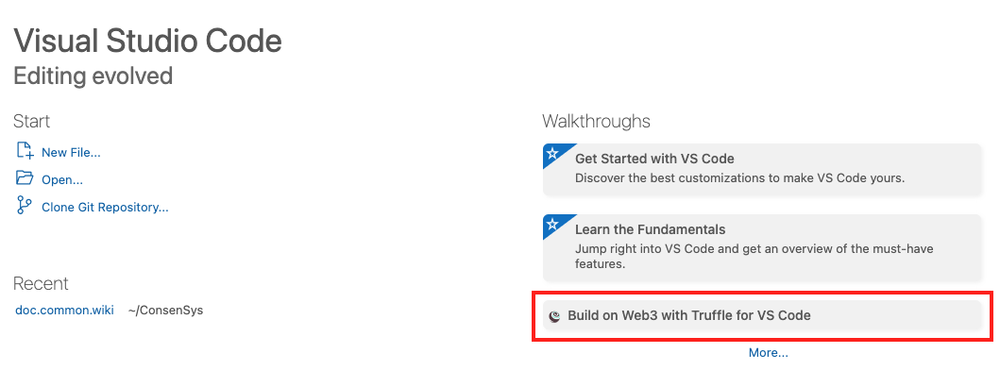
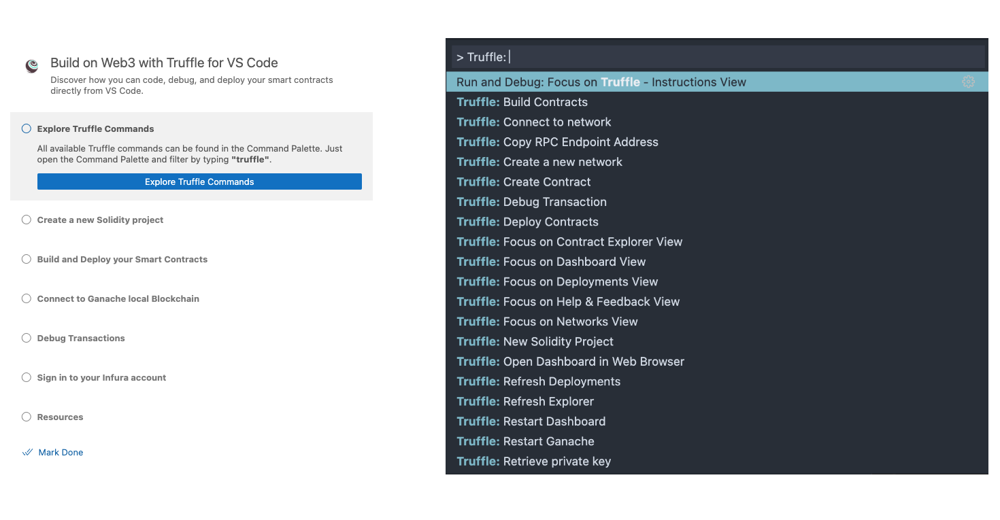
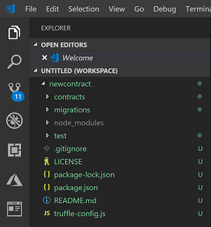

# Quickstart

Get started quickly with Truffle for VSCode by [using the walkthrough](#use-the-walkthrough) on the
VSCode welcome page, or following the instructions to [create](#create-a-smart-contract),
[build](#build-a-smart-contract), and [deploy](#deploy-a-smart-contract-to-truffle) contracts.

## Prerequisites

- Install the [Truffle for VSCode extension](https://marketplace.visualstudio.com/items?itemName=trufflesuite-csi.truffle-vscode).
- Install the [Truffle for VSCode dependencies](how-to/install-dependencies.md).

## Use the walkthrough

The VSCode welcome page features a walkthrough that highlights tasks to build on Web3 using Truffle
for VSCode.

After selecting the walkthrough, the page displays instructions, screenshots, and links to perform
tasks such as using Truffle commands, creating a Solidity project, and building and deploying
smart contracts.

## Create a smart contract

Truffle for VSCode uses [Truffle Suite](https://trufflesuite.com/) to help scaffold, build and
deploy Solidity smart contracts.

Developers familiar with Truffle Suite may use the Truffle command line (for example, `truffle init`)
directly from the VSCode terminal.

You can also use Truffle for VSCode to scaffold out a project directory using the following steps:

1. In the [command palette](reference/command-palette.md), select **Truffle: New Solidity Project**.
1. Select an empty directory to scaffold out your project.
1. Choose a name for your contract.
1. Press enter.

Once complete, your project directory looks like the following:

Your directory includes a simple contract and all the necessary files to build and deploy a simple,
working contract to Truffle.

## Build a smart contract

Build your smart contract by doing one of the following:

- In the [command palette](reference/command-palette.md), select **Truffle: Build Contracts**.
- Select your contract Solidity (`.sol`) file, right click and select **Build Contracts**.

Once compiled, you have your contract, contract metadata (contract ABI, bytecode, etc.) available in
the `build` directory.

## Deploy a smart contract to Truffle

Once you have your compiled contract and a local Ganache instance running, deploy your contract by
doing one of the following:

- In the [command palette](reference/command-palette.md), select **Truffle: Deploy Contracts**.
- Select your contract Solidity (`.sol`) file, right click and select **Deploy Contracts**.

Once activated, the deployment process gives users the option to deploy a contract to a local
Ethereum emulation environment, or various public Ethereum endpoints such as a testnet or mainnet.
Learn more in [Manage contracts](how-to/manage-smart-contracts.md).
