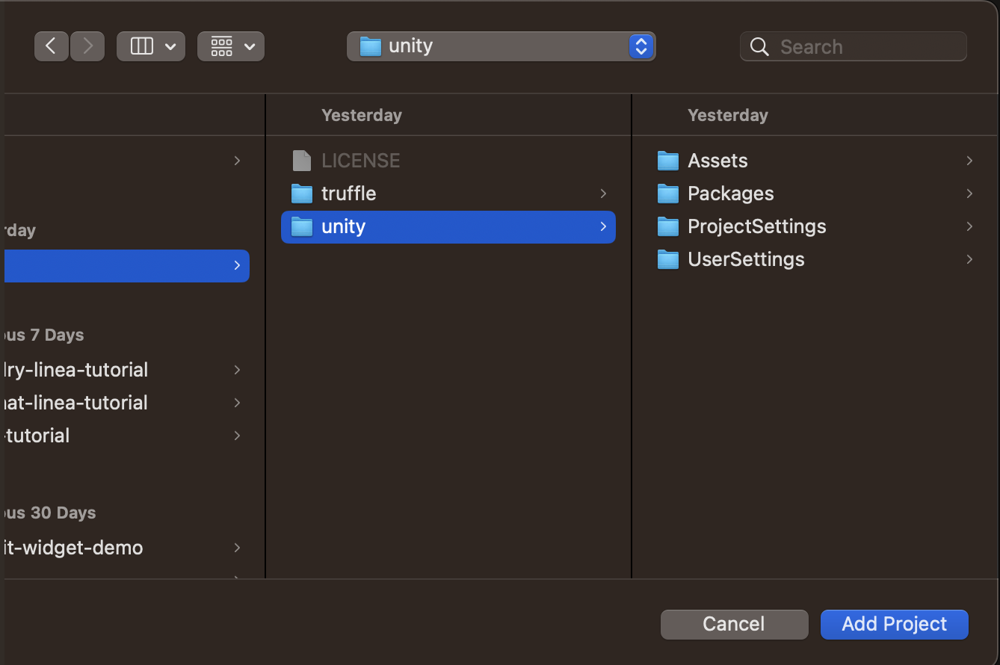
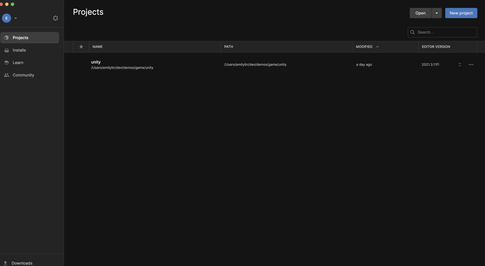
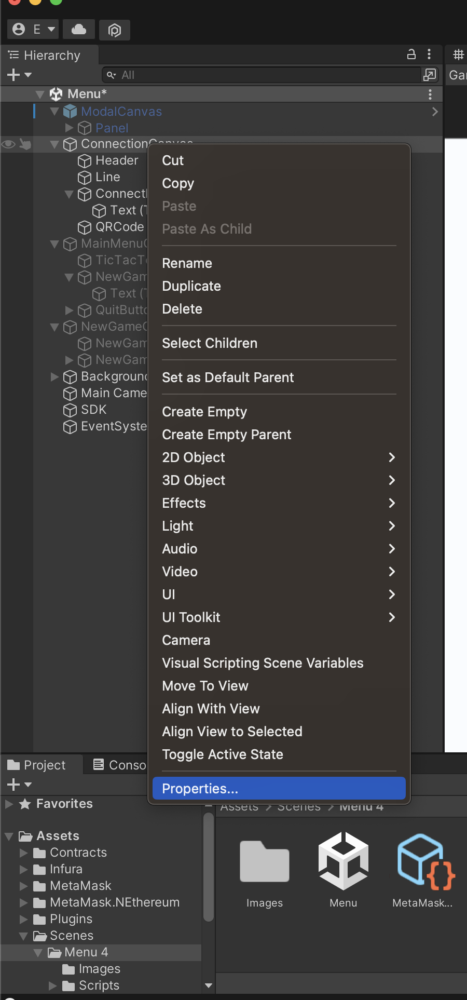
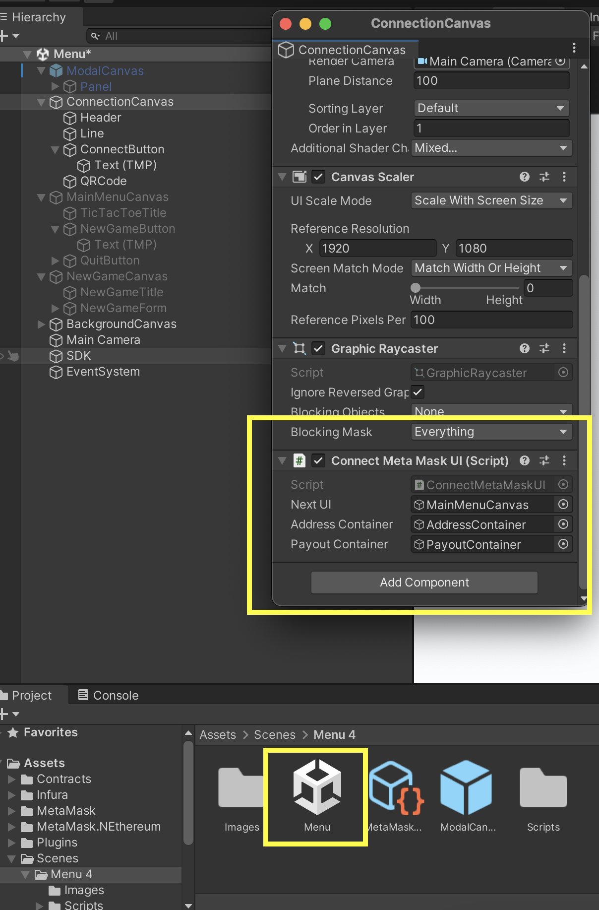
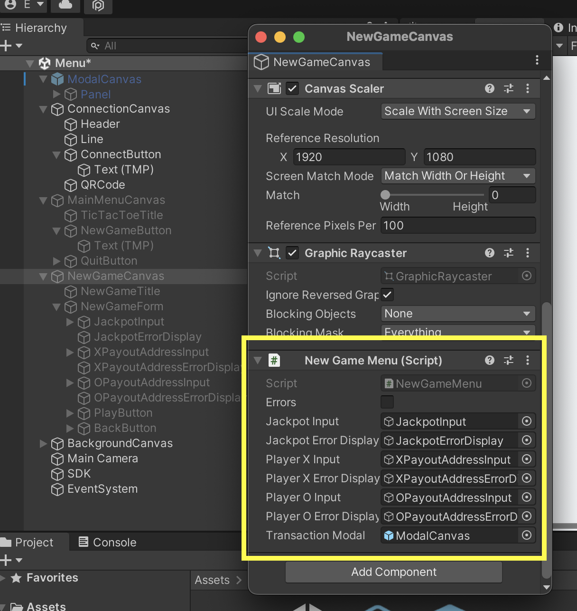

# Building a Tic Tac Toe Game with Truffle and Unity

Written by [Josh Quintal](https://twitter.com/OnlyOneJMJQ) and [Emily Lin](https://twitter.com/_emjlin)

Last updated 3/31/2023

Unity is a powerful game engine.
Truffle is a powerful smart contract framework.
Let's combine both to make something cool!

We'll be going over the Truffle Unity Box, which contains the basic code for a web3 Tic Tac Toe game that:

1. Uses a simple smart contract that locks and releases jackpot winnings to players of a Tic Tac Toe game
1. Uses a Truffle plugin that will automatically generate C# artifacts for your smart contracts
1. Connects a game master’s mobile MetaMask wallet to provide prize money using the [MetaMask SDK](https://c0f4f41c-2f55-4863-921b-sdk-docs.github.io/guide/metamask-sdk-unity.html)

This tutorial assumes you have basic familiarity with building with the Unity game engine.

We'll be deploying on Linea, an EVM equivalent, zero-knowledge rollup, to take advantage of its lower gas fees and faster transaction times, which are crucial to game development.


Let's dive in!

## Prerequisites:

There are a few tools you'll need to download:

- [Unity](https://unity.com/download): Unity is a game engine.
- [NEthereum](https://nethereum.com/): NEthereum allows us to interact with the Ethereum blockchain in C#.
- [Truffle CLI](https://trufflesuite.com/docs/truffle/how-to/install/): Truffle CLI manages the lifecycle of our smart contracts. It handles compiling our Solidity and producing artifact files, JSON files which contain the function signatures for a given contract. We'll ingest these artifacts using the [MetaMask SDK](https://c0f4f41c-2f55-4863-921b-sdk-docs.github.io/guide/metamask-sdk-unity.html) and NEtherem so we can interact with our smart contract in Unity.
- [Ganache](https://github.com/trufflesuite/ganache/tree/master#getting-started): Ganache spins up a local test chain for you to test your smart contracts locally.
- [MetaMask wallet](https://metamask.io/download/) as both an extension and on mobile
  - Make sure that Linea is [set up as a network on both platforms](https://docs.linea.build/use-linea/set-up-your-wallet)
- [Goerli Eth](https://faucetlink.to/goerli)
- [Linea Goerli Eth](https://docs.linea.build/use-linea/fund)

ConsenSys has a number of tools in the Unity asset store that will help you create any web3 gaming experience you can imagine. Another one you may want to check out is the [Infura Unity SDK](https://docs.infura.io/infura/infura-custom-apis/nft-sdk). This allows you to qucickly work with NFTs; querying collections, minting new NFTs, transferring them and more, without doing any smart contract development!

## Unbox the Truffle Unity Box

To unbox the Truffle Unity box, and store the game code in a folder called `game`, run:

```bash
truffle unbox unity game
```

The Unity box is split into two folders:

1. `truffle`, for storing smart contracts
1. `unity`, for storing the game files

First, let's dive into the smart contract!

## The Smart Contract

The smart contract powering the game can be found at `contracts/TicTacToe.sol`.

This contract allows for the creation of tic tac toe games represented by an ID, jackpot, and payout addresses of the 2 players involved. It also keeps track of a game's status, and whether or not its ended. Once a game ends the jackpot is released for the winner to withdraw at their convenience.

Let's break it down in sections to understand exactly what's happening.

### Imports and Variables

```solidity
import "@openzeppelin/contracts/security/PullPayment.sol";

contract TicTacToe is PullPayment {
  event GameStarted(uint game_id);
  event GameWon(address winner, uint amount);

  struct Game {
    uint jackpot;
    address[2] payout_addresses;
    bool ended;
  }

  Game[] games;

  ...
}
```

We import [OpenZeppelin's PullPayment contract](https://docs.openzeppelin.com/contracts/4.x/api/security#PullPayment) for safe processing of withdrawals for the winner. In Ethereum a best practice is to have users withdraw funds rather than sending them automatically.

We have 2 events: GameStarted, which fires when a game starts, and GameWon, which fires when a game ends in a win. If a game ends in a draw, it will not fire this event because nothing related to the smart contract needs to occur.

Each game is represented by a Game struct. It has a jackpot amount supplied by the user, an array containing the addresses of the players (X & O), and a boolean letting us know if this game has ended.

Finally, we keep an array of Games so that we can quickly access them by ID, which in this case is their index in the games array.

### Starting a Game

```solidity
function startGame(address payout_x, address payout_o) public payable {
  // must have some value attached for jackpot
  require(msg.value > 0, "jackpot must be greater than 0");

  // all params must be supplied
  require(payout_x != address(0), "player X address cannot be empty");
  require(payout_o != address(0), "player O address cannot be empty");

  // msg.sender and payout_o cannot be the same address
  require(payout_x != payout_o, "player X and player O cannot have the same payout address");

  uint new_game_id = games.length;
  address[2] memory payout_addresses = [payout_x, payout_o];
  games[new_game_id] = Game(msg.value, payout_addresses, false);

  emit GameStarted(new_game_id);
}
```

To start a game, we need to know the jackpot amount (supplied as `msg.value`) and the address of the players involved for payout. We check that those values are set and that the two payout addresses are not equal. Our contract assumes a "game master" will setup the game and deposit the necessary jackpot funds, which then get paid out to the winner. We then get the ID for our new game which, thanks to using an array, is the current length.

We then pass these variables into a new Game object and emit our `GameStarted()` event.

### Ending a Game

```solidity
function endGame(uint game_id, uint winner) public {
  // make sure the game hasn't already ended
  require(!games[game_id].ended);

  address winner_address = games[game_id].payout_addresses[winner];
  uint jackpot = games[game_id].jackpot;

  games[game_id].ended = true;

  _asyncTransfer(winner_address, jackpot);

  emit GameWon(winner_address, jackpot);
}
```

To end a game, we first make sure the game we're attempting to end hasn't already been ended. This single line is supremely important. Because this is a smart contract hosted on a public blockchain, anyone could call this contract outside of the game. Because of this, we check our game's state to make sure this can't be used to potentially trigger unlimited withdrawals.

We then add the winner's address to the winners array so that we can efficiently build the leaderboard.

From there, we get the winner's address and the jackpot so that we can call `_asyncTransfer()`. This function comes from the OpenZeppelin contract we imported, and it handles the payouts for us. The winner can now call a payout function to withdraw their funds safely. In the case that this player has won multiple times, this function will automatically aggregate their winnings.

Finally, we emit out `GameWon()` event.

### Compile the Smart Contract

Note that compiling the contracts only works if the build directory `unity/Assets/Contracts/json` does NOT include `.meta` files, which are created automatically by the Unity game engine. If they exist, simply delete the build directory. Then, run:

```bash
cd truffle
npm i
truffle compile
```

## Testing the Smart Contract

Now that we've written our smart contract, it's time to test! The test file can be found at `test/tictactoe.js`. Here we'll breakdown the tests.

Throughout all of these tests, we make use of [Rosco Kalis' Truffle Assertions library](https://github.com/rkalis/truffle-assertions). It makes it easy to test event emissions and reversion!

### Pre-Start Tests

In this series of tests we look at all of the invalid conditions that could occur before a game starts. We need 2 things to start a game: a jackpot and 2 players. We ensure both of those things, as well as that the 2 players, represented in this smart contract as 2 payout addresses, are unique.

```javascript
it("should not start a new game without a jackpot", async () => {
  const ticTacToeInstance = await TicTacToe.deployed();

  await truffleAssert.reverts(
    ticTacToeInstance.startGame(accounts[0], accounts[1]),
    "jackpot must be greater than 0"
  );
});

it("should not start a new game with an empty payout_x address", async () => {
  const ticTacToeInstance = await TicTacToe.deployed();

  await truffleAssert.reverts(
    ticTacToeInstance.startGame(
      "0x0000000000000000000000000000000000000000",
      accounts[1],
      { value: 100 }
    ),
    "player X address cannot be empty"
  );
});

it("should not start a new game with an empty payout_o address", async () => {
  const ticTacToeInstance = await TicTacToe.deployed();

  await truffleAssert.reverts(
    ticTacToeInstance.startGame(
      accounts[0],
      "0x0000000000000000000000000000000000000000",
      { value: 100 }
    ),
    "player O address cannot be empty"
  );
});

it("should not start a new game with 2 equal payout addresses", async () => {
  const ticTacToeInstance = await TicTacToe.deployed();

  await truffleAssert.reverts(
    ticTacToeInstance.startGame(accounts[0], accounts[0], { value: 100 }),
    "player X and player O cannot have the same payout address"
  );
});
```

### Post-Start Tests

Not much can go wrong once a game has started. Once a game ends, however, payment is released to the winning address. We want to make very sure that a game which has ended cannot be ended again. If that were possible, an attacker could potentially drain the contract of funds by ending a game they've won continuously until funds are gone.

```javascript
it("should not end game which has already ended", async () => {
  const ticTacToeInstance = await TicTacToe.deployed();

  const tx = await ticTacToeInstance.startGame(accounts[0], accounts[1], {
    value: 100,
  });

  await ticTacToeInstance.endGame(0, 0);

  await truffleAssert.reverts(
    ticTacToeInstance.endGame(0, 0),
    "cannot end a game which is already ended"
  );
});
```

### Happy Path Tests

Finally, we want to make sure that when everything goes as expected, the game actually works. A new game should start with a jackpot and 2 valid payout addresses. Importantly, a winner should be able to withdraw their winnings once a game has ended.

We've imported most of this functionality from [OpenZeppelin's PullPayment contract](https://docs.openzeppelin.com/contracts/4.x/api/security#PullPayment), so we just test that our implementation in the TicTacToe contract works as expected.

```javascript
it("should start a new game with all parameters supplied", async () => {
  const ticTacToeInstance = await TicTacToe.deployed();

  const tx = await ticTacToeInstance.startGame(accounts[0], accounts[1], {
    value: 100,
  });

  truffleAssert.eventEmitted(tx, "GameStarted");
});

it("should end a game if one exists", async () => {
  const ticTacToeInstance = await TicTacToe.deployed();

  const tx = await ticTacToeInstance.endGame(1, 1);

  truffleAssert.eventEmitted(tx, "GameWon");
});

it("should allow withdrawal if an address has winnings", async () => {
  const ticTacToeInstance = await TicTacToe.deployed();

  const oldBalance = await web3.eth.getBalance(accounts[1]);
  await ticTacToeInstance.withdrawPayments(accounts[1]);
  const newBalance = await web3.eth.getBalance(accounts[1]);

  assert.equal(
    parseInt(oldBalance) + 100,
    parseInt(newBalance),
    "winner balance changed an unanticipated amount after withdrawal"
  );
});
```

### Run the tests

Note that running the tests only works if the build directory `unity/Assets/Contracts/json` does NOT include `.meta` files, which are created automatically by the Unity game engine. If they exist, simply delete the build directory.

Then, to ensure that our smart contract is working, we can simply run the tests by running `truffle test`. Your output should look a little something like this:

```bash
Compiling your contracts...
===========================
> Compiling ./contracts/TicTacToe.sol
> Compiling @openzeppelin/contracts/access/Ownable.sol
> Compiling @openzeppelin/contracts/security/PullPayment.sol
> Compiling @openzeppelin/contracts/utils/Address.sol
> Compiling @openzeppelin/contracts/utils/Context.sol
> Compiling @openzeppelin/contracts/utils/escrow/Escrow.sol
> Artifacts written to /var/folders/bj/n7fv7n9j33l8_8t4c9ygct7w0000gn/T/test--83647-z48oHcJghUH3
> Compiled successfully using:
   - solc: 0.8.18+commit.87f61d96.Emscripten.clang


  Contract: TicTacToe
    ✔ should not start a new game without a jackpot (108ms)
    ✔ should not start a new game with an empty payout_x address
    ✔ should not start a new game with an empty payout_o address
    ✔ should not start a new game with 2 equal payout addresses
    ✔ should not end game which has already ended (105ms)
    ✔ should start a new game with all parameters supplied (67ms)
    ✔ should end a game if one exists
    ✔ should allow withdrawal if an address has winnings (58ms)


  8 passing (448ms)
```  

## Using Unity and Truffle Together

Now, it's time to open up the Unity engine! In order to interact with the `TicTacToe` smart contract in the Unity game, we have to use MetaMask mobile, which cannot connect to a local testchain. Instead, we'll have to deploy the contract to a public testnet.

### Deploy to Linea using Truffle Dashboard

Deploying to Linea is simple with Truffle Dashboard. First, run this command to open up Dashboard on `localhost:24012`:

```bash
truffle dashboard
```

Make sure your MetaMask wallet is connected to Linea.

Then, migrate your contracts:

```bash
truffle migrate --network dashboard
```

You should see an approval request to deploy the contract in Dashboard. Confirm the transaction.

Your output should look similar to this:

```bash
Compiling your contracts...
===========================
> Compiling ./contracts/TicTacToe.sol
> Compiling @openzeppelin/contracts/access/Ownable.sol
> Compiling @openzeppelin/contracts/security/PullPayment.sol
> Compiling @openzeppelin/contracts/utils/Address.sol
> Compiling @openzeppelin/contracts/utils/Context.sol
> Compiling @openzeppelin/contracts/utils/escrow/Escrow.sol
> Artifacts written to /Users/emilylin/dev/demos/unity/unity/Assets/Contracts/json
> Compiled successfully using:
   - solc: 0.8.18+commit.87f61d96.Emscripten.clang


Starting migrations...
======================
> Network name:    'dashboard'
> Network id:      59140
> Block gas limit: 30000000 (0x1c9c380)


1_ttt.js
========

   Deploying 'TicTacToe'
   ---------------------
   > transaction hash:    0xb9820cf99a77c5730f651209743531d81497c9e17abec93db7da3d95e9b20fb2sage.
   > Blocks: 1            Seconds: 16
   > contract address:    0x1bBafDeD286635aF0176A27133aCC8a05E3179D2
   > block number:        385733
   > block timestamp:     1680385169
   > account:             YOUR_ACCOUNT_NUMBER
   > balance:             2000.037039652445354678
   > gas used:            1420448 (0x15aca0)
   > gas price:           2.500000007 gwei
   > value sent:          0 ETH
   > total cost:          0.003551120009943136 ETH

   > Saving artifacts
   -------------------------------------
   > Total cost:     0.003551120009943136 ETH

Summary
=======
> Total deployments:   1
> Final cost:          0.003551120009943136 ETH
```

Save off the deployed contract address!

You can find more detailed instructions [here](https://docs.linea.build/developers/quickstart/deploy-smart-contract/truffle#deploy-your-contract).

### Modify `Assets/Contracts/ContractManager.cs`

We'll be referencing the contract address in multiple places throughout the Unity code. So, we've created a global variable `ticTacToeAddress` in `Assets/Contracts/ContractManager.cs`. Update that variable with your deployed contract address.

```csharp
public class ContractManager
{
    public static string ticTacToeAddress = "0x1bBafDeD286635aF0176A27133aCC8a05E3179D2";
}
```

### Open the Project in Unity

We'll be editing the Unity files in the Unity Hub.

First, start Unity Hub. Then, open a project from disk:


You'll want to select just the `unity` folder:



Your view should look like this:



Click on the project to open it. Ignore the Unity version update for now.

### Generating C# to Use Smart Contracts in Unity

This repo already contains the [Truffle Unity plugin](https://github.com/trufflesuite/unity-plugin), which automatically builds the necessary C# classes using NEthereum for interfacing with your smart contracts in Unity. You can manually add the contract artifact files to your Unity project, which will trigger the build, but in most cases, we recommend setting the contracts build directory to the desired directory in your Unity project.

As you can see below, the `contracts_build_directory` is already pointing to a folder under the `unity` folder.

```javascript
// truffle-config.js

module.exports = {
  contracts_build_directory: "../unity/Assets/Contracts/json"

  ...
}
```

This would be the directory structure in the `unity/Assets` folder once the contracts have been compiled in Truffle and the C# build completes:

```shell
├ Contracts
│ ├ csharp
│ └ json
```

The Truffle artifacts are in the `json` folder:


And you can find the corresponding C# classes in `csharp`. We'll be interacting with the classes generated under `csharp/contracts`:


### Update the Scenes

In order to for Unity to recognize the new contract artifacts. We have to force a rebuild of our scenes. To do this, you can move the `Menu 1` and `TicTacToe 1` folders out of the `scenes` folder, and then move them back into the `scenes` folder. This should trigger a reload of the script assemblies.

Ensure that `Menu 1` becomes `Menu 2` and `TicTacToe 1` becomes `TicTacToe 2`.

### Connect your MetaMask wallet

Now that we've created the necessary C# files for the Unity game, let's look at how we connect our MetaMask wallet.

To start a game, the very first action the gamemaster needs to do is to connect their wallet so that they can lock up the jackpot money. We'll change our MetaMask mobile network to Linea, since we deployed our contract on Linea. You can find the MetaMask Unity SDK documentation [here](https://c0f4f41c-2f55-4863-921b-sdk-docs.github.io/guide/metamask-sdk-unity.html).

The wallet connection code can be found in `ConnectMetaMaskUI.cs`. We use this script by adding it as a component of `ConnectionCanvas` and calling `Connect()` on the `ConnectionButton`.

You can find and modify these properties by right clicking the canvas and selecting `properties`:



And find the script:



And find `onClick`:


### Interacting with Smart Contracts in Unity

Now that we've hooked up connecting our wallet, let's walk through an example of interacting with a smart contract.

When we start a game, we want to call the function `startGame` from `TicTacToe.sol`. In order to do this, we will use the generated `StartGameRequestAndWaitForReceiptAsync` function from `unity/Assets/Contracts/csharp/Contracts/TicTacToeService.cs`. We will be using this in the `InitializeGame` function in `NewGameMenu.cs`.

To reference the deployed contract, we need to create an instance of of web3, as well as reference the global address we changed earlier:

```csharp
var metaMask = MetaMaskUnity.Instance;
var web3 = metaMask.CreateWeb3();
var ticTacToeAddress = ContractManager.ticTacToeAddress;

var ticTacToe = new Truffle.Contracts.TicTacToeService(web3, ticTacToeAddress);
```

`StartGameFunction` is an autogenerated C# class found under `csharp/Functions`. We will use this to pass in the necessary parameters to the `startGame` function in `TicTacToe.sol`:

```csharp
// This is in StartGameFunction.cs

public class StartGameFunctionBase : FunctionMessage
{
    [Parameter("address", "payout_x", 1)]
    public virtual string PayoutX { get; set; }
    [Parameter("address", "payout_o", 2)]
    public virtual string PayoutO { get; set; }
}
```

Then, as you can see back in `NewGameMenu.cs`, we pass in `startGameFunction` to the autogenerated `StartGameRequestAndWaitForReceiptAsync` function to actually call the smart contract function. Note that we want to pass in a certain amount of ETH to be added to the jackpot. We do this by adding `AmountToSend` to `startGameFunction`.

```csharp
// We create the StartGameFunction object so we can attach ETH via AmountToSend.

var startGameFunction = new Truffle.Functions.StartGameFunction();
    startGameFunction.AmountToSend = jackpotInt;
    startGameFunction.PayoutX = playerXValue;
    startGameFunction.PayoutO = playerOValue;

try
{
    var receipt = await ticTacToe.StartGameRequestAndWaitForReceiptAsync(startGameFunction);
    ...
}
```

As we saw in `ConnectionCanvas` properties, we can also see this script being utilized in `NewGameCanvas`:



And the game being started via `ValidateForm` in `PlayButton` properties:


There are many instances where we are calling the auto-generated csharp smart contract functions. Feel free to peruse around the code to get a better feel of the usage.

### Play the game

That was a lot to cover! Here's a short video clip of running through this entire process. Do note that the wallet connection portion is not screen recorded since we are connecting through mobile.

<video width="640" height="480" controls>
  <source src="./img/unity_flow.mp4" type="video/mp4">
</video>

## Continue the conversation

And there you have it - a brief overview of the Truffle Unity box. Ask questions on [GitHub discussions](https://github.com/orgs/trufflesuite/discussions) and [join our Discord](https://discord.com/invite/9QwXqsyAps) under #truffle-general to talk about what games you're building!