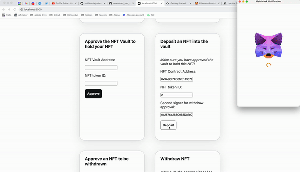
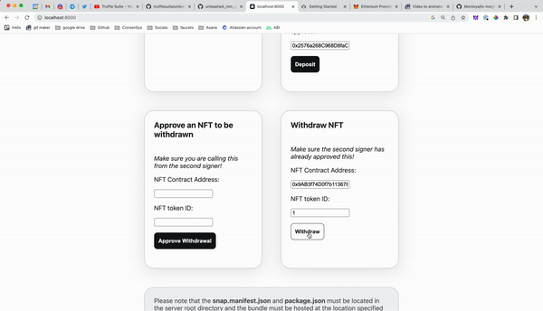

# Web3 Unleashed: How to build a MetaMask snap

Written by [Emily Lin](https://twitter.com/_emjlin) and [Christian Montoya](https://twitter.com/MidwitMilhouse)

Last updated 12/16/2022

## Overview 

In this episode of Web3 Unleashed, we'll be covering MetaMask Snaps, a new way to extend your MetaMask functionality. Snaps product manager [Christian Montoya](https://twitter.com/MidwitMilhouse) and engineer [Guillaume Roux](https://twitter.com/Guiiiiiiillaume) will be joining us to talk about what they are, how they work, and how you can get started building one! Specifically, we'll be leveraging the Truffle Snaps box to build a wallet experience that provides insights into your wallet transactions. Watch our livestream for a more detailed walkthrough!

<iframe width="560" height="315" src="https://www.youtube.com/embed/Tvfma567BhU" title="YouTube video player" frameborder="0" allow="accelerometer; autoplay; clipboard-write; encrypted-media; gyroscope; picture-in-picture" allowfullscreen></iframe>

You can read more about Snaps [here](https://metamask.io/snaps/?utm_source=truffle&utm_medium=webinar&utm_campaign=2022_Dec_unleashed-metamask-snaps_tutorial_content). The completed code lives [here](https://github.com/trufflesuite/unleashed_mm_snap).

## Create an Infura account and project

To connect your DApp to Ethereum mainnet and testnets, you'll need an Infura account. Sign up for an account [here](https://infura.io/register?utm_source=truffle&utm_medium=webinar&utm_campaign=2022_Dec_unleashed-metamask-snaps_tutorial_content)

## Install a MetaMask Flask wallet

To interact with your DApp in the browser, you'll need a MetaMask Flask wallet. You can download it and create one [here](https://metamask.io/flask/?utm_source=truffle&utm_medium=webinar&utm_campaign=2022_Dec_unleashed-metamask-snaps_tutorial_content).

Make sure to install Flask in a new browser profile or disable any existing installed versions of MetaMask. Running multiple instances of MetaMask in the same browser profile will break dapp interactions.

## Download System Requirements

You'll need to install:

- [Node.js](https://nodejs.org/en/), v14 or higher
- [truffle](https://trufflesuite.com/docs/truffle/getting-started/installation/)
- [ganache CLI](https://github.com/trufflesuite/ganache)
- yarn v3.x, run `corepack enable` if you are using Node v16 or higher

## Download VS Code

Feel free to use whatever IDE you want, but we highly recommend using VS Code! You can run through most of this tutorial using the Truffle extension to create, build, and deploy your smart contracts, all without using the CLI! You can read more about it [here](https://trufflesuite.com/blog/build-on-web3-with-truffle-vs-code-extension/).

## Set Up Your Project

In this project, we'll start off using the [MetaMask Snap Truffle box](https://trufflesuite.com/boxes/metamask-snap-box/) to scaffold our project!

```shell
truffle unbox metamask/snap-box tx-snap
cd tx-snap
```

Then, set up your development environment by running:

```shell
yarn install && yarn start
```

Once ganache gets started, make sure you copy paste and save off the mnemonic, account numbers, and private keys! You'll be able to get the account numbers again, but will not be able to retrieve the mnemonic and private keys. If you would like these numbers to be stable, add in your own mnemonic. The output looks something like this:

```shell
YN0000: [truffle]: mnemonic used: often innocent sphere luggage almost leaf faint fan goat lab swim use
➤ YN0000: [truffle]: {
➤ YN0000: [truffle]:   '0x49abb8858966f2d4b2b983e7ea5104c0f6cf495a': {
➤ YN0000: [truffle]:     secretKey: '0xf67606f22f122dcf7f6c2ee6a942a4d0bc1da6e2bc0a007b1547408dd2537eba',
➤ YN0000: [truffle]:     balance: 1000000000000000000000n,
➤ YN0000: [truffle]:     unlocked: true
➤ YN0000: [truffle]:   },
➤ YN0000: [truffle]:   '0x7318563db067c3ffaa81d82f77d176e7a8cde704': {
➤ YN0000: [truffle]:     secretKey: '0x6a6698b543e5c5a1af7c199187757fda1ebcf6c7490eecad4ee79ff44de84b45',
➤ YN0000: [truffle]:     balance: 1000000000000000000000n,
...
```

Additionally, note that if you restart this test instance, you'll have to redeploy your contracts and reconnect your Snap to get the most up to date contract addresses. So, if you want to persist transaction history, consider using ganache's `dbPath` option. Alternatively, feel free to just set up your own instance of ganache through the `cli`! This is just a convenience script to help you get started, but you can run `ganache` in a separate terminal and in the background using `ganache --detach`! You can read more about the different options [here](https://github.com/trufflesuite/ganache).

And clean up some files that are only useful within the GitHub organization:

```shell
./scripts/cleanup.sh
```

## What's in the box?

This box not only sets up the basic MetaMask Snap template, but adds in additional scaffolding to demonstrate how you might incorporate smart contract interactions within your Snap flow.

We'll step through the most important parts of this Truffle box.

### packages/snap/src/index.ts

We will be editing this file to customize our snap! In the Truffle box, the example snap simply displays a custom confirmation screen.

```javascript
export const onRpcRequest: OnRpcRequestHandler = ({ origin, request }) => {
  switch (request.method) {
    case 'hello':
      return wallet.request({
        method: 'snap_confirm',
        params: [
          {
            prompt: getMessage(origin),
            description:
              'This custom confirmation is just for display purposes.',
            textAreaContent:
              'But you can edit the snap source code to make it do something, if you want to!',
          },
        ],
      });
    default:
      throw new Error('Method not found.');
  }
};
```

If you want your snap to communicate with an external dapp or other snap, a snap must implement its own JSON-RPC API by exporting the function `onRpcRequest`. Since we want to display a custom confirmation screen in the MetaMask UI, we send the method [`snap_confirm`](https://docs.metamask.io/guide/snaps-rpc-api.html#snap-confirm?utm_source=truffle&utm_medium=webinar&utm_campaign=2022_Dec_unleashed-metamask-snaps_tutorial_content) via `wallet.request` to be processed by MetaMask.

### packages/snap/snap.manifest.json

This file tells MetaMask important information about your snap. Important pieces to highlight in the manifest:

- `description`: the description of your snap
- `proposedName`: the name of your snap
- `source.location`: where your snap is published
- `source.shasum`: the hash of your source code to verify the integrity of the snap when called
- `initialPermissions`: this specifies the [permissions](https://docs.metamask.io/guide/Snaps-permissions.html#permissions?utm_source=truffle&utm_medium=webinar&utm_campaign=2022_Dec_unleashed-metamask-snaps_tutorial_content) a snap can have

### packages/snap/snap.config.js

This file is used to override the Snaps cli options and should not be published.

You can get more detail on what makes up a snap in the MetaMask documentation [here](https://docs.metamask.io/guide/snaps.html#introduction?utm_source=truffle&utm_medium=webinar&utm_campaign=2022_Dec_unleashed-metamask-snaps_tutorial_content).

### packages/site/src/utils/snap.ts

This file contains all the methods necessary to interact with a snap in your frontend application. To interact with the MetaMask Snaps API, we call the relevant methods using `window.ethereum.request`:

- `getSnaps` calls [`wallet_getSnaps`](https://docs.metamask.io/guide/Snaps-rpc-api.html#wallet-getSnaps?utm_source=truffle&utm_medium=webinar&utm_campaign=2022_Dec_unleashed-metamask-snaps_tutorial_content) to get the user's permitted Snaps.
- `connectSnap` calls [`wallet_enable`](https://docs.metamask.io/guide/snaps-rpc-api.html#wallet-enable?utm_source=truffle&utm_medium=webinar&utm_campaign=2022_Dec_unleashed-metamask-snaps_tutorial_content) to install/connect Snaps to the user's account. The `snapId` is the location of the installed snap.
- `getSnap` gets a specific snap object.
- `sendHello` calls [`wallet_invokeSnap`](https://docs.metamask.io/guide/Snaps-rpc-api.html#wallet-invokesnap?utm_source=truffle&utm_medium=webinar&utm_campaign=2022_Dec_unleashed-metamask-snaps_tutorial_content) to call the JSON-RPC method of the specified snap. In this tutorial, the snap is installed locally, specified as `local:http://localhost:8080`. Then, this method calls the `hello` case as defined by the `onRpcRequest` method we defined earlier in `packages/snap/src/index.ts`.

### packages/truffle

This folder contains a basic Truffle project that is set up for you to write, deploy, and test your smart contracts. Currently, it is populated with a `SimpleStorage` contract that does not interact with the snap. We will be modifying this later!

### packages/truffle/scripts/ganache.js

In the example snap that we are building in this guide, we will be connecting to ganache, our local test chain. This script programmatically sets up an instance of ganache that forks Ethereum mainnet.

## Let's get building!

We will start off by building an NFT vault that allows users to deposit and store their NFTs securely by requiring a second signer to approve withdrawals. Then, we'll create a snap that surfaces transaction insights during withdrawal to let the user know whether or not the NFT is actually approved for withdrawal.

## Create the smart contracts

In order to build the NFT vault, go to the `packages/truffle` directory and create two smart contracts and a test:

```shell
cd packages/truffle
truffle create contract SimpleNFT
truffle create contract NFTVault
truffle create test NftVault
```

Let's also install packages we'll need later:

```shell
yarn add @openzeppelin/contracts
yarn add --dev @openzeppelin/test-helpers
```

### Create SimpleNFT

We'll be using Open Zeppelin's `ERC721URIStorage` contract to create `SimpleNFT`. This is simply so that we can quickly mint NFTs for testing. The code looks like this:

```javascript
// SPDX-License-Identifier: MIT
pragma solidity >=0.4.22 <0.9.0;

import "@openzeppelin/contracts/token/ERC721/ERC721.sol";
import "@openzeppelin/contracts/token/ERC721/extensions/ERC721URIStorage.sol";
import "@openzeppelin/contracts/utils/Counters.sol";

contract SimpleNFT is ERC721URIStorage {
  using Counters for Counters.Counter;
  Counters.Counter private _tokenIds;
  event NFTMinted(uint256);

  constructor() ERC721("SimpleNFT", "SNFT") {}

  function mint(string memory _tokenURI) public {
    _tokenIds.increment();
    uint256 newTokenId = _tokenIds.current();
    _safeMint(msg.sender, newTokenId);
    _setTokenURI(newTokenId, _tokenURI);
    emit NFTMinted(newTokenId);
  }
}
```

If you want a deeper dive into the methods of this NFT, see our tutorial on creating an NFT [here](https://trufflesuite.com/guides/nft-marketplace/#build-the-nft-smart-contract).

### Create NFTVault

The completed code for the NFTVault looks like this:

```javascript
// SPDX-License-Identifier: MIT
pragma solidity >=0.4.22 <0.9.0;
import "@openzeppelin/contracts/interfaces/IERC721.sol";

contract NFTVault {
  struct approval {
    address owner;
    address secondSigner;
    bool approved;
  }
  // map nftContract => nftID => approval
  mapping(address => mapping(uint256 => approval)) private approvals;

  function depositNFT(address nftContract, uint tokenId, address secondSigner) public {
    require(approvals[nftContract][tokenId].owner == address(0), "NFT already deposited!");
    approvals[nftContract][tokenId] = approval(msg.sender, secondSigner, false);
    IERC721(nftContract).transferFrom(msg.sender, address(this), tokenId);
  }

  function withdrawNFT(address nftContract, uint tokenId) public {
    approval memory data = approvals[nftContract][tokenId];
    require(data.owner != address(0), "NFT not deposited");
    require(data.owner == msg.sender, "Not owner of the NFT");
    require(data.approved, "Second signer has not signed approval");
    IERC721(nftContract).safeTransferFrom(address(this), data.owner, tokenId);
    delete approvals[nftContract][tokenId];
  }

  function approveWithdraw(address nftContract, uint tokenId) public {
    approval storage data = approvals[nftContract][tokenId];
    require(data.secondSigner == msg.sender, "Not an approver");
    if (!data.approved) {
      data.approved = true;
    }
  }

  function getApproval(address nftContract, uint tokenId) public view returns (address, address, bool) {
    approval memory data = approvals[nftContract][tokenId];
    return (data.owner, data.secondSigner, data.approved);
  }

  function removeApproval(address nftContract, uint tokenId) public {
    approval storage data = approvals[nftContract][tokenId];
    require(data.secondSigner == msg.sender, "Not an approver");
    if (data.approved) {
      data.approved = false;
    }
  }
}
```

Let's step through the code!

First, we create an `approval` struct in order to store the relevant information about each deposited NFT: the address of the owner, the address of the second approver, and whether or not the second signer has approved the NFT for withdrawal.

```javascript
struct approval {
  address owner;
  address secondSigner;
  bool approved;
}
```

Then, we create an `approvals` mapping that maps the NFT contract address and token id to an `approval` struct to store information about each deposited NFT.

```javascript
// map nftContract => nftID => approval
mapping(address => mapping(uint256 => approval)) private approvals;
```

Now, let's dive into the meat of the smart contract, the methods!
This smart contract consists of a few methods:

```javascript
function depositNFT(address nftContract, uint tokenId, address secondSigner) public {
  require(approvals[nftContract][tokenId].owner == address(0), "NFT already deposited!");
  approvals[nftContract][tokenId] = approval(msg.sender, secondSigner, false);
  IERC721(nftContract).transferFrom(msg.sender, address(this), tokenId);
}
```

`depositNFT` transfers ownership of the NFT to the smart contract and stores who the second signer is to approve for withdrawal. Note that this requires that the `NFTVault` contract was first approved to make transfers. This call would have to happen before the `depositNFT` function is called by calling the `approve` method on the NFT smart contract. You can read more about the `approve` method [here](https://docs.openzeppelin.com/contracts/2.x/api/token/erc721#IERC721-approve-address-uint256-).

```javascript
function withdrawNFT(address nftContract, uint tokenId) public {
  approval memory data = approvals[nftContract][tokenId];
  require(data.owner != address(0), "NFT not deposited");
  require(data.owner == msg.sender, "Not owner of the NFT");
  require(data.approved, "Second signer has not signed approval");
  IERC721(nftContract).safeTransferFrom(address(this), data.owner, tokenId);
  delete approvals[nftContract][tokenId];
}
```

`withdrawNFT` transfers ownership of the NFT from the smart contract to the user. We retrieve the `approval` `data` to check that the withdrawer was actually the owner of the NFT and the NFT was approved to be withdrawn by the second signer. Afterwards, we transfer the NFT from the smart contract back to the owner and delete this NFT information from the stored data.

```javascript
function approveWithdraw(address nftContract, uint tokenId) public {
  approval storage data = approvals[nftContract][tokenId];
  require(data.secondSigner == msg.sender, "Not an approver");
  if (!data.approved) {
    data.approved = true;
  }
}
```

`approveWithdraw` should be called by the second signer to approve the NFT for withdrawal. Note that we get `data` using the `storage` key word. This is because we want to actually change the data stored in the contract.

```javascript
function getApproval(address nftContract, uint tokenId) public view returns (address, address, bool) {
  approval memory data = approvals[nftContract][tokenId];
  return (data.owner, data.secondSigner, data.approved);
}
```
`getApproval` is a read method that returns `approval` information about an NFT to be used by the MetaMask snap. Note that we cannot return structs in solidity. Instead, we return an array of information as defined by `(address, address, bool)`.

```javascript
function removeApproval(address nftContract, uint tokenId) public {
  approval storage data = approvals[nftContract][tokenId];
  require(data.secondSigner == msg.sender, "Not an approver");
  if (data.approved) {
    data.approved = false;
  }
}
```

`removeApproval` is called by the second signer of an NFT to revoke their approval.

### Create the migration script

We need to tell Truffle how to deploy our contracts by writing a migration script. Create `1_deploy_contracts.js` under the `packages/truffle/migration` folder:

```javascript
const SimpleNFT = artifacts.require('SimpleNFT');
const NFTVault = artifacts.require('NFTVault');

module.exports = function (deployer) {
  deployer.deploy(SimpleNFT);
  deployer.deploy(NFTVault);
};
```

### Write tests

The completed test code looks like this:

```javascript
require("@openzeppelin/test-helpers/configure")({
  provider: web3.currentProvider,
  singletons: {
    abstraction: "truffle",
  },
});

const { constants, expectRevert } = require("@openzeppelin/test-helpers");
const NFTVault = artifacts.require("NFTVault");
const SimpleNFT = artifacts.require("SimpleNFT");

async function mintNft(simpleNFT, sender) {
  txn = await simpleNFT.mint("fakeURI", {from: sender});
  return txn.logs[1].args[0].toNumber();
}

function assertApproval(actual, expected) {
  assert.equal(actual[0], expected.owner, "owner is not correct");
  assert.equal(actual[1], expected.secondSigner, "secondSigner is not correct");
  assert.equal(actual[2], expected.approved, "approved is not correct");
}

contract("NFTVault", function (accounts) {
  const tokenOwner = accounts[1];
  const secondSigner = accounts[2];
  let nftVault;
  let simpleNFT;
  let tokenId;

  before('should reuse variables', async () => {
    nftVault = await NFTVault.deployed();
    simpleNFT = await SimpleNFT.deployed();
  });
  beforeEach('should mint and deposit NFT', async () => {
    tokenId = (await mintNft(simpleNFT, tokenOwner, {from: tokenOwner}));
    await simpleNFT.approve(nftVault.address, tokenId, {from: tokenOwner});
    await nftVault.depositNFT(simpleNFT.address, tokenId, secondSigner, {from: tokenOwner});
  });


  it("should deposit NFT with correct data and should not deposit twice", async function () {
    let expected = {
      owner: tokenOwner,
      secondSigner: secondSigner,
      approved: false
    };
    assertApproval(await nftVault.getApproval(simpleNFT.address, tokenId), expected);
    assert.equal(await simpleNFT.ownerOf(tokenId), nftVault.address);

    await expectRevert(
      nftVault.depositNFT(simpleNFT.address, tokenId, secondSigner, {from: tokenOwner}),
      "NFT already deposited!"
    );
  });
  it("should not approve withdrawal if not second signer", async function () {
    await expectRevert(
      nftVault.approveWithdraw(simpleNFT.address, tokenId, {from: accounts[3]}),
      "Not an approver"
    );
  });
  it("should approve withdrawal if second signer", async function () {
    await nftVault.approveWithdraw(simpleNFT.address, tokenId, {from: secondSigner});
    let expected = {
      owner: tokenOwner,
      secondSigner: secondSigner,
      approved: true
    };
    assertApproval(await nftVault.getApproval(simpleNFT.address, tokenId), expected);
  });
  it("should not withdraw if not owner", async function () {
    await expectRevert(
      nftVault.withdrawNFT(simpleNFT.address, tokenId, {from: accounts[3]}),
      "Not owner of the NFT"
    );
  });
  it("should not withdraw if not approved", async function () {
    await expectRevert(
      nftVault.withdrawNFT(simpleNFT.address, tokenId, {from: tokenOwner}),
      "Second signer has not signed approval"
    );
  });
  it("should withdraw and not withdraw twice", async function () {
    await nftVault.approveWithdraw(simpleNFT.address, tokenId, {from: secondSigner});
    await nftVault.withdrawNFT(simpleNFT.address, tokenId, {from: tokenOwner});
    let expected = {
      owner: constants.ZERO_ADDRESS,
      secondSigner: constants.ZERO_ADDRESS,
      approved: false
    }
    assertApproval(await nftVault.getApproval(simpleNFT.address, tokenId), expected);
    assert.equal(await simpleNFT.ownerOf(tokenId), tokenOwner);

    await expectRevert(
      nftVault.withdrawNFT(simpleNFT.address, tokenId, {from: tokenOwner}),
      "NFT not deposited"
    );
  });
  it("should not remove approval if not second signer", async function () {
    await expectRevert(
      nftVault.removeApproval(simpleNFT.address, tokenId, {from: accounts[3]}),
      "Not an approver"
    );
  });
  it("should remove approval if second signer", async function () {
    await nftVault.removeApproval(simpleNFT.address, tokenId, {from: secondSigner});
    let expected = {
      owner: tokenOwner,
      secondSigner: secondSigner,
      approved: false
    }
    assertApproval(await nftVault.getApproval(simpleNFT.address, tokenId), expected);
  });
});
```

Let's go through the highlights:

- `@openzeppelin/test-helpers` gives us some nifty utilities like `constants` for the zero address, and `expectRevert` to help us check that our `require` statements are correctly failing
- `async function mintNft(simpleNFT, sender)` is a helper function to quickly mint an NFT for testing
- `function assertApproval(actual, expected)` is a helper function that asserts whether or not the actual `approval` object has the same properties as the expected `approval` object
- `beforeEach` will mint, approve, and deposit an NFT before each test so that we are starting with fresh data each time

### Run the tests!

If you ran `yarn start` earlier, it should've brought up an instance of ganache on 8545, which is the `development` network defined in `truffle-config.js`. Then, just run `truffle test` and the output should look like this:

```shell
Contract: NFTVault
  ✔ should deposit NFT with correct data
  ✔ should not approve withdrawal if not second signer (272ms)
  ✔ should approve withdrawal if second signer
  ✔ should not withdraw if not owner
  ✔ should not withdraw if not approved
  ✔ should withdraw (175ms)
  ✔ should not remove approval if not second signer
  ✔ should remove approval if second signer


8 passing (3s)
```

## Create the frontend of your dapp!

In order to interact with the NFT Vault, we'll be building a quick site. This guides assumes you already have basic familiarity with React.

### Edit `packages/truffle/truffle-config.js`

In order for our frontend to be able to interact with our deployed contracts, we'll need to modify the directory where our smart contract builds are written to.

Let's add it into our snap `src` folder. Modify the `contracts_build_directory` property as follows:

```javascript
contracts_build_directory: '../snap/src/contracts',
```

Now, we want to actuall deploy these contracts! Call:

```shell
truffle migrate
```

You should see something like this:

```shell
Compiling your contracts...
===========================
> Compiling ./contracts/NFTVault.sol
> Compiling ./contracts/SimpleNFT.sol
> Compiling @openzeppelin/contracts/interfaces/IERC721.sol
> Compiling @openzeppelin/contracts/token/ERC721/ERC721.sol
> Compiling @openzeppelin/contracts/token/ERC721/IERC721.sol
> Compiling @openzeppelin/contracts/token/ERC721/IERC721Receiver.sol
> Compiling @openzeppelin/contracts/token/ERC721/extensions/ERC721URIStorage.sol
> Compiling @openzeppelin/contracts/token/ERC721/extensions/IERC721Metadata.sol
> Compiling @openzeppelin/contracts/utils/Address.sol
> Compiling @openzeppelin/contracts/utils/Context.sol
> Compiling @openzeppelin/contracts/utils/Counters.sol
> Compiling @openzeppelin/contracts/utils/Strings.sol
> Compiling @openzeppelin/contracts/utils/introspection/ERC165.sol
> Compiling @openzeppelin/contracts/utils/introspection/IERC165.sol
> Compiling @openzeppelin/contracts/utils/math/Math.sol
> Artifacts written to /Users/emilylin/dev/unleashed/unleashed_mm_snap/packages/snap/src/contracts
> Compiled successfully using:
   - solc: 0.8.14+commit.80d49f37.Emscripten.clang


Migrations dry-run (simulation)
===============================
> Network name:    'development-fork'
> Network id:      1
> Block gas limit: 30000000 (0x1c9c380)


1_deploy_contracts.js
=====================

   Deploying 'SimpleNFT'
   ---------------------
   > block number:        16190737
   > block timestamp:     1671115535
   > account:             0x28d2db1E78C3871c34A5BA44Fe5d40c7486B0259
   > balance:             999.9367138314506932
   > gas used:            2460810 (0x258c8a)
   > gas price:           2.794796691 gwei
   > value sent:          0 ETH
   > total cost:          0.00687746364517971 ETH


   Deploying 'NFTVault'
   --------------------
   > block number:        16190738
   > block timestamp:     1671115535
   > account:             0x28d2db1E78C3871c34A5BA44Fe5d40c7486B0259
   > balance:             999.934619651128490245
   > gas used:            757665 (0xb8fa1)
   > gas price:           2.763992427 gwei
   > value sent:          0 ETH
   > total cost:          0.002094180322202955 ETH

   -------------------------------------
   > Total cost:     0.008971643967382665 ETH

Summary
=======
> Total deployments:   2
> Final cost:          0.008971643967382665 ETH


Starting migrations...
======================
> Network name:    'development'
> Network id:      1
> Block gas limit: 30000000 (0x1c9c380)


1_deploy_contracts.js
=====================

   Deploying 'SimpleNFT'
   ---------------------
   > transaction hash:    0x0414b54b0b3cbe8714dbc8f73bc2faa3227685513064648f767e96d16069072f
   > Blocks: 0            Seconds: 0
   > contract address:    0x888111C9F5Fe423154838060C4207BF1a0D267A2
   > block number:        16190736
   > block timestamp:     1671115535
   > account:             0x28d2db1E78C3871c34A5BA44Fe5d40c7486B0259
   > balance:             999.93671366001836455
   > gas used:            2460810 (0x258c8a)
   > gas price:           2.794866356 gwei
   > value sent:          0 ETH
   > total cost:          0.00687763507750836 ETH


   Deploying 'NFTVault'
   --------------------
   > transaction hash:    0xb36b12cca3831a9d73ef958ba037682754193fa2312468ce349e4a8d2c1bbafe
   > Blocks: 0            Seconds: 0
   > contract address:    0xa00b4BD107EAB10825ec93066aBF57162b11Ee44
   > block number:        16190737
   > block timestamp:     1671115535
   > account:             0x28d2db1E78C3871c34A5BA44Fe5d40c7486B0259
   > balance:             999.934619432428472905
   > gas used:            757665 (0xb8fa1)
   > gas price:           2.764054813 gwei
   > value sent:          0 ETH
   > total cost:          0.002094227589891645 ETH

   > Saving artifacts
   -------------------------------------
   > Total cost:     0.008971862667400005 ETH

Summary
=======
> Total deployments:   2
> Final cost:          0.008971862667400005 ETH
```

### Edit `packages/site/src/pages/index.tsx`

First, let's clean up the parts of the code we won't be using - specifically, remove any references to the `HelloWorld` snap:

1. The `sendHello` and `SendHelloButton` imports
2. The `handleSendHelloClick` function
3. The `sendHello` card

First, we'll want to change into the `packages/site` directory to start installing the `ethers` package there:

```shell
cd ../site
yarn add ethers
```

Then, we'll add that as an import to the top of the `packages/site/src/pages/index.tsx` page and add `useState` and `useEffect` to the list of imports from `react`. We also want to use our contract information so we'll import the built Truffle files as well.

```javascript
import { useContext, useState, useEffect } from 'react';
import { ethers } from 'ethers';
import SimpleNFT from 'snap/src/contracts/SimpleNFT.json';
import NFTVault from 'snap/src/contracts/NFTVault.json';
```

If we want to interact with the smart contracts, we'll be using `ethers` to create a contract interface abstraction. To do this, we'll need the contract abi, address, and provider. Add the following code to the `Index` function:

```javascript
const [networkId, setNetworkId] = useState<unknown>();

useEffect(() => {
  const run = async () => {
    setNetworkId(await window.ethereum.request({ method: 'net_version' }));
  }

  const handleChainChanged = async () => {
    setNetworkId(await window.ethereum.request({ method: 'net_version' }));
  }

  window.ethereum.on('chainChanged', handleChainChanged);
  run();
}, []);

const simpleNFTContractAddress = networkId ? (SimpleNFT.networks[networkId] ? SimpleNFT.networks[networkId].address : null) : null;
const simpleNFTInterface = new ethers.utils.Interface(SimpleNFT.abi); 
const NFTVaultContractAddress = networkId ? (NFTVault.networks[networkId] ? NFTVault.networks[networkId].address : null) : null;
const NFTVaultInterface = NFTVaultContractAddress ? new ethers.utils.Interface(NFTVault.abi) : null;
```

To pull out the important pieces:

1. We use `await window.ethereum.request({ method: 'net_version' })` to get the `networkId` and listen for the `chainChanged` event in case the user changes networks
2. We get address and abi information from truffle's build files
3. We use `new ethers.utils.Interface(SimpleNFT.abi)` to get the contract interface abstraction for encoding

Then, we simply add additional cards and relevant handlers to interact with the contract! Note that in this tutorial, we're deliberately encoding the function data ourselves instead of passing a [`ethers.Contract` abstraction](https://docs.ethers.org/v5/getting-started/#getting-started--contracts). This is because we want to demonstrate the encoding to decoding flow.

In `Index`, add:

```javascript
const mintNFTHandler = async (e:Event) => { 
  e.preventDefault();
  const data = new FormData(e.target);  
  const tokenURI = ""+data.get("mintNFTtokenURI");
  const functionData = simpleNFTInterface.encodeFunctionData('mint',[tokenURI]); 
  // Get the user's account from MetaMask.
  try { 
    const [from] = (await window.ethereum.request({
      method: 'eth_requestAccounts',
    })) as string[];
    // Send a transaction to MetaMask.
    await window.ethereum.request({
      method: 'eth_sendTransaction',
      params: [
        {
          from: from,
          to: simpleNFTContractAddress,
          value: '0x0',
          data: functionData,
        },
      ],
    });
  } catch (e) {
    console.error(e);
  }
}; 

const approveVaultHandler = async (e:Event) => {
  e.preventDefault();
  const data = new FormData(e.target);  
  const address = ""+data.get("contractAddressToApprove"); 
  const tokenId = parseInt(data.get("tokenIdToApprove")); 
  const functionData = simpleNFTInterface.encodeFunctionData('approve',[NFTVaultContractAddress,tokenId]); 
  try { 
    const [from] = (await window.ethereum.request({
      method: 'eth_requestAccounts',
    })) as string[];
    // Send a transaction to MetaMask.
    await window.ethereum.request({
      method: 'eth_sendTransaction',
      params: [
        {
          from: from,
          to: address,
          value: '0x0',
          data: functionData,
        },
      ],
    });
  } catch (e) {
    console.error(e);
  }
}; 

const depositToVaultHandler = async (e:Event) => {
  e.preventDefault();
  const data = new FormData(e.target);  
  const nftAddress = ""+data.get("nftAddressToDeposit"); 
  const tokenId = parseInt(data.get("nftTokenIdToDeposit")); 
  const secondSigner = ""+data.get("secondSigner"); 
  const functionData = NFTVaultInterface.encodeFunctionData('depositNFT',[nftAddress, tokenId, secondSigner]); 
  try { 
    const [from] = (await window.ethereum.request({
      method: 'eth_requestAccounts',
    })) as string[];
    // Send a transaction to MetaMask.
    await window.ethereum.request({
      method: 'eth_sendTransaction',
      params: [
        {
          from: from,
          to: NFTVaultContractAddress,
          value: '0x0',
          data: functionData,
        },
      ],
    });
  } catch (e) {
    console.error(e);
  }
}; 

const approveWithdrawHandler = async (e:Event) => {
  e.preventDefault();
  const data = new FormData(e.target);  
  const nftAddress = ""+data.get("nftAddressToApprove"); 
  const tokenId = parseInt(data.get("nftTokenIdToApprove")); 
  const functionData = NFTVaultInterface.encodeFunctionData('approveWithdraw',[nftAddress, tokenId]); 
  try { 
    const [from] = (await window.ethereum.request({
      method: 'eth_requestAccounts',
    })) as string[];
    // Send a transaction to MetaMask.
    await window.ethereum.request({
      method: 'eth_sendTransaction',
      params: [
        {
          from: from,
          to: NFTVaultContractAddress,
          value: '0x0',
          data: functionData,
        },
      ],
    });
  } catch (e) {
    console.error(e);
  }
}; 

const withdrawHandler = async (e:Event) => {
  e.preventDefault();
  const data = new FormData(e.target);  
  const nftAddress = ""+data.get("nftAddressToWithdraw"); 
  const tokenId = parseInt(data.get("nftTokenIdToWithdraw")); 
  const functionData = NFTVaultInterface.encodeFunctionData('withdrawNFT',[nftAddress, tokenId]); 
  try { 
    const [from] = (await window.ethereum.request({
      method: 'eth_requestAccounts',
    })) as string[];
    // Send a transaction to MetaMask.
    await window.ethereum.request({
      method: 'eth_sendTransaction',
      params: [
        {
          from: from,
          to: NFTVaultContractAddress,
          value: '0x0',
          data: functionData,
        },
      ],
    });
  } catch (e) {
    console.error(e);
  }
};
```

And then, at the end of the return in function in the list of cards, add: 

```javascript
{simpleNFTContractAddress && ( 
  <Card
    content={ {
      title: 'Mint an NFT',
      description: (
        <form id="mintNFT" onSubmit={mintNFTHandler}>
          <p><label>TokenURI:</label></p>
          <p><input type="text" name="mintNFTtokenURI" id="mintNFTtokenURI" /></p>
          <button type="submit">Mint</button>
        </form>
      ), 
    } }
    disabled={false}
    fullWidth={false}
  />
)}
{NFTVaultContractAddress && (
  <Card
    content={ {
      title: 'Approve the NFT Vault to hold your NFT',
      description: (
        <form id="approveVault" onSubmit={approveVaultHandler}>
          <p><label>NFT Address:</label></p>
          <p><input type="text" name="contractAddressToApprove" id="contractAddressToApprove" /></p>
          <p><label>NFT token ID:</label></p>
          <p><input type="text" name="tokenIdToApprove" id="tokenIdToApprove" /></p>
          <button type="submit">Approve</button>
        </form>
      ), 
    } }
    disabled={false}
    fullWidth={false}
  />
)}
{NFTVaultContractAddress && (
  <Card
    content={ {
      title: 'Deposit an NFT into the vault',
      description: (
        <form id="depositToVault" onSubmit={depositToVaultHandler}>
          <p><em>Make sure you have approved the vault to hold this NFT!</em></p>
          <p><label>NFT Contract Address:</label></p>
          <p><input type="text" name="nftAddressToDeposit" id="nftAddressToDeposit" /></p>
          <p><label>NFT token ID:</label></p>
          <p><input type="text" name="nftTokenIdToDeposit" id="nftTokenIdToDeposit" /></p>
          <p><label>Second signer for withdraw approval:</label></p>
          <p><input type="text" name="secondSigner" id="secondSigner" /></p>
          <button type="submit">Deposit</button>
        </form>
      ), 
    } }
    disabled={false}
    fullWidth={false}
  />
)}
{NFTVaultContractAddress && (
  <Card
    content={ {
      title: 'Approve an NFT to be withdrawn',
      description: (
        <form id="approveWithdraw" onSubmit={approveWithdrawHandler}>
          <p><em>Make sure you are calling this from the second signer!</em></p>
          <p><label>NFT Contract Address:</label></p>
          <p><input type="text" name="nftAddressToApprove" id="nftAddressToApprove" /></p>
          <p><label>NFT token ID:</label></p>
          <p><input type="text" name="nftTokenIdToApprove" id="nftTokenIdToApprove" /></p>
          <button type="submit">Approve Withdrawal</button>
        </form>
      ), 
    } }
    disabled={false}
    fullWidth={false}
  />
)}
{NFTVaultContractAddress && (
  <Card
    content={ {
      title: 'Withdraw NFT',
      description: (
        <form id="withdraw" onSubmit={withdrawHandler}>
          <p><em>Make sure the second signer has already approved this!</em></p>
          <p><label>NFT Contract Address:</label></p>
          <p><input type="text" name="nftAddressToWithdraw" id="nftAddressToWithdraw" /></p>
          <p><label>NFT token ID:</label></p>
          <p><input type="text" name="nftTokenIdToWithdraw" id="nftTokenIdToWithdraw" /></p>
          <button type="submit">Withdraw</button>
        </form>
      ), 
    } }
    disabled={false}
    fullWidth={false}
  />
)}
```

To run through the entire life cycle you can take these steps:

1. Import a funded account to your MetaMask wallet using the private keys generated by `ganache`
2. Hit connect to install the snap
3. Mint an NFT (you can put in an arbitrary string for the tokenURI). If this is the first mint, the token ID will be 1.
4. Approve the NFTVault contract to `transfer` the NFT. Copy and paste the `SimpleNFT` address, which you can find in the `SimpleNFT.json` file or by calling `truffle networks`
5. Deposit the NFT. For the second signer, use another pre-funded account number from the list of accounts generated by `ganache`
6. Approve the withdrawal. Import the second signer account into your wallet by importing the private key. Switch and connect to that account to send the approval.
7. Withdraw the NFT. You'll need to switch back to the original account in order to do the withdrawal.

### Let's build the snap!

This snap will do a few things:

1. It will be able to identify which smart contract we are calling
2. If we are calling the `NFTVault` contract, it will identify what method we are calling
3. If we are calling `withdrawNFT`, it will communicate whether or not the NFT is approved to be withdraw and who the approver is

### Edit `packages/snap/snap.manifest.json`

We'll need to give new permissions to your snap. To do so, add `"endowment:transaction-insight": {}` to `initialPermissions`. This permission gives the snap read-only access to raw transaction payloads before they are accepted for signing by the user.

### Edit `packages/snap/tsconfig.json`

In order to access the contract build files, we'll need to add this to the `tsconfig.json` file:

```javascript
"compilerOptions": {
  "resolveJsonModule": true
}
```

### Edit `packages/snap/src/index.ts`

Then, for our snap to use our transaction insight modify the imports:

```javascript
import {
  OnTransactionHandler,
  OnRpcRequestHandler,
} from '@metamask/snap-types';
import { getInsights } from './insights';
```

Then, add the following function:

```javascript
/**
 * Handle an incoming transaction, and return any insights.
 *
 * @param args - The request handler args as object.
 * @param args.transaction - The transaction object.
 * @returns The transaction insights.
 */
export const onTransaction: OnTransactionHandler = async ({ transaction }) => {
  return {
    insights: await getInsights(transaction),
  };
};
```

### Create `packages/snap/src/insights.ts`

First, we'll need to install the necessary dependencies:

```shell
cd ../snap
yarn add @metamask/abi-utils ethers
```

Then create a new file called `insights.ts`.

Let's start out with the bare bones. Add this code in:

```javascript
import {
  add0x,
  bytesToHex,
  hasProperty,
  isObject,
  remove0x,
} from '@metamask/utils';
import { decode } from '@metamask/abi-utils';
import { ethers } from 'ethers';
import SimpleNft from './contracts/SimpleNFT.json';
import NFTVault from './contracts/NFTVault.json';

/**
 * As an example, get transaction insights by looking at the transaction data
 * and attempting to decode it.
 *
 * @param transaction - The transaction to get insights for.
 * @returns The transaction insights.
 */
export async function getInsights(transaction: Record<string, unknown>) {

  const returnObject: Record<string, unknown> = {
    message: 'Unknown transaction',
  };
  const networkId = await wallet.request({ method: 'net_version' });
  const SimpleNFTContractAddress = SimpleNft.networks[networkId]? SimpleNft.networks[networkId].address : null;
  const NFTVaultContractAddress = NFTVault.networks[networkId]? NFTVault.networks[networkId].address : null;

  try {
    // Check if the transaction has data.
    if (
      !isObject(transaction) ||
      !hasProperty(transaction, 'data') ||
      typeof transaction.data !== 'string'
    ) {
      throw "Transaction data received is not an object."; 
    }

    switch(transaction.to) { 
      case SimpleNFTContractAddress.toLowerCase(): 
        returnObject.message = "You are interacting with the SimpleNFT.sol contract"; 
        break; 
      case NFTVaultContractAddress.toLowerCase(): 
        returnObject.message = "You are interacting with the NFTVault.sol contract"; 
        break; 
      default: 
        returnObject.message = "I do not recognize the address " + transaction.to; 
    }

    return returnObject;
  } catch (error) {
    console.error(error);
    return returnObject; 
  }
}
```

In this code, we check the `transaction.to` property to see what the calling contract is. If you want to see this in action, we'll have to reinstall the snap. Go back to the browser and hit `Reconnect`. MetaMask should prompt you to reinstall. Note that the installation screen now has an additional permission, "Fetch and display transaction insights." After confirming, mint an NFT. In your MetaMask wallet, the transaction window has a new tab, "Typescript Example..." Click on this tab to view your transaction insights output. You should see that the SimpleNFT contract address was recognized!


In Solidity, the first 4 bytes of an encoded function (which we demonstrated in the `packages/site` portion of this tutorial), identify what the function is called. We can use this fact to translate what functions are actually being called by the `NFTVault` contract. In the `NFTVault` switch case statement, add:

```javascript
const transactionData = remove0x(transaction.data);

// Get function signature, i.e., the first 4 bytes of the data.
const functionSignature = transactionData.slice(0, 8);

let matchingFunction = '';  

switch (functionSignature) {
  case '4e1ca120':
    matchingFunction = 'approveWithdraw(address,uint256)';
    break;
  case '97be5523':
    matchingFunction = 'depositNFT(address,uint256,address)';
    break;
  case 'b537b269':
    matchingFunction = 'removeApproval(address,uint256)';
    break;
  case '6088e93a':
    matchingFunction = 'withdrawNFT(address,uint256)';
    break;
  default:
    break;
}

if(matchingFunction.length > 0) { 
  returnObject.method = matchingFunction; 
}
```

After you reconnect your snap, you should see something like this:



To get even more granular, let's actually decode the argument data when `withdrawNFT` is called. First, add this function, which will convert certain arguments which are not JSON serializable to strings:

```javascript
/**
 * The ABI decoder returns certain which are not JSON serializable. This
 * function converts them to strings.
 *
 * @param value - The value to convert.
 * @returns The converted value.
 */
function normalize4ByteValue(value: unknown): unknown {
  if (Array.isArray(value)) {
    return value.map(normalize4ByteValue);
  }

  if (value instanceof Uint8Array) {
    return bytesToHex(value);
  }

  if (typeof value === 'bigint') {
    return value.toString();
  }

  return value;
}
```

Then, in the `NFTVault` switch case, add:

```javascript
if(matchingFunction === 'withdrawNFT(address,uint256)') { 

  // This is a function name in the shape "functionName(arg1Type,arg2Type,...)", so
  // we do a simple slice to get the argument types.
  const parameterTypes = matchingFunction
    .slice(matchingFunction.indexOf('(') + 1, matchingFunction.indexOf(')'))
    .split(',');

  // Decode the parameters using the ABI utils library.
  const decodedParameters = decode(
    parameterTypes,
    add0x(transactionData.slice(8)),
  );

  returnObject.args = decodedParameters.map(normalize4ByteValue); 

  // now show them whether they are approved to withdraw or not
  returnObject.canWithdraw = 'No'; 
  try {
    const provider = new ethers.providers.Web3Provider(wallet); 
    const vaultContract = new ethers.Contract(
      NFTVaultContractAddress,
      NFTVault.abi,
      provider,
    );

    const ethersReadResult = await vaultContract.getApproval(...returnObject.args);
    if (ethersReadResult.length === 3 && ethersReadResult[2] === true) {
      returnObject.canWithdraw = 'Yes';
    }
    returnObject.readResult = ethersReadResult; 

  } catch (err) {
    returnObject.canWithdraw = `${err}`;
  }
}
```

Now, when you call `withdrawNFT`, the snap should give you some information about whether or not the NFT can be withdrawn and who the owner and second signer are! Note that this function is reading data from the chain using the `getApproval` method. Because `getApproval` and `withdrawNFT` have the same arguments, we can pass those on to `getApproval` to see if the NFT is approved with withdrawal or not.

Plus, as a bonus, the Snap could be updated to use this information:

1. To tell the user the address of the second signer
2. To tell them if they are attempting to withdraw an NFT they do not own
3. To tell them if the NFT is not found (the first two values will be 0x0)



The completed code looks like this:

```javascript
import {
  add0x,
  bytesToHex,
  hasProperty,
  isObject,
  remove0x,
} from '@metamask/utils';
import { decode } from '@metamask/abi-utils';
import { ethers } from 'ethers';
import NFTVault from './contracts/NFTVault.json';

/**
 * As an example, get transaction insights by looking at the transaction data
 * and attempting to decode it.
 *
 * @param transaction - The transaction to get insights for.
 * @returns The transaction insights.
 */
export async function getInsights(transaction: Record<string, unknown>) {

  const returnObject: Record<string, any> = {
    message: 'Unknown transaction',
  };
  const networkId = await wallet.request({ method: 'net_version' });
  const SimpleNFTContractAddress = SimpleNft.networks[networkId]? SimpleNft.networks[networkId].address : null;
  const NFTVaultContractAddress = NFTVault.networks[networkId]? NFTVault.networks[networkId].address : null;

  try {
    // Check if the transaction has data.
    if (
      !isObject(transaction) ||
      !hasProperty(transaction, 'data') ||
      typeof transaction.data !== 'string'
    ) {
      throw "Transaction data received is not an object."; 
    }

    switch(transaction.to) { 
      case SimpleNFTContractAddress.toLowerCase(): 
        returnObject.message = "You are interacting with the SimpleNFT.sol contract"; 
        break; 
      case NFTVaultContractAddress.toLowerCase(): 
        returnObject.message = "You are interacting with the NFTVault.sol contract"; 

        const transactionData = remove0x(transaction.data);

        // Get function signature, i.e., the first 4 bytes of the data.
        const functionSignature = transactionData.slice(0, 8);

        let matchingFunction = '';  

        switch (functionSignature) {
          case '4e1ca120':
            matchingFunction = 'approveWithdraw(address,uint256)';
            break;
          case '97be5523':
            matchingFunction = 'depositNFT(address,uint256,address)';
            break;
          case 'b537b269':
            matchingFunction = 'removeApproval(address,uint256)';
            break;
          case '6088e93a':
            matchingFunction = 'withdrawNFT(address,uint256)';
            break;
          default:
            break;
        }

        if(matchingFunction.length > 0) { 
          returnObject.method = matchingFunction; 
        }

        if(matchingFunction === 'withdrawNFT(address,uint256)') { 

          // This is a function name in the shape "functionName(arg1Type,arg2Type,...)", so
          // we do a simple slice to get the argument types.
          const parameterTypes = matchingFunction
            .slice(matchingFunction.indexOf('(') + 1, matchingFunction.indexOf(')'))
            .split(',');

          // Decode the parameters using the ABI utils library.
          const decodedParameters = decode(
            parameterTypes,
            add0x(transactionData.slice(8)),
          );

          returnObject.args = decodedParameters.map(normalize4ByteValue); 

          // now show them whether they are approved to withdraw or not
          returnObject.canWithdraw = 'No'; 
          try {
            const provider = new ethers.providers.Web3Provider(wallet); 
            const vaultContract = new ethers.Contract(
              NFTVaultContractAddress,
              NFTVault.abi,
              provider,
            );

            const ethersReadResult = await vaultContract.getApproval(...returnObject.args);
            if (ethersReadResult.length === 3 && ethersReadResult[2] === 'true') {
              returnObject.canWithdraw = 'Yes';
            }
            returnObject.readResult = ethersReadResult; 

          } catch (err) {
            returnObject.canWithdraw = `${err}`;
          }
        }
    }

    return returnObject;
  } catch (error) {
    console.error(error);
    return returnObject; 
  }
}

/**
 * The ABI decoder returns certain which are not JSON serializable. This
 * function converts them to strings.
 *
 * @param value - The value to convert.
 * @returns The converted value.
 */
function normalize4ByteValue(value: unknown): unknown {
  if (Array.isArray(value)) {
    return value.map(normalize4ByteValue);
  }

  if (value instanceof Uint8Array) {
    return bytesToHex(value);
  }

  if (typeof value === 'bigint') {
    return value.toString();
  }

  return value;
}
```

## Future Extensions

There's a lot of really cool stuff you can do with encoding and decoding! Check out Truffle's [decoder and encoder libraries](https://trufflesuite.com/docs/truffle/codec/) for more complex use cases.

If you want to talk about this content, make suggestions for what you'd like to see or ask questions about the series, start a discussion [here](https://github.com/orgs/trufflesuite/discussions/categories/web3-unleashed). If you want to show off what you built or hang with the Unleashed community in general, join our [Discord](https://discord.com/invite/hYpHRjK)! You can ask Snaps related questions in the the #Snaps-dev channel there. Lastly, don't forget to follow us on [Twitter](https://twitter.com/trufflesuite) for the latest updates on all things Truffle.