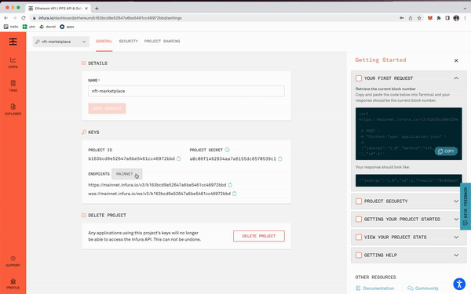
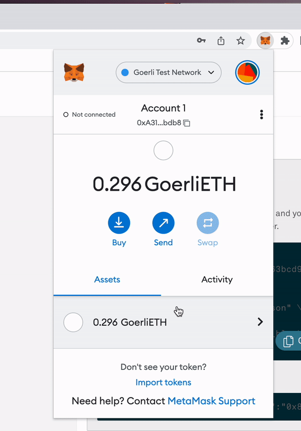
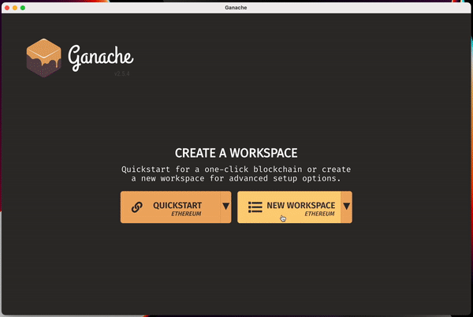
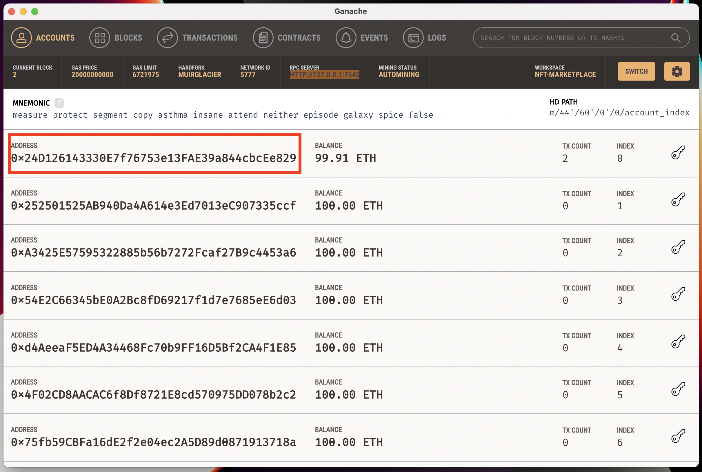
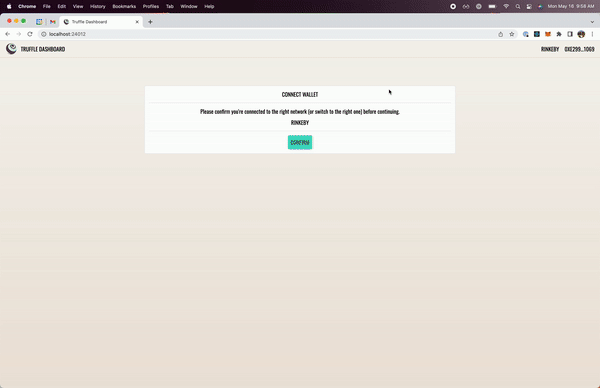
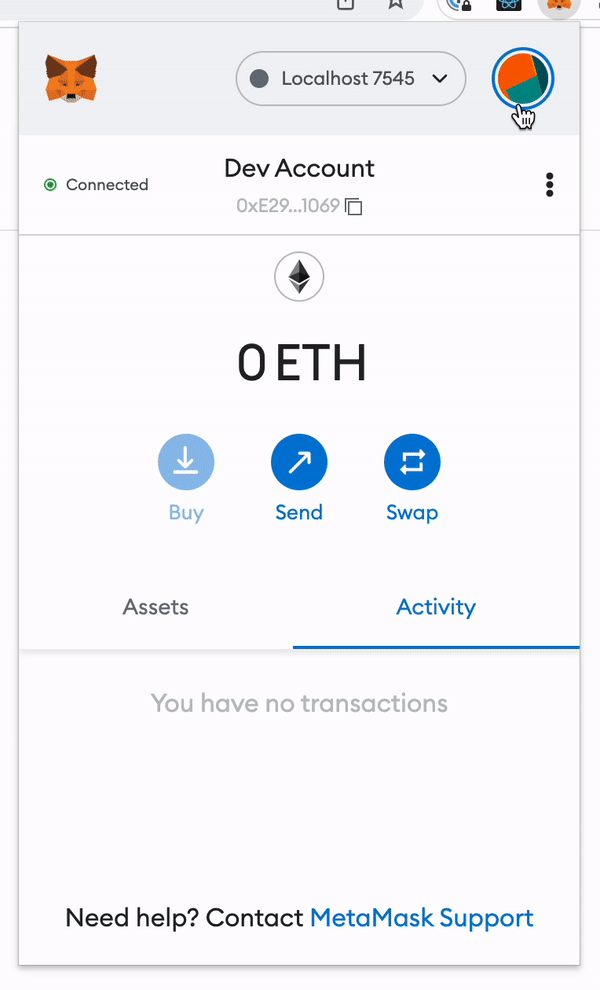

# How to Build a NFT Marketplace DApp on Ethereum or Optimism

Written by [Emily Lin](https://twitter.com/_emjlin)

## Overview 

Today, we're gonna build Bored Pets Marketplace, a simple NFT marketplace using [Truffle](https://trufflesuite.com/), [Infura](https://infura.io/), [MetaMask](https://metamask.io/), and [Web3.js](https://web3js.readthedocs.io/)! We'll start off with the basics and first show you how to deploy your ethereum contracts to Truffle's local blockchain, Ganache, and the Goerli testnet. Then, we'll show you how to covert those contracts over to Optimism and deploy on the Optimistic Goerli testnet. Note that this tutorial will not teach you Javascript and will only briefly go over some Solidity principles.

Our marketplace has a core set of functionality:
1. Minting and listing an NFT
2. Buying and selling an NFT
3. Viewing listed NFTs, NFTs you own, and NFTs you are selling

This tutorial was inspired by Nader Dabit's [marketplace tutorial](https://dev.to/edge-and-node/building-scalable-full-stack-apps-on-ethereum-with-polygon-2cfb). His tutorial uses [ethers.js](https://docs.ethers.io/) and deploys to Polygon, both of which you can use Truffle with!

The completed code for this tutorial lives [here](https://github.com/truffle-box/nft-marketplace-box).

## Prerequisites

### System Requirements

We will start with Truffle's [Optimism box](https://github.com/truffle-box/optimism-box), scaffolding code to help get your Truffle project configured to start using Optimism asap! The [README](https://github.com/truffle-box/optimism-box#readme) explains the project structure in more detail.

At the very least, you'll need to install:

- [Node.js](https://nodejs.org/en/), v12 or higher
- [truffle](https://trufflesuite.com/docs/truffle/getting-started/installation/?utm_source=blog&utm_medium=post&utm_campaign=2022_May_truffle-blog-nft-marketplace_acquisition_content)
- [ganache](https://trufflesuite.com/ganache/?utm_source=blog&utm_medium=post&utm_campaign=2022_May_truffle-blog-nft-marketplace_acquisition_content)

If you want to run Optimism locally, you'll need these [preqrequisites](https://community.optimism.io/docs/developers/build/dev-node/#prerequisites) too.

### Create an Infura account and project

To connect your DApp to Ethereum, Optimism, and other networks, you'll need an Infura account. Sign up for an account [here](https://infura.io/register?utm_source=blog&utm_medium=post&utm_campaign=2022_May_truffle-blog-nft-marketplace_acquisition_content).

Once you're signed in, create a project! Let's call it `nft-marketplace`. Since we're deploying to Optimism, go ahead and add the Optimistic Goerli endpoint. It'll ask you to sign up for a free trial.



### Register for a MetaMask wallet

To interact with your DApp in the browser, you'll need a MetaMask wallet. Sign up for an account [here](https://metamask.io/download/?utm_source=blog&utm_medium=post&utm_campaign=2022_May_truffle-blog-nft-marketplace_acquisition_content).

### Add Optimistic Goerli to your wallet

Let's add Optimistic Goerli to your list of available networks to your MetaMask wallet! To do so, open up the  MetaMask extension, click on the network, and then click Add Network. Then, fill out the network properties (you can copy your Infura idf from your Infura project):

- Network Name: Optimistic Goerli
- New RPC URL: https://optimism-goerli.infura.io/v3/INFURA_PROJECT_ID
- Chain ID: 420
- Currency Symbol: ETH
- Block Explorer URL: https://blockscout.com/optimism/goerli/


### Get Optimistic Goerli Eth

To use the Optimistic Goerli testnet, you'll need some test eth. To do so, you'll need to:

1) Get some Goerli Eth. You can use this [faucet](https://faucet.paradigm.xyz/)
2) Optimism's gateway still doesn't support Goerli, but if you transfer Goerli ETH to [0x636Af16bf2f682dD3109e60102b8E1A089FedAa8](https://goerli.etherscan.io/address/0x636Af16bf2f682dD3109e60102b8E1A089FedAa8), you will get it on Optimistic Goerli.



### VSCode

Feel free to use whatever IDE you want, but we highly recommend using VSCode! You can run through most of this tutorial using the Truffle extension to create, build, and deploy your smart contracts, all without using the CLI! You can read more about it [here](https://trufflesuite.com/blog/build-on-web3-with-truffle-vs-code-extension/).

## Set Up Your Project

### Unbox Optimism 

To get started, we'll start off by unboxing Truffle's Optimism box. You can do this by calling `truffle unbox optimism [FOLDER_NAME]` or through the VSCode extension command palette! Go ahead and install the requisite packages as well.

```shell
truffle unbox optimism nft-marketplace
cd nft-marketplace
npm install
```
### Create your client folders

We'll also be using [Next.js](https://nextjs.org/) and [Tailwind CSS](https://tailwindcss.com/) for our client. So, to get that set up, we'll use Next's [create-next-app](https://nextjs.org/docs/api-reference/create-next-app) utility. 

```shell
npx create-next-app@latest client
```

Then, we'll download the Tailwind dependencies and populate its config.

```shell
cd client
npm install -D tailwindcss@latest postcss@latest autoprefixer@latest
npx tailwindcss init -p
```
Edit `tailwind.config.js`

```javascript
module.exports = {
  content: [
    "./pages/**/*.{js,ts,jsx,tsx}",
    "./components/**/*.{js,ts,jsx,tsx}",
  ],
  theme: {
    extend: {},
  },
  plugins: [],
}
```
And replace the code from `styles/global.css`

```css
@tailwind base;
@tailwind components;
@tailwind utilities;
```

### Edit the Truffle config files

Since we'll be referencing your compiled contracts in the client, let's change `contracts_build_directory` in the Truffle config files:

- In `truffle-config.js`, change the value to `'./client/contracts/ethereum-contracts'`.
- In `truffle-config.ovm.js`, change the value to `'./client/contracts/optimism-contracts'`.

Your top level folder structure should look like this!

```shell
nft-marketplace
├── LICENSE
├── README.md
├── box-img-lg.png
├── box-img-sm.png
├── client
├── contracts
├── migrations
├── node_modules
├── package-lock.json
├── package.json
├── test
├── truffle-config.js
└── truffle-config.ovm.js
```

## Build the NFT Smart Contract

Since we are first showing you how to deploy on Ethereum, we'll edit the `SimpleStorage.sol` contract under `contracts/ethereum`. Change the file name and contract name to `BoredPetsNFT.sol`.

We'll need to install [OpenZeppelin](https://www.openzeppelin.com/). First, switch back into your `nft-marketplace` directory

```shell
cd ..
npm install @openzeppelin/contracts
```
The smart contract looks like this:

```java
// SPDX-License-Identifier: MIT
pragma solidity ^0.8.13;

import "@openzeppelin/contracts/token/ERC721/ERC721.sol";
import "@openzeppelin/contracts/token/ERC721/extensions/ERC721URIStorage.sol";
import "@openzeppelin/contracts/utils/Counters.sol";

contract BoredPetsNFT is ERC721URIStorage {
  using Counters for Counters.Counter;
  Counters.Counter private _tokenIds;
  address marketplaceContract;
  event NFTMinted(uint256);

  constructor(address _marketplaceContract) ERC721("Bored Pets Yacht Club", "BPYC") {
    marketplaceContract = _marketplaceContract;
  }

  function mint(string memory _tokenURI) public {
    _tokenIds.increment();
    uint256 newTokenId = _tokenIds.current();
    _safeMint(msg.sender, newTokenId);
    _setTokenURI(newTokenId, _tokenURI);
    setApprovalForAll(marketplaceContract, true);
    emit NFTMinted(newTokenId);
  }
}
```
Creating the NFT smart contract is short and sweet! Let's first take a look at the imports:

- @openzeppelin/contracts/token/ERC721/ERC721.sol

  To be a valid NFT, `BoredPetNFT` implements the [ERC721 standard](https://eips.ethereum.org/EIPS/eip-721) by inheriting the implementation of `ERC721URIStorage.sol`

- @openzeppelin/contracts/token/ERC721/extensions/ERC721URIStorage.sol

  This implementation of `ERC721` is used so that we store the tokenURIs on chain in `storage`, which is what allows us to store the metadata we upload to IPFS off-chain.

- @openzeppelin/contracts/utils/Counters.sol

  We use a counter to track the total number of NFTs and assign a unique token id to each NFT.

At the top we define a few variables:

- `address marketplaceContract` is the address of the Marketplace contract we'll be writing in the next section.
- `event NFTMinted` will be emitted every time a NFT is minted. When an event is emitted in solidity, the parameters are stored in the transaction's log. We will need the tokenId later when we build out the web app.

And finally, we only need to define the `mint` function! It only has one parameter:
- `string memory _tokenURI` points to the JSON metdata on IPFS that stores the NFT's metadata (i.e., image, name, description)

`mint` is relatively straightforward - it mints an NFT with an increasing, unique token Id. Of note, however, is `setApprovalForAll`. This is important because our Marketplace contract will need approver access to transfer ownership of the NFT between various addresses.

## Build the Marketplace Contract

Now, let's add a new contract `Marketplace.sol` under `contracts/ethereum`, which will store all the marketplace functionality. This'll be what it ends up like:

```java
// SPDX-License-Identifier: MIT
pragma solidity ^0.8.13;

import "@openzeppelin/contracts/utils/Counters.sol";
import "@openzeppelin/contracts/token/ERC721/ERC721.sol";
import "@openzeppelin/contracts/security/ReentrancyGuard.sol";

contract Marketplace is ReentrancyGuard {
  using Counters for Counters.Counter;
  Counters.Counter private _nftsSold;
  Counters.Counter private _nftCount;
  uint256 public LISTING_FEE = 0.0001 ether;
  address payable private _marketOwner;
  mapping(uint256 => NFT) private _idToNFT;
  struct NFT {
    address nftContract;
    uint256 tokenId;
    address payable seller;
    address payable owner;
    uint256 price;
    bool listed;
  }
  event NFTListed(
    address nftContract,
    uint256 tokenId,
    address seller,
    address owner,
    uint256 price
  );
  event NFTSold(
    address nftContract,
    uint256 tokenId,
    address seller,
    address owner,
    uint256 price
  );

  constructor() {
    _marketOwner = payable(msg.sender);
  }

  // List the NFT on the marketplace
  function listNft(address _nftContract, uint256 _tokenId, uint256 _price) public payable nonReentrant {
    require(_price > 0, "Price must be at least 1 wei");
    require(msg.value == LISTING_FEE, "Not enough ether for listing fee");

    IERC721(_nftContract).transferFrom(msg.sender, address(this), _tokenId);

    _nftCount.increment();

    _idToNFT[_tokenId] = NFT(
      _nftContract,
      _tokenId, 
      payable(msg.sender),
      payable(address(this)),
      _price,
      true
    );

    emit NFTListed(_nftContract, _tokenId, msg.sender, address(this), _price);
  }

  // Buy an NFT
  function buyNft(address _nftContract, uint256 _tokenId) public payable nonReentrant {
    NFT storage nft = _idToNFT[_tokenId];
    require(msg.value >= nft.price, "Not enough ether to cover asking price");

    address payable buyer = payable(msg.sender);
    payable(nft.seller).transfer(msg.value);
    IERC721(_nftContract).transferFrom(address(this), buyer, nft.tokenId);
    _marketOwner.transfer(LISTING_FEE);
    nft.owner = buyer;
    nft.listed = false;

    _nftsSold.increment();
    emit NFTSold(_nftContract, nft.tokenId, nft.seller, buyer, msg.value);
  }

  // Resell an NFT purchased from the marketplace
  function resellNft(address _nftContract, uint256 _tokenId, uint256 _price) public payable nonReentrant {
    require(_price > 0, "Price must be at least 1 wei");
    require(msg.value == LISTING_FEE, "Not enough ether for listing fee");

    IERC721(_nftContract).transferFrom(msg.sender, address(this), _tokenId);

    NFT storage nft = _idToNFT[_tokenId];
    nft.seller = payable(msg.sender);
    nft.owner = payable(address(this));
    nft.listed = true;
    nft.price = _price;

    _nftsSold.decrement();
    emit NFTListed(_nftContract, _tokenId, msg.sender, address(this), _price);
  }

  function getListingFee() public view returns (uint256) {
    return LISTING_FEE;
  }

  function getListedNfts() public view returns (NFT[] memory) {
    uint256 nftCount = _nftCount.current();
    uint256 unsoldNftsCount = nftCount - _nftsSold.current();

    NFT[] memory nfts = new NFT[](unsoldNftsCount);
    uint nftsIndex = 0;
    for (uint i = 0; i < nftCount; i++) {
      if (_idToNFT[i + 1].listed) {
        nfts[nftsIndex] = _idToNFT[i + 1];
        nftsIndex++;
      }
    }
    return nfts;
  }

  function getMyNfts() public view returns (NFT[] memory) {
    uint nftCount = _nftCount.current();
    uint myNftCount = 0;
    for (uint i = 0; i < nftCount; i++) {
      if (_idToNFT[i + 1].owner == msg.sender) {
        myNftCount++;
      }
    }

    NFT[] memory nfts = new NFT[](myNftCount);
    uint nftsIndex = 0;
    for (uint i = 0; i < nftCount; i++) {
      if (_idToNFT[i + 1].owner == msg.sender) {
        nfts[nftsIndex] = _idToNFT[i + 1];
        nftsIndex++;
      }
    }
    return nfts;
  }

  function getMyListedNfts() public view returns (NFT[] memory) {
    uint nftCount = _nftCount.current();
    uint myListedNftCount = 0;
    for (uint i = 0; i < nftCount; i++) {
      if (_idToNFT[i + 1].seller == msg.sender && _idToNFT[i + 1].listed) {
        myListedNftCount++;
      }
    }

    NFT[] memory nfts = new NFT[](myListedNftCount);
    uint nftsIndex = 0;
    for (uint i = 0; i < nftCount; i++) {
      if (_idToNFT[i + 1].seller == msg.sender && _idToNFT[i + 1].listed) {
        nfts[nftsIndex] = _idToNFT[i + 1];
        nftsIndex++;
      }
    }
    return nfts;
  }
}
```
There's a lot to unpack here! You might notice that the Marketplace contract inherits `ReentrancyGuard`. We do this so that we can defend against reentrancy attacks. You can read more about them [here](https://medium.com/coinmonks/protect-your-solidity-smart-contracts-from-reentrancy-attacks-9972c3af7c21).

First, let's dive into the contract variables:
- `Counters.Counter private _nftsSold` increments when a NFT is sold and decremented when a NFT is relisted.
- `Counters.Counter private _nftCount` tracks how many NFTs have been listed.
- `uint256 public LISTING_FEE` is taken from the seller and transferred to the marketplace contract owner whenever an NFT is sold.
- `address payable private _marketOwner` stores the Marketplace contract owner, so that we know who to pay the listing fee to.
- `mapping(uint256 => NFT) private _idToNFT` associates the unique tokenId to a the NFT struct.
- `struct NFT` stores relevant information for an NFT listed in the marketplace.
- `event NFTListed` is emitted every time a NFT is listed.
- `event NFTSold` is emitted every time a NFT is sold.

Next, we'll go over the functions that will alter state:
- `listNft` is called when a user first mints and lists their NFT. It transfers ownership from the user over to the Marketplace contract.
- `resellNft` allows users to sell an NFT that they purchase on the marketplace.
- `buyNft` is called when a user buys an NFT. The buyer becomes the new owner of the NFT, the token is transferred from the buyer to the seller, and the listing fee is given to the marketplace owner.

Finally, the query functions are relatively straightforward:

- `getListingFee` returns the listing fee. This is entirely optional. When you deploy a smart contract, a LISTING_FEE() function is actually created for you, but we created a getter function for code cleanliness.
- `getListedNfts` retrieves the NFTs that are currently listed for sale.
- `getMyNfts` retrieves the NFTs the user has bought.
- `getMyListedNfts` retrieves the NFTs the user has listed for sale.

## Deploy the Smart Contracts Locally

In order to deploy our smart contracts, we'll need to modify `migrations/1_deploy_contracts.js`. Because `BoredPetsNFT` requires the `Marketplace` contract address, order matters here! Truffle allows you to deploy contracts in order using `Promise` or `await`/`async`. You can read more about it [here](https://trufflesuite.com/docs/truffle/getting-started/running-migrations/#deployer). (Note that previously, Truffle also required a separate `Migrations.sol` contract, but that is no longer the case!)

Your deployment file should look like this:

```javascript
var BoredPetsNFT = artifacts.require("BoredPetsNFT");
var Marketplace = artifacts.require("Marketplace");

module.exports = async function(deployer) {
  await deployer.deploy(Marketplace);
  const marketplace = await Marketplace.deployed();
  await deployer.deploy(BoredPetsNFT, marketplace.address);
}
```
There are a variety of ways to get your local Ganache instance up: through the VS Code extension, Ganache CLI, and the Ganche graphical user interface. Each has its own advantages, and you can check out v7's coolest features [here](https://trufflesuite.com/blog/introducing-ganache-7/).

In this example, we'll be using the GUI. Open it up, create a workspace, and hit save!



This creates a running Ganache instance at HTTP://127.0.0.1:7545. Now, just run `truffle migrate --network development` in the CLI from the `nft-marketplace` folder. This will compile and deploy your contracts. You should see output similar to this:

```shell
Compiling your contracts...
===========================
> Compiling ./contracts/ethereum/BoredPetsNFT.sol.sol
> Compiling ./contracts/ethereum/Marketplace.sol
> Compiling @openzeppelin/contracts/security/ReentrancyGuard.sol
> Compiling @openzeppelin/contracts/token/ERC721/ERC721.sol
> Compiling @openzeppelin/contracts/token/ERC721/IERC721.sol
> Compiling @openzeppelin/contracts/token/ERC721/IERC721Receiver.sol
> Compiling @openzeppelin/contracts/token/ERC721/extensions/ERC721URIStorage.sol
> Compiling @openzeppelin/contracts/token/ERC721/extensions/IERC721Metadata.sol
> Compiling @openzeppelin/contracts/utils/Address.sol
> Compiling @openzeppelin/contracts/utils/Context.sol
> Compiling @openzeppelin/contracts/utils/Counters.sol
> Compiling @openzeppelin/contracts/utils/Strings.sol
> Compiling @openzeppelin/contracts/utils/introspection/ERC165.sol
> Compiling @openzeppelin/contracts/utils/introspection/IERC165.sol
> Artifacts written to /Users/emilylin/truffle/nft-marketplace/client/contracts/ethereum-contracts
> Compiled successfully using:
   - solc: 0.8.13+commit.abaa5c0e.Emscripten.clang


Starting migrations...
======================
> Network name:    'development'
> Network id:      5777
> Block gas limit: 6721975 (0x6691b7)


1_deploy_contracts.js
=====================

   Deploying 'Marketplace'
   -----------------------
   > transaction hash:    0xca3f5fcc301c700bdfd7bfb58c853e39085335ed0ef249bf57334ad856848383
   > Blocks: 0            Seconds: 0
   > contract address:    0x6F1A6D8a5414d1B1E67b69D69D5206498447aceE
   > block number:        1
   > block timestamp:     1652487728
   > account:             0x24D126143330E7f76753e13FAE39a844cbcEe829
   > balance:             99.96632092
   > gas used:            1683954 (0x19b1f2)
   > gas price:           20 gwei
   > value sent:          0 ETH
   > total cost:          0.03367908 ETH


   Deploying 'BoredPetsNFT'
   ---------------------------
   > transaction hash:    0x077ab3a709addd41229de58f3bb6ad913a5c4646cd5df39272a9db6ad3a04f05
   > Blocks: 0            Seconds: 0
   > contract address:    0x2935aBf19126137D47bCa1612Dc4900815A15E92
   > block number:        2
   > block timestamp:     1652487729
   > account:             0x24D126143330E7f76753e13FAE39a844cbcEe829
   > balance:             99.91495866
   > gas used:            2568113 (0x272fb1)
   > gas price:           20 gwei
   > value sent:          0 ETH
   > total cost:          0.05136226 ETH

   > Saving artifacts
   -------------------------------------
   > Total cost:          0.08504134 ETH

Summary
=======
> Total deployments:   2
> Final cost:          0.08504134 ETH
```

You should be able to find your compiled contracts under `./client/contracts/ethereum-contracts`

## Test Your Smart Contracts

In order to quickly test our smart contracts, we'll take advantage of `truffle exec` to run scripts to automate common tasks. Let's write a script that will execute all of our different functions. First, create a new file under a new `scripts` folder called `run.js`.

```javascript
var BoredPetsNFT = artifacts.require("BoredPetsNFT");
var Marketplace = artifacts.require("Marketplace");

async function logNftLists(marketplace) {
    let listedNfts = await marketplace.getListedNfts.call()
    const accountAddress = 'FIRST_ACCOUNT_ADDRESS'
    let myNfts = await marketplace.getMyNfts.call({from: accountAddress})
    let myListedNfts = await marketplace.getMyListedNfts.call({from: accountAddress})
    console.log(`listedNfts: ${listedNfts.length}`)
    console.log(`myNfts: ${myNfts.length}`)
    console.log(`myListedNfts ${myListedNfts.length}\n`)
}

const main = async (cb) => {
  try {
    const boredPets = await BoredPetsNFT.deployed()
    const marketplace = await Marketplace.deployed()

    console.log('MINT AND LIST 3 NFTs')
    let listingFee = await marketplace.getListingFee()
    listingFee = listingFee.toString()
    let txn1 = await boredPets.mint("URI1")
    let tokenId1 = txn1.logs[2].args[0].toNumber()
    await marketplace.listNft(boredPets.address, tokenId1, 1, {value: listingFee})
    console.log(`Minted and listed ${tokenId1}`)
    let txn2 = await boredPets.mint("URI1")
    let tokenId2 = txn2.logs[2].args[0].toNumber()
    await marketplace.listNft(boredPets.address, tokenId2, 1, {value: listingFee})
    console.log(`Minted and listed ${tokenId2}`)
    let txn3 = await boredPets.mint("URI1")
    let tokenId3 = txn3.logs[2].args[0].toNumber()
    await marketplace.listNft(boredPets.address, tokenId3, 1, {value: listingFee})
    console.log(`Minted and listed ${tokenId3}`)
    await logNftLists(marketplace)

    console.log('BUY 2 NFTs')
    await marketplace.buyNft(boredPets.address, tokenId1, {value: 1})
    await marketplace.buyNft(boredPets.address, tokenId2, {value: 1})
    await logNftLists(marketplace)

    console.log('RESELL 1 NFT')
    await marketplace.resellNft(boredPets.address, tokenId2, 1, {value: listingFee})
    await logNftLists(marketplace)

  } catch(err) {
    console.log('Doh! ', err);
  }
  cb();
}

module.exports = main;
```
In this script, you can use [`artifacts.require`](https://trufflesuite.com/docs/truffle/getting-started/running-migrations/#artifactsrequire) to gain access to the contract abstractions. Then, we interact with the contracts using the [`@truffle/contracts`](https://github.com/trufflesuite/truffle/blob/master/packages/contract/README.md) convenience library. You can use this functionality to [write unit tests](https://trufflesuite.com/docs/truffle/testing/testing-your-contracts/) in Truffle in javasacript or typescript. Note that if you use typescript, you'll need to create a `tsconfig.json` file and use `tsc` to compile down to javascript. You can read more about `tsc` [here](https://www.typescriptlang.org/docs/handbook/tsconfig-json.html).

To run this script, you'll need to fill in `FIRST_ACCOUNT_ADDRESS` to query the listed NFTs. By default, Truffle uses the first account available to execute functions. You can get this address by heading over to your Ganache GUI and copy/pasting the first account address.



Run `truffle exec scripts/run.js`, and your output should look what's below:

```shell
MINT AND LIST 3 NFTs
listedNfts: 3
myNfts: 0
myListedNfts 3
BUY 2 NFTs
listedNfts: 1
myNfts: 2
myListedNfts 1
RESELL 1 NFT
listedNfts: 2
myNfts: 1
myListedNfts 1
```
Success! If you want to deploy your contracts on a populated blockchain, you can use Ganache to [fork mainnet with zero config](https://trufflesuite.com/blog/introducing-ganache-7/#new-ganache-7-features).

## Other Ways to Deploy
### Deploy to Truffle Dashboards

In this tutorial, we'll take you through how to deploy to a testnet using [Truffle dashboards](https://trufflesuite.com/docs/truffle/getting-started/using-the-truffle-dashboard/), which allows you to sign your transactions using MetaMask. This allows you to keep your private key safe, since you don't have to save it locally. In order to do so, you'll need to get some test eth from a [faucet](https://faucet.paradigm.xyz/).

First, run `truffle dashboard` in a separate terminal window. It should open truffle dashboards at http://127.0.0.1:24012/. Then, you can use your MetaMask wallet to connect to a network of your choice. In this case, we'll select the Goerli network.

Next, migrate your contract to dashboards using `truffle migrate --network dashboard`. If you head back to the dashboard tab, you'll see the request to sign using MetaMask. Hit accept, and voila! Head back to the terminal, and you should see the that your contracts were deployed.



After changing the account number, you can execute the script again to test: `truffle exec scripts/run.js`

### Deploy Using a `.env` File

If you don't want to use Dashboards, you can modify your Truffle config files to use environment variables you set up. Create a `.env` file with the following code:

```shell
INFURA_KEY="<Your Infura project key>"
GANACHE_MNEMONIC="<Your Ganache mnemonic>"
GOERLI_MNEMONIC="<Your Metamask mnemonic>"
```

The `.gitignore` already ignores `.env`, but since you're populating your mnemonic/secret key here, PLEASE DO NOT COMMIT THIS ANYWHERE PUBLIC.

Then, just run `truffle migrate --network [NETWORK NAME]` or `npm run migrate:ovm --network=[NETWORK NAME]`

### Deploy to Optimistic Goerli

Since Optimism is EVM equivalent with [small exceptions](https://community.optimism.io/docs/developers/build/differences/), we can just copy our contracts from the `contracts/ethereum` over to `contracts/optimism`.

To get Eth for Optimistic Goerli, you can use this [faucet](https://optimismfaucet.xyz/). You'll need to sign up with a Github account older than 1 month and be following at least 5 repos:
- [trufflesuite](https://github.com/trufflesuite)
- [truffle-box](https://github.com/truffle-box)
- [Infura](https://github.com/INFURA)
- [MetaMask](https://github.com/metamask)
- [Optimism](https://github.com/ethereum-optimism)

Our box already includes the Optimistic Goerli configuration in `truffle-confg.ovm.js`. Run `npm run migrate:ovm --network=optimistic_goerli` to deploy, and `npm run exec:ovm scripts/run.js --network=optimistic_goerli` to test!

Since we are using a testnet, connectivity can get a bit flaky. You can try again by running the `migrate` command with `--reset`. Alternatively, you might see occasionally see something like this:

```shell
TypeError: Cannot read properties of null (reading 'from')
```

In which case, you can specify the `from` address in the deploy script as follows (`ACCOUNT_ADDRESS` is the address that will be signing the transaction):

```javascript
module.exports = async function(deployer) {
  await deployer.deploy(Marketplace);
  const marketplace = await Marketplace.deployed();
  await deployer.deploy(BoredPetsNFT, marketplace.address, {from: "ACCOUNT_ADDRESS"});
}
```

### Deploy to Optimism Locally

You can also deploy to a locally running instance of Optimism. You'll need to have very [specific system requirements](https://community.optimism.io/docs/developers/build/dev-node/#). Make sure ports 9545 and 8545 are free, and then run:

```shell
npm run installLocalOptimism
npm run startLocalOptimism
```

## Create an Infura IPFS project

You'll need Infura IPFS account and dedicated gateway to upload your NFT metadata. To create a IPFS project, select create IPFS project.


Then, you'll need to create a unique gateway name. In this project, we'll call it `optimism-demo`. You will need to give your own dedicated gateway with its own unique name.


## Create Your Front End

First, we need to install some packages to get our client up and running:

```shell
cd client
npm install axios
npm install web3modal
npm install web3
npm install ipfs-http-client
```

Then, we need to create or edit 6 files that sit under `client/pages`:

### `_app.js`

This file organizes the link routing

```javascript
import '../styles/globals.css'
import Link from 'next/link'

function MyApp({ Component, pageProps }) {
  return (
    <div>
      <nav className="border-b p-6">
        <p className="text-4xl font-bold">Bored Pet Marketplace</p>
        <div className="flex mt-4">
          <Link href="/">
            <a className="mr-4 text-teal-400">
              Home
            </a>
          </Link>
          <Link href="/create-and-list-nft">
            <a className="mr-6 text-teal-400">
              Sell a new NFT
            </a>
          </Link>
          <Link href="/my-nfts">
            <a className="mr-6 text-teal-400">
              My NFTs
            </a>
          </Link>
          <Link href="/my-listed-nfts">
            <a className="mr-6 text-teal-400">
              My Listed NFTs
            </a>
          </Link>
        </div>
      </nav>
      <Component {...pageProps} />
    </div>
  )
}

export default MyApp
```

### `index.js`

Thie file is the Home tab, where a user can see and buy all of the listed NFTs.

```javascript
import Web3 from 'web3';
import Web3Modal from 'web3modal';
import { useEffect, useState } from 'react';
import axios from 'axios';

import Marketplace from '../contracts/optimism-contracts/Marketplace.json'
import BoredPetsNFT from '../contracts/optimism-contracts/BoredPetsNFT.json'

export default function Home() {
  const [nfts, setNfts] = useState([])
  const [loadingState, setLoadingState] = useState('not-loaded')
  
  useEffect(() => { loadNFTs() }, [])
  
  async function loadNFTs() {
    const web3Modal = new Web3Modal()
    const provider = await web3Modal.connect()
    const web3 = new Web3(provider)
    const networkId = await web3.eth.net.getId()

    // Get all listed NFTs
    const marketPlaceContract = new web3.eth.Contract(Marketplace.abi, Marketplace.networks[networkId].address)
    const listings = await marketPlaceContract.methods.getListedNfts().call()
    // Iterate over the listed NFTs and retrieve their metadata
    const nfts = await Promise.all(listings.map(async (i) => {
      try {
        const boredPetsContract = new web3.eth.Contract(BoredPetsNFT.abi, BoredPetsNFT.networks[networkId].address)
        const tokenURI = await boredPetsContract.methods.tokenURI(i.tokenId).call()
        const meta = await axios.get(tokenURI)
        const nft = {
          price: i.price,
          tokenId: i.tokenId,
          seller: i.seller,
          owner: i.buyer,
          image: meta.data.image,
          name: meta.data.name,
          description: meta.data.description,
        }
        return nft
      } catch(err) {
        console.log(err)
        return null
      }
    }))
    setNfts(nfts.filter(nft => nft !== null))
    setLoadingState('loaded') 
  }

  async function buyNft(nft) {
    const web3Modal = new Web3Modal()
    const provider = await web3Modal.connect()
    const web3 = new Web3(provider)
    const networkId = await web3.eth.net.getId();
    const marketPlaceContract = new web3.eth.Contract(Marketplace.abi, Marketplace.networks[networkId].address);
    const accounts = await web3.eth.getAccounts();
    await marketPlaceContract.methods.buyNft(BoredPetsNFT.networks[networkId].address, nft.tokenId).send({ from: accounts[0], value: nft.price });
    loadNFTs()
  }

  if (loadingState === 'loaded' && !nfts.length) {
    return (<h1 className="px-20 py-10 text-3xl">No pets available!</h1>)
  } else {
    return (
      <div className="flex justify-center">
        <div className="px-4" style={ { maxWidth: '1600px' } }>
          <div className="grid grid-cols-1 sm:grid-cols-2 lg:grid-cols-4 gap-4 pt-4">
            {
              nfts.map((nft, i) => (
                <div key={i} className="border shadow rounded-xl overflow-hidden">
                  
                  <div className="p-4">
                    <p style={ { height: '64px' } } className="text-2xl font-semibold">{nft.name}</p>
                    <div style={ { height: '70px', overflow: 'hidden'  } }>
                      <p className="text-gray-400">{nft.description}</p>
                    </div>
                  </div>
                  <div className="p-4 bg-black">
                    <p className="text-2xl font-bold text-white">{Web3.utils.fromWei(nft.price, "ether")} ETH</p>
                    <button className="mt-4 w-full bg-teal-400 text-white font-bold py-2 px-12 rounded" onClick={() => buyNft(nft)}>Buy</button>
                  </div>
                </div>
              ))
            }
          </div>
        </div>
      </div>
    )
  }
}
```

This is the Sell tab, where a user can create and list an NFT. Make sure you replace <DEDICATED_GATEWAY> with the dedicated gateway name you create in your IPFS project on Infura. You'll also need to add in your IPFS API and Secret to create our IPFS client. To do so, create `.env.local` in your `client` folder. Then, populate it with these values:

```shell
NEXT_PUBLIC_IPFS_SECRET=
NEXT_PUBLIC_IPFS_KEY=
```

Then, copy paste this code:

```javascript
import { useState } from 'react'
import Web3 from 'web3'
import Web3Modal from 'web3modal'
import { useRouter } from 'next/router'
import { create as ipfsHttpClient } from 'ipfs-http-client'
import Marketplace from '../contracts/optimism-contracts/Marketplace.json'
import BoredPetsNFT from '../contracts/optimism-contracts/BoredPetsNFT.json'


const projectId = process.env["NEXT_PUBLIC_IPFS_KEY"];
const projectSecret = process.env["NEXT_PUBLIC_IPFS_SECRET"];
const auth =
    'Basic ' + Buffer.from(projectId + ':' + projectSecret).toString('base64');

const client = ipfsHttpClient({
    host: 'ipfs.infura.io',
    port: 5001,
    protocol: 'https',
    headers: {
        authorization: auth,
    },
});


const projectId = process.env["NEXT_PUBLIC_INFURA_KEY"];
const projectSecret = process.env["NEXT_PUBLIC_INFURA_SECRET"];
const auth =
    'Basic ' + Buffer.from(projectId + ':' + projectSecret).toString('base64');

const client = ipfsHttpClient({
    host: 'ipfs.infura.io',
    port: 5001,
    protocol: 'https',
    headers: {
        authorization: auth,
    },
});

export default function CreateItem() {
  const [fileUrl, setFileUrl] = useState(null)
  const [formInput, updateFormInput] = useState({ price: '', name: '', description: '' })
  const router = useRouter()

  async function onChange(e) {
    // upload image to IPFS
    const file = e.target.files[0]
    try {
      const added = await client.add(
        file,
        {
          progress: (prog) => console.log(`received: ${prog}`)
        }
      )
      const url = `https://<DEDICATED_GATEWAY>.infura-ipfs.io/ipfs/${added.path}`
      setFileUrl(url)
    } catch (error) {
      console.log('Error uploading file: ', error)
    }  
  }

  async function uploadToIPFS() {
    const { name, description, price } = formInput
    if (!name || !description || !price || !fileUrl) {
      return
    } else {
      // first, upload metadata to IPFS
      const data = JSON.stringify({
        name, description, image: fileUrl
      })
      try {
        const added = await client.add(data)
        console.log('added: ', added)
        const url = `https://<DEDICATED_GATEWAY>.infura-ipfs.io/ipfs/${added.path}`
        // after metadata is uploaded to IPFS, return the URL to use it in the transaction
        return url
      } catch (error) {
        console.log('Error uploading file: ', error)
      } 
    }
  }

  async function listNFTForSale() {
    const web3Modal = new Web3Modal()
    const provider = await web3Modal.connect()
    const web3 = new Web3(provider)
    const url = await uploadToIPFS()
    const networkId = await web3.eth.net.getId()

    // Mint the NFT
    const boredPetsContractAddress = BoredPetsNFT.networks[networkId].address
    const boredPetsContract = new web3.eth.Contract(BoredPetsNFT.abi, boredPetsContractAddress)
    const accounts = await web3.eth.getAccounts()
    const marketPlaceContract = new web3.eth.Contract(Marketplace.abi, Marketplace.networks[networkId].address)
    let listingFee = await marketPlaceContract.methods.getListingFee().call()
    listingFee = listingFee.toString()
    boredPetsContract.methods.mint(url).send({ from: accounts[0] }).on('receipt', function (receipt) {
        console.log('minted');
        // List the NFT
        const tokenId = receipt.events.NFTMinted.returnValues[0];
        marketPlaceContract.methods.listNft(boredPetsContractAddress, tokenId, Web3.utils.toWei(formInput.price, "ether"))
            .send({ from: accounts[0], value: listingFee }).on('receipt', function () {
                console.log('listed')
                router.push('/')
            });
    });
  }

  return (
    <div className="flex justify-center">
      <div className="w-1/2 flex flex-col pb-12">
        <input 
          placeholder="Asset Name"
          className="mt-8 border rounded p-4"
          onChange={e => updateFormInput({ ...formInput, name: e.target.value })}
        />
        <textarea
          placeholder="Asset Description"
          className="mt-2 border rounded p-4"
          onChange={e => updateFormInput({ ...formInput, description: e.target.value })}
        />
        <input
          placeholder="Asset Price in Eth"
          className="mt-2 border rounded p-4"
          onChange={e => updateFormInput({ ...formInput, price: e.target.value })}
        />
        <input
          type="file"
          name="Asset"
          className="my-4"
          onChange={onChange}
        />
        {
          fileUrl && (
            
          )
        }
        <button onClick={listNFTForSale} className="font-bold mt-4 bg-teal-400 text-white rounded p-4 shadow-lg">
          Mint and list NFT
        </button>
      </div>
    </div>
  )
}
```

### `my-nfts.js`
This is the My NFTs tab, where the user can see the NFTs they own and choose to resell.

```javascript
import Web3 from 'web3';
import { useEffect, useState } from 'react'
import axios from 'axios'
import Web3Modal from 'web3modal'
import { useRouter } from 'next/router'

import Marketplace from '../contracts/optimism-contracts/Marketplace.json';
import BoredPetsNFT from '../contracts/optimism-contracts/BoredPetsNFT.json';

export default function MyAssets() {
  const [nfts, setNfts] = useState([])
  const [loadingState, setLoadingState] = useState('not-loaded')
  const router = useRouter()

  useEffect(() => { loadNFTs() }, [])

  async function loadNFTs() {
    const web3Modal = new Web3Modal()
    const provider = await web3Modal.connect()
    const web3 = new Web3(provider)
    const networkId = await web3.eth.net.getId()
    const marketPlaceContract = new web3.eth.Contract(Marketplace.abi, Marketplace.networks[networkId].address)
    const boredPetsContractAddress = BoredPetsNFT.networks[networkId].address
    const boredPetsContract = new web3.eth.Contract(BoredPetsNFT.abi, boredPetsContractAddress)
    const accounts = await web3.eth.getAccounts()
    const data = await marketPlaceContract.methods.getMyNfts().call({from: accounts[0]})

    const nfts = await Promise.all(data.map(async i => {
      try {
        const tokenURI = await boredPetsContract.methods.tokenURI(i.tokenId).call()
        const meta = await axios.get(tokenURI)
        let nft = {
          price: i.price,
          tokenId: i.tokenId,
          seller: i.seller,
          owner: i.buyer,
          image: meta.data.image,
          name: meta.data.name,
          description: meta.data.description,
          tokenURI: tokenURI
        }
        return nft
      } catch(err) {
        console.log(err)
        return null
      }
      
    }))
    setNfts(nfts.filter(nft => nft !== null))
    setLoadingState('loaded')
  }

  function listNFT(nft) {
    router.push(`/resell-nft?id=${nft.tokenId}&tokenURI=${nft.tokenURI}`)
  }

  if (loadingState === 'loaded' && !nfts.length) {
    return (<h1 className="py-10 px-20 text-3xl">No NFTs owned</h1>);
  } else {
    return (
      <div className="flex justify-center">
        <div className="p-4">
          <div className="grid grid-cols-1 sm:grid-cols-2 lg:grid-cols-4 gap-4 pt-4">
            {
              nfts.map((nft, i) => (
                <div key={i} className="border shadow rounded-xl overflow-hidden">
                  
                  <div className="p-4">
                    <p style={ { height: '64px' } } className="text-2xl font-semibold">{nft.name}</p>
                    <div style={ { height: '70px', overflow: 'hidden' } }>
                      <p className="text-gray-400">{nft.description}</p>
                    </div>
                  </div>
                  <div className="p-4 bg-black">
                    <p className="text-2xl font-bold text-white">Price - {Web3.utils.fromWei(nft.price, "ether")} Eth</p>
                    <button className="mt-4 w-full bg-teal-400 text-white font-bold py-2 px-12 rounded" onClick={() => listNFT(nft)}>List</button>
                  </div>
                </div>
              ))
            }
          </div>
        </div>
      </div>
    );
  }
}
```

### `resell-nft.js`
This is the page the user is directed to to resell their NFTs.

```javascript
import { useEffect, useState } from 'react'
import Web3 from 'web3'
import { useRouter } from 'next/router'
import axios from 'axios'
import Web3Modal from 'web3modal'

import Marketplace from '../contracts/optimism-contracts/Marketplace.json'
import BoredPetsNFT from '../contracts/optimism-contracts/BoredPetsNFT.json'

export default function ResellNFT() {
  const [formInput, updateFormInput] = useState({ price: '', image: '' })
  const router = useRouter()
  const { id, tokenURI } = router.query
  const { image, price } = formInput

  useEffect(() => { fetchNFT() }, [id])

  async function fetchNFT() {
    if (!tokenURI) {
        return
    } else {
        const meta = await axios.get(tokenURI)
        updateFormInput(state => ({ ...state, image: meta.data.image }))
    }
  }

  async function listNFTForSale() {
    if (!price) {
        return
    } else {
        const web3Modal = new Web3Modal()
        const provider = await web3Modal.connect()
        const web3 = new Web3(provider)
        const networkId = await web3.eth.net.getId()
        const marketPlaceContract = new web3.eth.Contract(Marketplace.abi, Marketplace.networks[networkId].address)
        let listingFee = await marketPlaceContract.methods.getListingFee().call()
        listingFee = listingFee.toString()
        const accounts = await web3.eth.getAccounts()
        marketPlaceContract.methods.resellNft(BoredPetsNFT.networks[networkId].address, id, Web3.utils.toWei(formInput.price, "ether"))
            .send({ from: accounts[0], value: listingFee }).on('receipt', function () {
                router.push('/')
            });
    }
  }

  return (
    <div className="flex justify-center">
      <div className="w-1/2 flex flex-col pb-12">
        <input
          placeholder="Asset Price in Eth"
          className="mt-2 border rounded p-4"
          onChange={e => updateFormInput({ ...formInput, price: e.target.value })}
        />
        {
          image && (
            
          )
        }
        <button onClick={listNFTForSale} className="font-bold mt-4 bg-teal-400 text-white rounded p-4 shadow-lg">
          List NFT
        </button>
      </div>
    </div>
  )
}
```

### `my-listed-nfts.js`
This is the My Listed NFTs tab, where users can see what NFTs they have listed for sale.

```javascript
import Web3 from 'web3';
import { useEffect, useState } from 'react';
import axios from 'axios';
import Web3Modal from 'web3modal';

import Marketplace from '../contracts/optimism-contracts/Marketplace.json';
import BoredPetsNFT from '../contracts/optimism-contracts/BoredPetsNFT.json';

export default function CreatorDashboard() {
  const [nfts, setNfts] = useState([])
  const [loadingState, setLoadingState] = useState('not-loaded')

  useEffect(() => { loadNFTs() }, [])

  async function loadNFTs() {
    const web3Modal = new Web3Modal()
    const provider = await web3Modal.connect()
    const web3 = new Web3(provider)
    const networkId = await web3.eth.net.getId()

    // Get listed NFTs
    const marketPlaceContract = new web3.eth.Contract(Marketplace.abi, Marketplace.networks[networkId].address)
    const accounts = await web3.eth.getAccounts()
    const listings = await marketPlaceContract.methods.getMyListedNfts().call({from: accounts[0]})
    // Iterate over my listed NFTs and retrieve their metadata
    const nfts = await Promise.all(listings.map(async i => {
      try {
        const boredPetsContract = new web3.eth.Contract(BoredPetsNFT.abi, BoredPetsNFT.networks[networkId].address)
        const tokenURI = await boredPetsContract.methods.tokenURI(i.tokenId).call();
        const meta = await axios.get(tokenURI);
        let item = {
          price: i.price,
          tokenId: i.tokenId,
          seller: i.seller,
          owner: i.owner,
          image: meta.data.image,
        }
        return item
      } catch(err) {
        console.log(err)
        return null
      }
    }))
    setNfts(nfts.filter(nft => nft !== null))
    setLoadingState('loaded')
  }

  if (loadingState === 'loaded' && !nfts.length) {
    return (<h1 className="py-10 px-20 text-3xl">No NFTs listed</h1>)
  } else {
    return (
      <div>
        <div className="p-4">
          <h2 className="text-2xl py-2">Items Listed</h2>
            <div className="grid grid-cols-1 sm:grid-cols-2 lg:grid-cols-4 gap-4 pt-4">
            {
              nfts.map((nft, i) => (
                <div key={i} className="border shadow rounded-xl overflow-hidden">
                  
                  <div className="p-4 bg-black">
                    <p className="text-2xl font-bold text-white">Price - {Web3.utils.fromWei(nft.price, "ether")} Eth</p>
                  </div>
                </div>
              ))
            }
          </div>
        </div>
      </div>
    )
  }
}
```

### Web3 Client Overview

Let's go over the Web3 concepts and utilities we've used to hook up our front end.

- [`web3Modal`](https://github.com/Web3Modal/web3modal) is a library we use to retrieve the user's network provider
- [`ipfs-http-client`](https://www.npmjs.com/package/ipfs-http-client) is a library we use to upload the NFTs metadata to IPFS
- [`web3`](https://web3js.readthedocs.io/) is a library that allows us to use our smart contract abstractions

Depending on if you want to use your Optimism contracts or your Ethereum contracts, you'll change the contract import path:

```javascript
import Marketplace from '../contracts/optimism-contracts/Marketplace.json'
import BoredPetsNFT from '../contracts/optimism-contracts/BoredPetsNFT.json'
```

When we call our contract methods with `Web3.js`, we use `call` when we don't alter the contract state, and `send` when we do. You can read more about it [here](https://web3js.readthedocs.io/en/v1.2.2/web3-eth-contract.html#id25).

## Deploy Your Front End

To see the front end in action, just use the node scripts in `package.json`. Run `npm run dev` from the `client` folder, and your website should be brought up on `http://localhost:3000/`!

Note that the front end will be using whatever network and account is set on your MetaMask extension.

### Adding Ganache to MetaMask

If you would like to use Ganache as your network, you can add the network to your MetaMask wallet with the following properties:

- Network Name: Ganache
- New RPC URL: http://127.0.0.1:7545
- Chain ID: 1337
- Currency Symbol: ETH

Then, import a new account. If you are using the Ganache UI, you can grab the private key by clicking on the key icon to reveal the account keys.




### Adding Optimistic Ethereum to MetaMask

If you would like to use your local instance of Optimism, you can add the network to your MetaMask wallet with the following properties:

- Network Name: Optimistic Ethereum
- New RPC URL: http://127.0.0.1:8545
- Chain ID: 17
- Currency Symbol: ETH

Then, import a new account. You can get the list of accounts and private keys [here](https://community.optimism.io/docs/developers/build/dev-node/#accessing-the-environment).

## Additional Notes

And there you have it - a very basic marketplace! There are many ways you can build upon this project:
- Allow users to bid on an NFT
- Allow useres to delist their NFTs
- Combining the Marketplace contract and NFT contract into one
- Bridging the Optimism contracts (Truffle L2 bridge box coming soon!)

If you're interested in actually bridging between Ethereum and Optimism, check out our [Optimism Bridge Box](https://trufflesuite.com/blog/introducing-the-optimism-bridge-truffle-box/)!

Join [Github Discussions](https://github.com/orgs/trufflesuite/discussions) to join the Truffle community to discuss and ask questions!


