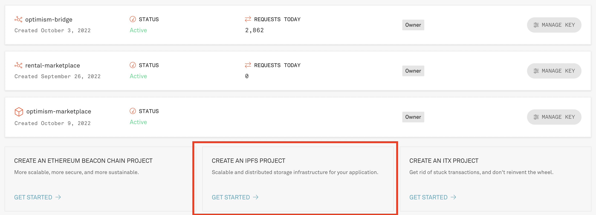

# Web3 Unleashed: Build a NFT Rental Marketplace Part 2

Written by [Emily Lin](https://twitter.com/_emjlin)

Last updated 11/10/2022

## Overview 

In episode 2 and 4, we created a [rentable NFT](https://trufflesuite.com/guides/rentable-nft/) and wrote a [rental marketplace smart contract](https://trufflesuite.com/guides/nft-rental-marketplace/) to interact with it! If you haven't gone through those two tutorials, they are prerequisites for completing this one.

In this guide, we'll create the frontend for the rental marketplace. Specifically, we will cover:

1. Writing a frontend for minting, listing, renting, and viewing NFTs in React
2. Using Infura's NFT API to query for all of a user's NFTs
3. Using an IPFS gateway to upload NFT metadata
4. Using `web3.js` to call our smart contract functions

<iframe width="560" height="315" src="https://www.youtube.com/embed/-6U-MVJTDX8" title="YouTube video player" frameborder="0" allow="accelerometer; autoplay; clipboard-write; encrypted-media; gyroscope; picture-in-picture" allowfullscreen></iframe>

Watch the livestream on [YouTube](https://youtu.be/LJGCkYC2ZCE) for a more in-depth walkthrough!

The completed code lives [here](https://github.com/trufflesuite/unleashed_nft_rental_marketplace/tree/front).

NOTE: It is assumed you have familiarity with React.js. This tutorial is meant to illustrate how to interact with your smart contracts with Web3js, use Infura's NFT API for querying NFTs, and uploading metadata through the IPFS gateway - NOT teach you the fundamentals of JavaScript or React development.

## Download System Requirements

You'll need to install:

- [Node.js](https://nodejs.org/en/), v14 or higher
- [truffle](https://trufflesuite.com/docs/truffle/getting-started/installation/)
- [ganache CLI](https://github.com/trufflesuite/ganache)

## Create an Infura account and project

To connect your DApp to Ethereum mainnet and testnets, you'll need an Infura account. Sign up for an account [here](https://infura.io/register?utm_source=truffle&utm_medium=webinar&utm_campaign=2022_Aug_unleashed-rentable-nft_tutorial_content).

Once you're signed in, create a project! Let's call it `rentable-nft-marketplace`, and select Web3 API from the dropdown

## Create an Infura IPFS project

You'll need Infura IPFS account and dedicated gateway to upload your NFT metadata. To create a IPFS project, select create IPFS project.



Then, you'll need to create a unique gateway name. In this project, we'll call it `rental-marketplace`. You will need to give your own dedicated gateway with its own unique name.


## Register for a MetaMask wallet

To interact with your DApp in the browser, you'll need a MetaMask wallet. You can download it and create one [here](https://metamask.io/download/?utm_source=truffle&utm_medium=webinar&utm_campaign=2022_Aug_unleashed-rentable-nft_tutorial_content).

## Download VS Code

Feel free to use whatever IDE you want, but we highly recommend using VS Code! You can run through most of this tutorial using the Truffle extension to create, build, and deploy your smart contracts, all without using the CLI! You can read more about it [here](https://trufflesuite.com/blog/build-on-web3-with-truffle-vs-code-extension/).

## Get Some Test Eth

In order to deploy to the public testnets, you'll need some test Eth to cover your gas fees! [Paradigm](https://faucet.paradigm.xyz/) has a great MultiFaucet that deposits funds across 8 different networks all at once.

## Set Up Your Project

There's a lot of code to go over, so rather than build it piece by piece, go ahead and just clone the completed code [here](https://github.com/trufflesuite/unleashed_nft_rental_marketplace/tree/front). Now, we'll go over the high level overview of the project structure, and the key components of how the frontend communicates with the smart contracts we had written before!

After cloning the project, you'll need to install the dependencies:

```shell
cd unleashed_nft_rental_marketplace/truffle
npm i
cd ../client
npm i
```

In order to utilize the NFT API, we'll need to create `env.json` to store the necessary keys:

```shell
cp ./src/env.example.json ./src/env.json
```

Then, add your Infura project id, secret, wallet private key, and IPFS subdomain to `env.json`. The IPFS subdomain should be the UNIQUE SUBDOMAIN NAME you chose, not the full URL.

NOTE: Set `infuraSdk.active` in `env.json` to false if you are using a ganache instance to test. In this tutorial, we'll be doing everything on goerli.

## `client/src/contexts`

This folder includes all the files that provide the necessary information to interact with the blockchain.

### `client/src/contexts/EthContext/EthProvider.jsx`

`EthContext` contains the code that allows you to connect to the blockchain. Specifically, `EthProvider.jsx`...

1. Retrieves the contract abis you will be interacting with

    ```javascript
    useEffect(() => {
      const tryInit = () => {
        try {
          const artifacts = {
            RentableNft: require("../../contracts/RentableNft.json"),
            Marketplace: require("../../contracts/Marketplace.json")
          };
          init(artifacts);
        } catch (err) {
          console.error(err);
        }
      };

      tryInit();
    }, [init]);
    ```

2. Creates an instance of `web3` to retrieve the current network and account information

    ```javascript
    const web3 = new Web3(Web3.givenProvider || "ws://localhost:8545");
    const accounts = await web3.eth.requestAccounts();
    const networkID = await web3.eth.net.getId();
    ```

3. Gets the contract abstraction associated with the currently connected network

    ```javascript
    try {
      for (const [contractName, artifact] of Object.entries(artifacts)) {
        const address = artifact.networks[networkID].address;
        const contract = new web3.eth.Contract(artifact.abi, address);
        contracts[contractName] = contract;
      }
    } catch (err) {
      contracts = null;
      console.error(err);
    }
    ```

4. Updates contracts when the account or network is changed

    ```javascript
    useEffect(() => {
      const events = ["chainChanged", "accountsChanged"];
      const handleChange = () => {
        init(state.artifacts);
      };

      events.forEach(e => window.ethereum.on(e, handleChange));
      return () => {
        events.forEach(e => window.ethereum.removeListener(e, handleChange));
      };
    }, [init, state.artifacts]);
    ```

    MetaMask injects a global API at `window.ethereum`. This API allows websites to request users' Ethereum accounts, read data from blockchains the user is connected to, and suggest that the user sign messages and transactions.

    `window.ethereum.on` will detect if the network or account has changed and re-initialize `web3`, `accounts`, `networkID`, and `contracts`. As detailed in the [MetaMask docs](https://docs.metamask.io/guide/ethereum-provider.html#events), we should remove the event listener.

### `client/src/contexts/InfuraContext/index.js`

We are utilizing Infura's NFT API to get the user's owned NFTs. This file instantiates the necessary objects to do so: `Auth` and `sdk`. Stepping through the code:

1. An `Auth` object is created with your Infura project id, secret, and wallet private key that you added to `env.json` during project set up

    ```javascript
    const auth = new Auth(env.infuraSdk.authOptions);
    ```

2. We check whether or not we are using ganache, set up the SDK so that we can call the NFT API, and get a `web3` and `artifacts` instance from `EthContext` as we had covered just above.

    ```javascript
    const { active } = env.infuraSdk;
    const [sdk, _setSdk] = useState(new SDK(auth));
    const {
      state: { web3, artifacts, networkID },
    } = useEth();
    ```

3. Then, we want to get all the NFTs that are owned by the current user and fulfill the rentable criteria.

    ```javascript
    const getOwnedRentableNfts = async (publicAddress) => {
      const { assets } = await sdk.getNFTs({
        publicAddress,
        includeMetadata: true,
      });

      const filtered = [];

      for (const asset of assets) {
        if (await contracts.Marketplace.methods.isRentableNFT(asset.contract).call()) {
          filtered.push(asset);
        }
      }

      return filtered;
    };
    ```

    To break this down further,

    ```javascript
    const { assets } = await sdk.getNFTs({
      publicAddress,
      includeMetadata: true,
    });
    ```

    `sdk.getNFTs` retrieves all the NFTs and metadata of `publicAddress`.

    ```javascript
    if (await contracts.Marketplace.methods.isRentableNFT(asset.contract).call()) {
      filtered.push(asset);
    }
    ```   

    `contracts.Marketplace.methods.isRentableNFT` is how we call the `isRentableNFT` function on the smart contract. Note that we got the `contracts.Marketplace` abstract by using the `EthProvider` through `useEth()` like so:

    ```javascript
    const {
      state: { contracts },
    } = useEth();
    ```

### `client/src/contexts/MarketplaceContext/index.js`

This file aggregates and updates the data for displaying an NFT:

1. `updateListings` is called whenever an NFT is listed, unlisted, or rented. It gets the image to be displayed by calling using the `tokenURI` function from the NFT smart contract

    ```javascript
    const nftContract = new web3.eth.Contract(
      artifacts.RentableNft.abi, nftContractAddress
    );
    const tokenUri = await nftContract.methods.tokenURI(tokenId).call();
    let tokenUriRes;
    try {
      tokenUriRes = await (await fetch(getIpfsGatewayUri(tokenUri))).json();
    } catch (err) {
      console.error("Bad uri");
    }
    ```

    After resolving the image data, `updateListings` will transform all the variables into the correct type (i.e., use `parseInt` to convert `pricePerDay` from a `string` to an `int`). The final `updateListings` looks like this:

    ```javascript
    const updateListings = useCallback(
      async () => {
        if (marketplaceContract) {
          const res = await marketplaceContract.methods.getAllListings().call();

          const listingsExtendedTransformed = {};

          const listingsExtended = await Promise.all(
            res.map(async listing => {
              const {
                nftContract: nftContractAddress,
                pricePerDay: pricePerDayStr,
                startDateUNIX: startDateUnixStr,
                endDateUNIX: endDateUnixStr,
                expires: expiresStr,
                tokenId,
                owner,
                user
              } = listing;
              const nftContract = new web3.eth.Contract(
                artifacts.RentableNft.abi, nftContractAddress
              );
              const tokenUri = await nftContract.methods.tokenURI(tokenId).call();
              let tokenUriRes;
              try {
                tokenUriRes = await (await fetch(getIpfsGatewayUri(tokenUri))).json();
              } catch (err) {
                console.error("Bad uri");
              }
              // const noUser = parseInt(user) !== 0;
              const pricePerDay = parseInt(pricePerDayStr);
              const startDateUnix = parseInt(startDateUnixStr);
              const endDateUnix = parseInt(endDateUnixStr);
              const duration = endDateUnix - startDateUnix;
              const expires = parseInt(expiresStr);
              const isOwner = owner === accounts[0];
              const isUser = user === accounts[0];
              const transformedData = {
                pricePerDay,
                startDateUnix,
                endDateUnix,
                duration,
                expires,
                user
              };
              const listingExtended = {
                ...listing,
                ...transformedData,
                nftContractAddress,
                tokenUri,
                tokenUriRes,
                isOwner,
                isUser
              };
              [
                ...Array(8).keys(),
                "nftContract",
                "startDateUNIX",
                "endDateUNIX",
              ].forEach(i => void delete listingExtended[i]);

              if (listingsExtendedTransformed[nftContractAddress]) {
                listingsExtendedTransformed[nftContractAddress][tokenId] = transformedData;
              } else {
                listingsExtendedTransformed[nftContractAddress] = { [tokenId]: transformedData };
              }

              return listingExtended;
            })
          );

          setListings(listingsExtended);
          setListingsTransformed(listingsExtendedTransformed);
        }
      },
      [
        marketplaceContract,
        web3?.eth.Contract,
        artifacts?.RentableNft.abi,
        accounts
      ]
    );
    ```

2. `updateOwnedTokens` is called whenever a new NFT is minted to update your owned tokens.

    It does this in two parts. First, it checks `infura.active` to see if we are using the Infura NFT SDK, which we would use if we were on a public testnet or mainnet. If so, we call `getOwnedRentableNfts` to retrieve all of user's NFTs and filter based on rentability.

    ```javascript
    if (infura.active) {
      // Option 1 - Use infura nft sdk
      if (accounts && listingsTransformed) {
        const res = await infura.getOwnedRentableNfts(accounts[0]);
        const tokens = await Promise.all(
          res.map(async ele => {
            return {
              nftContractAddress: ele.contract,
              tokenId: ele.tokenId,
              tokenUriRes: ele.metadata,
              listingData: listingsTransformed[ele.contract]?.[ele.tokenId]
            }
          })
        )
        setOwnedTokens(tokens);
      }
    }
    ```

    Otherwise, we're on ganache, our local test chain, and we will retrieve NFTs based on events emmitted. Specifically, we will track `Transfer`, which is an event emmitted when calling OpenZeppelin's `mint` function on their `ERC721` contract. Then, we will construct a token by creating a dictionary of the necessary values (`nftContractAddress`, `tokenId`, `tokenUri`, etc).

    ```javascript
    if (rentableNftContract && listingsTransformed) {
      const { address: nftContractAddress } = rentableNftContract.options;
      // This only checks `rentableNftContract`. 
      const mintEvents = await rentableNftContract.getPastEvents("Transfer", {
        filter: {
          from: "0x0000000000000000000000000000000000000000",
          to: accounts[0]
        },
        fromBlock: 0
      });
      const tokens = await Promise.all(
        mintEvents.map(async mintEvent => {
          const { tokenId } = mintEvent.returnValues;
          const tokenUri = await rentableNftContract.methods.tokenURI(tokenId).call();
          let tokenUriRes;
          try {
            tokenUriRes = await (await fetch(getIpfsGatewayUri(tokenUri))).json();
          } catch (err) {
            console.error("Bad uri");
          }
          return {
            nftContractAddress,
            tokenId,
            tokenUri,
            tokenUriRes,
            listingData: listingsTransformed[nftContractAddress]?.[tokenId]
          };
        })
      );
      setOwnedTokens(tokens);
    }
    ```

    The final code looks like this:

    ```javascript
    const updateOwnedTokens = useCallback(
      async () => {
        if (infura.active) {
          // Option 1 - Use infura nft sdk
          if (accounts && listingsTransformed) {
            const res = await infura.getOwnedRentableNfts(accounts[0]);
            const tokens = await Promise.all(
              res.map(async ele => {
                return {
                  nftContractAddress: ele.contract,
                  tokenId: ele.tokenId,
                  tokenUriRes: ele.metadata,
                  listingData: listingsTransformed[ele.contract]?.[ele.tokenId]
                }
              })
            )
            setOwnedTokens(tokens);
          }
        } else {
          // Option - 2 - Use contract events
          // This is useful when using local network (ganache) or network otherwise unsupported
          // docs.infura.io/infura/infura-custom-apis/nft-sdk/supported-networks
          if (rentableNftContract && listingsTransformed) {
            const { address: nftContractAddress } = rentableNftContract.options;
            // This only checks `rentableNftContract`. 
            const mintEvents = await rentableNftContract.getPastEvents("Transfer", {
              filter: {
                from: "0x0000000000000000000000000000000000000000",
                to: accounts[0]
              },
              fromBlock: 0
            });
            const tokens = await Promise.all(
              mintEvents.map(async mintEvent => {
                const { tokenId } = mintEvent.returnValues;
                const tokenUri = await rentableNftContract.methods.tokenURI(tokenId).call();
                let tokenUriRes;
                try {
                  tokenUriRes = await (await fetch(getIpfsGatewayUri(tokenUri))).json();
                } catch (err) {
                  console.error("Bad uri");
                }
                return {
                  nftContractAddress,
                  tokenId,
                  tokenUri,
                  tokenUriRes,
                  listingData: listingsTransformed[nftContractAddress]?.[tokenId]
                };
              })
            );
            setOwnedTokens(tokens);
          }
        }
      },
      [
        rentableNftContract,
        listingsTransformed,
        accounts,
        infura.getOwnedRentableNfts
      ]);
    ```

3. `mint` does exactly what it sounds like it does: mint an NFT! In order to call a function causes a change, we use `.send()` instead of `call()`. In this case, the caller of `mint` is the active account, which is indicated by `from: accounts[0]`. 

    ```javascript
    const mint = async (tokenUri) => {
      const tx = await rentableNftContract.methods.mint(tokenUri).send({ from: accounts[0] });
      if (tx.status) await updateOwnedTokens();
    };
    ```

4. `list` lists the NFT and also collects the listing fee required to do so. As you can see, we add `value: listingFee`, which will prompt the user to pay the `listingFee` when signing the transaction.

    ```javascript
    const list = async (nftContractAddress, tokenId, price, duration) => {
    // Time values are in seconds
    const buffer = 30;
    const start = Math.ceil(Date.now() / 1000) + buffer;
    const end = start + duration;
    const listingFee = await marketplaceContract.methods.getListingFee().call();
    const tx = await marketplaceContract.methods.listNFT(
      nftContractAddress,
      tokenId,
      price,
      start,
      end
    ).send({
      from: accounts[0],
      value: listingFee
    });
    if (tx.status) await updateListings();
    };
    ```

5. `unlist` is called by the owner of the NFT to take down the listing. It calculates the refund to give if the NFT was currently being rented.

    ```javascript
    const unlist = async (nftContractAddress, tokenId) => {
      const nftContract = new web3.eth.Contract(
        artifacts.RentableNft.abi, nftContractAddress
      );
      const expires = parseInt(await nftContract.methods.userExpires(tokenId).call());
      const { pricePerDay } = listingsTransformed[nftContractAddress][tokenId];
      const refund = Math.ceil((expires - Date.now() / 1000) / 60 / 60 / 24 + 1) * pricePerDay;
      const options = { from: accounts[0], value: Math.max(0, refund) };
      const tx = await marketplaceContract.methods.unlistNFT(nftContractAddress, tokenId).send(options);
      if (tx.status) await updateListings();
    };
    ```

6. `rent` is our final action! This allows users to rent available NFTs.

    ```javascript
    const rent = async (nftContractAddress, tokenId, duration) => {
      const { pricePerDay } = listingsTransformed[nftContractAddress][tokenId];
      const now = Math.ceil(Date.now() / 1000);
      const expires = now + duration;
      const numDays = (expires - now) / 60 / 60 / 24 + 1;
      const fee = Math.ceil(numDays * pricePerDay);
      const options = { from: accounts[0], value: fee };
      const tx = await marketplaceContract.methods.rentNFT(nftContractAddress, tokenId, expires).send(options);
      if (tx.status) await updateListings();
    };
    ```

### `client/src/contexts/TimeContext/index.js`

This file just helps manage all the math we have to do with regards to calculate rental times.

## `client/src/card`

This folder contains all the code for formatting and interacting with your owned, rented, and listed NFTs. It utilizes functions we defined in the `context` files we went over above.

## `client/layout` `client/market` `client/owned` `client/rented`

These folders contain the code for setting up the layout of what each page will look like.

## `client/utils/index.js`

This file lays out some common utility functions - namely around formatting and time math. You'll note that this is where we do the string manipulation of our IPFS urls to fetch the data for displaying the NFTs.

```javascript
export const IPFS_GATEWAY = `https://${env.infura.ipfs.subdomain}.infura-ipfs.io/ipfs/`;

export function isIpfsUri(uri) {
  return uri.match(/^ipfs:\/\//);
}

export function getIpfsGatewayUri(uri) {
  if (typeof uri === "string") {
    const ipfsAddress = uri.replace(/^ipfs:\/\//i, "");
    return `${IPFS_GATEWAY}${ipfsAddress}`;
  }
}
```

## Future Extensions

After this, you've built a full stack dapp! This marketplace has a LOT of functionality, however, retrieving your smart contract abstractions and interacting with them is easy with `Web3.js`. The bulk of the work is just your classic flavor of frontend web development. If you want to interact with a much simpler marketplace frontend that uses `Next.js`, check out our NFT Marketplace on Optimism [here](https://trufflesuite.com/guides/nft-marketplace/).

Next episode we'll be covering Web3 Communication with Push Protocol - namely, how to add notifications to your dapp!

If you want to talk about this content, join our [Discord](https://discord.com/invite/hYpHRjK)! If you need help coding, start a discussion [here](https://github.com/orgs/trufflesuite/discussions/). Lastly, don't forget to follow us on [Twitter](https://twitter.com/trufflesuite) for the latest updates on all things Truffle.