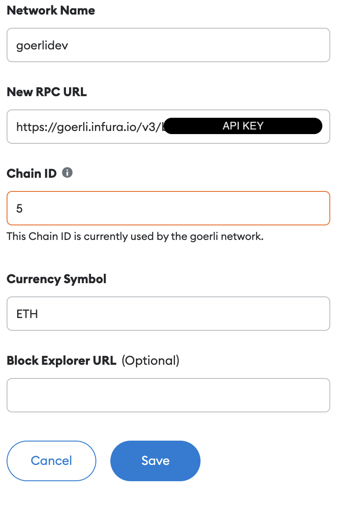
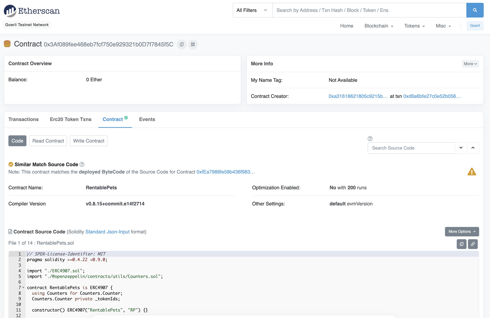

# Web3 Unleashed: Build a NFT Rental Marketplace Part 1

Written by [Emily Lin](https://twitter.com/_emjlin)

Last updated 9/15/2022

## Overview 

In episode 2, we covered rentable NFTs (see the tutorial [here](https://trufflesuite.com/guides/rentable-nft/)). Please go over this beforehand for an explanation of that code.

In this guide, we'll create a rental marketplace that will allow users to list and rent rentable NFTs! Specifically, we'll cover:

1. Starting a project using the Truffle React box to prepare for building a frontend in part 2
2. Writing a rental marketplace contract that will interact with rentable NFTs
3. Deploying contracts that are dependent on each other
4. Writing tests
5. Verifying the `RentablePets` contract using [truffle-plugin-verify](https://github.com/rkalis/truffle-plugin-verify) on Goerli Etherscan
6. Using Ganache forking and unlocking your MetaMask account locally to test the marketplace contract with already deployed contracts
7. Writing Truffle scripts for fast testing

<iframe width="560" height="315" src="https://www.youtube.com/embed/LJGCkYC2ZCE" title="YouTube video player" frameborder="0" allow="accelerometer; autoplay; clipboard-write; encrypted-media; gyroscope; picture-in-picture" allowfullscreen></iframe>

Watch the livestream on [YouTube](https://youtu.be/LJGCkYC2ZCE) for a more in-depth walkthrough with advanced debugging examples!

The completed code lives [here](https://github.com/trufflesuite/unleashed_rentable_nft).

## Download System Requirements

You'll need to install:

- [Node.js](https://nodejs.org/en/), v12 or higher
- [truffle](https://trufflesuite.com/docs/truffle/getting-started/installation/?utm_source=blog&utm_medium=post&utm_campaign=2022_May_truffle-blog-nft-marketplace_acquisition_content)
- [ganache CLI](https://github.com/trufflesuite/ganache)

## Create an Infura account and project

To connect your DApp to Ethereum mainnet and testnets, you'll need an Infura account. Sign up for an account [here](https://infura.io/register?utm_source=truffle&utm_medium=webinar&utm_campaign=2022_Aug_unleashed-rentable-nft_tutorial_content).

Once you're signed in, create a project! Let's call it `rentable-nft`, and select Web3 API from the dropdown

## Register for a MetaMask wallet

To interact with your DApp in the browser, you'll need a MetaMask wallet. You can download it and create one [here](https://metamask.io/download/?utm_source=truffle&utm_medium=webinar&utm_campaign=2022_Aug_unleashed-rentable-nft_tutorial_content).

## Download VS Code

Feel free to use whatever IDE you want, but we highly recommend using VS Code! You can run through most of this tutorial using the Truffle extension to create, build, and deploy your smart contracts, all without using the CLI! You can read more about it [here](https://trufflesuite.com/blog/build-on-web3-with-truffle-vs-code-extension/).

## Get Some Test Eth

In order to deploy to the public testnets, you'll need some test Eth to cover your gas fees! [Paradigm](https://faucet.paradigm.xyz/) has a great MultiFaucet that deposits funds across 8 different networks all at once.

## Set Up Your Project

Since the end goal is a full stack rental marketplace, we'll be starting with [Truffle's React Box](https://github.com/truffle-box/react-box)!

```shell
truffle unbox react rental_marketplace
cd rental_marketplace
```

Your file structure should look something like this:

```shell
├── LICENSE
├── README.md
├── client
│   ├── README.md
│   ├── node_modules
│   ├── package-lock.json
│   ├── package.json
│   ├── public
│   └── src
└── truffle
    ├── contracts
    ├── migrations
    ├── package-lock.json
    ├── package.json
    ├── scripts
    ├── test
    └── truffle-config.js
```

We'll only be working with contracts, so hop into the `truffle` directory. We'll also be using OpenZeppelin's base contracts and test helpers, so let's install that now too.

```shell
cd truffle
npm i @openzeppelin/contracts
npm i -D @openzeppelin/test-helpers
```

## Copy over the rentable NFT Contracts

Our marketplace will only allow NFTs that fulfill the ERC4907 standard to be listed, so we will also provide users a way to mint their own rentable NFTs. To do so, copy over the contracts we created in the second episode of Web3 Unleashed and delete the existing `SimpleStorage` contract from the box:

- [`IERC4907`](https://github.com/trufflesuite/unleashed_rentable_nft/blob/main/contracts/IERC4907.sol)
- [`ERC4907`](https://github.com/trufflesuite/unleashed_rentable_nft/blob/main/contracts/ERC4907.sol)
- [`RentablePets`](https://github.com/trufflesuite/unleashed_rentable_nft/blob/main/contracts/RentablePets.sol)

Also copy:

- [`test_rentable_pets.js`](https://github.com/trufflesuite/unleashed_rentable_nft/blob/main/test/test_rentable_pets.js)
- [`1_deploy_contracts.js`](https://github.com/trufflesuite/unleashed_rentable_nft/blob/main/migrations/1_deploy_contracts.js)

Also, since we are providing a generic rentable NFT for users to mint, let's rename `RentablePets.sol` to `RentableNft.sol`, and change all occurrences of `RentablePets` to `RentableNft` in the contract, migration, and test!

Your file structure should look like this:

```shell
├── contracts
│   ├── ERC4907.sol
│   ├── IERC4907.sol
│   └── RentableNft.sol
├── migrations
│   └── 1_deploy_simple_storage.js
├── package-lock.json
├── package.json
├── scripts
│   └── increment.js
├── test
│   └── test_rentable_nft.js
└── truffle-config.js
```

Quickly run a `truffle test` to see if everything was set up correctly.

## Write the Marketplace Smart Contract

With that out of the way, let's get started on our marketplace smart contract! Create a new contract called `Marketplace.sol`:

```shell
truffle create contract Marketplace
```

This contract will be long! It's completed form will look like this:

```javascript
// SPDX-License-Identifier: MIT
pragma solidity >=0.4.22 <0.9.0;

import "@openzeppelin/contracts/utils/structs/EnumerableSet.sol";
import "@openzeppelin/contracts/utils/Counters.sol";
import "@openzeppelin/contracts/interfaces/IERC165.sol";
import "@openzeppelin/contracts/security/ReentrancyGuard.sol";
import "@openzeppelin/contracts/interfaces/IERC721.sol";
import "./IERC4907.sol";

contract Marketplace is ReentrancyGuard {
    using Counters for Counters.Counter;
    using EnumerableSet for EnumerableSet.AddressSet;
    using EnumerableSet for EnumerableSet.UintSet;
    Counters.Counter private _nftsListed;
    address private _marketOwner;
    uint256 private _listingFee = .001 ether;
    // maps contract address to token id to properties of the rental listing
    mapping(address => mapping(uint256 => Listing)) private _listingMap;
    // maps nft contracts to set of the tokens that are listed
    mapping(address => EnumerableSet.UintSet) private _nftContractTokensMap;
    // tracks the nft contracts that have been listed
    EnumerableSet.AddressSet private _nftContracts;
    struct Listing {
        address owner;
        address user;
        address nftContract;
        uint256 tokenId;
        uint256 pricePerDay;
        uint256 startDateUNIX; // when the nft can start being rented
        uint256 endDateUNIX; // when the nft can no longer be rented
        uint256 expires; // when the user can no longer rent it
    }
    event NFTListed(
        address owner,
        address user,
        address nftContract,
        uint256 tokenId,
        uint256 pricePerDay,
        uint256 startDateUNIX,
        uint256 endDateUNIX,
        uint256 expires
    );
    event NFTRented(
        address owner,
        address user,
        address nftContract,
        uint256 tokenId,
        uint256 startDateUNIX,
        uint256 endDateUNIX,
        uint64 expires,
        uint256 rentalFee
    );
    event NFTUnlisted(
        address unlistSender,
        address nftContract,
        uint256 tokenId,
        uint256 refund
    );

    constructor() {
        _marketOwner = msg.sender;
    }

    // function to list NFT for rental
    function listNFT(
        address nftContract,
        uint256 tokenId,
        uint256 pricePerDay,
        uint256 startDateUNIX,
        uint256 endDateUNIX
    ) public payable nonReentrant {
        require(isRentableNFT(nftContract), "Contract is not an ERC4907");
        require(IERC721(nftContract).ownerOf(tokenId) == msg.sender, "Not owner of nft");
        require(msg.value == _listingFee, "Not enough ether for listing fee");
        require(pricePerDay > 0, "Rental price should be greater than 0");
        require(startDateUNIX >= block.timestamp, "Start date cannot be in the past");
        require(endDateUNIX >= startDateUNIX, "End date cannot be before the start date");
        require(_listingMap[nftContract][tokenId].nftContract == address(0), "This NFT has already been listed");
        
        payable(_marketOwner).transfer(_listingFee);
        _listingMap[nftContract][tokenId] = Listing(
            msg.sender,
            address(0),
            nftContract,
            tokenId,
            pricePerDay,
            startDateUNIX,
            endDateUNIX,
            0
        );
        _nftsListed.increment();
        EnumerableSet.add(_nftContractTokensMap[nftContract], tokenId);
        EnumerableSet.add(_nftContracts, nftContract);
        emit NFTListed(
            IERC721(nftContract).ownerOf(tokenId),
            address(0),
            nftContract,
            tokenId,
            pricePerDay,
            startDateUNIX,
            endDateUNIX,
            0
        );
    }
    
    // function to rent NFT
    function rentNFT(
        address nftContract,
        uint256 tokenId,
        uint64 expires
    ) public payable nonReentrant {
        Listing storage listing = _listingMap[nftContract][tokenId];
        require(listing.user == address(0) || block.timestamp > listing.expires, "NFT already rented");
        require(expires <= listing.endDateUNIX, "Rental period exceeds max date rentable");
        // Transfer rental fee
        uint256 numDays = (expires - block.timestamp)/60/60/24 + 1;
        uint256 rentalFee = listing.pricePerDay * numDays;
        require(msg.value >= rentalFee, "Not enough ether to cover rental period");
        payable(listing.owner).transfer(rentalFee);
        // Update listing
        IERC4907(nftContract).setUser(tokenId, msg.sender, expires);
        listing.user = msg.sender;
        listing.expires = expires;

        emit NFTRented(
            IERC721(nftContract).ownerOf(tokenId),
            msg.sender,
            nftContract,
            tokenId,
            listing.startDateUNIX,
            listing.endDateUNIX,
            expires,
            rentalFee
        );
    }

    // function to unlist your rental, refunding the user for any lost time
    function unlistNFT(address nftContract, uint256 tokenId) public payable nonReentrant {
        Listing storage listing = _listingMap[nftContract][tokenId];
        require(listing.owner != address(0), "This NFT is not listed");
        require(listing.owner == msg.sender || _marketOwner == msg.sender , "Not approved to unlist NFT");
        // fee to be returned to user if unlisted before rental period is up
        uint256 refund = ((listing.expires - block.timestamp) / 60 / 60 / 24 + 1) * listing.pricePerDay;
        require(msg.value >= refund, "Not enough ether to cover refund");
        payable(listing.user).transfer(refund);
        // clean up data
        IERC4907(nftContract).setUser(tokenId, address(0), 0);
        EnumerableSet.remove(_nftContractTokensMap[nftContract], tokenId);
        delete _listingMap[nftContract][tokenId];
        if (EnumerableSet.length(_nftContractTokensMap[nftContract]) == 0) {
            EnumerableSet.remove(_nftContracts, nftContract);
        }
        _nftsListed.decrement();

        emit NFTUnlisted(
            msg.sender,
            nftContract,
            tokenId,
            refund
        );
    }

    /* 
     * function to get all listings
     *
     * WARNING: This operation will copy the entire storage to memory, which can be quite expensive. This is designed
     * to mostly be used by view accessors that are queried without any gas fees. Developers should keep in mind that
     * this function has an unbounded cost, and using it as part of a state-changing function may render the function
     * uncallable if the set grows to a point where copying to memory consumes too much gas to fit in a block.
     */
    function getAllListings() public view returns (Listing[] memory) {
        Listing[] memory listings = new Listing[](_nftsListed.current());
        uint256 listingsIndex = 0;
        address[] memory nftContracts = EnumerableSet.values(_nftContracts);
        for (uint i = 0; i < nftContracts.length; i++) {
            address nftAddress = nftContracts[i];
            uint256[] memory tokens = EnumerableSet.values(_nftContractTokensMap[nftAddress]);
            for (uint j = 0; j < tokens.length; j++) {
                listings[listingsIndex] = _listingMap[nftAddress][tokens[j]];
                listingsIndex++;
            }
        }
        return listings;
    }

    function getListingFee() public view returns (uint256) {
        return _listingFee;
    }

    function isRentableNFT(address nftContract) public view returns (bool) {
        bool _isRentable = false;
        bool _isNFT = false;
        try IERC165(nftContract).supportsInterface(type(IERC4907).interfaceId) returns (bool rentable) {
            _isRentable = rentable;
        } catch {
            return false;
        }
        try IERC165(nftContract).supportsInterface(type(IERC721).interfaceId) returns (bool nft) {
            _isNFT = nft;
        } catch {
            return false;
        }
        return _isRentable && _isNFT;
    }
}
```

Let's walk through the code piece by piece!

### Imports

```javascript
import "@openzeppelin/contracts/utils/structs/EnumerableSet.sol";
import "@openzeppelin/contracts/utils/Counters.sol";
import "@openzeppelin/contracts/interfaces/IERC165.sol";
import "@openzeppelin/contracts/security/ReentrancyGuard.sol";
import "@openzeppelin/contracts/interfaces/IERC721.sol";
import "./IERC4907.sol";
```

If you followed our [guide in episode 2](https://trufflesuite.com/guides/rentable-nft/), you should be familiar with the `Counters`, `IERC165`, `IERC721`, and `IERC4907`, and `Counters` contracts. We're using two new ones here:

- [`EnumerableSet`](https://docs.openzeppelin.com/contracts/3.x/api/utils#EnumerableSet) is a nifty utility contract that will help us with storing our rental listings
- [`ReentrancyGuard`](https://docs.openzeppelin.com/contracts/4.x/api/security#ReentrancyGuard) is a contract we can inherit to protect our contract from [reentrancy attacks](https://hackernoon.com/hack-solidity-reentrancy-attack) since we will be transferring ETHer between accounts

In order to use `ReentrancyGuard`, we want `Marketplace` to inherit `ReentrancyGuard`:

```javascript
contract Marketplace is ReentrancyGuard {
```

### Contract Variables

```javascript
using Counters for Counters.Counter;
using EnumerableSet for EnumerableSet.AddressSet;
using EnumerableSet for EnumerableSet.UintSet;
```

This is just syntactic sugar for using these contracts. You can read more about it [here](https://docs.soliditylang.org/en/v0.8.14/contracts.html#using-for).

```javascript
address private _marketOwner;
uint256 private _listingFee = .001 ether;
```

In our marketplace, we want to pass a listing fee to the owner of the marketplace contract any time a NFT rental is listed.

```javascript
Counters.Counter private _nftsListed;
// maps contract address to token id to properties of the rental listing
mapping(address => mapping(uint256 => Listing)) private _listingMap;
// maps nft contracts to set of the tokens that are listed
mapping(address => EnumerableSet.UintSet) private _nftContractTokensMap;
// tracks the nft contracts that have been listed
EnumerableSet.AddressSet private _nftContracts;
```

This next set of code is for how we are storing the listing data. Solidity doesn't allow for map iterability, so we have to do some creative workarounds here. Namely, we store the keys we would iterate over in OpenZeppelin's `EnumerableSet`. How it is used will become more obvious when we go over `getAllListings`.

- `_nftsListed` simply tracks how many nfts are currently listed.
- `_listingMap` is a map of maps that will give us listing information for a specific tokenId in an NFT contract.
- `_nftContractTokensMap` will tell us all the tokenIds listed from a particular NFT contract.
- `_nftContracts` is a set of all the NFT contracts that have been listed.

```javascript
struct Listing {
    address owner;
    address user;
    address nftContract;
    uint256 tokenId;
    uint256 pricePerDay;
    uint256 startDateUNIX; // when the nft can start being rented
    uint256 endDateUNIX; // when the nft can no longer be rented
    uint256 expires; // when the user can no longer rent it
}
event NFTListed(
    address owner,
    address user,
    address nftContract,
    uint256 tokenId,
    uint256 pricePerDay,
    uint256 startDateUNIX,
    uint256 endDateUNIX,
    uint256 expires
);
event NFTRented(
    address owner,
    address user,
    address nftContract,
    uint256 tokenId,
    uint256 startDateUNIX,
    uint256 endDateUNIX,
    uint64 expires,
    uint256 rentalFee
);
event NFTUnlisted(
    address unlistSender,
    address nftContract,
    uint256 tokenId,
    uint256 refund
);
```

These last variables are just the data we want to store and emit about a particular listing. Specifically:

- `owner` is the address of the token owner
- `user` is the address of the `user` (i.e., renter). If there is none, it is the zero address
- `nftContract` is the NFT contract address (i.e., the NFT collection)
- `tokenId` is the tokenId of the listed NFT within the NFT collection
- `pricePerDay` is how much wei it costs to rent the NFT for one day
- `startDateUNIX` is the UNIX timestamp for when the NFT is ready to be rented
- `endDateUNIX` is the UNIX timestamp for when the NFT should no longer be rentable
- `expires` is when the rental period for a user will end. If there is no renter, this is 0
- `rentalFee` is how much it costed to rent the NFT
- `refund` is for when the owner decides to unlist their NFT while someone is still renting it. In this case, the owner must refund the user however many days before the rental period was supposed to end.

### Modify the Marketplace Constructor

Since we want to pass a listing fee to the marketplace owner whenever an NFT is listed, we'll need to store that information upon deployment. Modify the constructor as follows:

```javascript
constructor() {
    _marketOwner = msg.sender;
}
```

### Write listNFT()

```javascript
// function to list NFT for rental
function listNFT(
    address nftContract,
    uint256 tokenId,
    uint256 pricePerDay,
    uint256 startDateUNIX,
    uint256 endDateUNIX
) public payable nonReentrant {
    require(isRentableNFT(nftContract), "Contract is not an ERC4907");
    require(IERC721(nftContract).ownerOf(tokenId) == msg.sender, "Not owner of nft");
    require(msg.value == _listingFee, "Not enough ether for listing fee");
    require(pricePerDay > 0, "Rental price should be greater than 0");
    require(startDateUNIX >= block.timestamp, "Start date cannot be in the past");
    require(endDateUNIX >= startDateUNIX, "End date cannot be before the start date");
    require(_listingMap[nftContract][tokenId].nftContract == address(0), "This NFT has already been listed");
    
    payable(_marketOwner).transfer(_listingFee);
    _listingMap[nftContract][tokenId] = Listing(
        msg.sender,
        address(0),
        nftContract,
        tokenId,
        pricePerDay,
        startDateUNIX,
        endDateUNIX,
        0
    );
    _nftsListed.increment();
    EnumerableSet.add(_nftContractTokensMap[nftContract], tokenId);
    EnumerableSet.add(_nftContracts, nftContract);
    emit NFTListed(
        IERC721(nftContract).ownerOf(tokenId),
        address(0),
        nftContract,
        tokenId,
        pricePerDay,
        startDateUNIX,
        endDateUNIX,
        0
    );
}
```

`listNFT` requires that:

- the NFT is ERC4907 and ERC721 compliant
- the owner of the NFT is listing it
- the listing properties (i.e. price, start date, end date) are valid values
- the owner has enough ETH to cover the listing fee
- the NFT has not already been listed

We create a helper method `isRentableNFT` to check for the token standard compliance:

```javascript
function isRentableNFT(address nftContract) public view returns (bool) {
    bool _isRentable = false;
    bool _isNFT = false;
    try IERC165(nftContract).supportsInterface(type(IERC4907).interfaceId) returns (bool rentable) {
        _isRentable = rentable;
    } catch {
        return false;
    }
    try IERC165(nftContract).supportsInterface(type(IERC721).interfaceId) returns (bool nft) {
        _isNFT = nft;
    } catch {
        return false;
    }
    return _isRentable && _isNFT;
}
```

In particular, we check using Solidity's `try catch` syntax, since it is possible that the contract passed in does not support the ERC165 standard either. In that case, we want to gracefully fail and exit.

This method is public because we intend to call it in our frontend later to check for NFT validity.

Finally, `listNFT` simply transfers the listing fee over to the marketplace owner, and stores the relevant listing info. Note that the user is first set to the zero address and expires is set to 0 since no one has rented the NFT yet.

Do notice that we marked the function as `nonReentrant`, which is a modifier inherited from `ReentrancyGuard` to protect against reentrancy attacks, and `payable`, which ensures the function can send and receive ETH.

### Write rentNFT()

```javascript
// function to rent an NFT
function rentNFT(
    address nftContract,
    uint256 tokenId,
    uint64 expires
) public payable nonReentrant {
    Listing storage listing = _listingMap[nftContract][tokenId];
    require(listing.user == address(0), "NFT already rented");
    require(expires <= listing.endDateUNIX, "Rental period exceeds max date rentable");
    // Transfer rental fee
    uint256 numDays = (expires - block.timestamp)/60/60/24 + 1;
    uint256 rentalFee = listing.pricePerDay * numDays;
    require(msg.value >= rentalFee, "Not enough ether to cover rental period");
    payable(listing.owner).transfer(rentalFee);
    // Update listing
    IERC4907(nftContract).setUser(tokenId, msg.sender, expires);
    listing.user = msg.sender;
    listing.expires = expires;

    emit NFTRented(
        IERC721(nftContract).ownerOf(tokenId),
        msg.sender,
        nftContract,
        tokenId,
        listing.startDateUNIX,
        listing.endDateUNIX,
        expires,
        rentalFee
    );
}
```

This function handles the actual renting logic! We first grab the listing information and declare it as `storage`, since we want to modify contract state when we edit it. Again, we make some checks beforehand to ensure that the NFT can be rented, and the user has enough ETH to do so.

For this dapp, we assume the rental period starts right away. There is no ability to reserve NFTs later on. To calculate the number of days in a rental period, we add 1, because Solidity rounds down in integer division. After transferring the rental fee, we call `setUser` so that other dapps can check rental information on the NFT.

It is important to note that `setUser` requires that the Marketplace contract has approval to do so (if you recall from the implementation of it in episode 2). When we call this contract method in our dapp, we need to first call the ERC721 `approve` method to give it permission to do so. Otherwise, this transaction will fail.

### Write unlistNFT()

`unlistNFT` allows the owner of the NFT to take down their listing. However, if they choose to do so while an NFT is still being rented, they must refund the user the appropriate amount for the days lost.

```javascript
// function to unlist your rental, refunding the user for any lost time
function unlistNFT(address nftContract, uint256 tokenId) public payable nonReentrant {
    Listing storage listing = _listingMap[nftContract][tokenId];
    require(listing.owner != address(0), "This NFT is not listed");
    require(listing.owner == msg.sender || _marketOwner == msg.sender , "Not approved to unlist NFT");
    // fee to be returned to user if unlisted before rental period is up
    uint256 refund = ((listing.expires - block.timestamp) / 60 / 60 / 24 + 1) * listing.pricePerDay;
    require(msg.value >= refund, "Not enough ether to cover refund");
    payable(listing.user).transfer(refund);
    // clean up data
    IERC4907(nftContract).setUser(tokenId, address(0), 0);
    EnumerableSet.remove(_nftContractTokensMap[nftContract], tokenId);
    delete _listingMap[nftContract][tokenId];
    if (EnumerableSet.length(_nftContractTokensMap[nftContract]) == 0) {
        EnumerableSet.remove(_nftContracts, nftContract);
    }
    _nftsListed.decrement();

    emit NFTUnlisted(
        msg.sender,
        nftContract,
        tokenId,
        refund
    );
}
```

Again, we validate that:

- The NFT is listed
- Only the owner or marketplace owner can unlist an NFT
- Enough ETH is available to refund the user

At the end, we want to clean up our data, which entails:

- Removing the rental info from the NFT
- Removing the NFT from the stored listings

### Write getAllListings()

This function returns all the listings stored, regardless of whether or not the rental period has expired or the time is not within startDateUNIX and endDateUNIX. While this is possible to do in Solidity, this kind of filtering should be handled off-chain to reduce gas costs.

```javascript
/* 
* function to get all listings
*
* WARNING: This operation will copy the entire storage to memory, which can be quite expensive. This is designed
* to mostly be used by view accessors that are queried without any gas fees. Developers should keep in mind that
* this function has an unbounded cost, and using it as part of a state-changing function may render the function
* uncallable if the set grows to a point where copying to memory consumes too much gas to fit in a block.
*/
function getAllListings() public view returns (Listing[] memory) {
    Listing[] memory listings = new Listing[](_nftsListed.current());
    uint256 listingsIndex = 0;
    address[] memory nftContracts = EnumerableSet.values(_nftContracts);
    for (uint i = 0; i < nftContracts.length; i++) {
        address nftAddress = nftContracts[i];
        uint256[] memory tokens = EnumerableSet.values(_nftContractTokensMap[nftAddress]);
        for (uint j = 0; j < tokens.length; j++) {
            listings[listingsIndex] = _listingMap[nftAddress][tokens[j]];
            listingsIndex++;
        }
    }
    return listings;
}
```

As mentioned before, Solidity maps are not iterable. In order to get around it, we store the keys we want to step over in two separate arrays. Given this is an unbounded list, be careful not to call this in the context of a state change. Otherwise, the computational costs could get very high and the transaction would fail due to gas costs.

### Write getListingFee()

Finally, we have a simple helper function to expose the listing fee in our tests and scripts.

```javascript
function getListingFee() public view returns (uint256) {
    return _listingFee;
}
```

## Modify RentableNft

There's actually one last piece we need to handle! For our marketplace smart contract, we want to give it automatic approval for NFTs minted from the `RentableNFT` contract. To do so, we need to pass in the marketplace contract address to `RentableNFT` and set the approval in the mint function. 

Modify the constructor and contract variables in `RentableNft`:

```javascript
contract RentableNft is ERC4907 {
using Counters for Counters.Counter;
address private _marketplaceContract;
Counters.Counter private _tokenIds;

constructor(address marketplaceContract) ERC4907("RentableNft", "RNFT") {
    _marketplaceContract = marketplaceContract;
}
```

Lastly, modify `mint` to set the approval:

```javascript
function mint(string memory _tokenURI) public {
    _tokenIds.increment();
    uint256 newTokenId = _tokenIds.current();
    _safeMint(msg.sender, newTokenId);
    setApprovalForAll(_marketplaceContract, true);
    _setTokenURI(newTokenId, _tokenURI);
}
```

## Modify 1_deploy_contract.js

Now, we need to deploy our Marketplace contract, passing in its address to the RentableNft constructor to set approvals. Your migration file should look like this:

```javascript
const RentableNft = artifacts.require("RentableNft");
const Marketplace = artifacts.require("Marketplace");

module.exports = async function (deployer) {
  await deployer.deploy(Marketplace);
  const marketplace = await Marketplace.deployed();
  await deployer.deploy(RentableNft, marketplace.address);
};
```

## Write Tests

Our marketplace contract is done! Now, it's time to write tests.

```shell
truffle create test TestMarketplace
```

Your completed test should look like this:

```javascript
require("@openzeppelin/test-helpers/configure")({
  provider: web3.currentProvider,
  singletons: {
    abstraction: "truffle",
  },
});

const { balance, constants, ether, expectRevert, expectEvent } = require('@openzeppelin/test-helpers');
const Marketplace = artifacts.require("Marketplace");
const RentableNft = artifacts.require("RentableNft");

const TODAY = Math.floor(Date.now()/1000);
const TODAY_2 = TODAY + (60*60);
const YESTERDAY = TODAY - (24*60*60);
const TOMORROW = TODAY + (24*60*60);
const IN_FIVE_DAYS = TODAY + (24*60*60*5);

function assertListing(actual, expected) {
  assert.equal(actual.owner, expected.owner, "Owner is not correct");
  assert.equal(actual.user, expected.user, "User is not correct");
  assert.equal(actual.nftContract, expected.nftContract, "NFT contract is not correct");
  assert.equal(actual.tokenId, expected.tokenId, "TokenId is not correct");
  assert.equal(actual.pricePerDay, expected.pricePerDay, "Price per day is not correct");
  assert.equal(actual.startDateUNIX, expected.startDateUNIX, "Start date is not correct");
  assert.equal(actual.endDateUNIX, expected.endDateUNIX, "End date is not correct");
  assert.equal(actual.expires, expected.expires, "Expires date is not correct");
}

async function assertNFT(nftContractInstance, tokenId, expectedUser, expectedExpires) {
  let user = await nftContractInstance.userOf.call(tokenId);
  let expires = await nftContractInstance.userExpires.call(tokenId);
  assert.equal(user, expectedUser, "User is not correct");
  assert.equal(expires, expectedExpires, "Expires date is incorrect");
}

// EnumerableSet makes no guarantee about ordering, so we have to find the matching tokenId
function getListing(listings, tokenId) {
  let listing = {};
  listings.every((_listing) => {
    if (_listing.tokenId == tokenId) {
      listing = _listing;
      return false;
    } else {
      return true;
    }
  });
  return listing
}

function listingToString(listing) {
  let listingCopy = {...listing};
  listingCopy.tokenId = listing.tokenId.toString();
  listingCopy.pricePerDay = listing.pricePerDay.toString();
  listingCopy.startDateUNIX = listing.startDateUNIX.toString();
  listingCopy.endDateUNIX = listing.endDateUNIX.toString();
  listingCopy.expires = listing.expires.toString();
  if ("rentalFee" in listing) {
    listingCopy.rentalFee = listing.rentalFee.toString();
  }
}

contract("Marketplace", function (accounts) {
  const MARKETPLACE_OWNER = accounts[0];
  const TOKEN_OWNER = accounts[1];
  const USER = accounts[2];
  let marketplace;
  let rentableNft;
  let nftContract;
  let listingFee;

  before('should reuse variables', async () => {
    marketplace = await Marketplace.deployed();
    rentableNft = await RentableNft.deployed();
    nftContract = rentableNft.address;
    listingFee = (await marketplace.getListingFee()).toString();
    // mint nfts for testing
    await rentableNft.mint("fakeURI", {from: TOKEN_OWNER});
    await rentableNft.mint("fakeURI", {from: TOKEN_OWNER});
    await rentableNft.mint("fakeURI", {from: TOKEN_OWNER});
  });
  it("should list nfts", async function () {
    let tracker = await balance.tracker(MARKETPLACE_OWNER);
    await tracker.get();
    let txn = await marketplace.listNFT(nftContract, 1, ether("1"), TOMORROW, IN_FIVE_DAYS, {from: TOKEN_OWNER, value: listingFee});
    assert.equal(await tracker.delta(), listingFee, "Listing fee not transferred");
    let expectedListing = {
      owner: TOKEN_OWNER,
      user: constants.ZERO_ADDRESS,
      nftContract: nftContract,
      tokenId: 1,
      pricePerDay: ether("1"),
      startDateUNIX: TOMORROW,
      endDateUNIX: IN_FIVE_DAYS,
      expires: 0
    };
    assertListing(getListing(await marketplace.getAllListings.call(), 1), expectedListing);
    expectEvent(txn, "NFTListed", listingToString(expectedListing));
    await tracker.get();
    txn = await marketplace.listNFT(nftContract, 2, ether(".5"), TOMORROW, IN_FIVE_DAYS, {from: TOKEN_OWNER, value: listingFee});
    assert.equal(await tracker.delta(), listingFee, "Listing fee not transferred");
    expectedListing.tokenId = 2;
    expectedListing.pricePerDay = ether(".5");
    expectedListing.startDateUNIX = TOMORROW;
    expectedListing.endDateUNIX = IN_FIVE_DAYS;
    expectedListing.expires = 0;
    assertListing(getListing(await marketplace.getAllListings.call(), 2), expectedListing);
    expectEvent(txn, "NFTListed", listingToString(expectedListing));
  });
  it("should validate listings", async function () {
    await expectRevert(
      marketplace.listNFT(marketplace.address, 1, 1, TOMORROW, IN_FIVE_DAYS, {from: TOKEN_OWNER, value: listingFee}),
      "Contract is not an ERC4907"
    );
    await expectRevert(
      marketplace.listNFT(nftContract, 1, 1, TOMORROW, IN_FIVE_DAYS, {from: accounts[2], value: listingFee}),
      "Not owner of nft"
    );
    await expectRevert(
      marketplace.listNFT(nftContract, 1, 1, TOMORROW, IN_FIVE_DAYS, {from: TOKEN_OWNER}),
      "Not enough ether for listing fee"
    );
    await expectRevert(
      marketplace.listNFT(nftContract, 1, 0, TOMORROW, IN_FIVE_DAYS, {from: TOKEN_OWNER, value: listingFee}),
      "Rental price should be greater than 0"
    );
    await expectRevert(
      marketplace.listNFT(nftContract, 1, 1, YESTERDAY, IN_FIVE_DAYS, {from: TOKEN_OWNER, value: listingFee}),
      "Start date cannot be in the past"
    );
    await expectRevert(
      marketplace.listNFT(nftContract, 1, 1, IN_FIVE_DAYS, YESTERDAY, {from: TOKEN_OWNER, value: listingFee}),
      "End date cannot be before the start date"
    );
    await expectRevert(
      marketplace.listNFT(nftContract, 1, 1, TOMORROW, IN_FIVE_DAYS, {from: TOKEN_OWNER, value: listingFee}),
      "This NFT has already been listed"
    );
  });
  it("should modify listings and nft contract when nft is rented", async function () {
    assertNFT(rentableNft, 1, constants.ZERO_ADDRESS, 0);
    assertNFT(rentableNft, 2, constants.ZERO_ADDRESS, 0);
    let tracker = await balance.tracker(TOKEN_OWNER);
    await tracker.get();
    let txn = await marketplace.rentNFT(nftContract, 1, TODAY_2, {from: USER, value: ether("1")});
    // 1 day rental, pricePerDay is 1
    assert.equal((await tracker.delta()).toString(), ether("1").toString(), "One day rental fee is not correct");
    let listing = getListing(await marketplace.getAllListings.call(), 1);
    let expectedListing = {
      owner: TOKEN_OWNER,
      user: USER,
      nftContract: nftContract,
      tokenId: 1,
      pricePerDay: ether("1"),
      startDateUNIX: TOMORROW,
      endDateUNIX: IN_FIVE_DAYS,
      expires: TODAY_2,
      rentalFee: 1
    };
    assertListing(listing, expectedListing);
    assertNFT(rentableNft, 1, USER, TODAY_2);
    expectEvent(txn, "NFTRented", listingToString(expectedListing));
    await tracker.get();
    txn = await marketplace.rentNFT(nftContract, 2, IN_FIVE_DAYS, {from: USER, value: ether("2.5")});
    assert.equal((await tracker.delta()).toString(), ether("2.5").toString(), "Five day rental fee is not correct");
    listing = getListing(await marketplace.getAllListings.call(), 2);
    expectedListing.tokenId = 2;
    expectedListing.pricePerDay = ether(".5");
    expectedListing.expires = IN_FIVE_DAYS;
    expectedListing.rentalFee = ether("2.5");
    assertListing(listing, expectedListing);
    assertNFT(rentableNft, 2, USER, IN_FIVE_DAYS);
    expectEvent(txn, "NFTRented", listingToString(expectedListing));
  });
  it("should validate rentals", async function () {
    await expectRevert(
      marketplace.rentNFT(nftContract, 1, TODAY_2, {from: USER, value: ether("1")}),
      "NFT already rented"
    );
    await marketplace.listNFT(nftContract, 3, ether("1"), TOMORROW, IN_FIVE_DAYS, {from: TOKEN_OWNER, value: listingFee});
    await expectRevert(
      marketplace.rentNFT(nftContract, 3, IN_FIVE_DAYS + 1000, {from: USER, value: ether("2.5")}),
      "Rental period exceeds max date rentable"
    );
    await expectRevert(
      marketplace.rentNFT(nftContract, 3, TOMORROW, {from: USER}),
      "Not enough ether to cover rental period"
    );
  });
  it("should validate unlisting", async function () {
    await expectRevert(
      marketplace.unlistNFT(nftContract, 4, {from: TOKEN_OWNER, value: ether("2.5")}),
      "This NFT is not listed"
    );
    await expectRevert(
      marketplace.unlistNFT(nftContract, 2, {from: USER, value: ether("2.5")}),
      "Not approved to unlist NFT"
    );
    await expectRevert(
      marketplace.unlistNFT(nftContract, 2, {from: TOKEN_OWNER}),
      "Not enough ether to cover refund"
    );
  });
  it("should refund USER and cleanup listings if unlisted", async function () {
    let tracker = await balance.tracker(USER);
    await tracker.get();
    let txn = await marketplace.unlistNFT(nftContract, 2, {from: TOKEN_OWNER, value: ether("2.5")});
    assert.equal((await tracker.delta()).toString(), ether("2.5"), "Refunded amount is not correct");
    let listing = getListing(await marketplace.getAllListings.call(), 2);
    assert.equal(Object.keys(listing).length, 0, "NFT was not unlisted");
    assertNFT(rentableNft, 2, constants.ZERO_ADDRESS, 0);
    expectEvent(txn, "NFTUnlisted", {
      unlistSender: TOKEN_OWNER,
      nftContract: nftContract,
      tokenId: "2",
      refund: ether("2.5")
    });
  });
});
```

There is a lot to unpack here, so we'll just cover the highlights.

At the top of the file, we declare some constants that will help us write our tests. Additionally, we define helper assertion methods to reduce code duplication in our tests:

- `assertListing` asserts that a Listing object is equal to an expected Listing object.
- `assertNFT` asserts that the ERC4907 rental info was properly set.
- `getListing` returns the listing corresponding to the passed in tokenID in a list of listings.
- `listingToString` converts the values of a listing into a string, since `expectEvent` expects the values of the emitted event to be a string

Before the tests run, we first mint 3 NFTs to be used throughout the test.

To test that balances were correctly transferred, we use [OpenZeppelin's `tracker`](https://docs.openzeppelin.com/test-helpers/0.5/api#tracker). This is really handy because the prices are reflected in wei, which need to be wrapped in a javascript BigNumber, and `tracker` takes care of that logic!

Run `truffle test` to check that the tests pass:

```shell
Contract: Marketplace
    ✔ should list nfts (473ms)
    ✔ should validate listings (400ms)
    ✔ should modify listings and nft contract when nft is rented (241ms)
    ✔ should validate rentals (149ms)
    ✔ should validate unlisting
    ✔ should refund USER and cleanup listings if unlisted (54ms)

Contract: RentableNft
✔ should support the ERC721 and ERC4907 standards
✔ should not set UserInfo if not the owner (48ms)
✔ should return the correct UserInfo (150ms)


9 passing (2s)
```

If you run into issues testing, using the [Truffle debugger](https://trufflesuite.com/docs/truffle/getting-started/using-the-truffle-debugger/) is really helpful! Watch the livestream for help testing reverted transactions!

## Write Scripts to Test with Deployed Contracts

Now that we have our rental marketplace up and running, let's try testing it with a RentablePets contract we previously deployed! We can use ganache forking to mimic the state of the testnet or mainnet and interact with already deployed contracts.

### Deploy the RentablePets contract to Goerli

First, let's deploy the `RentablePets` contract to Goerli. If you haven't already done so, clone the [`unleashed_rentable_nft` repo](https://github.com/trufflesuite/unleashed_rentable_nft). Then, let's deploy it to the Goerli testnet using Truffle dashboard! To do so, let's add our Infura Goerli endpoint to our MetaMask wallet. First get your Infura endpoint from your Infura dashboard, and then navigate to Add Networks in MetaMask.




Make sure your MetaMask wallet is connected to `goerlidev` and run:

```shell
truffle dashboard
truffle migrate --network dashboard
```

This should bring up Truffle dashboard on localhost:24012 and prompt you to sign the deployment. After that's been deployed, now let's verify it!

### Verify RentablePets

Follow these steps (here)[https://github.com/rkalis/truffle-plugin-verify]

We recommend verifying with dashboard:

`truffle run verify RentablePets --network dashboard`

You might run into issues with the OpenZeppelin contracts being in the `node_modules` folder. If so, go ahead and copy the necessary ones from `node_modules` into the `contracts` folder and change the import paths in `RentablePets.sol` and `ERC4907.sol`. Then you'll need to redeploy and follow the verify steps again.

If you would like, just clone the [`verify-contract` branch](https://github.com/trufflesuite/unleashed_rentable_nft/tree/verify-contract) of the unleashed repo instead.

Once that's deployed, you should be able to see the contract on etherscan!



To read more about verification, see [here](https://info.etherscan.com/types-of-contract-verification/#:~:text=Contract%20verification%20allows%20smart%20contract,reading%20the%20contract%20source%20code.)

### Mint a RentablePets NFT

Now, let's just quickly mint an NFT to list, rent, and unlist in our marketplace!

```shell
truffle console --network dashboard
truffle(dashboard)> let rp = await RentablePets.deployed()
undefined
truffle(dashboard)> rp.mint("fakeURI")
{
  tx: '0xcc2787590995afc740a9f87c1878b4be290477959c7556fd94a4743d768359cd',
  receipt: {
    blockHash: '0x2de64b084ed37dccc19eb5c187da01b2c39ec76d761bd8c5180855585cde58c0',
    blockNumber: 7551204,
    contractAddress: null,
    cumulativeGasUsed: 578352,
    effectiveGasPrice: 2500000010,
    from: '0xa31618621805c9215b5ade58eb09dba8f32bbdb8',
    gasUsed: 117754,
    logs: [ [Object] ],
    logsBloom: '0x00000000000000000000000000000000000000000000000000000000008000000000000000000000000000000000000000010000000000000000000000040100000000000000000000000008000000000000000000040000000000000200000000000000020000000000000000000800000000000000000000000010000000000000000000000000000000000000000000000000000000000000000000000000000000000000000000000000000000000000000000000000000000000000000000000002000000000000000000000000000000010000000000000000000060000000000000000000000000000000000000000000004000000000000000000000',
    status: true,
    to: '0x3af089fee468eb7fcf750e929321b0d7f7845f5c',
    transactionHash: '0xcc2787590995afc740a9f87c1878b4be290477959c7556fd94a4743d768359cd',
    transactionIndex: 12,
    type: '0x2',
    rawLogs: [ [Object] ]
  },
  logs: [
    {
      address: '0x3Af089fee468eb7fcf750e929321b0D7f7845f5C',
      blockHash: '0x2de64b084ed37dccc19eb5c187da01b2c39ec76d761bd8c5180855585cde58c0',
      blockNumber: 7551204,
      logIndex: 5,
      removed: false,
      transactionHash: '0xcc2787590995afc740a9f87c1878b4be290477959c7556fd94a4743d768359cd',
      transactionIndex: 12,
      id: 'log_8554c89f',
      event: 'Transfer',
      args: [Result]
    }
  ]
}
```

### Start up a forked Ganache instance

To list, rent, and unlist this NFT, we'll need two things:

1. A local ganache instance that includes the deployed contract and the mint transaction
2. Access to the account that minted the NFT to set approval for the marketplace

We can do so as follows:

`ganache --fork.url https://goerli.infura.io/v3/[API_KEY] --fork.blockNumber [BLOCK_NUMBER_OF_MINT_TRANSACTION] -u [TOKEN_OWNER_ACCOUNT] --port [PORT_NUMBER]`

Add this instance to your `truffle-config` networks:

```javascript
 goerlidev: {
    host: "127.0.0.1",     // Localhost (default: none)
    port: 7545,            // Standard Ethereum port (default: none)
    network_id: "*",       // Any network (default: none)
},
```

### Write the list script

Create a `list.js` file under the `scripts` directory:

```javascript
const Marketplace = artifacts.require("Marketplace");
const TODAY = Math.floor(Date.now()/1000) + (60*60);
const TOMORROW = TODAY + (24*60*60);
const ERC721_ABI = [
    {
        "inputs": [{"internalType": "address", "name": "to", "type": "address"}, {
        "internalType": "uint256",
        "name": "tokenId",
        "type": "uint256"
        }], "name": "approve", "outputs": [], "stateMutability": "nonpayable", "type": "function"
    },
    {
        "inputs": [{"internalType": "uint256", "name": "tokenId", "type": "uint256"}],
        "name": "ownerOf",
        "outputs": [{"internalType": "address", "name": "owner", "type": "address"}],
        "stateMutability": "view",
        "type": "function"
    }
];
const NFT_CONTRACT = "[NFT_CONTRACT_ADDRESS]";
const TOKEN_ID = 1;
const PRICE = 1;
const START = TODAY;
const END = TOMORROW;

const main = async (cb) => {
    try {
        const marketplace = await Marketplace.deployed();
        const listingFee = (await marketplace.getListingFee()).toString();
        const nftContract = new web3.eth.Contract(ERC721_ABI, NFT_CONTRACT);
        const owner = await nftContract.methods.ownerOf(TOKEN_ID).call();
        let txn = await nftContract.methods.approve(marketplace.address, TOKEN_ID).send({from: owner});
        console.log(txn);
        txn = await marketplace.listNFT(
            NFT_CONTRACT, TOKEN_ID, PRICE, START, END, {from: owner, value: listingFee});
        console.log(txn);
    } catch(err) {
        console.log(err);
    }
    cb();
}

module.exports = main;
```

Replace [NFT_CONTRACT_ADDRESS] with the contract address of your contract on Goerli. Of note here is how we got the contract functions of the nft contract. Namely, we grabbed the functions we needed (`ownerOf` and `approve` from the RentablePets ABI) and passed it into the web3 Contract method:

```javascript
const nftContract = new web3.eth.Contract(ERC721_ABI, NFT_CONTRACT);
```

Let's test it out by calling `migrate` in the `console`:

```shell
truffle console --network goerlidev
truffle(goerlidev)> migrate

Compiling your contracts...
===========================
> Compiling ./contracts/ERC4907.sol
> Compiling ./contracts/IERC4907.sol
> Compiling ./contracts/Marketplace.sol
> Compiling ./contracts/RentableNft.sol
> Compiling @openzeppelin/contracts/interfaces/IERC165.sol
> Compiling @openzeppelin/contracts/interfaces/IERC721.sol
> Compiling @openzeppelin/contracts/security/ReentrancyGuard.sol
> Compiling @openzeppelin/contracts/token/ERC721/ERC721.sol
> Compiling @openzeppelin/contracts/token/ERC721/IERC721.sol
> Compiling @openzeppelin/contracts/token/ERC721/IERC721Receiver.sol
> Compiling @openzeppelin/contracts/token/ERC721/extensions/ERC721URIStorage.sol
> Compiling @openzeppelin/contracts/token/ERC721/extensions/IERC721Metadata.sol
> Compiling @openzeppelin/contracts/utils/Address.sol
> Compiling @openzeppelin/contracts/utils/Context.sol
> Compiling @openzeppelin/contracts/utils/Counters.sol
> Compiling @openzeppelin/contracts/utils/Strings.sol
> Compiling @openzeppelin/contracts/utils/introspection/ERC165.sol
> Compiling @openzeppelin/contracts/utils/introspection/IERC165.sol
> Compiling @openzeppelin/contracts/utils/structs/EnumerableSet.sol
> Artifacts written to /Users/emilylin/dev/rental_marketplace/client/src/contracts
> Compiled successfully using:
   - solc: 0.8.14+commit.80d49f37.Emscripten.clang


Migrations dry-run (simulation)
===============================
> Network name:    'goerlidev-fork'
> Network id:      5
> Block gas limit: 30000000 (0x1c9c380)


1_deploy_contract.js
====================

   Deploying 'Marketplace'
   -----------------------
   > block number:        7551207
   > block timestamp:     1662611960
   > account:             0x766160261b23502C82473Eb5749f47089909dCaa
   > balance:             999.993796389977667004
   > gas used:            2481444 (0x25dd24)
   > gas price:           2.500000009 gwei
   > value sent:          0 ETH
   > total cost:          0.006203610022332996 ETH


   Deploying 'RentableNft'
   -----------------------
   > block number:        7551208
   > block timestamp:     1662611961
   > account:             0x766160261b23502C82473Eb5749f47089909dCaa
   > balance:             999.986735529952247908
   > gas used:            2824344 (0x2b1898)
   > gas price:           2.500000009 gwei
   > value sent:          0 ETH
   > total cost:          0.007060860025419096 ETH

   -------------------------------------
   > Total cost:     0.013264470047752092 ETH

Summary
=======
> Total deployments:   2
> Final cost:          0.013264470047752092 ETH


Starting migrations...
======================
> Network name:    'goerlidev'
> Network id:      5
> Block gas limit: 30000000 (0x1c9c380)


1_deploy_contract.js
====================

   Deploying 'Marketplace'
   -----------------------
   > transaction hash:    0x903c8b43645caad6cfc7a85946f6166fdd4150d936ed8d75fa0d1db9ba67315e
   > Blocks: 0            Seconds: 0
   > contract address:    0x8f7D9a7EFFAD4d0c93CFdbB8b8A7A0BC1A600baf
   > block number:        7551206
   > block timestamp:     1662611961
   > account:             0x766160261b23502C82473Eb5749f47089909dCaa
   > balance:             999.993796389977667004
   > gas used:            2481444 (0x25dd24)
   > gas price:           2.500000009 gwei
   > value sent:          0 ETH
   > total cost:          0.006203610022332996 ETH


   Deploying 'RentableNft'
   -----------------------
   > transaction hash:    0x8ebabb1b0d376cbd8dc7d19743bbef4bc4bd1485743f3857b7c2f63c67b39f19
   > Blocks: 0            Seconds: 0
   > contract address:    0xEdBDba2B0Fc091DC6def14ed727e6Da48a546FA7
   > block number:        7551207
   > block timestamp:     1662611961
   > account:             0x766160261b23502C82473Eb5749f47089909dCaa
   > balance:             999.986735529952247908
   > gas used:            2824344 (0x2b1898)
   > gas price:           2.500000009 gwei
   > value sent:          0 ETH
   > total cost:          0.007060860025419096 ETH

   > Saving artifacts
   -------------------------------------
   > Total cost:     0.013264470047752092 ETH

Summary
=======
> Total deployments:   4
> Final cost:          0.026528940095504184 ETH


truffle(goerlidev)> exec scripts/list.js
Using network 'goerlidev'.

{
  transactionHash: '0x0a7744320828e574cb6f359fc48b8b12bb72c96aee0adcf8117615cf04ada6d1',
  transactionIndex: 0,
  blockNumber: 7551208,
  blockHash: '0x155d4646401b1d0b6cb3816c7cf2f2f117a9d628d3be18d95afa306c910b6665',
  from: '0xa31618621805c9215b5ade58eb09dba8f32bbdb8',
  to: '0x3af089fee468eb7fcf750e929321b0d7f7845f5c',
  cumulativeGasUsed: 49236,
  gasUsed: 49236,
  contractAddress: null,
  logsBloom: '0x00000000000000200000000000000000000000000000000000000000008000000000000000000000000000000000000000010000000000000000000000240100000020100000000000000000000000000000000000040000000000000200000000000000000000000000000000000000000000000000000000000000000000000000000000000000000000000000000000000000000000000000000000000000020000000000000000000000000000000000000000000000000000000000000000000000000000000000000000000000000000010000000000000000000040000010000000000000000000000000000000000000004000000000000000000000',
  status: true,
  effectiveGasPrice: 2500000009,
  type: '0x2',
  events: {
    '0': {
      address: '0x3Af089fee468eb7fcf750e929321b0D7f7845f5C',
      blockHash: '0x155d4646401b1d0b6cb3816c7cf2f2f117a9d628d3be18d95afa306c910b6665',
      blockNumber: 7551208,
      logIndex: 0,
      removed: false,
      transactionHash: '0x0a7744320828e574cb6f359fc48b8b12bb72c96aee0adcf8117615cf04ada6d1',
      transactionIndex: 0,
      id: 'log_ddded61e',
      returnValues: Result {},
      event: undefined,
      signature: null,
      raw: [Object]
    }
  }
}
{
  tx: '0xd0681047e8873ca3265199ac87ebe2fd3c27063ed35850eb31906896670c636a',
  receipt: {
    transactionHash: '0xd0681047e8873ca3265199ac87ebe2fd3c27063ed35850eb31906896670c636a',
    transactionIndex: 0,
    blockNumber: 7551209,
    blockHash: '0xb9908ab4e78e4393c1b3b6c41601b4b2575a6bb57ecfc69b0243476686292e64',
    from: '0xa31618621805c9215b5ade58eb09dba8f32bbdb8',
    to: '0x8f7d9a7effad4d0c93cfdbb8b8a7a0bc1a600baf',
    cumulativeGasUsed: 348370,
    gasUsed: 348370,
    contractAddress: null,
    logs: [ [Object] ],
    logsBloom: '0x00000000000000000000004000000000000000000000000000000000000000000000000000000000000000000000000000000000000000000000000000000000000000000000000000000010000000000000000080004000000000000000000000000000000000000000000000000000000000000000000000000000000000000000000000000000000000000000000000000000000000000000040800000000000000000000000000000000000000000000000000000000000000000000000000000000000000000000000000000000000000000000000000000000000000000000000000000000000000000000000000000000000000000000000000000000',
    status: true,
    effectiveGasPrice: 2500000008,
    type: '0x2',
    rawLogs: [ [Object] ]
  },
  logs: [
    {
      address: '0x8f7D9a7EFFAD4d0c93CFdbB8b8A7A0BC1A600baf',
      blockHash: '0xb9908ab4e78e4393c1b3b6c41601b4b2575a6bb57ecfc69b0243476686292e64',
      blockNumber: 7551209,
      logIndex: 0,
      removed: false,
      transactionHash: '0xd0681047e8873ca3265199ac87ebe2fd3c27063ed35850eb31906896670c636a',
      transactionIndex: 0,
      id: 'log_1f383ff1',
      event: 'NFTListed',
      args: [Result]
    }
  ]
}
truffle(goerlidev)> 
```

We'll be following similar patterns in the following scripts.

### Write rent.js

```javascript
const Marketplace = artifacts.require("Marketplace");
const TODAY = Math.floor(Date.now()/1000);
const TOMORROW = TODAY + (24*60*60);
const NFT_CONTRACT = "[NFT_CONTRACT]";
const TOKEN_ID = 1;
const EXPIRES = TOMORROW;
const PRICE = 1;

const main = async (cb) => {
    try {
        const marketplace = await Marketplace.deployed();
        let value = ((EXPIRES - TODAY)/60/60/24 + 1) * PRICE;
        let user = (await web3.eth.getAccounts())[0];
        txn = await marketplace.rentNFT(NFT_CONTRACT, TOKEN_ID, EXPIRES, {from: user, value: value});
        console.log(txn);
    } catch(err) {
        console.log(err);
    }
    cb();
  }
  
module.exports = main;
```

```shell
truffle(goerlidev)> exec scripts/rent.js
Using network 'goerlidev'.

{
  tx: '0xc8b9ecaeccdc502ca2c334e2ecafdea17409c631622c8e0c9b26e42ce59f8325',
  receipt: {
    transactionHash: '0xc8b9ecaeccdc502ca2c334e2ecafdea17409c631622c8e0c9b26e42ce59f8325',
    transactionIndex: 0,
    blockNumber: 7551210,
    blockHash: '0x3606594dbcec10924a73112a481fd368257b2a949b9fc1f3cddbbd786ab8f852',
    from: '0x766160261b23502c82473eb5749f47089909dcaa',
    to: '0x8f7d9a7effad4d0c93cfdbb8b8a7a0bc1a600baf',
    cumulativeGasUsed: 130387,
    gasUsed: 130387,
    contractAddress: null,
    logs: [ [Object] ],
    logsBloom: '0x00000000000000000000004001000000000000000000000000000000008000001000000000000000000000000008000000010000000000000000000020040000000000000000000000000000000000000000000000040000000000000200000000000000000000000000000000000000000000000000000000000000000000000000000000000000000000000000000000000000000000000000040800000000000000000000000000000000000020000000000000020000000000000000000100000000000000000000000000000000000000000000000000000000000040000000000000800000080000000000000000000000000000000000000000000000',
    status: true,
    effectiveGasPrice: 2500000008,
    type: '0x2',
    rawLogs: [ [Object], [Object] ]
  },
  logs: [
    {
      address: '0x8f7D9a7EFFAD4d0c93CFdbB8b8A7A0BC1A600baf',
      blockHash: '0x3606594dbcec10924a73112a481fd368257b2a949b9fc1f3cddbbd786ab8f852',
      blockNumber: 7551210,
      logIndex: 1,
      removed: false,
      transactionHash: '0xc8b9ecaeccdc502ca2c334e2ecafdea17409c631622c8e0c9b26e42ce59f8325',
      transactionIndex: 0,
      id: 'log_0dd47305',
      event: 'NFTRented',
      args: [Result]
    }
  ]
}
truffle(goerlidev)> 
```

### Write `unlist.js`

```javascript
const Marketplace = artifacts.require("Marketplace");
const NFT_CONTRACT = "[NFT_CONTRACT]";
const TOKEN_ID = 1;
const PRICE = 1;
const ERC721_ABI = [
    {
        "inputs": [
          {
            "internalType": "uint256",
            "name": "tokenId",
            "type": "uint256"
          }
        ],
        "name": "userExpires",
        "outputs": [
          {
            "internalType": "uint256",
            "name": "",
            "type": "uint256"
          }
        ],
        "stateMutability": "view",
        "type": "function",
        "constant": true
    },
    {
        "inputs": [{"internalType": "uint256", "name": "tokenId", "type": "uint256"}],
        "name": "ownerOf",
        "outputs": [{"internalType": "address", "name": "owner", "type": "address"}],
        "stateMutability": "view",
        "type": "function"
    }
];

const main = async (cb) => {
    try {
        const marketplace = await Marketplace.deployed();
        const nftContract = new web3.eth.Contract(ERC721_ABI, NFT_CONTRACT);
        const expires = await nftContract.methods.userExpires(TOKEN_ID).call();
        let value = (Math.floor((expires - Date.now()/1000)/60/60/24 + 1)) * PRICE;
        const owner = await nftContract.methods.ownerOf(TOKEN_ID).call();
        let txn = await marketplace.unlistNFT(NFT_CONTRACT, TOKEN_ID, {from: owner, value: value});
        console.log(txn);
    } catch(err) {
        console.log(err);
    }
    cb();
}
  
module.exports = main;
```

You might not have enough ETH in the owner wallet to cover the refund. If so, jump to the bonus section to write a script to fund wallets with ETH on your ganache instance!

```shell
truffle(goerlidev)> exec scripts/unlist.js
Using network 'goerlidev'.

{
  tx: '0xe88e20e9543a5053c3e27d69714f1216e0677c202d911e06f2ca644e93b17742',
  receipt: {
    transactionHash: '0xe88e20e9543a5053c3e27d69714f1216e0677c202d911e06f2ca644e93b17742',
    transactionIndex: 0,
    blockNumber: 7551212,
    blockHash: '0xfd3ed03ed838e004494293336b35eb69e56df75efedd8a6b43ca70e94dc9cc24',
    from: '0xa31618621805c9215b5ade58eb09dba8f32bbdb8',
    to: '0x8f7d9a7effad4d0c93cfdbb8b8a7a0bc1a600baf',
    cumulativeGasUsed: 110370,
    gasUsed: 110370,
    contractAddress: null,
    logs: [ [Object] ],
    logsBloom: '0x00000000000000000000004001000000000000000000000000000000008000000000000000000000000000000000000000010000000000000000000000040000000800000000000000000000000000000000000000040000000000000200000000000000020080000000000000000800000000000000000000000000000000000000000000000000000000000000000000000000000000000000040800000000000000000000000000000000000000000000000000020000000000000000000000000000000000000000000000000000000000000000000000000000000064000000000000800000000000000000000000000000000000000000000000000000',
    status: true,
    effectiveGasPrice: 2500000007,
    type: '0x2',
    rawLogs: [ [Object], [Object] ]
  },
  logs: [
    {
      address: '0x8f7D9a7EFFAD4d0c93CFdbB8b8A7A0BC1A600baf',
      blockHash: '0xfd3ed03ed838e004494293336b35eb69e56df75efedd8a6b43ca70e94dc9cc24',
      blockNumber: 7551212,
      logIndex: 1,
      removed: false,
      transactionHash: '0xe88e20e9543a5053c3e27d69714f1216e0677c202d911e06f2ca644e93b17742',
      transactionIndex: 0,
      id: 'log_e724900c',
      event: 'NFTUnlisted',
      args: [Result]
    }
  ]
}
```

## BONUS: Write a script to fund your test wallets

Scripts allow you to execute common tasks quickly. One thing you might want to do is fund test wallets! Here's a quick utility script to do so. Create a file `load.js`:

```javascript
const ACCOUNT = "[ACCOUNT_NUMBER]";

const main = async (cb) => {
    try {
        await web3.currentProvider.send({
            method:"evm_setAccountBalance",
            params:[ACCOUNT, "0x3635c9adc5dea00000"]}, function() {}
        )
        console.log(await web3.eth.getBalance(ACCOUNT));
    } catch(err) {
        console.log(err);
    }
    cb();
}
  
module.exports = main;
```

In this file, `0x3635c9adc5dea00000` is 1000 ETH in hexadecimal. Now, fund your wallet as follows:

```shell
truffle(goerlidev)> exec scripts/load.js
```

## Future Extensions

That's it for the smart contract portion of the NFT Rental Marketplace! Be on the lookout for part 2 where we will build the frontend. Sign up for reminders and follow up material [here](https://consensys-software.typeform.com/to/vECIYbiQ).

For a more a detailed walkthrough of the code, be sure to watch the livestream on [YouTube](https://www.youtube.com/watch?v=aiGVzcX0P6U&list=PLVGaL7nFtvpBnLGcWnNRQsIAB3Fs-0Exx). Next episode we'll be covering smart contract automation with Gelato Network.

If you want to talk about this content, make suggestions for what you'd like to see or ask questions about the series, start a discussion [here](https://github.com/orgs/trufflesuite/discussions/categories/web3-unleashed). If you want to show off what you built or just hang with the Unleashed community in general, join our [Discord](https://discord.com/invite/hYpHRjK)! Lastly, don't forget to follow us on [Twitter](https://twitter.com/trufflesuite) for the latest updates on all things Truffle.