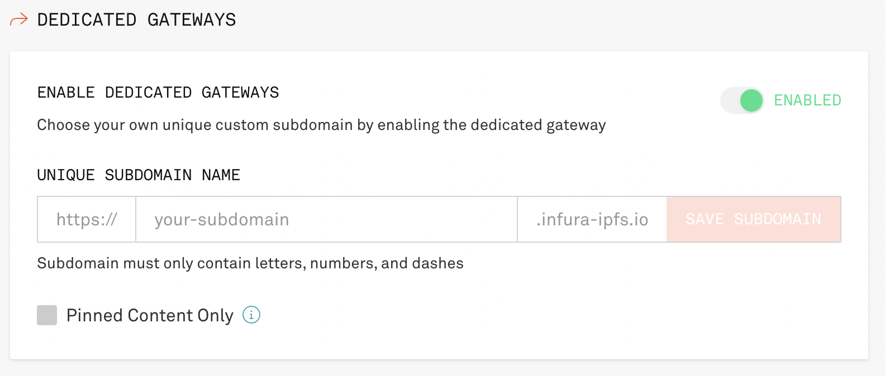

# Web3 Unleashed: Optimistic rollups and bridging with Optimism

Written by [Emily Lin](https://twitter.com/_emjlin)

Last updated 11/03/2022

## Overview 

In this episode of Web3 Unleashed, we're chatting with [Annie Ke](https://twitter.com/annieyke) from Optimism about all things L2: optimistic roll-ups, bridging, and Optimism Bedrock! At the end, we'll build a bridge widget that leverages the scripts in the [Truffle Optimism Bridge box](https://trufflesuite.com/boxes/optimism-bridge), to embed bridging into your Optimism dapps!

<iframe width="560" height="315" src="https://www.youtube.com/embed/i_yhkHgl4tA" title="YouTube video player" frameborder="0" allow="accelerometer; autoplay; clipboard-write; encrypted-media; gyroscope; picture-in-picture" allowfullscreen></iframe>

If you want a deeper dive into the bridge contract interfaces and an overview of L1s, L2s, and bridging, catch our presentation at Devcon!

<iframe width="560" height="315" src="https://www.youtube.com/embed/ZpSsFXv7Fwk?start=4292" title="YouTube video player" frameborder="0" allow="accelerometer; autoplay; clipboard-write; encrypted-media; gyroscope; picture-in-picture" allowfullscreen></iframe>

The completed code lives [here](https://github.com/trufflesuite/unleashed_optimism_bridge).

## Bridging basics in the Optimism Bridge Box

In this tutorial, we'll be creating an NFT Marketplace on Optimism and then adding Bridget, an Optimism bridge widget, that will bridge ETH using Optimism's bridge SDK.

NOTE: To do the bridging for our widget, we will be interacting with the Optimism bridge contract that has already been deployed. Therefore, we will only be interacting with Ethereum Goerli and Optimism Goerli. If we wanted to run all of this locally, there are a lot of additional steps, such as deploying all the Optimism contracts to your local Ethereum and local Optimism and running a local sequencer.

## Set Up

### Install Truffle

You'll need to install the latest version of [Truffle](../../docs/truffle/getting-started/installation/)

### Register for a MetaMask wallet

To interact with your DApp in the browser, you'll need a MetaMask wallet. Sign up for an account [here](https://metamask.io/?utm_source=devcon&utm_medium=event&utm_campaign=2022_Oct_optimism-bridge_tutorial_none).

### Download VS Code

Feel free to use whatever IDE you want, but we highly recommend using VS Code! You can run through most of this tutorial using the Truffle extension to create, build, deploy, and debug your smart contracts, all without using the CLI! You can read more about it [here](../../blog/build-on-web3-with-truffle-vs-code-extension/).

### Create an Infura account and Infura project

To connect your DApp to Ethereum Goerli and Optimism Goerli, you'll need an Infura account. Sign up for an account [here](https://infura.io/register?utm_source=devcon&utm_medium=event&utm_campaign=2022_Oct_optimism-bridge_tutorial_none).

Once you're signed in, create a project! Let's call it `optimism-marketplace`, and select Web3 API from the dropdown.

### Get Ethereum Goerli Eth, Optimism Goerli Eth, and Goerli DAI

In order to deploy your contracts and run our bridging scripts, you'll need some test Eth to cover your gas fees! There are multiple ways to get each one:

- Ethereum Goerli Eth: [Paradigm](https://faucet.paradigm.xyz/) has a great MultiFaucet that deposits funds across different networks.
- Optimism Goerli Eth: Optimism provides its own [faucet](https://optimismfaucet.xyz/) for Optimism Goerli.
- Goerli DAI: Go to [Uniswap](https://app.uniswap.org/#/swap), and connect your wallet to the Goerli test network. Then, exchange some of your Goerli ETH for Goerli DAI.

### Unbox the Optimism Bridge Box

The Truffle Optimism Bridge Box contains contracts that interact with the Optimism bridge on L1 and L2, along with a set of migrations for deploying, calling functions, and passing messages and value between both layers. To set it up:

```shell
truffle unbox optimism-bridge optimism-bridge
cd optimism-bridge
```

`unbox` will automatically run `npm install` for you.

### Bridge Box Contents

There's a lot in this box! Let's go over some key differences between this box and a vanilla `truffle init`:

- `package.json`

  The box contains some special scripts to perform common functions. For example, `migrate:ovm` will migrate using `truffle-confg.ovm.js` without you having to type out `--config truffle-config.ovm.js`.

- `contracts/ethereum` and `contracts/optimism`

  The `contracts` folder is further divided into `ethereum` and `optimism` to differentiate between the two contracts.

- [`contracts/Greeter.sol`](https://github.com/truffle-box/optimism-bridge-box/blob/main/contracts/Greeter.sol)

  We use the pre-deployed instance of this contract. It's the example contract from this [Optimism tutorial](https://github.com/ethereum-optimism/optimism-tutorial/tree/main/cross-dom-comm) for reference/learning.

- [`contracts/ethereum/GreeterL1.sol`](https://github.com/truffle-box/optimism-bridge-box/blob/main/contracts/ethereum/GreeterL1.sol)

  This contract will be deployed on Ethereum and controls a Greeter on Optimism.

- [`contracts/optimism/GreeterL2.sol`](https://github.com/truffle-box/optimism-bridge-box/blob/main/contracts/optimism/GreeterL2.sol)

  This contract will be deployed on Optimism and controls a Greeter on Ethereum.

- `truffle-config.js` and `truffle-config.ovm.js`
  
  In order to specify which chain to deploy to, we introduce a second config - `truffle-config.ovm.js` - with its own build path, contract directory, and networks. By default, `truffle migrate` will use `truffle-config.js`. When we want to deploy our Optimism contracts, however, we can specify `--config truffle-config.ovm.js` so that we properly deploy the correct contracts to the relevant networks.

- `migrations`

  In this box, we have four different migrations files. `1_deploy_L1_contracts.js` deploys the Ethereum contract `GreeterL1.sol`. `2_deploy_L2_contracts.js` deploys the Optimism contract `GreeterL2.sol`. The remaining 2 migrations, `3_set_L2_greeting.js` and `4_set_L1_greeting.js` actually don't deploy contracts - they call contract functions to send messages across L1 and L2.
  
  Normally, `3_set_L2_greeting.js` and `4_set_L1_greeting.js` would just go in a separate Truffle script since it's just sending messages rather than deploying a contract. However, in this case, we wanted to illustrate how with Truffle, you can write ordered, incremental steps with migrations to end in a desired state. You can see how this is done in `scripts/goerli_bridge_message.mjs`.

- `scripts/goerli_bridge_message.mjs`

  `npm run deploy` runs this script - which is actually a series of `truffle migrate` calls. This automates the process of compiling contracts, running migrations, and sending messages across each side of the bridge. Note the `--f 1 --to 1`, `--f 2 --to 2`, `--f 3 --to 3`, and `--f 4 --to 4` flags. This is how we tell Truffle which migrations to run provided we prefix the migration script's name with the appropriate number.

- `scripts/goerli_bridge_value.mjs`

  This script automates the process of compiling contracts, running migrations, and sending messages across each side of the bridge.

Let's dive into some of these files in depth.

### `contracts/Greeter.sol`

There are two important functions to call out here:

```javascript
function setGreeting(string memory _greeting) public {
  greeting = _greeting;
  emit SetGreeting(msg.sender, tx.origin, getXorig());
}
```
`setGreeting` is the function we will be calling in the other contract. It doesn't do anything other than set a greeting message.

```javascript
// Get the cross domain origin, if any
function getXorig() private view returns (address) {
  // Get the cross domain messenger's address each time.
  // This is less resource intensive than writing to storage.
  address cdmAddr = address(0);

  // Mainnet
  if (block.chainid == 1)
    cdmAddr = 0x25ace71c97B33Cc4729CF772ae268934F7ab5fA1;

  // Kovan
  if (block.chainid == 42)
    cdmAddr = 0x4361d0F75A0186C05f971c566dC6bEa5957483fD;

  // Goerli
  if (block.chainid == 5)
    cdmAddr = 0x5086d1eEF304eb5284A0f6720f79403b4e9bE294;

  // L2 (same address on every network)
  if (block.chainid == 10 || block.chainid == 69 || block.chainid == 420)
    cdmAddr = 0x4200000000000000000000000000000000000007;

  // If this isn't a cross domain message
  if (msg.sender != cdmAddr)
    return address(0);

  // If it is a cross domain message, find out where it is from
  return ICrossDomainMessenger(cdmAddr).xDomainMessageSender();
}    // getXorig()
```
`getXorig` returns the address of the original contract calling the messenger.

#### `contracts/GreeterL1.sol`

This contract is deployed on Ethereum, but will be calling the `setGreeting` method from the pre-deployed `Greeter` contract on Optimism Goerli.

```javascript
address crossDomainMessengerAddr = 0x5086d1eEF304eb5284A0f6720f79403b4e9bE294;
```

As you can see, this is the messenger contract address for the Goerli Chain Id 5 as specified in `Greeter.sol`.

```javascript
address greeterL2Addr = 0xC0836cCc8FBa87637e782Dde6e6572aD624fb984;
```

This is the address of the pre-deployed Greeter contract on Optimism Goerli.

```javascript
function setGreeting(string calldata _greeting) public {
    bytes memory message;

    message = abi.encodeWithSignature("setGreeting(string)",
        _greeting);

    ICrossDomainMessenger(crossDomainMessengerAddr).sendMessage(
        greeterL2Addr,
        message,
        1000000   // within the free gas limit amount
    );
} 
```

Finally, `setGreeting` does 2 things:
- Sets `message` to be the encoded function signature and input
- Calls the `sendMessage` method to call that function on the L2 contract

#### `contracts/GreeterL2.sol`

This contract does the same thing as `GreeterL1.sol`, except that it uses the messenger contract on Optimism (`0x4200000000000000000000000000000000000007`) and calls the function from Greeter contract on Ethereum.

#### `scripts/goerli_bridge_value.mjs`

This script demonstrates how to deposit/withdraw Ethereum and DAI using Optimism's SDK, which relies on Optimism's Standard Bridge. It's a big script, so we'll go over the most important parts.

```javascript
// Contract addresses for DAI tokens, taken
// from https://static.optimism.io/optimism.tokenlist.json
const daiAddrs = {
  l1Addr: "0x11fE4B6AE13d2a6055C8D9cF65c55bac32B5d844",
  l2Addr: "0xDA10009cBd5D07dd0CeCc66161FC93D7c9000da1",
}; // daiAddrs
```

The standard bridge can only be used with tokens that have a properly configured ERC20 version on Optimism. In this case, we can find the tokens on this [list](https://static.optimism.io/optimism.tokenlist.json).

```javascript
/**
 * getSigners()
 * Initializes ethers providers and returns wallets.
 */
const getSigners = async () => {
  const l1RpcProvider = new ethers.providers.JsonRpcProvider(l1Url);
  const l2RpcProvider = new ethers.providers.JsonRpcProvider(l2Url);
  const hdNode = ethers.utils.HDNode.fromMnemonic(goerliMnemonic);
  const privateKey = hdNode.derivePath(ethers.utils.defaultPath).privateKey;
  const l1Wallet = new ethers.Wallet(privateKey, l1RpcProvider);
  const l2Wallet = new ethers.Wallet(privateKey, l2RpcProvider);

  return [l1Wallet, l2Wallet];
}; // getSigners

/**
 * setup()
 * Initializes Optimism SDK's Cross Chain Messenger
 */
const setup = async () => {
  const [l1Signer, l2Signer] = await getSigners();
  addr = l1Signer.address;
  crossChainMessenger = new optimismSDK.CrossChainMessenger({
      l1ChainId: 5,    // Goerli value, 1 for mainnet
      l2ChainId: 420,  // Goerli value, 10 for mainnet
      l1SignerOrProvider: l1Signer,
      l2SignerOrProvider: l2Signer
  })
  l1ERC20 = new ethers.Contract(daiAddrs.l1Addr, erc20ABI, l1Signer);
  l2ERC20 = new ethers.Contract(daiAddrs.l2Addr, erc20ABI, l2Signer);
}; // setup
```

These two methods are relatively straightforward. They are just setting up our wallets to sign our transactions. Notice in this case, we are specifying Goerli and Optimism Goerli, which have the chainIds 5 and 420, respectively.

```javascript
/**
 * reportBalances()
 * Logs ETH balances on L1 and L2.
 */
const reportBalances = async () => {
  const l1Balance = (await crossChainMessenger.l1Signer.getBalance())
    .toString()
    .slice(0, -9);
  const l2Balance = (await crossChainMessenger.l2Signer.getBalance())
    .toString()
    .slice(0, -9);

  console.log(`On L1:${l1Balance} Gwei    On L2:${l2Balance} Gwei`);
}; // reportBalances

/**
 * reportERC20Balances()
 * Logs DAI balances on L1 and L2.
 */
const reportERC20Balances = async () => {
  const l1Balance = (await l1ERC20.balanceOf(addr)).toString().slice(0, -18);
  const l2Balance = (await l2ERC20.balanceOf(addr)).toString().slice(0, -18);
  console.log(`DAI on L1:${l1Balance}     DAI on L2:${l2Balance}`);
}; // reportERC20Balances
```

These are simply methods that will log how much DAI/ETH we have on each layer. They are used to give visibility into our assets while we are depositing/withdrawing tokens.

```javascript
/**
 * depositETH()
 * Bridges ETH from L1 to L2 and reports balances
 */
const depositETH = async () => {
  console.log("Deposit ETH");
  await reportBalances();
  const start = new Date();

  const response = await crossChainMessenger.depositETH(gwei);
  console.log(`Transaction hash (on L1): ${response.hash}`);
  await response.wait();
  console.log("Waiting for status to change to RELAYED");
  console.log(`Time so far ${(new Date() - start) / 1000} seconds`);
  await crossChainMessenger.waitForMessageStatus(
    response.hash,
    optimismSDK.MessageStatus.RELAYED
  );

  await reportBalances();
  console.log(`depositETH took ${(new Date() - start) / 1000} seconds\n\n`);
}; // depositETH()
```

In order to bridge Eth from L1 to L2, we call `crossChainMessenger.depositETH`, which takes gwei. To know that the bridging has completed, we need to wait for the RELAYED status. You can see the list of all possible statuses [here](https://sdk.optimism.io/enums/messagestatus).

```javascript
/**
 * depositERC20()
 * Bridges DAI from L1 to L2 and reports balances
 */
const depositERC20 = async () => {
  console.log("Deposit ERC20");
  await reportERC20Balances();
  const start = new Date();

  // Need the l2 address to know which bridge is responsible
  const allowanceResponse = await crossChainMessenger.approveERC20(
    daiAddrs.l1Addr,
    daiAddrs.l2Addr,
    dai
  );
  await allowanceResponse.wait();
  console.log(`Allowance given by tx ${allowanceResponse.hash}`);
  console.log(`Time so far ${(new Date() - start) / 1000} seconds`);

  const response = await crossChainMessenger.depositERC20(
    daiAddrs.l1Addr,
    daiAddrs.l2Addr,
    dai
  );
  console.log(`Deposit transaction hash (on L1): ${response.hash}`);
  await response.wait();
  console.log("Waiting for status to change to RELAYED");
  console.log(`Time so far ${(new Date() - start) / 1000} seconds`);
  await crossChainMessenger.waitForMessageStatus(
    response.hash,
    optimismSDK.MessageStatus.RELAYED
  );

  await reportERC20Balances();
  console.log(`depositERC20 took ${(new Date() - start) / 1000} seconds\n\n`);
}; // depositERC20()
```

This method is relatively the same as `depositETH`. However, there is one important thing to call out. When we are bridging an ERC20 token, we MUST approve the Standard Token Bridge to use the amount of tokens that you want to deposit and the token contract addresses you care about or the deposit will fail. We do this in this part of the code:

```javascript
// Need the l2 address to know which bridge is responsible
const allowanceResponse = await crossChainMessenger.approveERC20(
  daiAddrs.l1Addr,
  daiAddrs.l2Addr,
  dai
);
```

```javascript
/**
 * withdrawETH()
 * Bridges ETH from L2 to L1 and reports balances
 */
const withdrawETH = async () => {
  console.log("Withdraw ETH");
  const start = new Date();
  await reportBalances();

  const response = await crossChainMessenger.withdrawETH(centieth);
  console.log(`Transaction hash (on L2): ${response.hash}`);
  await response.wait();

  console.log("Waiting for status to change to IN_CHALLENGE_PERIOD");
  console.log(`Time so far ${(new Date() - start) / 1000} seconds`);
  await crossChainMessenger.waitForMessageStatus(
    response.hash,
    optimismSDK.MessageStatus.IN_CHALLENGE_PERIOD
  );
  console.log("In the challenge period, waiting for status READY_FOR_RELAY");
  console.log(`Time so far ${(new Date() - start) / 1000} seconds`);
  await crossChainMessenger.waitForMessageStatus(
    response.hash,
    optimismSDK.MessageStatus.READY_FOR_RELAY
  );
  console.log("Ready for relay, finalizing message now");
  console.log(`Time so far ${(new Date() - start) / 1000} seconds`);
  await crossChainMessenger.finalizeMessage(response);
  console.log("Waiting for status to change to RELAYED");
  console.log(`Time so far ${(new Date() - start) / 1000} seconds`);
  await crossChainMessenger.waitForMessageStatus(
    response,
    optimismSDK.MessageStatus.RELAYED
  );
  await reportBalances();
  console.log(`withdrawETH took ${(new Date() - start) / 1000} seconds\n\n\n`);
}; // withdrawETH()
```

This method withdraws ETH from L2 to L1. Specifically, you'll notice now we check for two new states: `IN_CHALLENGE_PERIOD` and `READY_FOR_RELAY`. This is because when bridging from L2 to L1, there needs to be a time delay during which the transaction can be challenged (i.e., the challenge period).

```javascript
/**
 * withdrawERC20()
 * Bridges DAI from L2 to L1 and reports balances
 */
const withdrawERC20 = async () => {
  console.log("Withdraw ERC20");
  const start = new Date();
  await reportERC20Balances();

  const response = await crossChainMessenger.withdrawERC20(
    daiAddrs.l1Addr,
    daiAddrs.l2Addr,
    dai
  );
  console.log(`Transaction hash (on L2): ${response.hash}`);
  await response.wait();

  console.log("Waiting for status to change to IN_CHALLENGE_PERIOD");
  console.log(`Time so far ${(new Date() - start) / 1000} seconds`);
  await crossChainMessenger.waitForMessageStatus(
    response.hash,
    optimismSDK.MessageStatus.IN_CHALLENGE_PERIOD
  );
  console.log("In the challenge period, waiting for status READY_FOR_RELAY");
  console.log(`Time so far ${(new Date() - start) / 1000} seconds`);
  await crossChainMessenger.waitForMessageStatus(
    response.hash,
    optimismSDK.MessageStatus.READY_FOR_RELAY
  );
  console.log("Ready for relay, finalizing message now");
  console.log(`Time so far ${(new Date() - start) / 1000} seconds`);
  await crossChainMessenger.finalizeMessage(response);
  console.log("Waiting for status to change to RELAYED");
  console.log(`Time so far ${(new Date() - start) / 1000} seconds`);
  await crossChainMessenger.waitForMessageStatus(
    response,
    optimismSDK.MessageStatus.RELAYED
  );
  await reportERC20Balances();
  console.log(
    `withdrawERC20 took ${(new Date() - start) / 1000} seconds\n\n\n`
  );
}; // withdrawERC20()
```

This is just the ERC20 counterpart to the withdrawETH version.

Now, let's actually run the scripts to see the output of Optimism bridging!

### Deploy the contracts and send messages

In order to run our deployment script that also sends messages, we'll need to specify our mnemonics and Infura API key for the `optimism-marketplace` project we created earlier for the different networks we will be deploying to. Specify your `GOERLI_MNEMONIC` and `INFURA_KEY` in a `.env` file.

After that's been specified, you should be able to run `npm run deploy`. You'll see that two contracts have been deployed and will be prompted to view the bridged on Etherscan. The result looks like this:

<details><summary> Output </summary>
<p>

```shell
$ truffle compile --config=truffle-config.ovm

Compiling your contracts...
===========================
> Compiling ./contracts/optimism/GreeterL2.sol
> Compiling @eth-optimism/contracts/libraries/bridge/ICrossDomainMessenger.sol
> Artifacts written to /Users/emilylin/dev/optimism-bridge-box/build/optimism-contracts
> Compiled successfully using:
   - solc: 0.8.4+commit.c7e474f2.Emscripten.clang
$ truffle migrate --network=goerli --f 1 --to 1 --skip-dry-run

Compiling your contracts...
===========================
> Everything is up to date, there is nothing to compile.


Starting migrations...
======================
> Network name:    'goerli'
> Network id:      5
> Block gas limit: 30000000 (0x1c9c380)


1_deploy_L1_contracts.js
========================
Deploying L1 Greeter 👋

   Deploying 'GreeterL1'
   ---------------------
   > transaction hash:    0x0d60c97232474974d872fb99159772681351275a45fc33034818e4a069ba3944
- Blocks: 0            Seconds: 0
- Blocks: 1            Seconds: 4
- Blocks: 1            Seconds: 8
- Blocks: 1            Seconds: 12
- Blocks: 2            Seconds: 16
- Blocks: 2            Seconds: 20
- Blocks: 2            Seconds: 24
- Blocks: 2            Seconds: 28
- Blocks: 2            Seconds: 32
- Blocks: 2            Seconds: 36
   > Blocks: 2            Seconds: 36
   > contract address:    0x70B01484283d5495930125305ebbB62224EF9424
   > block number:        7711471
   > block timestamp:     1664905308
   > account:             0xA31618621805C9215B5Ade58EB09dBA8f32Bbdb8
   > balance:             0.258526123140245736
   > gas used:            326161 (0x4fa11)
   > gas price:           2.50000001 gwei
   > value sent:          0 ETH
   > total cost:          0.00081540250326161 ETH

   > Saving artifacts
   -------------------------------------
   > Total cost:     0.00081540250326161 ETH

Summary
=======
> Total deployments:   1
> Final cost:          0.00081540250326161 ETH


$ truffle migrate --network=optimistic_goerli --config=truffle-config.ovm --f 2 --to 2 --skip-dry-run

Compiling your contracts...
===========================
> Everything is up to date, there is nothing to compile.


Starting migrations...
======================
> Network name:    'optimistic_goerli'
> Network id:      420
> Block gas limit: 15000000 (0xe4e1c0)


2_deploy_L2_contracts.js
========================
Deploying L2 Greeter 👋👋

   Deploying 'GreeterL2'
   ---------------------
   > transaction hash:    0x019c43d23d1998655e0d3511372847d4c5390c6c2708be1fdea1edab5c5d240d
- Blocks: 0            Seconds: 0
- Blocks: 3            Seconds: 4
   > Blocks: 3            Seconds: 4
   > contract address:    0xdB48896120B728a3a152a07cF40632820ADa7111
   > block number:        1683657
   > block timestamp:     1664905316
   > account:             0xA31618621805C9215B5Ade58EB09dBA8f32Bbdb8
   > balance:             0.399999347575380974
   > gas used:            232016 (0x38a50)
   > gas price:           0.000000001 gwei
   > value sent:          0 ETH
   > total cost:          0.000000000000232016 ETH

   > Saving artifacts
   -------------------------------------
   > Total cost:     0.000000000000232016 ETH

Summary
=======
> Total deployments:   1
> Final cost:          0.000000000000232016 ETH


$ truffle migrate --network=goerli --f 3 --to 3 --skip-dry-run

Compiling your contracts...
===========================
> Everything is up to date, there is nothing to compile.


Starting migrations...
======================
> Network name:    'goerli'
> Network id:      5
> Block gas limit: 30000000 (0x1c9c380)


3_set_L2_greeting.js
====================
Updating the L2 Greetings contract from L1! 👋👋
🙌 Greeter txn confirmed on L1! 0xe392e0edb1dbc5db05546846eb0c098e20bfc1557265e8ee5c2ced3f8be76bc0
🛣️  Bridging message to L2 Greeter contract...
🕐 In about 1 minute, check the Greeter contract "read" function: https://goerli-optimism.etherscan.io/address/0xC0836cCc8FBa87637e782Dde6e6572aD624fb984#readContract
   -------------------------------------
   > Total cost:                   0 ETH

Summary
=======
> Total deployments:   0
> Final cost:          0 ETH


$ truffle migrate --network=optimistic_goerli --config=truffle-config.ovm --f 4 --to 4 --skip-dry-run

Compiling your contracts...
===========================
> Everything is up to date, there is nothing to compile.


Starting migrations...
======================
> Network name:    'optimistic_goerli'
> Network id:      420
> Block gas limit: 15000000 (0xe4e1c0)


4_set_L1_greeting.js
====================
Updating the L1 Greetings contract from L2! 👋
🙌🙌 Greeter txn confirmed on L2! 0x4ed90d90a5b30770c69766b4bc017c78bc15322169baada2a95e1e01ca048eaa
🛣️  Bridging message to L1 Greeter contract.
 🕐 This will take at least 1-5 min...
Message not yet received on L1.
 🕐 Retrying in 10 seconds...
Message not yet received on L1.
 🕐 Retrying in 10 seconds...
Message not yet received on L1.
 🕐 Retrying in 10 seconds...
Message not yet received on L1.
 🕐 Retrying in 10 seconds...
Message not yet received on L1.
 🕐 Retrying in 10 seconds...
Message not yet received on L1.
 🕐 Retrying in 10 seconds...
Message not yet received on L1.
 🕐 Retrying in 10 seconds...
Message not yet received on L1.
 🕐 Retrying in 10 seconds...
Message not yet received on L1.
 🕐 Retrying in 10 seconds...
Message not yet received on L1.
 🕐 Retrying in 10 seconds...
Message not yet received on L1.
 🕐 Retrying in 10 seconds...
Message not yet received on L1.
 🕐 Retrying in 10 seconds...
Message not yet received on L1.
 🕐 Retrying in 10 seconds...
Message not yet received on L1.
 🕐 Retrying in 10 seconds...
Message not yet received on L1.
 🕐 Retrying in 10 seconds...
Message not yet received on L1.
 🕐 Retrying in 10 seconds...
Message not yet received on L1.
 🕐 Retrying in 10 seconds...
Message not yet received on L1.
 🕐 Retrying in 10 seconds...
Message not yet received on L1.
 🕐 Retrying in 10 seconds...
Message not yet received on L1.
 🕐 Retrying in 10 seconds...
Message not yet received on L1.
 🕐 Retrying in 10 seconds...
Message not yet received on L1.
 🕐 Retrying in 10 seconds...
Message not yet received on L1.
 🕐 Retrying in 10 seconds...
Message not yet received on L1.
 🕐 Retrying in 10 seconds...
Message not yet received on L1.
 🕐 Retrying in 10 seconds...
Message not yet received on L1.
 🕐 Retrying in 10 seconds...
Message not yet received on L1.
 🕐 Retrying in 10 seconds...
Message not yet received on L1.
 🕐 Retrying in 10 seconds...
📬 Message received! Finalizing...
🎉 Message finalized. Check the L1 Greeter contract "read" function: https://goerli.etherscan.io/address/0x7fA4D972bB15B71358da2D937E4A830A9084cf2e#readContract
   -------------------------------------
   > Total cost:                   0 ETH

Summary
=======
> Total deployments:   0
> Final cost:          0 ETH
```

</p>
</details>

### Send Eth and DAI across the bridge

To send Eth and DAI across the bridge, simply run a `truffle exec scripts/goerli_bridge_value.js`. This result should look like this:

<details><summary>  Output </summary>
<p>

```shell
Deposit ETH
On L1:207145727 Gwei    On L2:539999353 Gwei
Transaction hash (on L1): 0x5af02f2c7b9350fa3762f37aedc9df6cbf826e82e00ad19ba4c11abfc46ec783
Waiting for status to change to RELAYED
Time so far 22.473 seconds
On L1:206934536 Gwei    On L2:539999355 Gwei
depositETH took 220.514 seconds


Withdraw ETH
On L1:206934536 Gwei    On L2:539999355 Gwei
Transaction hash (on L2): 0x7315691a120bd13954b2d3243e8fe47f68c14a920ecaf5b889a06a8af46b4f18
Waiting for status to change to IN_CHALLENGE_PERIOD
Time so far 3.284 seconds
In the challenge period, waiting for status READY_FOR_RELAY
Time so far 151.495 seconds
Ready for relay, finalizing message now
Time so far 162.431 seconds
Waiting for status to change to RELAYED
Time so far 166.164 seconds
On L1:215727635 Gwei    On L2:529999355 Gwei
withdrawETH took 188.858 seconds


Deposit ERC20
DAI on L1:43     DAI on L2:
Allowance given by tx 0xf81b69b54597af3934daad2a0b0491fb19d161714f84b535b702137e08a7f2d3
Time so far 22.799 seconds
Deposit transaction hash (on L1): 0xe29e229f7afece8c09317db908ff3166c41f6858972e7ac44c3069fde458319b
Waiting for status to change to RELAYED
Time so far 34.414 seconds
DAI on L1:42     DAI on L2:1
depositERC20 took 261.9 seconds


Withdraw ERC20
DAI on L1:42     DAI on L2:1
Transaction hash (on L2): 0x569c638dfb4a034b6a267b024c415dbc5f26412fb6f2c7a56b531d332f209ae9
Waiting for status to change to IN_CHALLENGE_PERIOD
Time so far 8.008 seconds
In the challenge period, waiting for status READY_FOR_RELAY
Time so far 324.519 seconds
Ready for relay, finalizing message now
Time so far 359.411 seconds
Waiting for status to change to RELAYED
Time so far 363.363 seconds
DAI on L1:43     DAI on L2:
withdrawERC20 took 372.773 seconds
```

</p>
</details>

Given everything works, we can essentially copy paste the relevant withdrawETH/depositETH functions in `goerli_bridge_value.js` into a frontend Bridge component. We'll be doing that when we create the NFT marketplace.

## Build a Marketplace DApp on Optimism

Now that we've got the bridging basics down, let's use the NFT marketplace tutorial in this guide and add a new page specifically for users to bridge their ETH. We will be organizing the project folder structure into two parts: a `truffle` folder for all of your smart contract development needs, and a `client` folder to hold your code for the marketplace frontend.

### Move bridge contents into a truffle folder

Now that we are adding a client component to our DApp, let's place all the relevant Truffle files in a separate folder for organization. Create a folder called `truffle`. Then, move the `contracts`, `migrations`, `scripts`, and `node_modules` folders into the `truffle` folder. Then, also move `.env`, `package.json`, `package-lock.json`, `truffle-config.js`, and `truffle-config.ovm.js` into the `truffle folder`.

We don't need the `.env.example` anymore, so delete that too.

Your top level directory folder structure should look like this:

```shell
.
├── .gitignore
├── LICENSE
├── README.md
├── client
└── truffle

```

Your `truffle` folder structure should look like this:

```shell
truffle
├── .env
├── contracts
├── migrations
├── node_modules
├── package-lock.json
├── package.json
├── scripts
├── test
├── truffle-config.js
└── truffle-config.ovm.js
```

We also don't need the `Greeter` contracts, so let's go ahead and delete the related files: `GreeterL1.sol`, `GreeterL2.sol`, `Greeter.sol`, all the migrations files, and `goerli_bridge_message.mjs`.

### Create client folder using Next.js

To set up the frontend, we'll be using Next.js and Tailwind for our CSS. To do so, call:

```shell
npx create-next-app@latest client
```

Then, to add Tailwind to your project:

```shell
cd client
npm install -D tailwindcss@latest postcss@latest autoprefixer@latest
npx tailwindcss init -p
```

Edit `tailwind.config.js`

```javascript
module.exports = {
  content: [
    "./pages/**/*.{js,ts,jsx,tsx}",
    "./components/**/*.{js,ts,jsx,tsx}",
  ],
  theme: {
    extend: {},
  },
  plugins: [],
}
```

And replace the code from `styles/global.css`

```css
@tailwind base;
@tailwind components;
@tailwind utilities;
```

Nice! Now that we have our folder structure organized, let's first create our marketplace contracts.

### Create an NFT and Marketplace smart contract

In this tutorial, we'll be using the same contracts and frontend as the [Optimism NFT Marketplace](../nft-marketplace/), so if you want any in depth explanation of the smart contract code, please reference [the NFT smart contract section](../nft-marketplace/#build-the-nft-smart-contract) and [the marketplace smart contract section](../nft-marketplace/#build-the-marketplace-contract).

To start, we will create two new Optimism contracts in the `contracts/optimism` folder. We also need `@openzeppelin/contracts` to inherit. To this, we can simply call:

```shell
cd ../truffle
npm i @openzeppelin/contracts
truffle create contract OptimismNFT --config truffle-config.ovm.js
truffle create contract OptimismMarketplace --config truffle-config.ovm.js
```

Then, populate the contracts with the corresponding code from the previous tutorial:

<details><summary> Code </summary>
<p>

```javascript
// SPDX-License-Identifier: MIT
pragma solidity ^0.8.0;

import "@openzeppelin/contracts/token/ERC721/ERC721.sol";
import "@openzeppelin/contracts/token/ERC721/extensions/ERC721URIStorage.sol";
import "@openzeppelin/contracts/utils/Counters.sol";

contract OptimismNFT is ERC721URIStorage {
  using Counters for Counters.Counter;
  Counters.Counter private _tokenIds;
  address marketplaceContract;
  event NFTMinted(uint256);

  constructor(address _marketplaceContract) ERC721("Optimism NFT", "ON") {
    marketplaceContract = _marketplaceContract;
  }

  function mint(string memory _tokenURI) public {
    _tokenIds.increment();
    uint256 newTokenId = _tokenIds.current();
    _safeMint(msg.sender, newTokenId);
    _setTokenURI(newTokenId, _tokenURI);
    setApprovalForAll(marketplaceContract, true);
    emit NFTMinted(newTokenId);
  }
}
```

</p>
</details>

<details><summary> Code </summary>
<p>

```javascript
// SPDX-License-Identifier: MIT
pragma solidity ^0.8.0;

import "@openzeppelin/contracts/utils/Counters.sol";
import "@openzeppelin/contracts/token/ERC721/ERC721.sol";
import "@openzeppelin/contracts/security/ReentrancyGuard.sol";

contract OptimismMarketplace is ReentrancyGuard {
  using Counters for Counters.Counter;
  Counters.Counter private _nftsSold;
  Counters.Counter private _nftCount;
  uint256 public LISTING_FEE = 0.0001 ether;
  address payable private _marketOwner;
  mapping(uint256 => NFT) private _idToNFT;
  struct NFT {
    address nftContract;
    uint256 tokenId;
    address payable seller;
    address payable owner;
    uint256 price;
    bool listed;
  }
  event NFTListed(
    address nftContract,
    uint256 tokenId,
    address seller,
    address owner,
    uint256 price
  );
  event NFTSold(
    address nftContract,
    uint256 tokenId,
    address seller,
    address owner,
    uint256 price
  );

  constructor() {
    _marketOwner = payable(msg.sender);
  }

  // List the NFT on the marketplace
  function listNft(address _nftContract, uint256 _tokenId, uint256 _price) public payable nonReentrant {
    require(_price > 0, "Price must be at least 1 wei");
    require(msg.value == LISTING_FEE, "Not enough ether for listing fee");

    IERC721(_nftContract).transferFrom(msg.sender, address(this), _tokenId);

    _nftCount.increment();

    _idToNFT[_tokenId] = NFT(
      _nftContract,
      _tokenId,
      payable(msg.sender),
      payable(address(this)),
      _price,
      true
    );

    emit NFTListed(_nftContract, _tokenId, msg.sender, address(this), _price);
  }

  // Buy an NFT
  function buyNft(address _nftContract, uint256 _tokenId) public payable nonReentrant {
    NFT storage nft = _idToNFT[_tokenId];
    require(msg.value >= nft.price, "Not enough ether to cover asking price");

    address payable buyer = payable(msg.sender);
    payable(nft.seller).transfer(msg.value);
    IERC721(_nftContract).transferFrom(address(this), buyer, nft.tokenId);
    _marketOwner.transfer(LISTING_FEE);
    nft.owner = buyer;
    nft.listed = false;

    _nftsSold.increment();
    emit NFTSold(_nftContract, nft.tokenId, nft.seller, buyer, msg.value);
  }

  // Resell an NFT purchased from the marketplace
  function resellNft(address _nftContract, uint256 _tokenId, uint256 _price) public payable nonReentrant {
    require(_price > 0, "Price must be at least 1 wei");
    require(msg.value == LISTING_FEE, "Not enough ether for listing fee");

    IERC721(_nftContract).transferFrom(msg.sender, address(this), _tokenId);

    NFT storage nft = _idToNFT[_tokenId];
    nft.seller = payable(msg.sender);
    nft.owner = payable(address(this));
    nft.listed = true;
    nft.price = _price;

    _nftsSold.decrement();
    emit NFTListed(_nftContract, _tokenId, msg.sender, address(this), _price);
  }

  function getListingFee() public view returns (uint256) {
    return LISTING_FEE;
  }

  function getListedNfts() public view returns (NFT[] memory) {
    uint256 nftCount = _nftCount.current();
    uint256 unsoldNftsCount = nftCount - _nftsSold.current();

    NFT[] memory nfts = new NFT[](unsoldNftsCount);
    uint nftsIndex = 0;
    for (uint i = 0; i < nftCount; i++) {
      if (_idToNFT[i + 1].listed) {
        nfts[nftsIndex] = _idToNFT[i + 1];
        nftsIndex++;
      }
    }
    return nfts;
  }

  function getMyNfts() public view returns (NFT[] memory) {
    uint nftCount = _nftCount.current();
    uint myNftCount = 0;
    for (uint i = 0; i < nftCount; i++) {
      if (_idToNFT[i + 1].owner == msg.sender) {
        myNftCount++;
      }
    }

    NFT[] memory nfts = new NFT[](myNftCount);
    uint nftsIndex = 0;
    for (uint i = 0; i < nftCount; i++) {
      if (_idToNFT[i + 1].owner == msg.sender) {
        nfts[nftsIndex] = _idToNFT[i + 1];
        nftsIndex++;
      }
    }
    return nfts;
  }

  function getMyListedNfts() public view returns (NFT[] memory) {
    uint nftCount = _nftCount.current();
    uint myListedNftCount = 0;
    for (uint i = 0; i < nftCount; i++) {
      if (_idToNFT[i + 1].seller == msg.sender && _idToNFT[i + 1].listed) {
        myListedNftCount++;
      }
    }

    NFT[] memory nfts = new NFT[](myListedNftCount);
    uint nftsIndex = 0;
    for (uint i = 0; i < nftCount; i++) {
      if (_idToNFT[i + 1].seller == msg.sender && _idToNFT[i + 1].listed) {
        nfts[nftsIndex] = _idToNFT[i + 1];
        nftsIndex++;
      }
    }
    return nfts;
  }
}

```

</p>
</details>

### Modify `truffle-config.ovm.js`

Now that we want to reference our new Optimsim contracts in the client, we need to change the build path in `truffle-config.ovm.js` to add the contract ABIs into a folder in `client`. Modify the build directory in `truffle-config.ovm.js` as follows:

```javascript
contracts_build_directory: "../client/contracts/optimism-contracts",
```

### Migrate the new Optimism contracts

Now, let's deploy the newly created Optimism contracts. To do so, create a migrations file `1_deploy_contracts.js`. Then populate as so:

```javascript
var OptimismNFT = artifacts.require("OptimismNFT");
var OptimismMarketplace = artifacts.require("OptimismMarketplace");

module.exports = async function(deployer) {
  await deployer.deploy(OptimismMarketplace);
  const marketplace = await OptimismMarketplace.deployed();
  await deployer.deploy(OptimismNFT, marketplace.address);
}
```

Since we are only deploying these two contracts, which are both on Optimism, let's deploy using Truffle Dashboard! First, let's add the Optimism Goerli network to our MetaMask wallet. You should add this network information to your MetaMask wallet:

- **Network name**: Optimism Goerli
- **New RPC URL**: https://optimism-goerli.infura.io/v3/<INFURA_API_KEY>
- **Chain ID**: 420
- **Currency Symbol**: ETH
- **Block explorer URL**: https://blockscout.com/optimism/goerli/

Now, to migrate your contracts first start up dashboard on `localhost:24012`:

```shell
truffle dashboard
```

Make sure the Optimism Goerli network is selected on MetaMask. Then simply call:

```shell
truffle migrate --config truffle-config.ovm.js --network dashboard
```

Truffle dashboard will ask you sign to transactions:  one for deploying `OptimismMarketplace` and one for deploying `OptimismNFT`. You should be able to see the built contracts in `client/contract/optimism-contracts`.

At this point, you should test the contracts. We won't be going over it in this tutorial, but you can follow the instructions [here](../nft-marketplace/#test-your-smart-contracts).

Now, let's get into the client portion!

### Create an Infura IPFS project

You'll need Infura IPFS account and dedicated gateway to upload your NFT metadata. To create a IPFS project, select create IPFS project.


Then, you'll need to create a unique gateway name. In this project, we'll call it `optimism-demo`. You will need to give your own dedicated gateway with its own unique name.



### Create Marketplace frontend pages

Again, we'll just be using the frontend from our previous tutorial. If you want to do a deeper dive, read this section. Otherwise, to add the front end you'll need to:

Install some packages to get our client up and running:

```shell
cd ../client
npm install axios
npm install web3modal
npm install web3
npm install ipfs-http-client
```

Then, we need to create or edit 6 files that sit under `client/pages`:

#### `_app.js`

This file organizes the link routing

<details><summary> Code </summary>
<p>

```javascript
import '../styles/globals.css'
import Link from 'next/link'

function MyApp({ Component, pageProps }) {
  return (
    <div>
      <nav className="border-b p-6">
        <p className="text-4xl font-bold">Optimism Marketplace</p>
        <div className="flex mt-4">
          <Link href="/">
            <a className="mr-4 text-teal-400">
              Home
            </a>
          </Link>
          <Link href="/create-and-list-nft">
            <a className="mr-6 text-teal-400">
              Sell a new NFT
            </a>
          </Link>
          <Link href="/my-nfts">
            <a className="mr-6 text-teal-400">
              My NFTs
            </a>
          </Link>
          <Link href="/my-listed-nfts">
            <a className="mr-6 text-teal-400">
              My Listed NFTs
            </a>
          </Link>
        </div>
      </nav>
      <Component {...pageProps} />
    </div>
  )
}

export default MyApp
```

</p>
</details>

#### `index.js`

Thie file is the Home tab, where a user can see and buy all of the listed NFTs.

<details><summary> Code </summary>
<p>

```javascript
import Web3 from 'web3';
import Web3Modal from 'web3modal';
import { useEffect, useState } from 'react';
import axios from 'axios';

import OptimismMarketplace from '../contracts/optimism-contracts/OptimismMarketplace.json'
import OptimismNFT from '../contracts/optimism-contracts/OptimismNFT.json'

export default function Home() {
  const [nfts, setNfts] = useState([])
  const [loadingState, setLoadingState] = useState('not-loaded')
  
  useEffect(() => { loadNFTs() }, [])
  
  async function loadNFTs() {
    const web3Modal = new Web3Modal()
    const provider = await web3Modal.connect()
    const web3 = new Web3(provider)
    const networkId = await web3.eth.net.getId()

    // Get all listed NFTs
    const marketPlaceContract = new web3.eth.Contract(OptimismMarketplace.abi, OptimismMarketplace.networks[networkId].address)
    const listings = await marketPlaceContract.methods.getListedNfts().call()
    // Iterate over the listed NFTs and retrieve their metadata
    const nfts = await Promise.all(listings.map(async (i) => {
      try {
        const optimismNFTContract = new web3.eth.Contract(OptimismNFT.abi, OptimismNFT.networks[networkId].address)
        const tokenURI = await optimismNFTContract.methods.tokenURI(i.tokenId).call()
        const meta = await axios.get(tokenURI)
        const nft = {
          price: i.price,
          tokenId: i.tokenId,
          seller: i.seller,
          owner: i.buyer,
          image: meta.data.image,
          name: meta.data.name,
          description: meta.data.description,
        }
        return nft
      } catch(err) {
        console.log(err)
        return null
      }
    }))
    setNfts(nfts.filter(nft => nft !== null))
    setLoadingState('loaded') 
  }

  async function buyNft(nft) {
    const web3Modal = new Web3Modal()
    const provider = await web3Modal.connect()
    const web3 = new Web3(provider)
    const networkId = await web3.eth.net.getId();
    const marketPlaceContract = new web3.eth.Contract(OptimismMarketplace.abi, OptimismMarketplace.networks[networkId].address);
    const accounts = await web3.eth.getAccounts();
    await marketPlaceContract.methods.buyNft(OptimismNFT.networks[networkId].address, nft.tokenId).send({ from: accounts[0], value: nft.price });
    loadNFTs()
  }

  if (loadingState === 'loaded' && !nfts.length) {
    return (<h1 className="px-20 py-10 text-3xl">No NFTs available!</h1>)
  } else {
    return (
      <div className="flex justify-center">
        <div className="px-4" style={ { maxWidth: '1600px' } }>
          <div className="grid grid-cols-1 sm:grid-cols-2 lg:grid-cols-4 gap-4 pt-4">
            {
              nfts.map((nft, i) => (
                <div key={i} className="border shadow rounded-xl overflow-hidden">
                  
                  <div className="p-4">
                    <p style={ { height: '64px' } } className="text-2xl font-semibold">{nft.name}</p>
                    <div style={ { height: '70px', overflow: 'hidden'  } }>
                      <p className="text-gray-400">{nft.description}</p>
                    </div>
                  </div>
                  <div className="p-4 bg-teal-300">
                    <p className="text-2xl font-bold text-white">{Web3.utils.fromWei(nft.price, "ether")} ETH</p>
                    <button className="mt-4 w-full bg-teal-400 text-white font-bold py-2 px-12 rounded" onClick={() => buyNft(nft)}>Buy</button>
                  </div>
                </div>
              ))
            }
          </div>
        </div>
      </div>
    )
  }
}
```

</p>
</details>

#### `create-and-list-nft.js`

This is the Sell tab, where a user can create and list an NFT. Make sure you replace <DEDICATED_GATEWAY> with the dedicated gateway name you create in your IPFS project on Infura. You'll also need to add in your IPFS API and Secret to create our IPFS client. To do so, create `.env.local` in your `client` folder. Then, populate it with these values:

```shell
NEXT_PUBLIC_IPFS_SECRET=
NEXT_PUBLIC_IPFS_KEY=
NEXT_PUBLIC_IPFS_UNIQUE_SUBDOMAIN=
```

Don't forget to add `.env.local` to your `.gitignore`!

Then, copy paste this code into `create-and-list-nft.js`:

<details><summary> Code </summary>
<p>

```javascript
import { useState } from 'react'
import Web3 from 'web3'
import Web3Modal from 'web3modal'
import { useRouter } from 'next/router'
import { create as ipfsHttpClient } from 'ipfs-http-client'
import OptimismMarketplace from '../contracts/optimism-contracts/OptimismMarketplace.json'
import OptimismNFT from '../contracts/optimism-contracts/OptimismNFT.json'


const projectId = process.env["NEXT_PUBLIC_IPFS_KEY"];
const projectSecret = process.env["NEXT_PUBLIC_IPFS_SECRET"];
const auth =
    'Basic ' + Buffer.from(projectId + ':' + projectSecret).toString('base64');

const client = ipfsHttpClient({
    host: 'ipfs.infura.io',
    port: 5001,
    protocol: 'https',
    headers: {
        authorization: auth,
    },
});

const IPFSGateway = `https://${process.env["NEXT_PUBLIC_IPFS_UNIQUE_SUBDOMAIN"]}.infura-ipfs.io/ipfs/`

export default function CreateItem() {
  const [fileUrl, setFileUrl] = useState(null)
  const [formInput, updateFormInput] = useState({ price: '', name: '', description: '' })
  const router = useRouter()

  async function onChange(e) {
    // upload image to IPFS
    const file = e.target.files[0]
    try {
      const added = await client.add(
        file,
        {
          progress: (prog) => console.log(`received: ${prog}`)
        }
      )
      const url = `${IPFSGateway}${added.path}`
      setFileUrl(url)
    } catch (error) {
      console.log('Error uploading file: ', error)
    }  
  }

  async function uploadToIPFS() {
    const { name, description, price } = formInput
    if (!name || !description || !price || !fileUrl) {
      return
    } else {
      // first, upload metadata to IPFS
      const data = JSON.stringify({
        name, description, image: fileUrl
      })
      try {
        const added = await client.add(data)
        console.log('added: ', added)
        const url = `${IPFSGateway}${added.path}`
        // after metadata is uploaded to IPFS, return the URL to use it in the transaction
        return url
      } catch (error) {
        console.log('Error uploading file: ', error)
      } 
    }
  }

  async function listNFTForSale() {
    const web3Modal = new Web3Modal()
    const provider = await web3Modal.connect()
    const web3 = new Web3(provider)
    const url = await uploadToIPFS()
    const networkId = await web3.eth.net.getId()

    // Mint the NFT
    const optimismNFTContractAddress = OptimismNFT.networks[networkId].address
    const optimismNFTContract = new web3.eth.Contract(OptimismNFT.abi, optimismNFTContractAddress)
    const accounts = await web3.eth.getAccounts()
    const marketPlaceContract = new web3.eth.Contract(OptimismMarketplace.abi, OptimismMarketplace.networks[networkId].address)
    let listingFee = await marketPlaceContract.methods.getListingFee().call()
    listingFee = listingFee.toString()
    optimismNFTontract.methods.mint(url).send({ from: accounts[0] }).on('receipt', function (receipt) {
        console.log('minted');
        // List the NFT
        const tokenId = receipt.events.NFTMinted.returnValues[0];
        marketPlaceContract.methods.listNft(optimismNFTContractAddress, tokenId, Web3.utils.toWei(formInput.price, "ether"))
            .send({ from: accounts[0], value: listingFee }).on('receipt', function () {
                console.log('listed')
                router.push('/')
            });
    });
  }

  return (
    <div className="flex justify-center">
      <div className="w-1/2 flex flex-col pb-12">
        <input 
          placeholder="Asset Name"
          className="focus:outline-none focus:ring-teal-400 focus:border-teal-400 mt-8 border rounded p-4"
          onChange={e => updateFormInput({ ...formInput, name: e.target.value })}
        />
        <textarea
          placeholder="Asset Description"
          className="focus:outline-none focus:ring-teal-400 focus:border-teal-400 mt-2 border rounded p-4"
          onChange={e => updateFormInput({ ...formInput, description: e.target.value })}
        />
        <input
          placeholder="Asset Price in Eth"
          className="focus:outline-none focus:ring-teal-400 focus:border-teal-400 mt-2 border rounded p-4"
          onChange={e => updateFormInput({ ...formInput, price: e.target.value })}
        />
        <input
          type="file"
          name="Asset"
          className="my-4"
          onChange={onChange}
        />
        {
          fileUrl && (
            
          )
        }
        <button onClick={listNFTForSale} className="focus:ring-teal-400 focus:border-teal-400 font-bold mt-4 bg-teal-400 text-white rounded p-4 shadow-lg">
          Mint and list NFT
        </button>
      </div>
    </div>
  )
}
```

</p>
</details>

#### `my-nfts.js`

This is the My NFTs tab, where the user can see the NFTs they own and choose to resell.

<details><summary> Code </summary>
<p>

```javascript
import Web3 from 'web3';
import { useEffect, useState } from 'react'
import axios from 'axios'
import Web3Modal from 'web3modal'
import { useRouter } from 'next/router'

import OptimismMarketplace from '../contracts/optimism-contracts/OptimismMarketplace.json';
import OptimismNFT from '../contracts/optimism-contracts/OptimismNFT.json';

export default function MyAssets() {
  const [nfts, setNfts] = useState([])
  const [loadingState, setLoadingState] = useState('not-loaded')
  const router = useRouter()

  useEffect(() => { loadNFTs() }, [])

  async function loadNFTs() {
    const web3Modal = new Web3Modal()
    const provider = await web3Modal.connect()
    const web3 = new Web3(provider)
    const networkId = await web3.eth.net.getId()
    const marketPlaceContract = new web3.eth.Contract(OptimismMarketplace.abi, OptimismMarketplace.networks[networkId].address)
    const optimismNFTContractAddress = OptimismNFT.networks[networkId].address
    const optimismNFTContract = new web3.eth.Contract(OptimismNFT.abi, optimismNFTContractAddress)
    const accounts = await web3.eth.getAccounts()
    const data = await marketPlaceContract.methods.getMyNfts().call({from: accounts[0]})

    const nfts = await Promise.all(data.map(async i => {
      try {
        const tokenURI = await optimismNFTContract.methods.tokenURI(i.tokenId).call()
        const meta = await axios.get(tokenURI)
        let nft = {
          price: i.price,
          tokenId: i.tokenId,
          seller: i.seller,
          owner: i.buyer,
          image: meta.data.image,
          name: meta.data.name,
          description: meta.data.description,
          tokenURI: tokenURI
        }
        return nft
      } catch(err) {
        console.log(err)
        return null
      }
      
    }))
    setNfts(nfts.filter(nft => nft !== null))
    setLoadingState('loaded')
  }

  function listNFT(nft) {
    router.push(`/resell-nft?id=${nft.tokenId}&tokenURI=${nft.tokenURI}`)
  }

  if (loadingState === 'loaded' && !nfts.length) {
    return (<h1 className="py-10 px-20 text-3xl">No NFTs owned</h1>);
  } else {
    return (
      <div className="flex justify-center">
        <div className="p-4">
          <div className="grid grid-cols-1 sm:grid-cols-2 lg:grid-cols-4 gap-4 pt-4">
            {
              nfts.map((nft, i) => (
                <div key={i} className="border shadow rounded-xl overflow-hidden">
                  
                  <div className="p-4">
                    <p style={ { height: '64px' } } className="text-2xl font-semibold">{nft.name}</p>
                    <div style={ { height: '70px', overflow: 'hidden' } }>
                      <p className="text-gray-400">{nft.description}</p>
                    </div>
                  </div>
                  <div className="p-4 bg-teal-300">
                    <p className="text-2xl font-bold text-white">Price - {Web3.utils.fromWei(nft.price, "ether")} Eth</p>
                    <button className="mt-4 w-full bg-teal-400 text-white font-bold py-2 px-12 rounded" onClick={() => listNFT(nft)}>List</button>
                  </div>
                </div>
              ))
            }
          </div>
        </div>
      </div>
    );
  }
}
```

</p>
</details>

#### `resell-nft.js`

This is the page the user is directed to to resell their NFTs.

<details><summary> Code </summary>
<p>

```javascript
import { useEffect, useState } from 'react'
import Web3 from 'web3'
import { useRouter } from 'next/router'
import axios from 'axios'
import Web3Modal from 'web3modal'

import OptimismMarketplace from '../contracts/optimism-contracts/OptimismMarketplace.json'
import OptimismNFT from '../contracts/optimism-contracts/OptimismNFT.json'

export default function ResellNFT() {
  const [formInput, updateFormInput] = useState({ price: '', image: '' })
  const router = useRouter()
  const { id, tokenURI } = router.query
  const { image, price } = formInput

  useEffect(() => { fetchNFT() }, [id])

  async function fetchNFT() {
    if (!tokenURI) {
        return
    } else {
        const meta = await axios.get(tokenURI)
        updateFormInput(state => ({ ...state, image: meta.data.image }))
    }
  }

  async function listNFTForSale() {
    if (!price) {
        return
    } else {
        const web3Modal = new Web3Modal()
        const provider = await web3Modal.connect()
        const web3 = new Web3(provider)
        const networkId = await web3.eth.net.getId()
        const marketPlaceContract = new web3.eth.Contract(OptimismMarketplace.abi, OptimismMarketplace.networks[networkId].address)
        let listingFee = await marketPlaceContract.methods.getListingFee().call()
        listingFee = listingFee.toString()
        const accounts = await web3.eth.getAccounts()
        marketPlaceContract.methods.resellNft(OptimismNFT.networks[networkId].address, id, Web3.utils.toWei(formInput.price, "ether"))
            .send({ from: accounts[0], value: listingFee }).on('receipt', function () {
                router.push('/')
            });
    }
  }

  return (
    <div className="flex justify-center">
      <div className="w-1/2 flex flex-col pb-12">
        <input
          placeholder="Asset Price in Eth"
          className="mt-2 border rounded p-4"
          onChange={e => updateFormInput({ ...formInput, price: e.target.value })}
        />
        {
          image && (
            
          )
        }
        <button onClick={listNFTForSale} className="font-bold mt-4 bg-teal-400 text-white rounded p-4 shadow-lg">
          List NFT
        </button>
      </div>
    </div>
  )
}
```

</p>
</details>

#### `my-listed-nfts.js`

<details><summary> Code </summary>
<p>

This is the My Listed NFTs tab, where users can see what NFTs they have listed for sale.

```javascript
import Web3 from 'web3';
import { useEffect, useState } from 'react';
import axios from 'axios';
import Web3Modal from 'web3modal';

import OptimismMarketplace from '../contracts/optimism-contracts/OptimismMarketplace.json';
import OptimismNFT from '../contracts/optimism-contracts/OptimismNFT.json';

export default function CreatorDashboard() {
  const [nfts, setNfts] = useState([])
  const [loadingState, setLoadingState] = useState('not-loaded')

  useEffect(() => { loadNFTs() }, [])

  async function loadNFTs() {
    const web3Modal = new Web3Modal()
    const provider = await web3Modal.connect()
    const web3 = new Web3(provider)
    const networkId = await web3.eth.net.getId()

    // Get listed NFTs
    const marketPlaceContract = new web3.eth.Contract(OptimismMarketplace.abi, OptimismMarketplace.networks[networkId].address)
    const accounts = await web3.eth.getAccounts()
    const listings = await marketPlaceContract.methods.getMyListedNfts().call({from: accounts[0]})
    // Iterate over my listed NFTs and retrieve their metadata
    const nfts = await Promise.all(listings.map(async i => {
      try {
        const optimismNFTContract = new web3.eth.Contract(OptimismNFT.abi, OptimismNFT.networks[networkId].address)
        const tokenURI = await optimismNFTContract.methods.tokenURI(i.tokenId).call();
        const meta = await axios.get(tokenURI);
        let item = {
          price: i.price,
          tokenId: i.tokenId,
          seller: i.seller,
          owner: i.owner,
          image: meta.data.image,
        }
        return item
      } catch(err) {
        console.log(err)
        return null
      }
    }))
    setNfts(nfts.filter(nft => nft !== null))
    setLoadingState('loaded')
  }

  if (loadingState === 'loaded' && !nfts.length) {
    return (<h1 className="py-10 px-20 text-3xl">No NFTs listed</h1>)
  } else {
    return (
      <div>
        <div className="p-4">
          <h2 className="text-2xl py-2">Items Listed</h2>
            <div className="grid grid-cols-1 sm:grid-cols-2 lg:grid-cols-4 gap-4 pt-4">
            {
              nfts.map((nft, i) => (
                <div key={i} className="border shadow rounded-xl overflow-hidden">
                  
                  <div className="p-4 bg-teal-300">
                    <p className="text-2xl font-bold text-white">Price - {Web3.utils.fromWei(nft.price, "ether")} Eth</p>
                  </div>
                </div>
              ))
            }
          </div>
        </div>
      </div>
    )
  }
}
```
</p>
</details>

### Add bridge widget

Now, let's create a new page under `pages` called `goerli-bridge.js`. We'll need some additional packages:

```shell
npm i react-async-hook
npm i @eth-optimism/sdk
npm i ethers
```

Now, we'll need to add our infura key and goerli mnemonic to the `.env.local` file as well:

```shell
NEXT_PUBLIC_INFURA_KEY=
NEXT_PUBLIC_GOERLI_MNEMONIC=
```

Add the following code to `goerli-bridge.js`:

<details><summary> Code </summary>
<p>

```javascript
import { useRef, useEffect } from "react";
import { useAsyncCallback } from 'react-async-hook';
const optimismSDK = require("@eth-optimism/sdk");
const ethers = require("ethers");
const goerliMnemonic = process.env["NEXT_PUBLIC_GOERLI_MNEMONIC"];
const infuraKey = process.env["NEXT_PUBLIC_INFURA_KEY"];
const l1Url = "https://goerli.infura.io/v3/" + infuraKey;
const l2Url = "https://optimism-goerli.infura.io/v3/" + infuraKey;

// getSigners
// Initializes ethers providers and returns wallets.
const l1RpcProvider = new ethers.providers.JsonRpcProvider(l1Url);
const l2RpcProvider = new ethers.providers.JsonRpcProvider(l2Url);
const hdNode = ethers.utils.HDNode.fromMnemonic(goerliMnemonic);
const privateKey = hdNode.derivePath(ethers.utils.defaultPath).privateKey;
const [l1Signer, l2Signer] = [
  new ethers.Wallet(privateKey, l1RpcProvider),
  new ethers.Wallet(privateKey, l2RpcProvider)
];
// Initializes Optimism SDK's Cross Chain Messenger
const crossChainMessenger = new optimismSDK.CrossChainMessenger({
    l1ChainId: 5,    // Goerli value, 1 for mainnet
    l2ChainId: 420,  // Goerli value, 10 for mainnet
    l1SignerOrProvider: l1Signer,
    l2SignerOrProvider: l2Signer
});

const getL1Eth = async () => {
  console.log("getL1Eth");
  return ethers.utils.formatEther(
    (await crossChainMessenger.l1Signer.getBalance())
    .toString()
  );
};

const getL2Eth = async () => {
  console.log("getL2Eth");
  return ethers.utils.formatEther(
    (await crossChainMessenger.l2Signer.getBalance())
    .toString()
  );
};

const Bridge = () => {
  const l1Balance = useAsyncCallback(getL1Eth, []);
  const l2Balance = useAsyncCallback(getL2Eth, []);
  const depositRef = useRef(null);
  const withdrawRef = useRef(null);

  useEffect(() => {
    l1Balance.execute();
    l2Balance.execute();
  }, [l1Balance.execute, l2Balance.execute]);

  const withdrawEth = async () => {
    console.log("Withdraw ETH");
    const start = new Date();

    const response = await crossChainMessenger.withdrawETH(ethers.utils.parseEther(withdrawRef.current.value));
    console.log(`Transaction hash (on L2): ${response.hash}`);
    await response.wait();

    console.log("Waiting for status to change to IN_CHALLENGE_PERIOD");
    console.log(`Time so far ${(new Date() - start) / 1000} seconds`);
    await crossChainMessenger.waitForMessageStatus(
      response.hash,
      optimismSDK.MessageStatus.IN_CHALLENGE_PERIOD
    );
    console.log("In the challenge period, waiting for status READY_FOR_RELAY");
    console.log(`Time so far ${(new Date() - start) / 1000} seconds`);
    await crossChainMessenger.waitForMessageStatus(
      response.hash,
      optimismSDK.MessageStatus.READY_FOR_RELAY
    );
    console.log("Ready for relay, finalizing message now");
    console.log(`Time so far ${(new Date() - start) / 1000} seconds`);
    await crossChainMessenger.finalizeMessage(response);
    console.log("Waiting for status to change to RELAYED");
    console.log(`Time so far ${(new Date() - start) / 1000} seconds`);
    await crossChainMessenger.waitForMessageStatus(
      response,
      optimismSDK.MessageStatus.RELAYED
    );
    console.log(`withdrawETH took ${(new Date() - start) / 1000} seconds\n\n\n`);

    l1Balance.execute();
    l2Balance.execute();
  };

  const depositEth = async () => {
    console.log("Deposit ETH");
    const start = new Date();
  
    const response = await crossChainMessenger.depositETH(ethers.utils.parseEther(depositRef.current.value));
    console.log(`Transaction hash (on L1): ${response.hash}`);
    await response.wait();
    console.log("Waiting for status to change to RELAYED");
    console.log(`Time so far ${(new Date() - start) / 1000} seconds`);
    await crossChainMessenger.waitForMessageStatus(
      response.hash,
      optimismSDK.MessageStatus.RELAYED
    );
  
    console.log(`depositETH took ${(new Date() - start) / 1000} seconds\n\n`);

    l1Balance.execute();
    l2Balance.execute();
  };

  return (
    <div className="py-8 px-8 m-8 max-w-md mx-auto bg-white rounded-xl shadow-lg space-y-2 sm:py-4 sm:flex sm:items-center sm:space-y-0 sm:space-x-6">
      <div className="text-center space-y-2 sm:text-left">
        <div className="space-y-0.5"></div>
          <div>
            <div className="txt-lg font-bold">Bridge your ETH!</div>
          </div>
        <div className="my-4 space-y-4">
          <input placeholder="ETH bridged to Optimism" ref={depositRef} type="text" className="focus:outline-none bg-gray-50 border border-gray-300 text-gray-900 text-sm rounded-lg focus:ring-teal-400 focus:border-teal-400 block w-full p-2.5"/>
          <button onClick={depositEth} className="px-4 py-1 text-sm text-teal-400 font-semibold rounded-lg border border-teal-400 hover:text-white hover:bg-teal-400 hover:border-transparent">Deposit</button>
          {l1Balance.loading && <div>Loading Goerli Eth Balance...</div>}
          {l1Balance.error && <div className="font-semibold">Error: {l1Balance.error.message}</div>}
          {
            l1Balance.result && (
                <div>
                  <span className="text-slate-500">Current Goerli Eth Balance: </span>
                  <span className="font-semibold">{l1Balance.result}</span>
                </div>
            )
          }
          <input placeholder="ETH bridged to Ethereum"ref={withdrawRef} type="text" className="focus:outline-none bg-gray-50 border border-gray-300 text-gray-900 text-sm rounded-lg focus:ring-teal-400 focus:border-teal-400 block w-full p-2.5"/>
          <button onClick={withdrawEth} className="px-4 py-1 text-sm text-teal-400 font-semibold rounded-lg border border-teal-400 hover:text-white hover:bg-teal-400 hover:border-transparent">Withdraw</button>
          {l2Balance.loading && <div>Loading Optimism Goerli Eth Balance...</div>}
          {l2Balance.error && <div className="font-semibold">Error: {l2Balance.error.message}</div>}
          {
              l2Balance.result && (
                <div>
                  <span className="text-slate-500">Current Optimism Goerli Eth Balance: </span>
                  <span className="font-semibold">{l2Balance.result}</span>
                </div>
              )
            }
          </div>
        </div>
    </div>
  );
}

export default Bridge;
```

</p>
</details>

The things to note here is that we effectively copy pasted the relevant depositETH and withdrawETH content from `scripts/goerli_bridge_value.js`. There are a few key differences though, namely:

- We split `reportBalances` into `getL1Eth` and `getL2Eth` to be displayed on our web page.
- We needed to convert the input values for withdraw and deposit from `text` to `BigNumber` (`ethers.utils.parseEther(withdrawRef.current.value)` and `ethers.utils.parseEther(depositRef.current.value)`)

Finally, the last piece is to make sure we add this page to our list of pages in `_app.js`! To the end of the links, add:

```javascript
<Link href="/goerli-bridge">
  <a className="mr-6 text-teal-400">
    Goerli Bridge
  </a>
</Link>
```

Now, everything should be hooked up! Run `npm run dev` from the client folder and try it out!

## Future Extensions

And there you have it! You've created a Marketplace DApp on Optimism and embedded an ETH bridge into the UI. It is important to note that we only covered bridging ETH on Goerli. Possible extensions include allowing the user to choose the desired network, or bridging other ERC20 tokens.

Alternatively, consider creating a chat bot, that incorporates our `Greeter` contracts for sending messages.

If you want to talk about this content, make suggestions for what you'd like to see or ask questions about the series, join our [Discord](https://discord.com/invite/hYpHRjK)! Lastly, don't forget to follow us on [Twitter](https://twitter.com/trufflesuite) for the latest updates on all things Truffle.