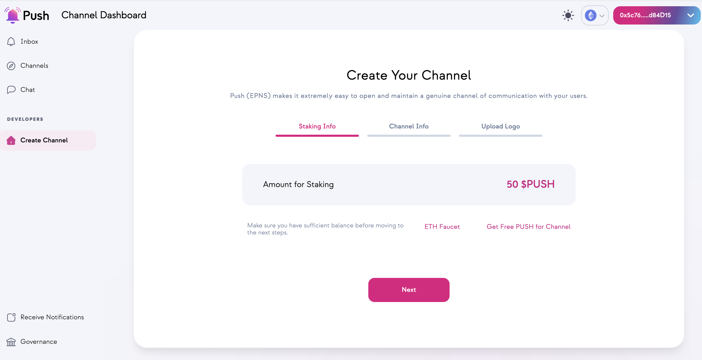
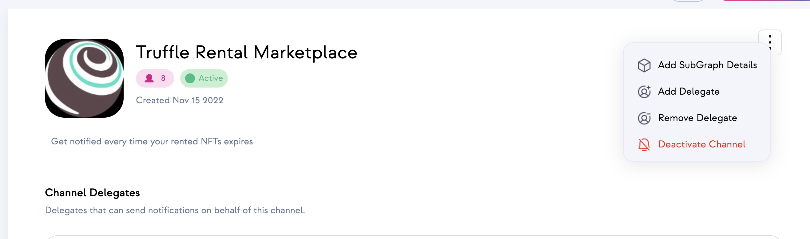

# Web3 Unleashed: How to Add Notifications to Your Dapp

Written by [Emily Lin](https://twitter.com/_emjlin)

Last updated 1/05/2023

## Overview 

Our full-stack NFT rental marketplace is done! We created a [rentable NFT](https://trufflesuite.com/guides/rentable-nft/), wrote a [rental marketplace smart contract](https://trufflesuite.com/guides/nft-rental-marketplace/), and built a [frontend](https://trufflesuite.com/guides/nft-rental-marketplace-2/) to tie it all together. 

In this guide, we'll be adding some details to improve the user expriecnce: using Push to send decentralized notifications whenever a user's rental has expired. Additionally, we'll be using `ganache` forking to test our contracts and interact with the Push contracts locally before deploying to an actual testnet or mainnet.

<iframe width="560" height="315" src="https://www.youtube.com/embed/oevGLIvWDTc" title="YouTube video player" frameborder="0" allow="accelerometer; autoplay; clipboard-write; encrypted-media; gyroscope; picture-in-picture" allowfullscreen></iframe>

Watch the livestream on [YouTube](https://youtu.be/oevGLIvWDTc) for a more in-depth walkthrough and to hear from core dev, Fabio, about how Push is changing up Web3 communication!

The completed code lives [here](https://github.com/trufflesuite/unleashed_nft_rental_marketplace/tree/push).

NOTE: We are only interacting with the smart contracts, so you can ignore the `client` folder.

## Download System Requirements

You'll need to install:

- [Node.js](https://nodejs.org/en/), v14 or higher
- [truffle](https://trufflesuite.com/docs/truffle/getting-started/installation/)
- [ganache CLI](https://github.com/trufflesuite/ganache)

## Create an Infura account and project

To connect your DApp to Ethereum mainnet and testnets, you'll need an Infura account. Sign up for an account [here](https://infura.io/register?utm_source=truffle&utm_medium=webinar&utm_campaign=2022_Aug_unleashed-rentable-nft_tutorial_content).

Once you're signed in, create a project! Let's call it `rentable-nft-marketplace`, and select Web3 API from the dropdown.

## Register for a MetaMask wallet

To interact with your DApp in the browser, you'll need a MetaMask wallet. You can download it and create one [here](https://metamask.io/download/?utm_source=truffle&utm_medium=webinar&utm_campaign=2022_Aug_unleashed-rentable-nft_tutorial_content).

## Download VS Code

Feel free to use whatever IDE you want, but we highly recommend using VS Code! You can run through most of this tutorial using the Truffle extension to create, build, and deploy your smart contracts, all without using the CLI! You can read more about it [here](https://trufflesuite.com/blog/build-on-web3-with-truffle-vs-code-extension/).

## Get Some Test Eth

In order to deploy to the public testnets, you'll need some test Eth to cover your gas fees! [Paradigm](https://faucet.paradigm.xyz/) has a great MultiFaucet that deposits funds across 8 different networks all at once.

## Set Up Your Project

We'll be starting with the marketplace contracts we wrote in [episode 4](https://trufflesuite.com/guides/nft-rental-marketplace/). Go ahead and clone the main project [here](https://github.com/trufflesuite/unleashed_nft_rental_marketplace).  

Since we're only interacting with the smart contracts in this tutorial, we'll just go to the `truffle` folder and install our dependencies.

```shell
cd unleashed_nft_rental_marketplace/truffle
npm i
```

## Create a Channel in Push

In order to send notifications, we need to create a channel for users to subscribe to. To create a channel, see the Push docs [here](https://docs.push.org/developers/developer-guides/create-your-notif-channel/channel-creation-guides/deploying-your-first-channel). In this guide, we are only building on Ethereum, so ignore any instructions for multi-chain channels. Additionally, we are deploying on Goerli and NOT multi-chain, so make sure you're creating your channel through the [staging dapp](https://staging.push.org/#/channels) - NOT the prod dapp. Do note that you'll need 50 Goerli PUSH in order to deploy your channel! Their staging dapp has a link that will send some to your wallet.

Note that the address of your channel is the account address you deployed with. Additionally, you can only have one channel per address.



## Create `IPUSHCommInterface.sol`

In order to send notifications from our marketplace smart contract, we need to interact with Push's deployed contracts. First, we'll create a `IPUSHCommInterface` interface contract to be able to call those methods.

```shell
truffle create contract IPUSHCommInterface
```

Then, copy and paste in this code:

```javascript
// PUSH Comm Contract Interface
interface IPUSHCommInterface {
    function sendNotification(address _channel, address _recipient, bytes calldata _identity) external;
}
```

## Call `sendNotification`

Now that we have the interface contract, we can go ahead and call `sendNotification` on Push's deployed contract to alert our users that their rental was unlisted.

We want to notify the user which NFT was unlisted in the notification message, which is of type string. However, it's not straightforward to convert the `address` type into a `string` type. Luckily, OpenZeppelin provides the `Strings` library to help with these types of conversions. Import it at the top of the `Marketplace` contract:

```javascript
import "@openzeppelin/contracts/utils/Strings.sol";
```

Then, to construct the notification message, add the following code _before_ we clean up the Marketplace data in `unlistNFT`.

```javascript
string memory body = string.concat("Your NFT rental from ", Strings.toHexString(nftContract), " with tokenId ", Strings.toString(tokenId), " has expired.");
if (msg.sender == listing.owner) {
    string.concat(body, " Your rental NFT was unlisted by the owner, so you have been refunded ", Strings.toString(refund), " ETH.");
}
```

Afterwards, call `sendNotification` afterwards:

```javascript
IPUSHCommInterface(address(0xb3971BCef2D791bc4027BbfedFb47319A4AAaaAa)).sendNotification(
    address(YOUR_CHANNEL_ADDRESS), // from channel - recommended to set channel via dApp and put it's value -> then once contract is deployed, go back and add the contract address as delegate for your channel
    listing.user, // to recipient, put address(this) in case you want Broadcast or Subset. For Targetted put the address to which you want to send
    bytes(
        string(
            // We are passing identity here: https://docs.epns.io/developers/developer-guides/sending-notifications/advanced/notification-payload-types/identity/payload-identity-implementations
            abi.encodePacked(
                "0", // this is notification identity: https://docs.epns.io/developers/developer-guides/sending-notifications/advanced/notification-payload-types/identity/payload-identity-implementations
                "+", // segregator
                "3", // this is payload type: https://docs.epns.io/developers/developer-guides/sending-notifications/advanced/notification-payload-types/payload (1, 3 or 4) = (Broadcast, targetted or subset)
                "+", // segregator
                "Your NFT rental has expired", // this is notification title
                "+", // segregator
                body // notification body
            )
        )
    )
);
```

Note that `0xb3971BCef2D791bc4027BbfedFb47319A4AAaaAa` is the address for the Push contract deployed on Goerli. If you're not deploying on Goerli, you can find the appropriate smart contract address for your desired chain [here](https://docs.push.org/developers/developer-tooling/push-smart-contracts/epns-contract-addresses). You'll be using the address listed under `EPNS CommV1`.

The final `unlistNFT` function looks like this:

```javascript
// function to unlist your rental, refunding the user for any lost time
function unlistNFT(address nftContract, uint256 tokenId) public payable nonReentrant {
    Listing storage listing = _listingMap[nftContract][tokenId];
    require(listing.owner != address(0), "This NFT is not listed");
    require(listing.owner == msg.sender || _marketOwner == msg.sender , "Not approved to unlist NFT");
    // fee to be returned to user if unlisted before rental period is up
    // nothing to refund if no renter
    uint256 refund = 0;
    if (listing.user != address(0)) {
        refund = ((listing.expires - block.timestamp) / 60 / 60 / 24 + 1) * listing.pricePerDay;
        require(msg.value >= refund, "Not enough ether to cover refund");
        payable(listing.user).transfer(refund);
    }

    string memory body = string.concat("Your NFT rental from ", Strings.toHexString(nftContract), " with tokenId ", Strings.toString(tokenId), " has expired.");
    if (msg.sender == listing.owner) {
        string.concat(body, " Your rental NFT was unlisted by the owner, so you have been refunded ", Strings.toString(refund), " ETH.");
    }

    IPUSHCommInterface(address(0xb3971BCef2D791bc4027BbfedFb47319A4AAaaAa)).sendNotification(
        address(0xA31618621805C9215B5Ade58EB09dBA8f32Bbdb8), // from channel - recommended to set channel via dApp and put it's value -> then once contract is deployed, go back and add the contract address as delegate for your channel
        listing.user, // to recipient, put address(this) in case you want Broadcast or Subset. For Targetted put the address to which you want to send
        bytes(
            string(
                // We are passing identity here: https://docs.epns.io/developers/developer-guides/sending-notifications/advanced/notification-payload-types/identity/payload-identity-implementations
                abi.encodePacked(
                    "0", // this is notification identity: https://docs.epns.io/developers/developer-guides/sending-notifications/advanced/notification-payload-types/identity/payload-identity-implementations
                    "+", // segregator
                    "3", // this is payload type: https://docs.epns.io/developers/developer-guides/sending-notifications/advanced/notification-payload-types/payload (1, 3 or 4) = (Broadcast, targetted or subset)
                    "+", // segregator
                    "Your NFT rental has expired", // this is notification title
                    "+", // segregator
                    body // notification body
                )
            )
        )
    );

    // clean up data
    IERC4907(nftContract).setUser(tokenId, address(0), 0);
    EnumerableSet.remove(_nftContractTokensMap[nftContract], tokenId);
    delete _listingMap[nftContract][tokenId];
    if (EnumerableSet.length(_nftContractTokensMap[nftContract]) == 0) {
        EnumerableSet.remove(_nftContracts, nftContract);
    }
    _nftsListed.decrement();

    emit NFTUnlisted(
        msg.sender,
        nftContract,
        tokenId,
        refund
    );
}
```

## Deploy the Marketplace contract and add it as delegate

In order for the contract address to send a notification, it needs to be set as a delegate by Push. To do so, follow the instructions [here](https://docs.push.org/developers/developer-guides/create-your-notif-channel/adding-delegates-for-channel).

First, we need to deploy the contract onto Goerli. We can do this with [Truffle Dashboard](https://trufflesuite.com/docs/truffle/how-to/use-the-truffle-dashboard/). Connect to Goerli with MetaMask after bringing up Dashboard.

```shell
truffle dashboard
truffle migrate --network dashboard
```

Then, add the deployed contract address as delegate through the staging dapp you created your channel in.



## Test notifications locally

Because our `Marketplace` contract now interacts with the Push contract on Goerli, we have to run our tests against a forked version of Ganache. We can do so without any configuration, due to Infura's free archive node access. Spin it up in a different terminal:

```shell
ganache --fork goerli
```

Then, in our tests, we need to reference the specific contract addresses we just deployed on Goerli. You can do so by replacing `Marketplace.deployed()` and `RentableNft.deployed()` with the following:

```javascript
marketplace = await Marketplace.at("MARKETPLACE_GOERLI_ADDRESS");
rentableNft = await RentableNft.at("NFT_GOERLI_ADDRESS");
```

Additionally, you'll need to replace `MARKETPLACE_OWNER` with the actual address you deployed your contracts with.

Your final test code should look like this:

```javascript
require("@openzeppelin/test-helpers/configure")({
  provider: web3.currentProvider,
  singletons: {
    abstraction: "truffle",
  },
});

const { balance, constants, ether, expectRevert, expectEvent } = require('@openzeppelin/test-helpers');
const Marketplace = artifacts.require("Marketplace");
const RentableNft = artifacts.require("RentableNft");

const TODAY = Math.floor(Date.now()/1000);
const TODAY_2 = TODAY + (60*60);
const YESTERDAY = TODAY - (24*60*60);
const TOMORROW = TODAY + (24*60*60);
const IN_FIVE_DAYS = TODAY + (24*60*60*5);

function assertListing(actual, expected) {
  assert.equal(actual.owner, expected.owner, "Owner is not correct");
  assert.equal(actual.user, expected.user, "User is not correct");
  assert.equal(actual.nftContract, expected.nftContract, "NFT contract is not correct");
  assert.equal(actual.tokenId, expected.tokenId, "TokenId is not correct");
  assert.equal(actual.pricePerDay, expected.pricePerDay, "Price per day is not correct");
  assert.equal(actual.startDateUNIX, expected.startDateUNIX, "Start date is not correct");
  assert.equal(actual.endDateUNIX, expected.endDateUNIX, "End date is not correct");
  assert.equal(actual.expires, expected.expires, "Expires date is not correct");
}

async function assertNFT(nftContractInstance, tokenId, expectedUser, expectedExpires) {
  let user = await nftContractInstance.userOf.call(tokenId);
  let expires = await nftContractInstance.userExpires.call(tokenId);
  assert.equal(user, expectedUser, "User is not correct");
  assert.equal(expires, expectedExpires, "Expires date is incorrect");
}

// EnumerableSet makes no guarantee about ordering, so we have to find the matching tokenId
function getListing(listings, tokenId) {
  let listing = {};
  listings.every((_listing) => {
    if (_listing.tokenId == tokenId) {
      listing = _listing;
      return false;
    } else {
      return true;
    }
  });
  return listing
}

function listingToString(listing) {
  let listingCopy = {...listing};
  listingCopy.tokenId = listing.tokenId.toString();
  listingCopy.pricePerDay = listing.pricePerDay.toString();
  listingCopy.startDateUNIX = listing.startDateUNIX.toString();
  listingCopy.endDateUNIX = listing.endDateUNIX.toString();
  listingCopy.expires = listing.expires.toString();
  if ("rentalFee" in listing) {
    listingCopy.rentalFee = listing.rentalFee.toString();
  }
}

contract("Marketplace", function (accounts) {
  const MARKETPLACE_OWNER = "YOUR_ACCOUNT_ADDRESS";
  const TOKEN_OWNER = accounts[1];
  const USER = accounts[2];
  let marketplace;
  let rentableNft;
  let nftContract;
  let listingFee;
  let tokenID1;
  let tokenID2;
  let tokenID3;


  before('should reuse variables', async () => {
    marketplace = await Marketplace.at("MARKETPLACE_GOERLI_ADDRESS");
    rentableNft = await RentableNft.at("NFT_GOERLI_ADDRESS");
    nftContract = rentableNft.address;
    listingFee = (await marketplace.getListingFee()).toString();
    // mint nfts for testing
    tokenID1 = (await rentableNft.mint("fakeURI", {from: TOKEN_OWNER})).logs[0].args.tokenId.toNumber();
    tokenID2 = (await rentableNft.mint("fakeURI", {from: TOKEN_OWNER})).logs[0].args.tokenId.toNumber();
    tokenID3 = (await rentableNft.mint("fakeURI", {from: TOKEN_OWNER})).logs[0].args.tokenId.toNumber();
  });
  it("should list nfts", async function () {
    let tracker = await balance.tracker(MARKETPLACE_OWNER);
    await tracker.get();
    let txn = await marketplace.listNFT(nftContract, tokenID1, ether("1"), TOMORROW, IN_FIVE_DAYS, {from: TOKEN_OWNER, value: listingFee});
    assert.equal(await tracker.delta(), listingFee, "Listing fee not transferred");
    let expectedListing = {
      owner: TOKEN_OWNER,
      user: constants.ZERO_ADDRESS,
      nftContract: nftContract,
      tokenId: tokenID1,
      pricePerDay: ether("1"),
      startDateUNIX: TOMORROW,
      endDateUNIX: IN_FIVE_DAYS,
      expires: 0
    };
    assertListing(getListing(await marketplace.getAllListings.call(), tokenID1), expectedListing);
    expectEvent(txn, "NFTListed", listingToString(expectedListing));
    await tracker.get();
    txn = await marketplace.listNFT(nftContract, tokenID2, ether(".5"), TOMORROW, IN_FIVE_DAYS, {from: TOKEN_OWNER, value: listingFee});
    assert.equal(await tracker.delta(), listingFee, "Listing fee not transferred");
    expectedListing.tokenId = tokenID2;
    expectedListing.pricePerDay = ether(".5");
    expectedListing.startDateUNIX = TOMORROW;
    expectedListing.endDateUNIX = IN_FIVE_DAYS;
    expectedListing.expires = 0;
    assertListing(getListing(await marketplace.getAllListings.call(), tokenID2), expectedListing);
    expectEvent(txn, "NFTListed", listingToString(expectedListing));
  });
  it("should validate listings", async function () {
    await expectRevert(
      marketplace.listNFT(marketplace.address, tokenID1, 1, TOMORROW, IN_FIVE_DAYS, {from: TOKEN_OWNER, value: listingFee}),
      "Contract is not an ERC4907"
    );
    await expectRevert(
      marketplace.listNFT(nftContract, tokenID1, 1, TOMORROW, IN_FIVE_DAYS, {from: accounts[2], value: listingFee}),
      "Not owner of nft"
    );
    await expectRevert(
      marketplace.listNFT(nftContract, tokenID1, 1, TOMORROW, IN_FIVE_DAYS, {from: TOKEN_OWNER}),
      "Not enough ether for listing fee"
    );
    await expectRevert(
      marketplace.listNFT(nftContract, tokenID1, 0, TOMORROW, IN_FIVE_DAYS, {from: TOKEN_OWNER, value: listingFee}),
      "Rental price should be greater than 0"
    );
    await expectRevert(
      marketplace.listNFT(nftContract, tokenID1, 1, YESTERDAY, IN_FIVE_DAYS, {from: TOKEN_OWNER, value: listingFee}),
      "Start date cannot be in the past"
    );
    await expectRevert(
      marketplace.listNFT(nftContract, tokenID1, 1, IN_FIVE_DAYS, YESTERDAY, {from: TOKEN_OWNER, value: listingFee}),
      "End date cannot be before the start date"
    );
    await expectRevert(
      marketplace.listNFT(nftContract, tokenID1, 1, TOMORROW, IN_FIVE_DAYS, {from: TOKEN_OWNER, value: listingFee}),
      "This NFT has already been listed"
    );
  });
  it("should modify listings and nft contract when nft is rented", async function () {
    assertNFT(rentableNft, tokenID1, constants.ZERO_ADDRESS, 0);
    assertNFT(rentableNft, tokenID2, constants.ZERO_ADDRESS, 0);
    let tracker = await balance.tracker(TOKEN_OWNER);
    await tracker.get();
    let txn = await marketplace.rentNFT(nftContract, tokenID1, TODAY_2, {from: USER, value: ether("1")});
    // 1 day rental, pricePerDay is 1
    assert.equal((await tracker.delta()).toString(), ether("1").toString(), "One day rental fee is not correct");
    let listing = getListing(await marketplace.getAllListings.call(), tokenID1);
    let expectedListing = {
      owner: TOKEN_OWNER,
      user: USER,
      nftContract: nftContract,
      tokenId: tokenID1,
      pricePerDay: ether("1"),
      startDateUNIX: TOMORROW,
      endDateUNIX: IN_FIVE_DAYS,
      expires: TODAY_2,
      rentalFee: 1
    };
    assertListing(listing, expectedListing);
    assertNFT(rentableNft, tokenID1, USER, TODAY_2);
    expectEvent(txn, "NFTRented", listingToString(expectedListing));
    await tracker.get();
    txn = await marketplace.rentNFT(nftContract, tokenID2, IN_FIVE_DAYS, {from: USER, value: ether("2.5")});
    assert.equal((await tracker.delta()).toString(), ether("2.5").toString(), "Five day rental fee is not correct");
    listing = getListing(await marketplace.getAllListings.call(), tokenID2);
    expectedListing.tokenId = tokenID2;
    expectedListing.pricePerDay = ether(".5");
    expectedListing.expires = IN_FIVE_DAYS;
    expectedListing.rentalFee = ether("2.5");
    assertListing(listing, expectedListing);
    assertNFT(rentableNft, tokenID2, USER, IN_FIVE_DAYS);
    expectEvent(txn, "NFTRented", listingToString(expectedListing));
  });
  it("should validate rentals", async function () {
    await expectRevert(
      marketplace.rentNFT(nftContract, tokenID1, TODAY_2, {from: USER, value: ether("1")}),
      "NFT already rented"
    );
    await marketplace.listNFT(nftContract, tokenID3, ether("1"), TOMORROW, IN_FIVE_DAYS, {from: TOKEN_OWNER, value: listingFee});
    await expectRevert(
      marketplace.rentNFT(nftContract, tokenID3, IN_FIVE_DAYS + 1000, {from: USER, value: ether("2.5")}),
      "Rental period exceeds max date rentable"
    );
    await expectRevert(
      marketplace.rentNFT(nftContract, tokenID3, TOMORROW, {from: USER}),
      "Not enough ether to cover rental period"
    );
  });
  it("should validate unlisting", async function () {
    await expectRevert(
      marketplace.unlistNFT(nftContract, 10000, {from: TOKEN_OWNER, value: ether("2.5")}),
      "This NFT is not listed"
    );
    await expectRevert(
      marketplace.unlistNFT(nftContract, tokenID2, {from: USER, value: ether("2.5")}),
      "Not approved to unlist NFT"
    );
    await expectRevert(
      marketplace.unlistNFT(nftContract, tokenID2, {from: TOKEN_OWNER}),
      "Not enough ether to cover refund"
    );
  });
  it("should refund USER and cleanup listings if unlisted", async function () {
    let tracker = await balance.tracker(USER);
    await tracker.get();
    let txn = await marketplace.unlistNFT(nftContract, tokenID2, {from: TOKEN_OWNER, value: ether("2.5")});
    assert.equal((await tracker.delta()).toString(), ether("2.5"), "Refunded amount is not correct");
    let listing = getListing(await marketplace.getAllListings.call(), tokenID2);
    assert.equal(Object.keys(listing).length, 0, "NFT was not unlisted");
    assertNFT(rentableNft, tokenID2, constants.ZERO_ADDRESS, 0);
    expectEvent(txn, "NFTUnlisted", {
      unlistSender: TOKEN_OWNER,
      nftContract: nftContract,
      tokenId: tokenID2.toString(),
      refund: ether("2.5")
    });
  });
});
```

In order to use our forked ganache, let's specify a network in `truffle-config.js`. Add the following under networks:

```javascript
goerlidev: {
    network_id: "*",
    port: 8545,
    host: "127.0.0.1"
}
```

Then, you can run your tests as follows:

```shell
truffle test --network goerlidev
```

## Try it out for real!

Now, if you want to actually try it out on Goerli. You can run the `truffle/scripts/run.js` script we wrote before. You'll need to make some modifications so that we use the contracts we just deployed.

Like we did for the tests, replace your NFT and Marketplace contract abstractions with:

```javascript
RentableNft.at("NFT_GOERLI ADDRESS");
Marketplace.at("MARKETPLACE_GOERLI_ADDRESS");
```

Additionally, change the `user` address to whatever address you mint your NFT with. Then, run the scripts as follows:

```shell
truffle exec scripts/run.js --network dashboard
```

You'll be stepping through multiple transactions, which you can see being called in the Dashboard view.

To check that notifications were sent in the `unlistNFT` call, you can follow Push's instructions [here](https://docs.push.org/developers/developer-guides/testing-sent-notifications).

## Join our community

If you want to talk about this content, join our [Discord](https://discord.com/invite/hYpHRjK)! If you need help coding, start a discussion [here](https://github.com/orgs/trufflesuite/discussions/). Lastly, don't forget to follow us on [Twitter](https://twitter.com/trufflesuite) for the latest updates on all things Truffle.