# Building for StarkNet with Truffle

Written by [David Killen](https://twitter.com/DavidAKillen)

## Overview

Today, we are going to lead you through deploying, and interacting with, your own ERC20 token on [StarkNet](https://starknet.io/) using Truffle's [StarkNet Box](https://github.com/truffle-box/starknet-box). If your friends and family have been incessently asking you "Wen token?", now's your chance to give it to them. To the moon!

### What is StarkNet?

StarkNet is a permissionless decentralized Validity-Rollup (ZK-Rollup). StarkNet operates as a Layer 2 network over Ethereum, enabling any dApp to achieve unlimited scale for its computation – without compromising Ethereum’s composability and security.

### The Cairo Language

StarkNet Contracts are written in Cairo. Cairo is a programming language for writing provable programs, that is, a program where one party can prove to another that a certain computation was executed correctly. Cairo and similar proof systems can be used to provide scalability to blockchains. StarkNet uses the Cairo programming language both for its infrastructure and for writing StarkNet contracts. More information about StarkNet and Cairo, including some tutorials, can be found in the [StarkNet and Cairo documentation](https://starknet.io/docs/index.html).

## Introducing the StarkNet Box

In this guide, we will use Truffle's new StarkNet Box. The StarkNet Box is a proof of concept box. The box has been built with the intention of better understanding StarkNet development and exploring how StarkNet development can be supported by Truffle. Further detail about using the StarkNet Box can be found in [StarkNet Box GitHub repository](https://github.com/truffle-box/starknet-box).

### What's in the Box?

The StarkNet Box gathers together several tools and resources that are necessary and helpful in developing for StarkNet. These tools are provided in two Docker images which the StarkNet Box will pull from a Docker Hub repository if necessary. First, the box provides a command line interface for compiling, deploying, testing and interacting with your contracts. Second, the box includes the [OpenZeppelin Cairo contracts](https://github.com/OpenZeppelin/cairo-contracts) library to help in developing StarkNet contracts and the [pytest](https://docs.pytest.org/en/7.1.x/index.html) library for writing and running unit tests. The StarkNet Box also makes use of the [StarkNet Devnet Docker image](https://hub.docker.com/r/shardlabs/starknet-devnet) to provide a StarkNet network for development testing. 

## Prerequisites

### System Requirements

At the very least, you will need the following to use the StarkNet Box:

- [Node.js](https://nodejs.org/) 14.18.2 or later
- [NPM](https://docs.npmjs.com/cli/) version 6.14.15 or later
- [truffle](https://trufflesuite.com/docs/truffle/getting-started/installation/?utm_source=blog&utm_medium=post&utm_campaign=2022_May_truffle-blog-nft-marketplace_acquisition_content)

- [Docker](https://docs.docker.com/get-docker/), version 20.10.10 or later
- Recommended Docker memory allocation of >=8 GB.
- Windows, MacOS or Linux

**Important Note:** The scripts included in the StarkNet Box rely on Docker being available and running. On Linux you may need to have Docker configured to [run the Docker daemon in 'rootless' mode](https://docs.docker.com/engine/security/rootless/).

### Docker

The StarkNet Box relies heavily on Docker. All the tools used in developing StarkNet contracts are supplied in two Docker images. For this reason, you must have Docker installed and running to use the StarkNet Box. If you don't already have Docker installed, follow the installation instructions for your operating system [here](https://docs.docker.com/get-docker/).

## Set Up the Project

### Unboxing the StarkNet Truffle Box

Now that you have all the prerequisites set up, the first thing to do is to create a directory for your project and unbox the StarkNet box.

First, create a directory for the project and change to the newly created directory. For example:

```bash
mkdir erc20-example
cd erc20-example
```

Next, unbox the StarkNet Box in the project directory:

```bash
truffle unbox https://github.com/truffle-box/starknet-box
```

This will download the box and generate a StarkNet project for you.

### Configuration Files

The StarkNet box contains two separate sets of configuration that can be used to configure development for Ethereum and StarkNet. We will focus on the StarkNet configuration in this guide.

The configuration of the StarkNet box can be found in `truffle-config.starknet.js` in your main project directory. The contents of the configuration file should look very similar to the following:

```javascript
require('dotenv').config();

module.exports = {

  /**
  *  contracts_directory tells Cairo where to find your contracts
  */
  contracts_directory: './contracts/starknet',

  /**
  * contracts_build_directory tells Cairo where to store compiled contracts
  */
  contracts_build_directory: './build/starknet-contracts',

  /**
   * starknet_accounts_directory tells Cairo where the StarkNet account keys are located.
   * WARNING: accounts deployed using keys stored in this directory are for development and testing only.
   * DO NOT use any account deployed using keys stored here in production, or you risk having all your funds stolen.
   * You should also add this directory to a .gitignore file to avoid making your keys publicly available.
   */
  starknet_accounts_directory: './starknet_accounts',

  networks: {
    testnet: {
      network_id: "alpha-goerli",
    },
    // mainnet: {
    //   network_id: "alpha-mainnet"
    // },
    devnet: {
      network_id: "devnet",
      gateway_url: "http://starknet-devnet:5050/gateway/",
      feeder_gateway_url: "http://starknet-devnet:5050/feeder_gateway/"
    },
    default: {
      network: "testnet",
    },
  },
  // Configure your Cairo compilers
  compilers: {
    cairo: {
      repository: "trufflesuite/cairo-starknet-cli",  // Docker Hub repository
      version: "0.8.2",                               // Version tag
    }
  },
  // Configuration for StarkNet DevNet
  devnet: {
    repository: "shardlabs/starknet-devnet",  // Docker Hub repository
    version: "0.2.1",                        // Version tag
  },

};
```

**Directories**

The configuration file specifies three important directories:

1. `contracts_directory` - the directory in which your StarkNet contract source code (.cairo) files can be found.
2. `contracts_build_directory` - the directory to which the compilation artifacts will be saved.
3. `starknet_accounts_directory` - the directory in which account information will be saved.

**Networks**

The configiuration file specifies several StarkNet networks which may be the target of various operations. You will note that they are of two different types. 

First are the StarkNet networks configuration, which look like this:

```javascript
testnet: {
  network_id: "alpha-goerli",
},
```

Second is the StarkNet Devnet, which looks like this:

```javascript
devnet: {
  network_id: "devnet",
  gateway_url: "http://starknet-devnet:5050/gateway/",
  feeder_gateway_url: "http://starknet-devnet:5050/feeder_gateway/"
},
```

The StarkNet network that is to be the target of a command line operation can be referred to by the name specified in the `network_id` property. For example: `--network=devnet` or `--network=testnet`.

Finally, the networks configuration also allows you to set a default network. If a default is set in the configuration, you won't need to specify the target network as an argument on the cli. You can configure your default network like this:

```javascript
default: {
  network: "testnet",
},
```

By default, the box's default network is `testnet` which is configured to point to the `alpha-goerli` network.

**Compiler and Devnet**

In this Truffle box, the StarkNet command line compiler is provided in a Docker image which will be pulled from the [Docker Hub](https://hub.docker.com/repository/docker/trufflesuite/cairo-starknet-cli) if it is not present. Likewise, this box uses a Docker image to provide the Devnet development network which is useful for testing your StarkNet contracts during development. The Docker Hub repository and version tags for both are configured as follows:

```javascript
  // Configure your Cairo compilers
  compilers: {
    cairo: {
      repository: "trufflesuite/cairo-starknet-cli",  // Docker Hub repository
      version: "0.8.2",                               // Version tag
    }
  },
  // Configuration for StarkNet DevNet
  devnet: {
    repository: "shardlabs/starknet-devnet",  // Docker Hub repository
    version: "0.2.1",                         // Version tag
  },
```

## StarkNet Accounts

Externally Owned Accounts on StarkNet differ from those of the Ethereum network. A StarkNet account requires the deployment of an account contract to the StarkNet network. The StarkNet CLI provides a simple method of deploying an account contract for development purposes. This currently uses a modified version of the OpenZeppelin Cairo account contract. The `truffle-config.starknet.js` configuration file defines a location for storing account information for accounts deployed while using the box. By default this is the ./starknet_accounts directory. **You should ensure that this directory is included in your project's .gitignore file to avoid accidentally commiting your account keys to a public source code repository.**

Accounts deployed with this box have their own location and configuration seperate to any other StarkNet accounts that you may have deployed in another StarkNet environment. Currently, this box only supports the deployment of a single default account which will be used for any interactions where an account is necessary or desirable.

**WARNING: never use an account deployed with the StarkNet CLI in production as its private key is stored on your system in plaintext. It can be easily compromised and your funds stolen.**

### Deploying an Account Contract

First, we want to deploy an account to the StarkNet Alpha Goerli network. We do that with the following command. In a terminal in your project's root directory, type the following:

```bash
npm run starknet:deploy_account
```

The output of the `deply_account` command should look very similar to this:

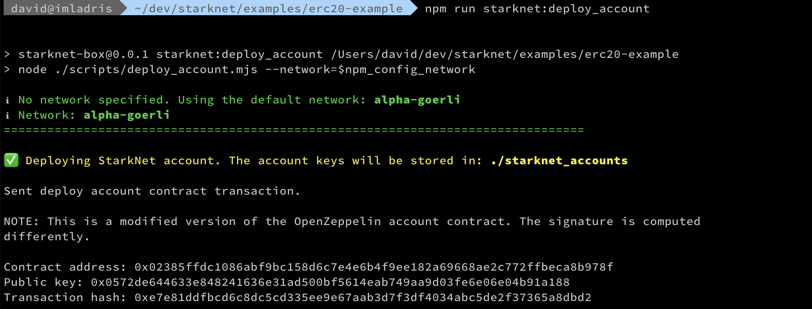

The account's private keys will be stored in the `./starknet_accounts` directory. You won't need to do anything further to use this account with the box, it is configured to look for your account keys in this location.
### Funding your Account

Now that you have your account, you need some funds to pay transaction fees. To do so you will need to copy the account contract address from the output of your account deployment. So, don't close your terminal just yet.

First, go to the [StarkNet Alpha Goerli faucet](https://faucet.goerli.starknet.io/), then copy and paste your account address into the space provided, check the box to confirm that you're not a robot and send your request. 

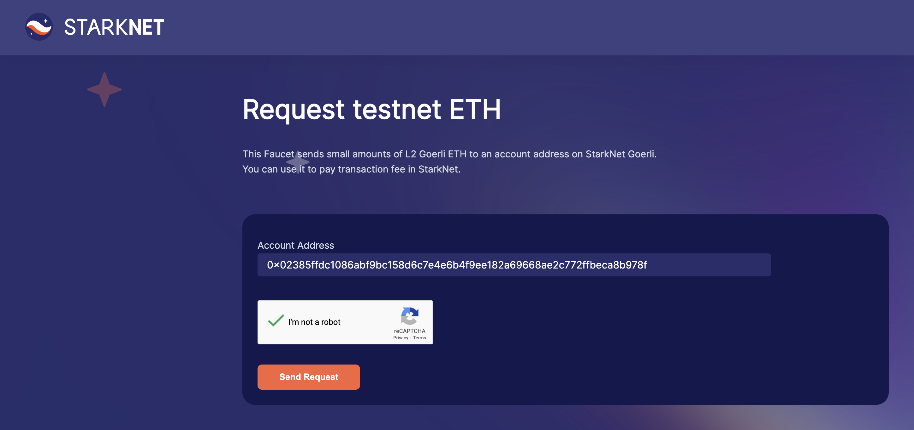

Once a transaction has been initiated a link to the transaction on [StarkNet Voyager](https://goerli.voyager.online/), StarkNet's block explorer, will be displayed to you. You can click on the link to view the transaction if you wish. After a couple of minutes the transaction should complete and a small amount of testnet ETH will be sent to your account. You can do this a few times if you need to.

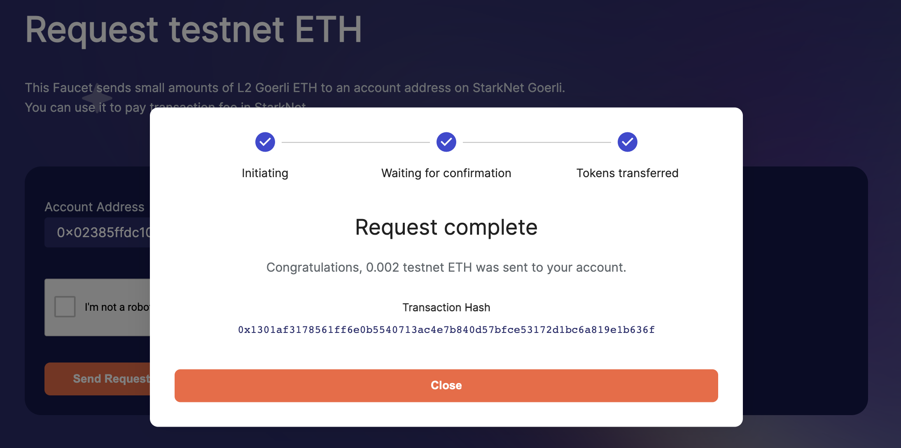

## The ERC20 Contract

Now that we have deployed an account and funded it, it's time to get started on our ERC20 contract. In this guide we are just going to deploy a simple mintable ERC20 contract. To simplify the creation of our ERC20 contract we will use the [OpenZeppelin Contract Wizard for Cairo](https://wizard.openzeppelin.com/cairo).

On the Contract Wizard for Cairo page, make sure that you have selected ERC20 as your contract on the top left. Then, in the Settings section, give your token a name and a symbol. Leave the decimals at 18. For this guide we have called our token `Truffle Token` and given it a symbol of `TRF`. We have also chosen to premint 1000 tokens for an initial recipient. Finally, in the Features section, check the mintable feature. Once you have entered a name, a symbol, a premint amount, and selected the mintable feature, click on the `Copy to Clipboard` button on the top right.

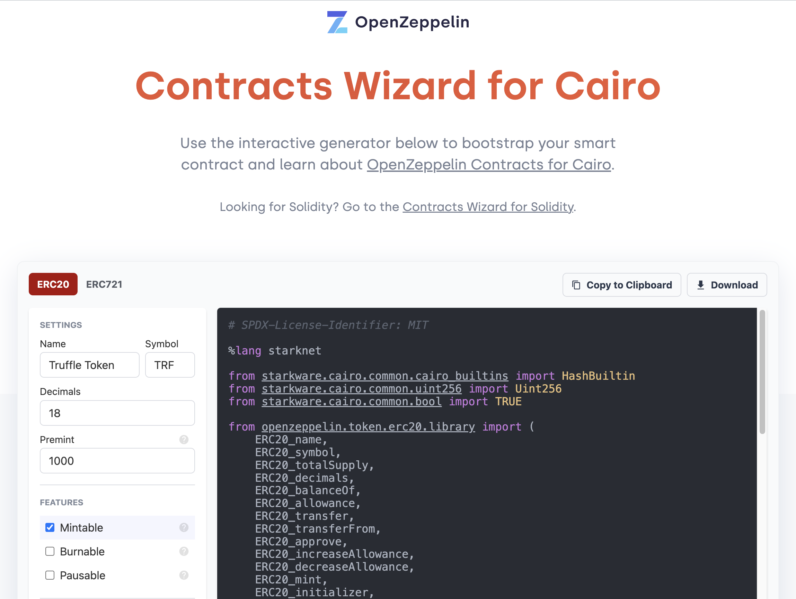

In this guide we will use the [Visual Studio Code](https://code.visualstudio.com/) (VSCode) as our source code editor. You can use another if you are more comfortable with it. In your terminal, type the following in your project's root directory.

```bash
code .
```

This will open VSCode with your project's files and directories visible in the pane to the left.

The StarkNet Truffle box is configured to look for `.cairo` source code files in the `contracts/starknet` directory of your project. This is where we will create our ERC20 contract. Create a new file in this directory and name it ERC20.cairo and paste the code copied from the OpenZeppelin Contract Wizard into the editor and save it. When you're done, it should look something like this:

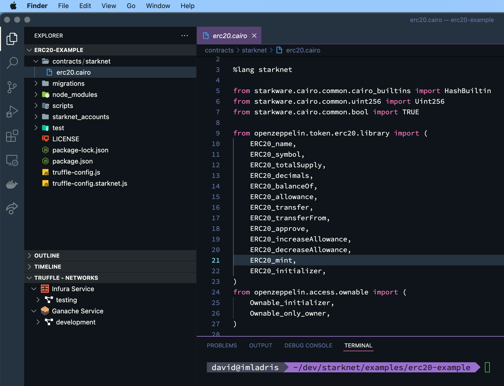

## Compiling the ERC20 Contract

The next step is to compile our contract. In either your terminal or the terminal pane of VSCode, type the following:

```bash
npm run starknet:compile
```

This will compile your Cairo contract and save the compilation artifacts to the `build` directory. You should see output similar to the following:

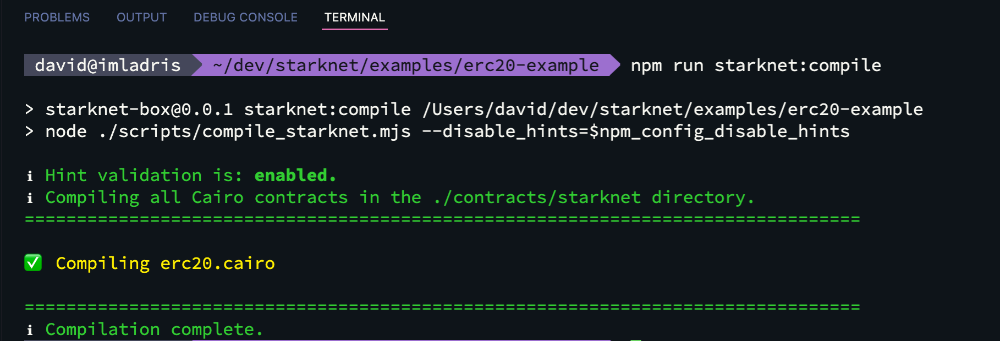

You should also notice that the compiled contract and the contract ABI file have been saved to the `build` directory.

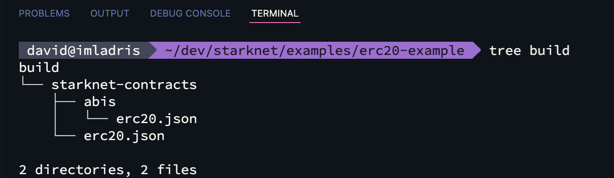

## Testing the ERC20 Contract

Now that we have compile our contract, it's a good idea to test it before we deploy it. The Docker image used in this box includes the [pytest](https://docs.pytest.org/en/7.1.x/) library to allow you to write and run unit tests in Python. There is a sample test script in the `test` directory. We will replace the contents of this file with code to test the deployment of our ERC20 contract. Open the file named `contract_test.py` in the `test/starknet` directory and replace its contents with the code below.

```python
import warnings
warnings.filterwarnings("ignore", category=DeprecationWarning)
import pytest

from starkware.starknet.testing.starknet import Starknet

# The path to the contract source code.
CONTRACT_FILE = "contracts/starknet/erc20.cairo"

# The testing library uses python's asyncio. So the following decorator and the 'async' keyword are needed.
@pytest.mark.asyncio
async def test_deploy():
    # Create a new Starknet class that simulates the StarkNet system.
    starknet = await Starknet.empty()

    # Deploy the contract.
    contract = await starknet.deploy(
        source=CONTRACT_FILE,
        constructor_calldata=[
            1004231639892309031199397597011962835490457675745477853670294057354032551823,
            1004231639892309031199397597011962835490457675745477853670294057354032551823
        ]
    )

    # Check the result of balanceOf().
    execution_info = await contract.balanceOf(1004231639892309031199397597011962835490457675745477853670294057354032551823).call()
    expected_result = ((1000000000000000000000, 0),)
    assert execution_info.result == expected_result
```

There are a couple of important things to understand about this script before we run the test. First, this test does not use a StarkNet network to perform its tests. It uses the StarkNet testing library to launch a simulation of a StarkNet system to facilitate testing. Second, you will notice that the values in the `constructor_calldata` array look nothing like the hexadecimal account address that you might be expecting to see. This is because Cairo has only one data type, the `field element`, or `felt`. Practically, a `felt` is best thought of as a unsinged 252-bit integer. You will need to convert the hexadecimal account address to an integer to be passed in to the contract's constructor.

It is also worth noting that, at the time of writing, Cairo does not have a `string` type. As such, short strings of up to 31 ASCII characters can be represented by a `felt`. If your contract constructor (or another function) expects a parameter of type felt that respresents a string, such as a token name, you will need to convert the string to a decimal integer before it is passed as a parameter.

This is a simple test that just tests our deployment and that the premint was successful. Extending the test to test the other contract function is left as an exercise for you. 

## Deploying the ERC20 Contract

Now that we've successfully run our unit tests we can deploy our contract. You can now deploy your contract to StarkNet Alpha Goerli with the following command:

```bash
npm run starknet:deploy --contract=erc20 <recipient_address> <owner_address>
```

where `<recipient_address>` is the account address of the recipient of the inial supply of tokens, and `<owner_address>` is the account address of contract's owner. 

**Important note:** To interact with the ERC20 contract with the StarkNet box, you must supply the address of the account that we deployed earlier in this guide as the `<owner_address>` constructor parameter. This isn't necessary if you will only be intereracting with the contract through StarkNet's block explorer, Voyager. However, you will need to have a wallet that supports StarkNet accounts (such as Argent X) installed with an account set up and funded. In that instance, the address of that account should be supplied as the `<owner_address>`.  

In the following example, the `recipient` and `owner` are the same address. As already mentioned, you will notice that the account address of the `recipient` and `owner` are supplied as decimal integers rather than hexadecimal. Nake sure that you save the contract address of the deployed contract. You will need this to interact with the contract.

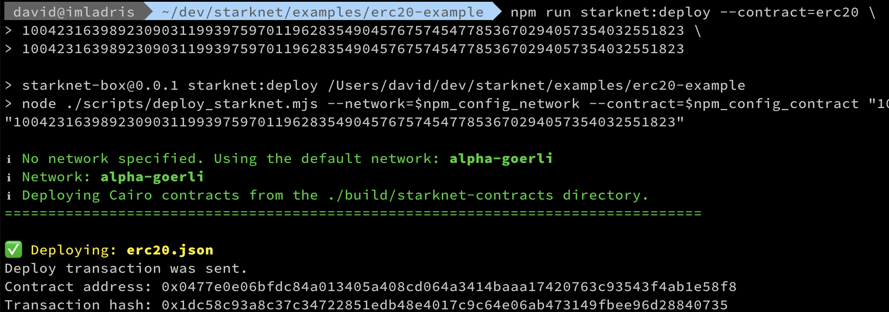

### StarkNet Voyager

You can use  Voyager to view and interact with your deployed contract. After deploying the contract, you should be able to find the contract on Voyager here: `https://goerli.voyager.online/contract/<contract_address>`. You must replace `<contract_address>` with the address of the contract you've just deployed. For example:

```bash
https://goerli.voyager.online/contract/0x0477e0e06bfdc84a013405a408cd064a3414baaa17420763c93543f4ab1e58f8
```

## Interacting with the ERC20 Contract

Now that the contract is deployed we should be able to interact with it.

### Check the Initial Supply

The first thing that we want to do is check that an initial supply of tokens were minted to the recipient by the contract constructor. Remember you saved the address of the contract deployed earlier, this is where you will need it first. As it will be passed as an argument to the command line you do not need to convert it to a decimal integer.

```bash
npm run starknet:call \
--contract=erc20 \
--address=<contract_address> \
--function=totalSupply
```

This should return the current value of the totalSupply storage variable, which is represented in the contract as a Uint256. What will be returned are two values that represent the Uint256. The first value represents the low 128 bits and the second value represents the high 128 bits. Given that our contract has an initial mint of `1000000000000000000000` tokens, we should expect the totalSupply function to return the hexadecimal integer `0x3635c9adc5dea00000` in the low 128 bits and a 0 for the high 128 bits.

For example:


Now, let's check that the initial supply of tokens were in fact minted to the recipient address. To do that we will call the contract's balanceOf function and pass in the address of the recipient:

```bash
npm run starknet:call \
--contract=erc20 \
--address=<contract_address> \
--function=balanceOf
<recipient_address>
```

Again, you must convert `<recipient_address>` to a decimal integer when being passed to a function with a parameter of type `felt`. For example:

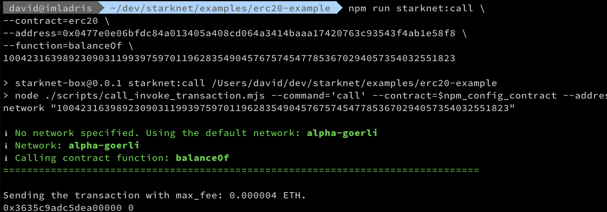

If the recipient's balance matches the total supply, the contract has been correctly deployed. As an exercise, you could also call the `name` and `symbol` functions to check that the constructor has correctly set the token's name and symbol. The `name` function should return an hexadecimal integer representing the token's name, and the `symbol` function should return a decimal integer representing the token's symbol. These need to be converted to strings to check they are correct.

### Minting Further Tokens

Now that we have the ERC20 contract successfully deployed and an initial supply of tokens minted, let's try minting more. For this exercise, we will just mint some additional tokens for the recipient of the initial mint. But, if you like you can mint them for another address. Because the `mint` function will change the state, we will have to use `invoke` rather than `call`. The following command will mint some tokens:

```bash
npm run starknet:invoke \
--contract=erc20 \
-address=<contract_address> \
--function=mint \
<to_address> <amount>
```

**Important note:** The `mint` function expects to receive a `Uint256` value for the `amount` parameter. Remember, this requires two decimal integer values to be supplied, the low and the high 128 bits. For example, to mint 1000 additional tokens you must pass in the following value for the `<amount>` parameter: `1000000000000000000000 0`. 

For example:

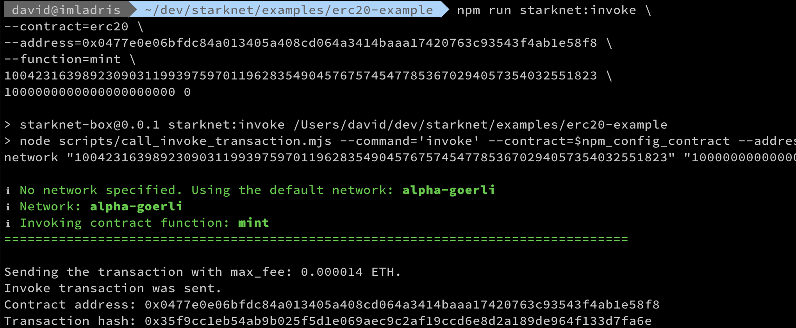

Now that you have minted some additional tokens, you can `call` the `balanceOf` function again to check the balance of the `to` account.

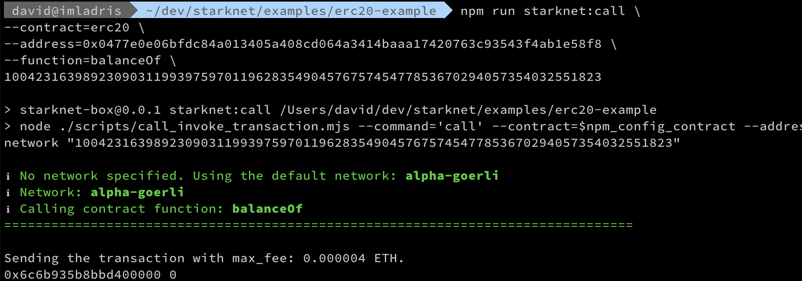

The returned hexadecimal integer `0x6c6b935b8bbd400000` is equivalent to `2000000000000000000000`. We have successfully minted 1000 additional tokens. Now let's try and transfer them.
### Transferring Tokens

Well, we can now mint tokens. Now it's time to try transferring them to another account. To extend our use of StarkNet and our ERC20 contract, this time we will try using the [Argent X](https://www.argent.xyz/argent-x/) wallet and [Voyager](https://goerli.voyager.online/).

In your browser, open the Argent X site and install Argent X for your browser. The installation process will include the deployment of an account contract. Once your account contract has been deployed, you can fund it with the [StarkNet Alpha Goerli faucet](https://faucet.goerli.starknet.io/). Once you have your account funded, open Voyager in your browser. When Voyager has loaded the drop-down menu at the top right should read `GOERLI TEST`.

Now, copy your ERC20 contract address and paste it into the main Voyager search field. Once your contract is located by Voyager a drop-down should appear with your contract. For example:

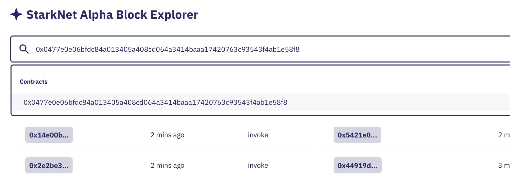

Click on the contract address and you will be taken to your contract's page.

Now, let's transfer some tokens to your new account. To do that we will need to invoke the `transfer` function. The following command will achieve that:

```bash
npm run starknet:invoke \
--contract=erc20 \
--address=<contract_address> \
--function=transfer \
<to_address> <amount>
```

You'll notice that This looks very similar to the mint function. The same considerations regarding the `<to_address>` and `<amount>` apply. Invoking the transfer function should look something like this:

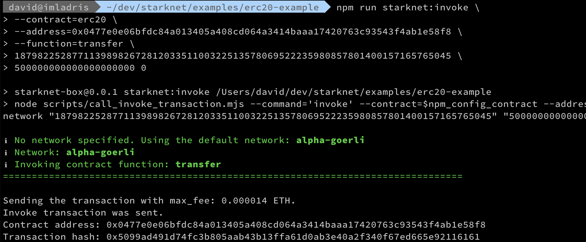

Once you have sent your transfer transaction, you can check its status with the `tx_status` command like this:

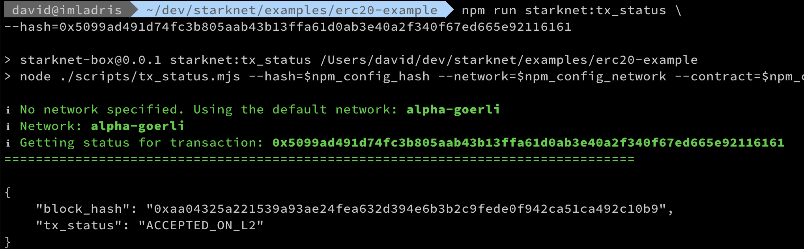

If the `tx_status` returned is `ACCEPTED_ON_L2` your transaction is confirmed on StarkNet. To see if the tokens have been transferred to your Argent X account, you will first need to add the token to Argent X. This is done in a very similar way to other wallets. You will need to copy your ERC20 contract's address. This should be easily available on your contract's Voyager page. Click on the Argent X wallet icon on your browser toolbar. Log in to your wallet if you need to, then scroll to the bottim of the token list. Click on `Add token`. On the `Add token` page paste your contract's address into the `Contract address` field. Once you do so the other fields should then be populated. 

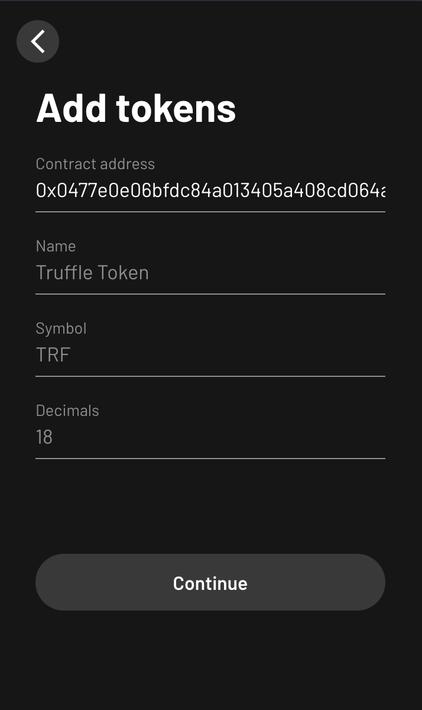{ width=40% }

Click the `Continue` button and your token will be added. You should now find that you have a number of tokens in your account that correspond to the amount of tokens your transferred. 

## Final Notes

1. [Truffle's StarkNet Box](https://github.com/truffle-box/starknet-box)
1. [StarkNet](https://starknet.io/)
1. [OpenZeppelin Cairo Contracts](https://github.com/OpenZeppelin/cairo-contracts)
1. [OpenZeppelin Contracts Wizard for Cairo](https://wizard.openzeppelin.com/cairo)