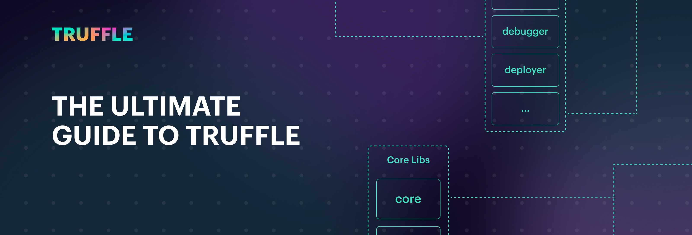
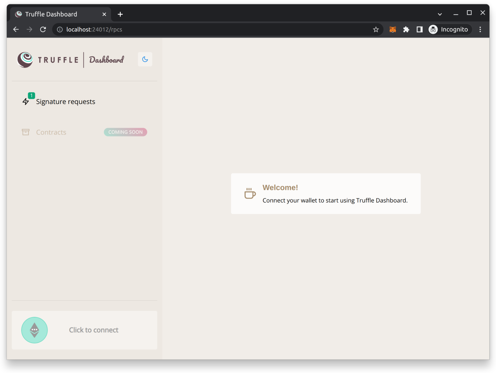
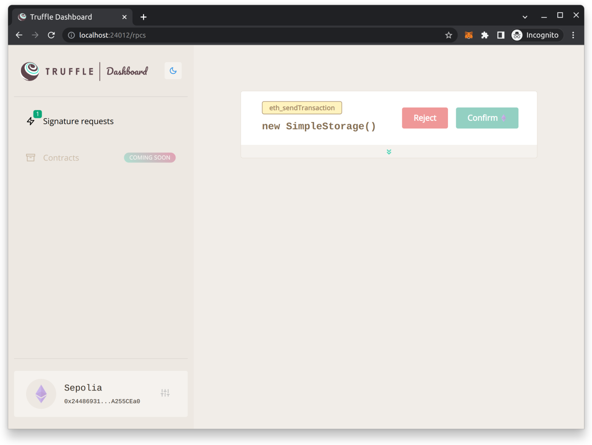
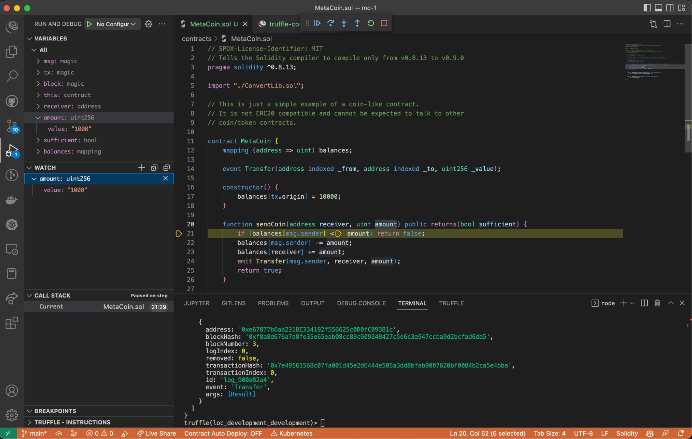

# Ultimate Guide to Truffle: The Gateway to Full Stack Blockchain Development

Written by [Kingsley Arinze](https://www.linkedin.com/in/bruzzy)

Last updated 05/03/2023



_The Ultimate Guide to Truffle showcases everything developers need to get started using Truffle for blockchain development, providing an overview of core features such as Truffle Dashboard, Command Line Interface, VS Code, and Ganache._

## Overview

The Ultimate Guide to Truffle introduces all the components of Truffle to get started building full stack blockchain applications.

Truffle is a suite of development environment tooling for web3 developers to simplify the development lifecycle for EVM-based applications. It was the first development environment software created for Ethereum and has existed since 2015.

This guide covers Truffle's library-first approach, touching on the fundamental building blocks of Truffle and how it's composed for building blockchain applications. The benefits of building with the Truffle Suite are outlined and ways to use Truffle together with other tools. Finally, the guide covers the tools within the Truffle Suite, how each functions to improve your development process, and how to get started using them.

Index:  
[Part 1: What is Truffle?](#part-one-what-is-truffle)  
[Part 2: The Benefits of Building with Truffle](#part-two-the-benefits-of-building-with-truffle)  
[Part 3: Truffle Suite Core Features and Tooling](#part-three-truffle-suite-core-features-and-tooling)  
[Part 4: Truffle Command Line Interface](#part-four-truffle-command-line-interface)  
[Part 5: Truffle Dashboard](#part-five-truffle-dashboard)  
[Part 6: Ganache](#part-six-ganache)  
[Part 7: Truffle for VS Code Extension ](#part-seven-truffle-for-vs-code-extension)

## Part one: What is Truffle?

Truffle is a collection of tools that simplifies the development of blockchain-based applications on EVM-compatible networks. It includes tooling to help you, the developer, throughout your development cycle, from coding and testing to debugging and deployment.

Truffle focuses on the development of smart contracts, which are the foundation of EVM applications. It also includes tools for developing front-end applications that interact with smart contracts and a comprehensive suite of testing and debugging tools.

This allows developers to quickly and easily build and test their applications, reducing development time and increasing the reliability of the final product.

At its core, Truffle is made up of free and open-source software (FOSS) libraries. These libraries are built to be platform agnostic and interoperable, meaning they can be plugged into other tools fairly easily e.g. [@truffle/fetch-and-compile](https://github.com/trufflesuite/truffle/tree/master/packages/fetch-and-compile#readme), [@truffle/codec](https://trufflesuite.com/docs/truffle/codec/index.html), and [@truffle/debugger](https://trufflesuite.github.io/truffle-debugger/).

Each library is assembled to form tools like Truffle’s CLI (command-line interface), Truffle Dashboard, Truffle Debugger, Truffle for VS Code extension, and Ganache. Together, these make up the Truffle Suite of tools.

## Part two: The Benefits of Building with Truffle

Truffle allows developers to code, test, debug, and deploy smart contracts to Ethereum and other EVM-compatible blockchain networks. Here are some benefits that make Truffle a standout in the Ethereum ecosystem:

1. **Insight into Transaction Details:** Truffle Dashboard lets you inspect transactions before they occur by giving you more digestible information to more confidently approve or reject transactions.
2. **Diagnose and fix errors quickly:** The Truffle Debugger together with Truffle’s testing suite allows you to surgically diagnose errors when they occur and fix them quickly
3. **Focus on your dapp’s uniqueness:** Truffle offers a workflow that gets out of your way and lets you focus on your dapp’s unique functionality. It’s prescriptive enough to provide guidance, yet flexible enough to adapt to your needs.
4. **Operate safely:** With Ganache’s zero-config mainnet forking, you can easily test against live networks without spending real Ether. You can execute risky transactions in a sandbox and test integrations with production smart contracts, all with the same human-readable information and debugging tools you use for development networks.

5. **Applicable at all stages of development:** Regardless of whether your project began with Truffle CLI or another framework, Truffle can provide tooling and insights. We also support a number of different protocols and offer the ability to easily add support for new ones.

## Part three: Truffle Suite Core Features and Tooling

As mentioned earlier, Truffle isn’t a single tool, but a suite of tools that come together to create a smooth development experience. These tools include Truffle CLI, Truffle Dashboard, Ganache, and Truffle for VS code.

Before we delve into each of these tools, their features, and how you can start using them, let's review the underlying libraries that power these tools.

A. **Truffle Debugger** ([@truffle/debugger](https://trufflesuite.github.io/truffle-debugger/)) is a portable Solidity debugger library that can be used with or without Truffle. It is a standalone package that is available on NPM, which means that anyone can install this library and use it as is, or build on it to offer an even better experience.

Truffle’s debugger is at the heart of every Truffle tool including Truffle CLI, and Truffle for VS Code with plans to integrate it into Truffle Dashboard. Some of its features are:

- Solidity stepping and breakpoints
- Variable inspection
- Watch expressions
- Rudimentary support for Vyper
- and more!

B. **Truffle Encoder & Decoder** ([@truffle/codec](https://trufflesuite.com/docs/truffle/codec/index.html)) library provides an interface for decoding Solidity smart contract state and information sent to, or from smart contracts using the Solidity ABI. It produces output in a machine-readable form that avoids losing any information. This is a low-level package for encoding, decoding, and data representation.

C. **Truffle Fetch & Compile** ([@truffle/fetch-and-compile](https://github.com/trufflesuite/truffle/tree/master/packages/fetch-and-compile#readme)) is a library that is used to obtain externally verified sources and compile them.

It is important to note that, while these libraries form the core of Truffle, they can be used stand-alone or together with other tools within the ecosystem.

Let’s take a deeper look at some of the user-facing tools within the Truffle Suite and how to get started with them.


## Part four: Truffle Command Line Interface

This is a powerful command-line tool that provides developers with a wide range of functionality for building, testing, and deploying smart contracts on the Ethereum blockchain.

At its core, the Truffle CLI provides a suite of commands for compiling, testing, and deploying smart contracts, as well as for interacting with the Ethereum network. These commands can perform a wide range of tasks, from compiling contracts and generating boilerplate code to testing contracts and deploying them to the blockchain.

One of the key features of the Truffle CLI is its integration with other Truffle tools and frameworks, such as Ganache UI (a local blockchain simulator), Drizzle (a front-end library for building dapps), and Web3.js (a library for interacting with the Ethereum network). This integration makes it easy for developers to build, test, and deploy complex dapps using a single, unified toolset.

### Prerequisites:

- Node.js (version 14 or later)

- NPM (Node Package Manager)

### Installation

1.  Install the Truffle CLI globally by running the following command:

        npm install -g truffle

2.  Once the installation is complete, verify that the Truffle CLI has been installed correctly by running the following command:

        truffle version

    This command should display the version number of the Truffle CLI, indicating that it has been successfully installed.

3.  Install additional dependencies needed by the Truffle CLI, such as the Ganache CLI. To install Ganache CLI, for example, run the following command:

        npm install -g ganache

### Create a project

There are a number of ways to create a Truffle project, one is the [Truffle box](https://trufflesuite.com/boxes) option that allows you to use Truffle Boxes, which are example applications and project templates.

    mkdir MetaCoin
    cd MetaCoin
    truffle unbox metacoin

And the other option is to create a bare project that doesn’t come with any smart contract or boilerplate code, to use this option, run:

    truffle init

If you examine the newly created project structure, you’ll find the following items:

```
.
├── contracts           <-- solidity contracts live here
├── migrations          <-- migration scripts live here
├── test                <-- tests (Solidity and JS) live here
└── truffle-config.js   <-- truffle configuration file
```

### Compile your project

To compile your Truffle project, navigate to the project root directory and run the `truffle compile` command. Truffle will go through the `contracts/` directory, compiling every file and library that ends with `.sol`.

Upon the first run, all contracts will be compiled. Upon subsequent runs, Truffle will compile only the contracts that have been changed since the last compile. If you'd like to override this behavior, run the above command with the `--all` option.

See the [documentation](https://trufflesuite.com/docs/truffle/how-to/compile-contracts/#compile-contracts) for more information.

### Test your contracts

Truffle comes bundled with an automated testing framework to make testing your contracts easy. Automated tests can be written in both JavaScript/TypeScript and Solidity, with their respective advantages and disadvantages. Truffle looks for test files inside the `test/` directory"

To run all tests, simply run:

     truffle test

Alternatively, you can specify a path to a specific file you want to run, e.g.,

    truffle test ./path/to/test/file.js

More on testing with Truffle on the official [documentation](https://trufflesuite.com/docs/truffle/how-to/debug-test/test-your-contracts/).

### Debugging with console.log

Debugging is an essential part of building dapps, especially because you want to minimise bugs since smart contracts are deployed on the public blockchain.

To facilitate debugging, Truffle CLI supports logging variables and messages to the console out of the box. To use this feature, simply ensure that you are running the latest version of Truffle CLI.

Here's an example of how to use console.log in your code:

    // SPDX-License-Identifier: MIT
    pragma solidity ^0.8.13;
    import "truffle/console.sol";

    contract SampleContract {
        address public admin;
        constructor(address _admin) {
            console.log("SampleContract::constructor\n\tadmin: %o", _admin);
            admin = _admin;
        }
    }

If you wish to modify this feature, you can personalize it by adding a prefix to log messages for easier identification or by enabling a safety mechanism to avoid deploying console.log statements to the mainnet. You can find more information about how to do this in this [blog post](https://trufflesuite.com/blog/truffle-now-supports-console-logging-in-solidity-smart-contract/#configuration).

### Deploying a smart contract

Truffle uses a script-based deployment system that allows developers to write custom scripts in JavaScript to automate the deployment of smart contracts to the Ethereum network (EVM).

To use Truffle's script-based deployment system, you will need to create a migration script in the `migrations` directory of your Truffle project. Migration scripts are named numerically to indicate their order of execution, and they typically include instructions for deploying one or more smart contracts to the Ethereum (EVM) network.

A typical migration script would look like this:

    const MyContract = artifacts.require("MyContract");
    module.exports = function(deployer) {
        deployer.deploy(MyContract);
    };

Once you have written your migration script, you can run it using the Truffle migration command:

    truffle migrate [--reset] [--network NETWORK_NAME]

This command will execute all migration scripts that have not already been executed on the specified network. You can use the --reset option to re-run all migration scripts from scratch, and you can use the --network option to specify the target network for deployment.

Check out the [documentation](https://trufflesuite.com/docs/truffle/how-to/contracts/run-migrations/) for a more detailed walkthrough of how deployment works in Truffle.

## Part five: Truffle Dashboard

To deploy your smart contract, you need to specify an Ethereum account that has enough funds to cover the transaction fees of the deployment. To do this, you’d typically copy-paste your mnemonic phrase to a .gitignored .env file. This is necessary because your mnemonic or private key gives Truffle the necessary ability to sign transactions on your behalf.

Truffle Dashboard completely removes the need to share your mnemonic phrase or private keys throughout the development lifecycle. You can now safely deploy your smart contracts to your network of choice without Truffle ever needing to know what your keys look like.

Truffle seamlessly connects to your MetaMask wallet without any configuration using the currently selected account and network for Truffle's deployment configuration.

### Installation

If you have the Truffle CLI installed, accessing the Truffle Dashboard is made possible as it comes bundled with it. If you’re running an older version of Truffle CLI that doesn’t ship with the Dashboard, consider upgrading to the latest version by running the following commands:

    npm uninstall -g truffle
    npm install -g truffle

### Quick Start

Running `truffle dashboard` in a separate terminal window starts Truffle Dashboard at http://localhost:24012 and automatically opens a new tab in your browser.

    truffle dashboard [--port <number>] [--host <string>] [--verbose]

    Truffle Dashboard running at [http://localhost:24012](http://localhost:24012)
    DashboardProvider RPC endpoint running at [http://localhost:24012/rpc](http://localhost:24012/rpc)



With Truffle Dashboard running, you’ll be prompted to connect your wallet and confirm that you're connected to the right network. You should double-check your connected network at this point since switching to a different network during deployment can have unintended consequences.


To deploy your contracts using Truffle Dashboard, run the command:

    truffle migrate --network dashboard

This is possible because Truffle exposes a built-in network named `"dashboard"`. This network automatically uses the port and host specified in the dashboard configuration or falls back to the default `[http://localhost:24012](http://localhost:24012)`

Now, subsequent RPC requests will be forwarded to the Truffle Dashboard, where the user can inspect the RPC requests and approve or decline them on MetaMask.



### Configuration

The port and host can be configured through command line options, or by configuring them inside your truffle-config.js.

1.  On the command line:

        truffle dashboard --port <port of choice> --host <host of choice>`

2.  In your Truffle configuration (truffle-config.js) file:

            module.exports = {
              ...
              dashboard: {
                port: 25012,
                host: "localhost"
              }
            }

### Transaction decoding

Truffle Dashboard uses the @truffle/decoder library we described earlier to decode requests from certain RPC calls for example eth_sendTransaction, personal_sign, eth_signTypedData_v3, and eth_signTypedData_v4.

This allows you to view a more human-friendly representation of the messaging between your computer and the Ethereum network. For example, if you have a contract that allows you to mint 5 tokens and send it to a user (myaccount.eth in this example), the low-level form would look something like this:

            `0xa0e9439c000000000000000000000000627306090abab3a6e1400e9345bc60c78a8bef570000000000000000000000000000000000000000000000000000000000000005`

Truffle Dashboard can display this in a more human-readable format, for example:

    mint(myaccount.eth, 5)

### Using Truffle Dashboard with Hardhat

Truffle Dashboard now offers full support for Hardhat projects through the [@truffle/dashboard-hardhat-plugin](https://www.npmjs.com/package/@truffle/dashboard-hardhat-plugin). Prior to this plugin, Hardhart users were not able to see decoded transaction information, including function names and all argument values. This plugin adds that, providing extra visibility into a transaction before you issue a signature using your browser-based wallet. Here’s a screenshot of the before and after:


You can install this plugin by running:

    npm install --save-dev @truffle/dashboard-hardhat-plugin

Then simply import the plugin in your hardhat.config.ts:

    import "@truffle/dashboard-hardhat-plugin";

To use this plugin, you are required to have Truffle installed either globally or in a local project. If it's not installed, you can install it using the command `npm i -g truffle`. Alternatively, you can skip the installation and use `npx truffle dashboard` to fetch and run it remotely.

This plugin automatically adds the `truffleDashboard`, so there's no need to add it manually to `hardhat.config.ts`.

You can start using this plugin by specifying `--network truffleDashboard` when running Hardhat commands e.g., `npx hardhat run ./scripts/deploy-contracts.ts --network truffleDashboard`. The truffleDashboard network includes sensible defaults and the URL property is set to `http://localhost:24012/rpc`.

## Part six: Ganache

Ganache is a local blockchain simulator or a personal blockchain for dapp development, It allows developers to simulate an Ethereum network locally on their machine, making it easier and faster to test and debug smart contracts without having to deploy them on a live network.

It also allows developers to customize the blockchain to suit their testing needs. For example, developers can specify the number of accounts on the blockchain, the initial balance of each account, the gas limit for each block, the block time and more.

In addition to usage via the CLI from within JavaScript programmatically, ganache also provides a GUI, aptly named Ganache UI.

Ganache UI provides a graphical user interface that displays useful information such as account balances, transactions, and gas usage, making it easier for developers to understand the behavior of their smart contracts.

### Installation

Ganache comes in two forms, as a UI and as a CLI, but it can be used in three ways: [UI](https://trufflesuite.com/docs/ganache/quickstart/), [CLI](https://trufflesuite.com/blog/introducing-ganache-7/#a-using-ganache-7-on-the-command-line), and [programmatically](https://trufflesuite.com/blog/introducing-ganache-7/#b-using-ganache-7-programmatically). Ganache UI can be downloaded from the [Truffle Suite website](https://trufflesuite.com/ganache/) while the ganache npm package can be installed with the following command:

    npm install ganache --global

You’re required to have [Node.js >= v14.0.0 and NPM >= 6.4.1](https://nodejs.org/en/download/) installed on your computer to be able to run Ganache.

### How to connect a Truffle project to Ganache

To link a Truffle project with Ganache, make sure that a Ganache instance is active in the background. You can initiate a CLI instance by executing the command `ganache` in the terminal or launch a UI instance by clicking the Ganache icon after downloading it.

Depending on which one you choose, you'll have access to 10 accounts, each with 100 ether at your disposal. In a separate terminal window, navigate to your Truffle project directory and run the following command to compile your smart contracts:

    truffle compile

Next, you need to configure Truffle to use the Ganache network by updating the `truffle-config.js` file in your project directory. Open the file and update the networks section as follows:

Ganache CLI:

        module.exports = {
          networks: {
            development: {
              host: "127.0.0.1",
              port: 8545,
              network_id: "*", // Match any network id
            },
          },
          // ...rest of your config
        }

Ganache UI:

        module.exports = {
          networks: {
            development: {
              host: "127.0.0.1",
              port: 7545,
              network_id: "*", // Match any network id
            },
          },
          // ...rest of your config
        }

The above code snippets tells Truffle to connect to the local Ganache blockchain running on localhost at port 8545 (CLI) or 7545 (UI). Once you've updated the configuration file, you can deploy your smart contracts to the Ganache network using the following command:

    truffle migrate --network development

This will deploy your smart contracts to the Ganache network, and you should see the output in your terminal indicating the status of the deployment.

### Forking

A very useful step in software development is being able to test applications in a sandbox environment that closely resembles the production environment in which the application is going to live. This is particularly important in web3 and dapp development since we want to ensure that our dapps work as expected before deploying to a live network.

Ganache as mentioned earlier, acts like a sandbox environment for dapp development but the forking feature makes it even more interesting as it allows developers to make a copy of the Ethereum blockchain’s state. This means that developers can now develop dapps in an environment that closely resembles production.

This isn’t only limited to Ethereum mainnet as you can also fork any Ethereum testnet as well. To use this feature, start an instance of Ganache on the command line, passing in the `--fork` flag like so:

    ganache --fork

This command creates a fork of Ethereum Mainnet. Alternatively, you can specify which network to fork using the `--fork.network` option.

    ganache --fork.network <network name>

By default, Ganache uses Infura as the blockchain provider but you can specify the provider URL to use with the `--fork.url` option.

    ganache --fork.url <URL>

### Time manipulation

Ganache also supports time manipulation during testing, e.g fast forwarding and rewinding time. This is particularly useful when testing a smart contract that requires that a specific time passes before users can take certain actions.

Ganache exposes two RPC methods for manipulating time during testing:

- [evm_increaseTime](https://ganache.dev/#evm_increaseTime)
- [evm_setTime](https://ganache.dev/#evm_setTime)

### Ganache in the browser

Ganache can be used in the browser with this line of code:

    <script src="[https://cdn.jsdelivr.net/npm/ganache@](https://cdn.jsdelivr.net/npm/ganache@)>VERSION NUMBER>/dist/web/ganache.min.js"></script>

If you specify the version number 7.3.2 or greater, you also get the zero-config mainnet forking feature. The latest version as of the time of writing is 7.8.0. You can try this out with the below code sample.

    <script src="https://cdn.jsdelivr.net/npm/ganache@7.8.0/dist/web/ganache.min.js"></script>

    	<script>
            const options = { fork: { network: "mainnet" } }
            const provider = Ganache.provider(options);
        <script>

Now verify that this is working by attempting to fetch a mainnet block using the eth_getBlockByNumber method:

    const block = await provider.request({ method: "eth_getBlockByNumber", params: ["0xec4eb0"] });

    console.log(block); // will be mainnet's block 15486640

Here’s a sample HTML code that puts it all together:

    <!DOCTYPE html>
    <html>
    <head>
    	<meta charset="UTF-8">
    	<title>Ganache Example</title>
    </head>
    <body>
    	<h1>Ganache Example</h1>
    	<script src="https://cdn.jsdelivr.net/npm/ganache@7.8.0/dist/web/ganache.min.js"></script>


    	<script>
            (async function() {
                const options = { fork: { network: "mainnet" } }
                const provider = Ganache.provider(options);
                const block = await provider.request({ method:       "eth_getBlockByNumber", params: ["0xec4eb0"] });
                console.log(block); // will be mainnet's block 15486640
            })()
    	</script>
    </body>
    </html>

## Part seven: Truffle for VS Code Extension

The Truffle for VS Code extension simplifies how you create, build, debug and deploy smart contracts on Ethereum and all EVM-based blockchains and layer 2. The extension has built-in integration with many tools and services including Truffle, Ganache, and Infura.

It combines all the important features of Truffle CLI, Ganache and Infura into a single, more user-friendly user experience so that you do not have to leave Visual Studio while building a dapp.

Truffle for VS Code also offers comprehensive native IDE Solidity debugging support, taking advantage of VS Code's great debugging features such as variables, watches, and breakpoints. This means that you no longer need to jump between different tools or windows while you edit, compile, deploy, transact, and debug smart contracts.

### Installation

Truffle for VS Code can be installed from the [VS Code marketplace](https://marketplace.visualstudio.com/items?itemName=trufflesuite-csi.truffle-vscode). After installation, the extension may ask you to install certain local dependencies if you haven't done so already. But, don't worry! We have created a helpful [guide](https://trufflesuite.com/docs/vscode-ext/how-to/install-dependencies/) to make the installation process smooth and easy.

### Create project

The Truffle extension for VS Code provides an easy way for developers to create a new Solidity project using the Command Palette. If you are not familiar with Truffle, this is a simple way to scaffold out a project directory. Just select "Truffle: New Solidity Project" from the Command Palette, choose an empty directory, give your project a name, and hit Enter.

Alternatively, you can also use the Truffle CLI directly from the VS Code terminal by running `truffle init`.

### Compile contract

After creating a project directory, it will include a basic contract and all the necessary files to build and deploy a simple working contract to an RPC endpoint. To build your contract, simply select the Solidity (.sol) file of your contract, right-click on it, and choose "Truffle: Build Contracts". That's it!

### Deploy contract

Once you've compiled your contract, the contract metadata (including the contract ABI and bytecode) will be available in a .json file located in the ./build directory.

To deploy your compiled contract, right-click on the Solidity (.sol) file and select "Truffle: Deploy Contracts". The extension will start a Ganache instance by default and deploy the contract to a local network.

For more information on how you can deploy to any Ethereum network through Infura, see Truffle for VS Code [documentation.](https://trufflesuite.com/docs/vscode-ext/how-to/manage-smart-contracts/#deploy-to-an-ethereum-network).

### Debug contract

Truffle for VS Code extension comes bundled with the Truffle debugger, you can use the debugger by following these steps:

- Start the debugger by selecting `Truffle: Debug Transaction` in the command palette which can be accessed using `Ctrl + Shift + P` for Windows or `⌘ + Shift + P` for Macs. Then select the network to debug against.
- Select the transaction hash to debug.
- The VSCode debugger launches, and you can use typical debugger functions such as watch windows, view the call stack, and step in/out/over.



See the [documentation](https://trufflesuite.com/docs/vscode-ext/how-to/debug-smart-contracts/) for more information.

## Conclusion

Truffle simplifies the development lifecycle for EVM-based applications. Its library-first approach and suite of developer tools for every stage of development enable developers to ensure their code is thoroughly tested and ready for deployment, while reducing the risk of bugs and errors.

Building with Truffle has several benefits, including increased efficiency, reduced development time, and improved code quality. Truffle can be easily integrated with other tools, giving you even more power and flexibility to create blockchain applications.

The Truffle Suite, which includes a Command Line Interface, Dashboard, Ganache, and VS Code Extension, all work together seamlessly to help you create, test, and deploy your blockchain applications with ease.

If you're a blockchain developer looking to enhance your development experience, consider Truffle as an essential resource for full stack blockchain development.
