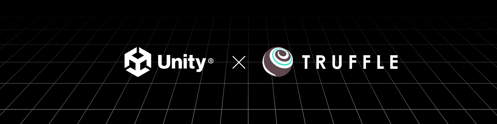

Consensys has a number of tools in the Unity asset store that will help you create any web3 gaming experience you can imagine. Here are some guides to get started.

Step 1: Check out the [Tutorial - Building a Tic Tac Toe Game with Truffle and Unity](/guides/building-a-tic-tac-toe-game-with-truffle-and-unity)

Step 2: Read our “How to” guides to:

- Build a NFT Rental Marketplace [Part 1](https://trufflesuite.com/guides/nft-rental-marketplace/) & [Part 2](https://trufflesuite.com/guides/nft-rental-marketplace-2/)
- [Write a rentable NFT smart contract](https://trufflesuite.com/guides/rentable-nft/)
- [Write an NFT Smart Contract with Royalties](https://trufflesuite.com/guides/nft-royalty/)
- [How to Build a NFT Marketplace DApp on Ethereum or Optimism](https://trufflesuite.com/guides/nft-marketplace/)

Step 3: Join [our Early Adopter Program](#) to work with our team and community to learn more about web3 gaming and design the best features to bring your game to the next
